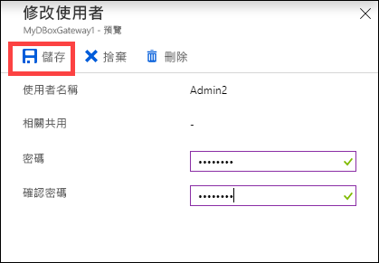
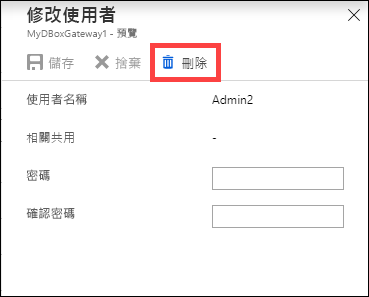
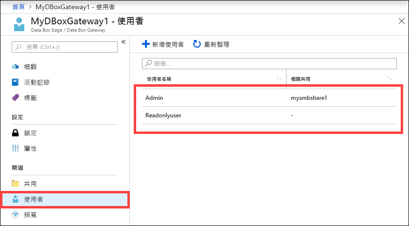

# 使用 Azure 入口網站來管理 Azure 資料箱閘道上的使用者。 

本文說明如何管理 Azure 資料箱閘道上的使用者。 您可以透過 Azure 入口網站或本機 Web UI 來管理 Azure 資料箱閘道。 使用 Azure 入口網站來新增、修改或刪除使用者。

> [!IMPORTANT]
> - 資料箱閘道處於預覽狀態。 部署訂購並部署此解決方案之前，請檢閱 [Azure 預覽版使用條款](https://azure.microsoft.com/support/legal/preview-supplemental-terms/)。

在本文中，您將了解：

> [!div class="checklist"]
> * 新增使用者
> * 修改使用者
> * 刪除使用者 

## 關於使用者

使用者可以具有唯讀或完整權限。 如名稱所指，唯讀使用者只能檢視共用資料。 完整權限的使用者可以讀取共用資料、寫入至這些共用，以及修改或刪除共用資料。 

 - **完整權限的使用者** - 具有完整存取權的本機使用者。 
 - **唯讀使用者** - 具有唯讀存取權的本機使用者。 這些使用者會與允許唯讀作業的共用相關聯。

在共用建立期間建立使用者時，首先會定義使用者權限。 定義與使用者相關聯的權限之後，即可使用 [檔案總管] 來修改這些權限。 

## 新增使用者

在 Azure 入口網站中執行下列步驟，以新增使用者。

1. 在 Azure 入口網站中，移至您的資料箱閘道資源，然後瀏覽至 [概觀]。 按一下命令列上的 [+ 新增使用者]。

    ![按一下 [新增使用者]](media/data-box-gateway-manage-users/add-user-1.png)

2. 針對您要新增的使用者指定使用者名稱和密碼。 確認密碼，然後按一下 [新增]。

    ![按一下 [新增使用者]](media/data-box-gateway-manage-users/add-user-2.png)

    > [!IMPORTANT] 
    > 系統會保留下列使用者，不得加以使用：系統管理員、EdgeUser、EdgeSupport、HcsSetupUser、WDAGUtilityAccount、CLIUSR、DefaultAccount、來賓。  

3. 開始及完成使用者建立時，您會收到通知。 建立使用者之後，從命令列中按一下 [重新整理]，以檢視更新後的使用者清單。

## 修改使用者

建立使用者之後，您就可以變更與使用者相關聯的密碼。 從使用者清單中選取並且按一下。 提供並確認新密碼。 儲存變更。
 

## 刪除使用者

在 Azure 入口網站中執行下列步驟，以刪除使用者。

1. 從使用者清單中選取並按一下使用者，然後按一下 [刪除]。  

   

2. 出現提示時，確認刪除。 

   

使用者清單會更新，以反映出已刪除的使用者。

## 後續步驟

- 了解如何[管理頻寬](data-box-gateway-manage-bandwidth-schedules.md)。
