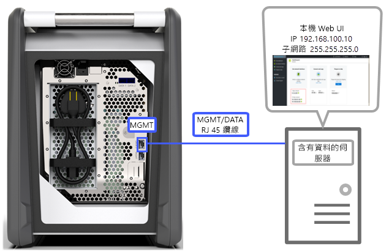
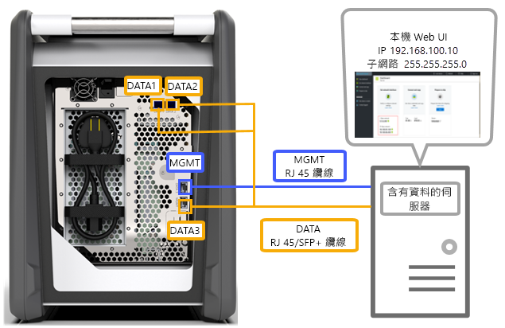
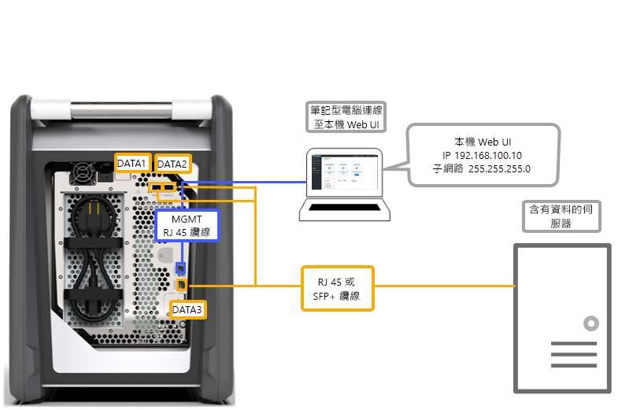
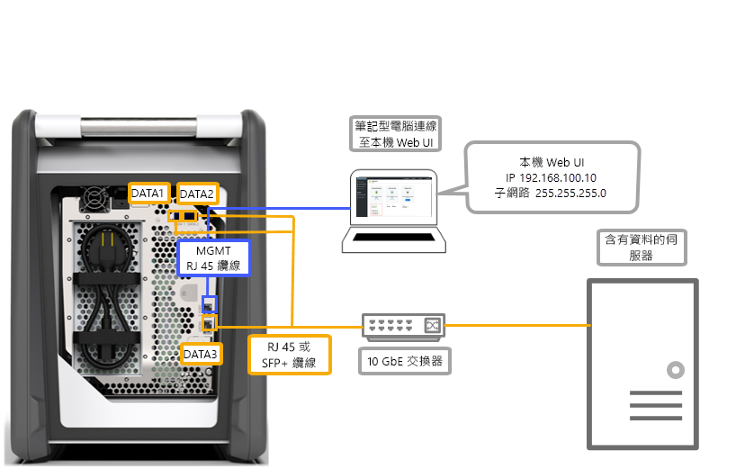
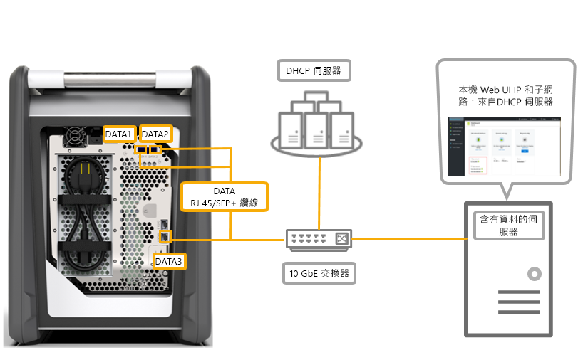

# Azure 資料箱的佈線選項

本文說明為您的 Azure 資料箱佈線以進行資料傳輸的各種方式。

## 透過 MGMT 連接埠傳輸

此選項會為資料箱進行最基本的設定。 您可以僅設定 MGMT 連接埠供管理和資料之用。

開始之前，請確定您擁有：

- MGMT 的 RJ45 乙太網路纜線。
- 執行[支援作業系統](data-box-system-requirements.md#supported-operating-systems-for-clients)的資料來源。

請執行下列步驟以連接裝置的纜線。

1. 您可以使用 RJ45 纜線將 MGMT 連接埠連接到具有資料的伺服器。

    

2. 在伺服器上，進行下列設定：

    - 將 **IP 位址**設為 192.168.100.5
    - 將**子網路**設為 255.255.255.0

3. 在下列位址存取裝置的本機 Web UI：192.168.100.10。 從 Azure 入口網站登入資料箱，並使用解除鎖定密碼將其解除鎖定。

## 透過資料連接埠使用靜態 IP 傳輸

您可以為資料箱設定兩個連接埠，MGMT 連接埠用於管理流量，其中一個資料連接埠用於資料。 資料連接埠可以是 DATA 1、DATA 2 或 DATA 3。

如果您僅設定一個資料連接埠，強烈建議以 10-GbE 連接埠作為該連接埠，例如 DATA 1 或 2。 1-GbE 連接埠會大幅增加資料傳輸所花費的時間。

開始之前，請確定您擁有：

- MGMT 的 RJ45 乙太網路纜線。
- 您要連接的每個 10-GbE 資料連接埠各需一條 10-GbE SFP+ Twinax 銅纜線。
- 一或多個執行[支援作業系統](data-box-system-requirements.md#supported-operating-systems-for-clients)的資料來源。

### 選項 1 - 透過伺服器的初始安裝

請執行下列步驟以連接裝置的纜線。

1. 使用從伺服器直接連到 MGMT 連接埠的 RJ45 乙太網路纜線進行設定。
2. 使用 DATA 3 的 RJ45 或 SFP+ 纜線將 DATA 1 或 DATA 2 連接到作為資料來源的伺服器。 建議您使用 10-GbE DATA 1 或 DATA 2 連接埠以達到良好效能。
3. 在伺服器上，進行下列設定：

   - 將 **IP 位址**設為 192.168.100.5
   - 將**子網路**設為 255.255.255.0

     

3. 在下列位址存取裝置的本機 Web UI：192.168.100.10。 從 Azure 入口網站登入資料箱，並使用解除鎖定密碼將其解除鎖定。
4. 將靜態 IP 指派給您已設定的資料連接埠。

### 選項 2 - 透過個別電腦的初始安裝

請執行下列步驟以連接裝置的纜線。

1. 使用從伺服器直接連到 MGMT 連接埠的 RJ45 乙太網路纜線進行設定。
2. 使用 DATA 3 的 RJ45 或 SFP+ 纜線將 DATA 1 或 DATA 2 連接到伺服器。 建議您使用 10-GbE DATA 1 或 DATA 2 連接埠以達到良好效能。 資料連接埠會透過 10-GbE 交換器連接到具有資料的伺服器。
3. 使用下列位址，為您要用來連接到裝置的膝上型電腦設定乙太網路介面卡：

   - **IP 位址** 192.168.100.5
   - **子網路** 255.255.255.0。

     

3. 在下列位址存取裝置的本機 Web UI：192.168.100.10。 從 Azure 入口網站登入資料箱，並使用解除鎖定密碼將其解除鎖定。
4. 識別 DHCP 伺服器所指派的 IP 位址。

## 透過資料連接埠使用靜態 IP 和交換器傳輸 

對於跨 1 GbE 和 10 gbE 網路的多個資料來源，請使用此組態。

開始之前，請確定您擁有：

- MGMT 的 RJ45 乙太網路纜線。
- 您要連接的每個 10-GbE 資料連接埠各需一條 10-GbE SFP+ Twinax 銅纜線。
- 一或多個執行[支援作業系統](data-box-system-requirements.md#supported-operating-systems-for-clients)的資料來源。 這些資料來源可能位於不同的網路中，例如 1 GbE 或 10-GbE 網路。

請執行下列步驟以連接裝置的纜線。

1. 使用從伺服器直接連到 MGMT 連接埠的 RJ45 乙太網路纜線進行設定。
2. 使用 DATA 3 的 RJ45 或 SFP+ 纜線將 DATA 1 或 DATA 2 連接到伺服器。 建議您使用 10-GbE DATA 1 或 DATA 2 連接埠以達到良好效能。
3. 使用下列位址，為您要用來連接到裝置的膝上型電腦設定乙太網路介面卡：

   - **IP 位址** 192.168.100.5
   - **子網路** 255.255.255.0。

     

3. 在下列位址存取裝置的本機 Web UI：192.168.100.10。 從 Azure 入口網站登入資料箱，並使用解除鎖定密碼將其解除鎖定。
4. 將靜態 IP 指派給您已設定的資料連接埠。

## 在 DHCP 環境中透過資料連接埠傳輸

如果您的裝置將位於 DHCP 環境中，請使用此組態。

開始之前，請確定您擁有：

- RJ45 纜線 (如果您要連接 DATA 1)。
- 您要連接的每個 10-GbE 資料連接埠各需一條 10-GbE SFP+ Twinax 銅纜線。
- 一或多個執行[支援作業系統](data-box-system-requirements.md#supported-operating-systems-for-clients)的資料來源。 這些資料來源可能位於不同的網路中，例如 1 GbE 或 10-GbE 網路。

請執行下列步驟以連接裝置的纜線。

1. 使用 RJ45 或 SFP + 纜線透過交換器 (可存取 DHCP 伺服器) 連接到伺服器。

    
2. 使用 DHCP 伺服器或 DNS 伺服器識別 IP 位址。
3. 從相同網路上的伺服器，使用 DHCP 伺服器所指派的 IP 位址存取裝置的本機 Web UI。 從 Azure 入口網站登入資料箱，並使用解除鎖定密碼將其解除鎖定。

## 後續步驟

- 完成裝置的佈線後，請移至[將資料複製到您的 Azure 資料箱](data-box-deploy-copy-data.md)。
