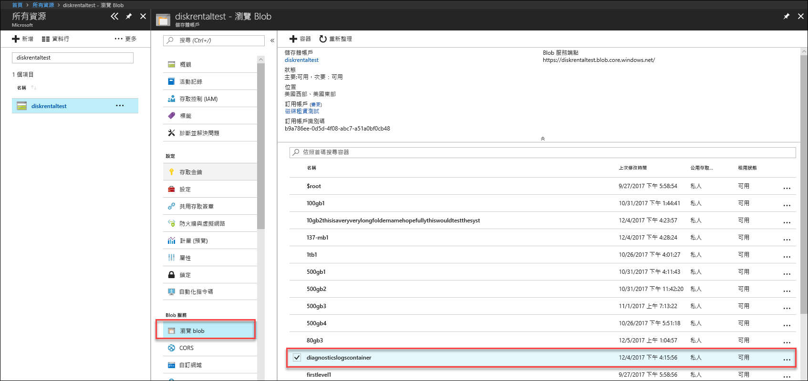
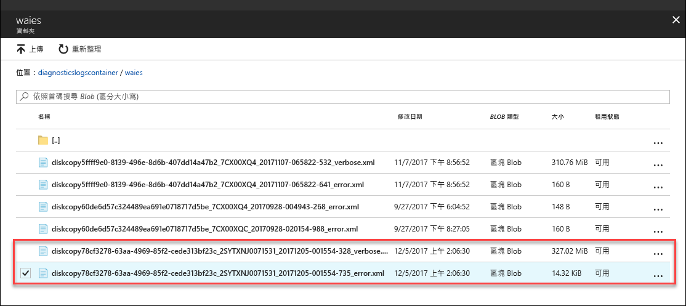

# 針對 Azure 資料箱磁碟 (預覽) 中的問題進行疑難排解

本文適用於執行預覽版本的 Microsoft Azure 資料箱。 本文說明一些可以在資料箱和資料箱磁碟上執行的複雜工作流程和管理工作。 

您可以透過 Azure 入口網站管理資料箱磁碟。 本文著重於可使用 Azure 入口網站執行的工作。 使用 Azure 入口網站來管理訂單、管理裝置，並且在進行到完成時追蹤訂單狀態。

本文包含下列教學課程：

- 下載診斷記錄
- 查詢活動記錄

> [!IMPORTANT]
> 資料箱處於預覽狀態。 部署這個解決方案之前，請檢閱 [Azure 預覽版使用條款](https://azure.microsoft.com/support/legal/preview-supplemental-terms/)。

## 下載診斷記錄

如果在資料複製程序期間有任何錯誤，則入口網站會顯示前往資料夾 (診斷記錄位於該資料夾) 的路徑。 

診斷記錄可以是：
- 錯誤記錄
- 詳細資訊記錄  

若要瀏覽至複製記錄的路徑，請移至與資料箱訂單相關聯的儲存體帳戶。 

1.  移至 [一般 > 訂單詳細資料]，並記下與訂單相關聯的儲存體帳戶。
 

2.  移至 [所有資源] 並搜尋在上一個步驟中所識別出的儲存體帳戶。 選取並按一下儲存體帳戶。

    

3.  移至 [Blob 服務 > 瀏覽 Blob] 並尋找對應到儲存體帳戶的 Blob。 移至 [diagnosticslogcontainer > waies]。 

    

    您應該會看到資料複製的錯誤記錄和詳細資訊記錄。 選取並按一下每個檔案，然後下載本機複本。

## 查詢活動記錄

使用活動記錄可在進行疑難排解時發現錯誤，或監視貴組織使用者修改資源的方式。 透過活動記錄檔，您可以判斷︰

- 在訂用帳戶的資源上進行了哪些作業。
- 起始作業的人員。 
- 發生作業的時間。
- 作業狀態。
- 其他可能協助您研究作業的屬性值。

活動記錄包含在您的資源上執行的所有寫入作業 (例如 PUT、POST、DELETE)，但不包含讀取作業 (例如 GET)。 

活動記錄檔會保留 90 天。 您可以查詢任何的日期範圍，只要開始日期不是在過去 90 天以前。 您也可以依據 Insights 中其中一個內建查詢來進行篩選。 例如，按一下錯誤然後選取並按一下特定錯誤，以了解根本原因。

## 資料箱磁碟解除鎖定工具錯誤

| 錯誤訊息/工具行為      | 建議                                                                                               |
|-------------------------------------------------------------------------------------------------------------------------------------|------------------------------------------------------------------------------------------------------|
| None  資料箱磁碟解除鎖定工具損毀。                                                                            | 未安裝 Bitlocker。 請確定執行資料箱磁碟解除鎖定工具的主機電腦已安裝 BitLocker。                                                                            |
| 不支援最新版本的 .NET Framework。 支援的版本是 4.5 版和更新版本。  工具結束並且有訊息。  | 未安裝 .NET 4.5。 請在執行資料箱磁碟解除鎖定工具的主機電腦上，安裝 .NET 4.5 或更新版本。                                                                            |
| 無法解除鎖定或驗證任何磁碟區。 連絡 Microsoft 支援服務。    此工具無法解除鎖定或驗證任何已鎖定的磁碟機。 | 此工具無法使用提供的通行金鑰，解除鎖定任何已鎖定的磁碟機。 連絡 Microsoft 支援服務以進行後續步驟。                                                |
| 下列磁碟區已解除鎖定並經過驗證。  磁碟區磁碟機代號：E: 無法使用下列通行金鑰解除鎖定任何磁碟區：werwerqomnf、qwerwerqwdfda   此工具會解除鎖定部分磁碟機，並列出成功和失敗的磁碟機代號。| 部分成功。 無法使用提供的通行金鑰解除鎖定部分磁碟機。 連絡 Microsoft 支援服務以進行後續步驟。 |
| 找不到鎖定的磁碟區。 請確認從 Microsoft 處接收的磁碟已正確連線且處於鎖定狀態。          | 此工具找不到任何鎖定的磁碟機。 可能磁碟機已解除鎖定，或未偵測到磁碟機。 請確定磁碟機已連線且已鎖定。                                                           |
| 嚴重錯誤：參數無效 參數名稱：invalid_arg 使用方式： DataBoxDiskUnlock /PassKeys:<passkey_list_separated_by_semicolon>  範例：DataBoxDiskUnlock /PassKeys:passkey1;passkey2;passkey3 範例：DataBoxDiskUnlock /SystemCheck 範例：DataBoxDiskUnlock /Help  /PassKeys:       從 Azure 資料箱磁碟訂單取得此通行金鑰。 通行金鑰會將您的磁碟解除鎖定。 /Help:           這個選項提供 Cmdlet 使用方式和範例的說明。 /SystemCheck:    這個選項會檢查您的系統是否符合執行工具的需求。  按任意鍵以結束。 | 輸入的參數無效。 允許的參數只有 /SystemCheck、/PassKey 和 /Help。                                                                            |

## 資料箱磁碟分割複製工具錯誤

|錯誤訊息/警告  |建議 |
|---------|---------|
|[資訊] 擷取 m 磁碟區的 bitlocker 密碼  [錯誤] 擷取 m: 磁碟區的 bitlocker 金鑰時攔截到例外狀況  序列未包含項目。|如果目的地資料箱磁碟處於離線狀態，就會擲回這個錯誤。   對線上磁碟使用 `diskmgmt.msc` 工具。|
|[錯誤] 擲回例外狀況：WMI 作業失敗：  Method=UnlockWithNumericalPassword, ReturnValue=2150694965,  Win32Message=所提供的復原密碼格式無效。  BitLocker 修復原密碼是 48 位數字。  請確認復原密碼的格式正確，然後再試一次。|先使用資料箱磁碟解除鎖定工具將磁碟解除鎖定，然後重試命令。 如需詳細資訊，請移至 <li> [解除鎖定適用於 Windows 用戶端的資料箱磁碟](data-box-disk-deploy-set-up.md#unlock-disks-on-windows-client)。 </li><li> [解除鎖定適用於 Linux 用戶端的資料箱磁碟](data-box-disk-deploy-set-up.md#unlock-disks-on-linux-client)。 </li>|
|[錯誤] 擲回例外狀況：目標磁碟機上有 DriveManifest.xml 檔案。   這表示目標磁碟機可能已透過不同的日誌檔案來準備。  若要將更多資料新增至相同磁碟機，請使用先前的日誌檔案。 若要刪除現有資料，並再次使用目標磁碟進行新的匯入作業，則請刪除磁碟機上的 DriveManifest.xml。 以新的日誌檔案重新執行此命令。| 當您嘗試對多個匯入工作階段使用同一組磁碟機時，就會收到這個錯誤。   一組磁碟機僅適用於一個分割及複製工作階段。|
|[錯誤] 擲回例外狀況：CopySessionId importdata-sept-test-1 代表前一個複製工作階段，而且無法用於新的複製工作階段。|如果嘗試使用前一個已成功完成的作業名稱來作為新作業的名稱，就會回報此錯誤。  請為您的新作業指派唯一名稱。|
|[資訊] 目的地檔案或目錄名稱超過 NTFS 長度限制。 |當目的檔案因為檔案路徑太長而重新命名時，就會回報此訊息。  請修改 `config.json` 檔案中的配置選項，以控制此行為。|
|[錯誤] 擲回例外狀況：不正確的 JSON 逸出序列。 |當 config.json 的格式無效時，就會回報此訊息。   請在儲存檔案之前，先確認您的 `config.json` 是使用 [JSONlint](https://jsonlint.com/)。|

## 後續步驟

- 深入了解如何[透過 Azure 入口網站管理資料箱磁碟](data-box-portal-ui-admin.md)。
