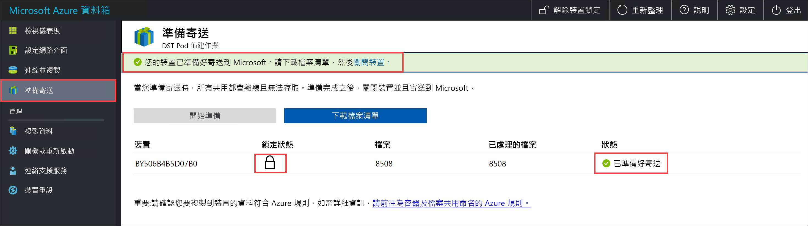
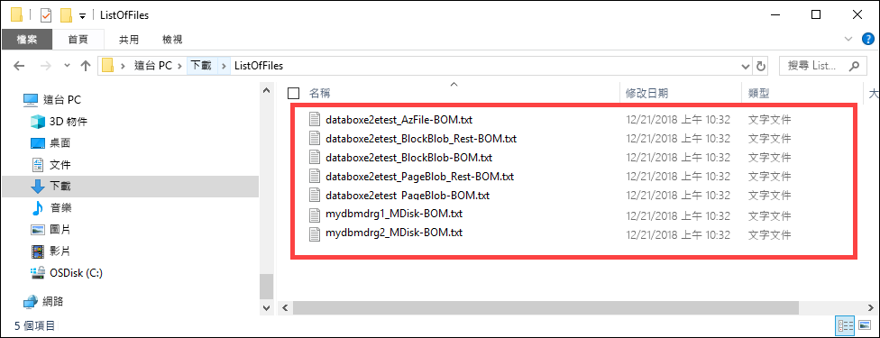

# <a name="use-the-local-web-ui-to-administer-your-data-box"></a>使用本機 Web UI 來管理您的資料箱

此文章說明一些可以在資料箱上執行的設定與管理工作。 您可以透過 Azure 入口網站 UI 與資料箱的本機 Web UI 來管理該裝置。 此文章著重在可以使用本機 Web UI 執行的工作。

您必須使用資料箱的本機 Web UI 來進行裝置的初始設定。 您也可以使用本機 Web UI 來將資料箱關機或重新啟動、執行診斷測試、更新軟體、檢視複製記錄，以及為 Microsoft 支援服務產生記錄套件。

本文包含下列教學課程：

- 產生支援套件
- 關閉或重新啟動您的裝置
- 檢視裝置的可用容量
- 跳過總和檢查碼驗證 

## <a name="generate-support-package"></a>產生支援套件

如果您遇到任何裝置問題，您可以從系統記錄檔建立支援套件。 Microsoft 支援服務會使用此套件來針對問題進行疑難排解。 若要產生支援套件，請執行下列步驟：

1. 在本機 Web UI 中，移至 [連絡支援服務]，然後按一下 [建立支援套件]。

    

2. 已收集支援套件。 此作業需要幾分鐘的時間。

    

3. 建立支援套件之後，按一下 [下載支援套件]。 

    

4. 瀏覽並選擇下載位置。 開啟資料夾以檢視內容。

    


## <a name="shut-down-or-restart-your-device"></a>關閉或重新啟動您的裝置

您可以使用本機 Web UI 來將資料箱關機或重新啟動。 我們建議在重新開機之前，先讓主機上的共用離線，然後再讓裝置離線。 這樣可以讓資料損毀的可能性降至最低。 將裝置關機時，請確保並未執行資料複製。

若要將資料箱關機，請執行下列步驟。

1. 在本機 Web UI 中，移至 [關機或重新啟動]。
2. 按一下 [關機]。

    

3. 系統提示您進行確認時，按一下 [確定] 以繼續。

    

裝置關機之後，請使用前端面板上的電源按鈕來開啟裝置電源。

若要將資料箱重新啟動，請執行下列步驟。

1. 在本機 Web UI 中，移至 [關機或重新啟動]。
2. 按一下 [重新啟動] 。

    

3. 系統提示您進行確認時，按一下 [確定] 以繼續。

   裝置將會關機並重新啟動。

## <a name="download-bom-or-manifest-files"></a>下載 BOM 或資訊清單檔

材料清單 (BOM) 或資訊清單檔包含已複製到資料箱的檔案清單。 這些檔案會在您準備要寄送的資料箱時產生。

開始之前，請確定您的資料箱已完成 [準備寄送] 步驟。 請遵循下列步驟來下載 BOM 或資訊清單檔：

1. 移至您資料箱的本機 Web UI。 您會看到資料箱已完成寄送準備。 當裝置準備完成時，您的裝置狀態會顯示為 [準備好寄送]。

    

2. 按一下 [下載檔案清單]，以下載資料箱上複製的檔案清單。

    ![按一下 [下載檔案清單]](media/data-box-portal-admin/download-list-of-files.png)

3. 在 [檔案總管] 中，您會看到根據用來連線到裝置的通訊協定和所用的 Azure 儲存體類型產生的個別檔案清單。

    

   下表將檔案名稱對應至使用的 Azure 儲存體類型和連接通訊協定。

    |檔案名稱  |Azure 儲存體類型  |使用的連線通訊協定 |
    |---------|---------|---------|
    |databoxe2etest_BlockBlob.txt     |區塊 Blob         |SMB/NFS         |
    |databoxe2etest_PageBlob.txt     |分頁 Blob         |SMB/NFS         |
    |databoxe2etest_AzFile-BOM.txt    |Azure 檔案         |SMB/NFS         |
    |databoxe2etest_PageBlock_Rest-BOM.txt     |分頁 Blob         |REST        |
    |databoxe2etest_BlockBlock_Rest-BOM.txt    |區塊 Blob         |REST         |

在資料箱返回 Azure 資料中心之後，您可使用這份清單來確認已上傳到 Azure 儲存體帳戶的檔案。 範例資訊清單檔如下所示。

```xml
<file size="52689" crc64="0x95a62e3f2095181e">\databox\media\data-box-deploy-copy-data\prepare-to-ship2.png</file>
<file size="22117" crc64="0x9b160c2c43ab6869">\databox\media\data-box-deploy-copy-data\connect-shares-file-explorer2.png</file>
<file size="57159" crc64="0x1caa82004e0053a4">\databox\media\data-box-deploy-copy-data\verify-used-space-dashboard.png</file>
<file size="24777" crc64="0x3e0db0cd1ad438e0">\databox\media\data-box-deploy-copy-data\prepare-to-ship5.png</file>
<file size="162006" crc64="0x9ceacb612ecb59d6">\databox\media\data-box-cable-options\cabling-dhcp-data-only.png</file>
<file size="155066" crc64="0x051a08d36980f5bc">\databox\media\data-box-cable-options\cabling-2-port-setup.png</file>
<file size="150399" crc64="0x66c5894ff328c0b1">\databox\media\data-box-cable-options\cabling-with-switch-static-ip.png</file>
<file size="158082" crc64="0xbd4b4c5103a783ea">\databox\media\data-box-cable-options\cabling-mgmt-only.png</file>
<file size="148456" crc64="0xa461ad24c8e4344a">\databox\media\data-box-cable-options\cabling-with-static-ip.png</file>
<file size="40417" crc64="0x637f59dd10d032b3">\databox\media\data-box-portal-admin\delete-order1.png</file>
<file size="33704" crc64="0x388546569ea9a29f">\databox\media\data-box-portal-admin\clone-order1.png</file>
<file size="5757" crc64="0x9979df75ee9be91e">\databox\media\data-box-safety\japan.png</file>
<file size="998" crc64="0xc10c5a1863c5f88f">\databox\media\data-box-safety\overload_tip_hazard_icon.png</file>
<file size="5870" crc64="0x4aec2377bb16136d">\databox\media\data-box-safety\south-korea.png</file>
<file size="16572" crc64="0x05b13500a1385a87">\databox\media\data-box-safety\taiwan.png</file>
<file size="999" crc64="0x3f3f1c5c596a4920">\databox\media\data-box-safety\warning_icon.png</file>
<file size="1054" crc64="0x24911140d7487311">\databox\media\data-box-safety\read_safety_and_health_information_icon.png</file>
<file size="1258" crc64="0xc00a2d5480f4fcec">\databox\media\data-box-safety\heavy_weight_hazard_icon.png</file>
<file size="1672" crc64="0x4ae5cfa67c0e895a">\databox\media\data-box-safety\no_user_serviceable_parts_icon.png</file>
<file size="3577" crc64="0x99e3d9df341b62eb">\databox\media\data-box-safety\battery_disposal_icon.png</file>
<file size="993" crc64="0x5a1a78a399840a17">\databox\media\data-box-safety\tip_hazard_icon.png</file>
<file size="1028" crc64="0xffe332400278f013">\databox\media\data-box-safety\electrical_shock_hazard_icon.png</file>
<file size="58699" crc64="0x2c411d5202c78a95">\databox\media\data-box-deploy-ordered\data-box-ordered.png</file>
<file size="46816" crc64="0x31e48aa9ca76bd05">\databox\media\data-box-deploy-ordered\search-azure-data-box1.png</file>
<file size="24160" crc64="0x978fc0c6e0c4c16d">\databox\media\data-box-deploy-ordered\select-data-box-option1.png</file>
<file size="115954" crc64="0x0b42449312086227">\databox\media\data-box-disk-deploy-copy-data\data-box-disk-validation-tool-output.png</file>
<file size="6093" crc64="0xadb61d0d7c6d4deb">\databox\data-box-cable-options.md</file>
<file size="6499" crc64="0x080add29add367d9">\databox\data-box-deploy-copy-data-via-nfs.md</file>
<file size="11089" crc64="0xc3ce6b13a4fe3001">\databox\data-box-deploy-copy-data-via-rest.md</file>
<file size="9126" crc64="0x820856b5a54321ad">\databox\data-box-overview.md</file>
<file size="10963" crc64="0x5e9a14f9f4784fd8">\databox\data-box-safety.md</file>
<file size="5941" crc64="0x8631d62fbc038760">\databox\data-box-security.md</file>
<file size="12536" crc64="0x8c8ff93e73d665ec">\databox\data-box-system-requirements-rest.md</file>
<file size="3220" crc64="0x7257a263c434839a">\databox\data-box-system-requirements.md</file>
<file size="2823" crc64="0x63db1ada6fcdc672">\databox\index.yml</file>
<file size="4364" crc64="0x62b5710f58f00b8b">\databox\data-box-local-web-ui-admin.md</file>
<file size="3603" crc64="0x7e34c25d5606693f">\databox\TOC.yml</file>
```

此檔案包含在資料箱上複製的所有檔案清單。 在此檔案中，*crc64* 值與針對對應檔案產生的總和檢查碼有關。

## <a name="view-available-capacity-of-the-device"></a>檢視裝置的可用容量

您可以使用裝置儀表板來檢視裝置的可用與已使用容量。 

1. 在本機 Web UI 中，移至 [檢視儀表板]。
2. 在 [連線並複製] 下，將會顯示裝置上的可用與已使用空間。

    


## <a name="skip-checksum-validation"></a>跳過總和檢查碼驗證

在您準備寄送時，系統預設會針對您的資料產生總和檢查碼。 在某些罕見的情況下，根據資料類型的不同 (小型檔案)，效能可能很緩慢。 在這種情況下，您可以跳過總和檢查碼。 

我們強烈建議您不要停用總和檢查碼，除非效能已嚴重受到影響。

1. 在裝置本機 Web UI 的右上角，移至 [設定]。

    

2. [停用] 總和檢查碼驗證
3. 按一下 [套用]。

## <a name="next-steps"></a>後續步驟

- 了解如何[透過 Azure 入口網站管理資料箱](data-box-portal-admin.md)。

