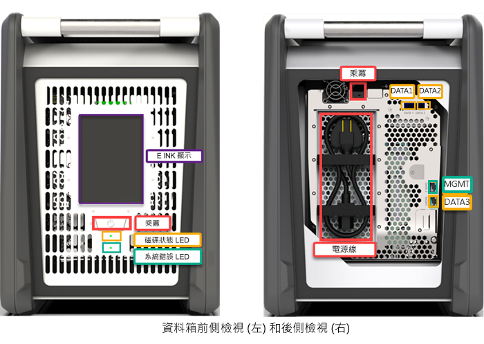
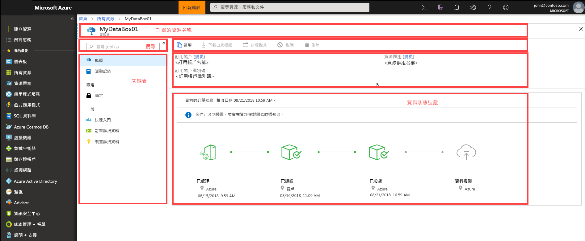
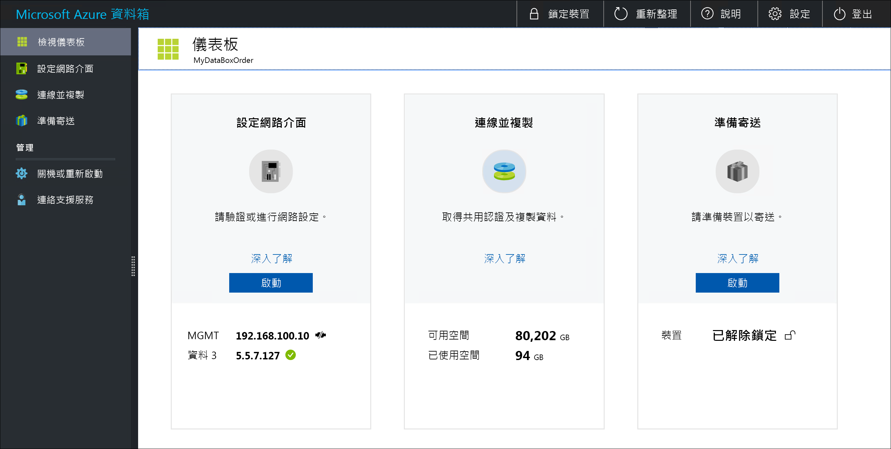

# 什麼是 Azure 資料箱？

Microsoft Azure 資料箱雲端解決方案可讓您以快速、實惠和可靠的方式，將數 TB 的內部部署資料傳送至 Azure。 透過向您寄送專屬的資料箱存放裝置，來加速安全的資料傳輸。 每個存放裝置的最大可用儲存容量為 80 TB，並透過區域性貨運公司運輸至您的資料中心。 該裝置具有堅固的外殼，可在運輸過程中保護裝置與資料。

您可以透過 Azure 入口網站訂購資料箱裝置。 一旦收到裝置之後，您就可以快速地使用本機 Web UI 來設定它。 將您伺服器的資料複製到裝置上，然後將裝置寄回給 Azure。 在 Azure 資料中心內，您的資料會自動從裝置上傳到 Azure。 Azure 入口網站中的資料箱服務會以端對端的方式追蹤這整個程序。

## 使用案例

資料箱非常適合在沒有網路或是網路連線能力受限的情況下，傳送大於 40 TB 的資料。 資料移動可以是單次或定期的，或一開始是大量資料傳輸，然後繼之以定期傳輸。 以下是適合將資料箱用於資料傳輸的各種案例。

 - **單次移轉** - 有大量的內部部署資料移至 Azure 時。 
     - 將媒體櫃從離線磁帶移至 Azure 以建立線上媒體櫃。
     - 將 VM 陣列、SQL 伺服器與應用程式移轉到 Azure
     - 將歷程記錄資料移至 Azure 以使用 HDInsight 進行深入分析和報告

 - **初始大量傳輸** - 使用資料箱 (種子) 完成初始大量傳輸，然後透過網路進行累加式傳輸。 
     - 例如，使用備份解決方案合作夥伴 (例如 Commvault 和資料箱) 將初始的大型歷程記錄備份移至 Azure。 完成後，繼續透過網路將累加資料傳輸到 Azure 儲存體。

- **定期上傳** - 定期產生大量資料而需要移至 Azure 時。 例如，在進行能源探勘時，鑽井平台和風車農場會產生視訊內容。      

## 優點

資料箱的設計可讓它在幾乎不對網路產生影響的情況下，將大量資料移至 Azure。 此解決方案有下列優點：

- **速度** - 資料箱使用 1 Gbps 或 10 Gbps 網路介面，將最多 80 TB 的資料移至 Azure。

- **安全** - 資料箱具有適用於裝置、資料和服務的內建安全保護機制。
    - 裝置有堅固的外殼，並以防拆螺絲和易碎貼紙加以保護。 
    - 裝置上的資料會全程受到 AES 256 位元加密的保護。
    - 裝置只能使用 Azure 入口網站中提供的密碼來解除鎖定。
    - 此服務受到 Azure 安全功能的保護。
    - 在您的資料上傳至 Azure 後，裝置上的磁碟即會根據 NIST 800-88r1 標準進行抹除。
    
    如需詳細資訊，請移至 [Azure 資料箱安全性和資料保護](data-box-security.md)。

## 功能和規格

資料箱裝置在此版本中具有下列功能。

| 規格                                          | 說明              |
|---------------------------------------------------------|--------------------------|
| Weight                                                  | < 50 磅。                |
| 維度                                              | 裝置 - 寬度：309.0 mm 高度：430.4 mm 深度：502.0 mm |            
| 機架空間                                              | 放置在機架側面時為 7 U (不能裝載在機架上)|
| 必要纜線                                         | 1 條電源纜線 (已包含)   2 條 RJ45 纜線   2 條 SFP + Twinax 銅纜線|
| 儲存體容量                                        | 100 TB   80 TB 可用容量 (RAID 5 保護後)|
| 網路介面                                      | 2 個 1 GbE 介面 - MGMT、DATA 3。   MGMT - 用於管理，使用者無法設定，用於初始設定   DATA3 - 用於資料，可由使用者設定，依預設為動態的   MGMT 和 DATA 3 也可以 10 GbE 運作   2 個 10 GbE 介面 - DATA 1、DATA 2   兩者皆用於資料，可以設定為動態 (預設值) 或靜態 |
| 資料傳輸媒體                                     | RJ45、SFP+ 銅纜線 10 GbE 乙太網路  |
| 安全性                                                | 堅固耐用的裝置外殼，使用防拆特製螺絲   易碎貼紙放置在裝置的底部|
| 資料傳輸速率                                      | 透過 10 GbE 網路介面，每天最多 80 TB        |
| 管理性                                              | 本機 Web UI - 一次性初始設定和組態   Azure 入口網站 - 日常的裝置管理        |

## 資料箱元件

資料箱包括下列元件：

* **資料箱裝置** - 一種實體裝置，可提供主要儲存體、管理與雲端儲存體的通訊，並協助確保所有儲存在裝置之資料的安全性和機密性。 資料箱裝置的可用儲存容量為 80 TB。 

    

    
* **資料箱服務** - Azure 入口網站的延伸模組，可讓您從不同的地理位置存取 Web 介面來管理資料箱裝置。 使用資料箱服務執行資料箱裝置的每日管理。 服務工作包括如何建立和管理訂單、檢視及管理警示，以及管理共用。  

    

    如需詳細資訊，請移至[使用資料箱服務管理資料箱裝置](data-box-portal-ui-admin.md)。

* **本機 Web 使用者介面** - 此 Web 型 UI 可用來設定裝置以使其可以連線到區域網路，然後再向資料箱服務註冊該裝置。 您也可以使用本機 Web UI 關閉和重新啟動資料箱裝置、檢視複製記錄檔，以及連絡 Microsoft 支援服務提出服務要求。

    

    如需有關使用 Web 型 UI 的資訊，請移至[使用 Web 型 UI 來管理資料箱](data-box-portal-ui-admin.md)。

## 工作流程

典型的流程包含下列步驟：

1. **訂購** - 在 Azure 入口網站中建立訂單，提供運送資訊，以及資料的目的地 Azure 儲存體帳戶。 如果裝置可供使用，Azure 便會準備並寄出裝置，並附上寄送追蹤識別碼。

2. **接收** - 在裝置成功遞送之後，請使用指定的纜線將裝置接上網路及電源。 開啟電源並連線到裝置。 設定裝置網路，並在您想要複製資料的主機電腦上掛接共用。

3. **複製資料** - 將資料複製到資料箱共用。

4. **寄回** - 準備好裝置並將它關機，然後將裝置寄回 Azure 資料中心。

5. **上傳** - 資料會自動從裝置複製到 Azure。 裝置磁碟會根據美國國家標準與技術局 (National Institute of Standards and Technology，NIST) 的指導方針安全地抹除。

在這整個程序中，您將會透過電子郵件獲知所有狀態變更。 如需更多有關詳細流程的資訊，請移至[在 Azure 入口網站中部署資料箱](data-box-deploy-ordered.md)。

## 區域可用性

資料箱可以根據其服務所部署的區域、裝置所寄送的國家/地區，以及您將資料傳輸至的目標 Azure 儲存體帳戶來傳輸資料。 

- **服務可用性** - 針對此版本，下列區域提供資料箱服務：
    - 位於美國的所有區域 - 美國中西部、美國西部2、美國西部、美國中南部、美國中部、美國中北部、美國東部，以及美國東部2。
    - 歐盟 - 西歐及北歐。
    - 英國 - 英國南部與英國西部。
    - 法國 - 法國中部與法國南部。

- **目的地儲存體帳戶** - 儲存資料的儲存體帳戶在服務可用的所有 Azure 區域都可用。  

## 後續步驟

- 檢閱[資料箱系統需求](data-box-system-requirements.md)。
- 了解[資料箱限制](data-box-limits.md)。
- 在 Azure 入口網站中快速部署 [Azure 資料箱](data-box-quickstart-portal.md)。

