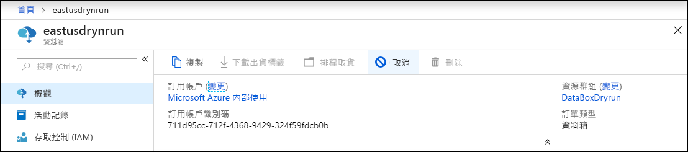
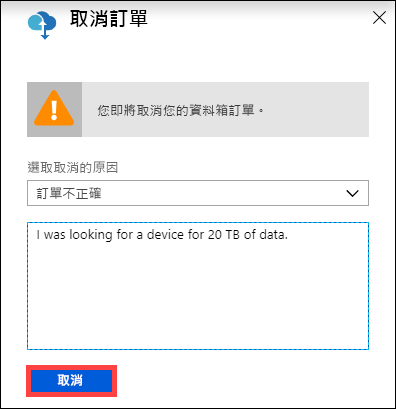
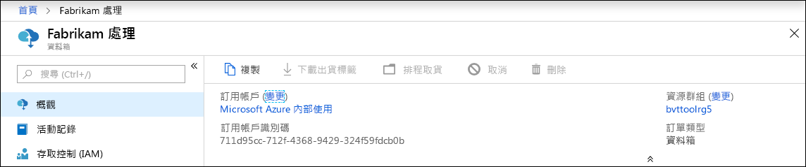
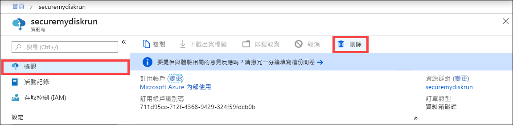
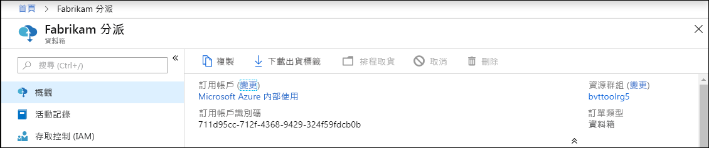
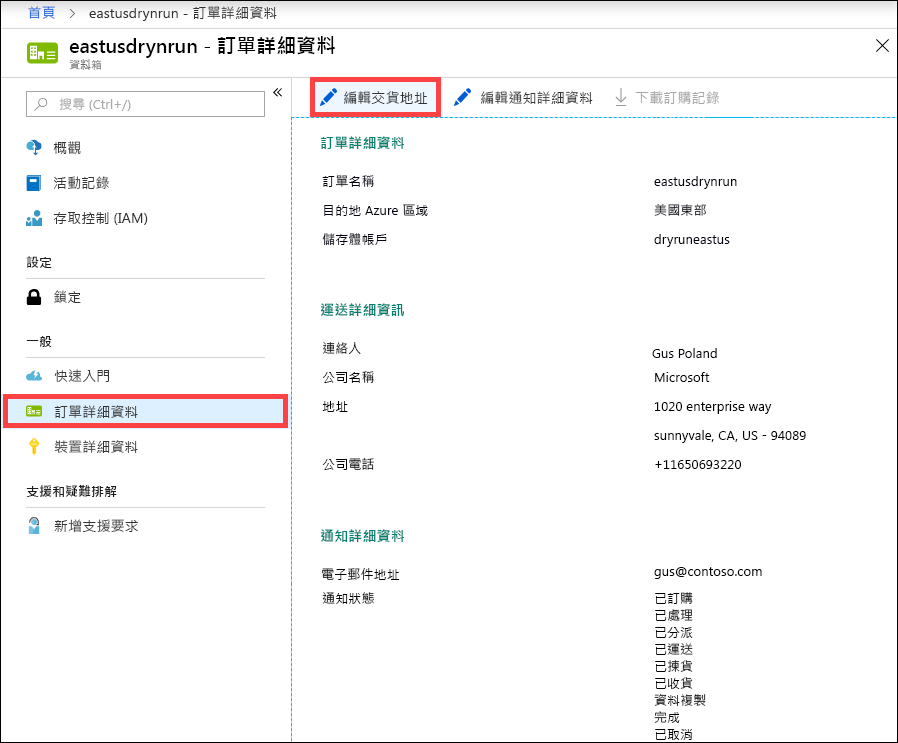
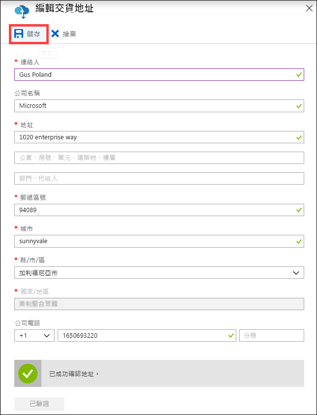
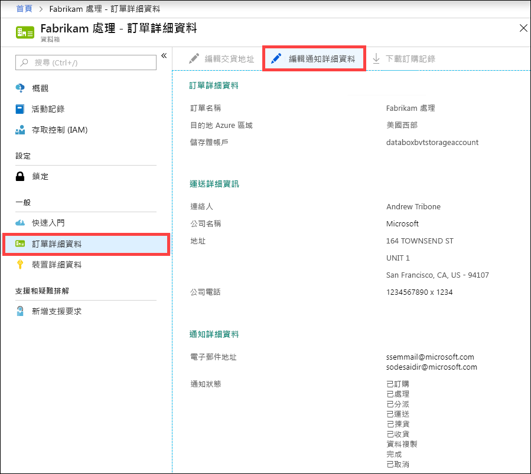
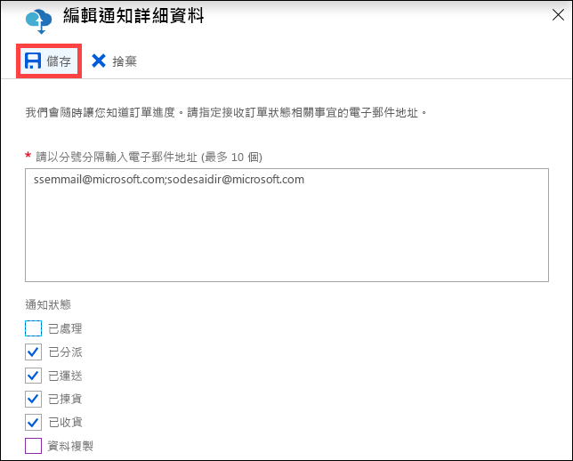

# 使用 Azure 入口網站來管理您的資料箱

此文章說明一些可以在資料箱上執行的複雜工作流程與管理工作。 您可以透過 Azure 入口網站或本機 Web UI 來管理資料箱。 

本文著重於可使用 Azure 入口網站執行的工作。 使用 Azure 入口網站來管理訂單、管理資料箱，並訂單完成之前持續追蹤其狀態。

## 取消訂單

在下過訂單之後，您可能基於各種原因需要取消訂單。 您只能在系統處理訂單之前取消訂單。 在系統已處理訂單並開始準備資料箱之後，就不能夠取消訂單。 

執行下列步驟以取消訂單。

1.  移至 [概觀 > 取消]。 

    

2.  填寫取消訂單的原因。  

    

3.  一旦訂單取消後，入口網站會更新訂單狀態，並將它顯示為 [已取消]。 

## 複製訂單

在某些情況下，複製會很有用。 例如，某個使用者已使用資料箱來傳送一些資料。 隨著更多資料的產生，該使用者發現自己需要另一個資料箱來將那些資料傳送至 Azure。 在此情況下，只需複製相同的訂單即可。

請執行下列步驟來複製訂單。

1.  移至 [概觀 > 複製]。 

    

2.  所有的訂單詳細資料保持不變。 訂單名稱是原始訂單名稱附加上「-複製」。 請選取核取方塊，以確認您已檢閱隱私權資訊。 按一下頁面底部的 [新增] 。    

會在幾分鐘內建立複製，且入口網站更新會顯示新的訂單。

## 刪除訂單

在完成訂單時，您可能需要刪除訂單。 訂單會包含您的個人資訊，例如姓名、地址和連絡資訊。 刪除訂單時，會將此個人資訊刪除。

您只能將已完成或已取消的訂單刪除。 執行下列步驟來刪除訂單。

1. 移至 [所有資源]。 搜尋您的訂單。

2. 按一下您想要刪除的訂單，並移至 [概觀]。 從命令列中，按一下 [刪除]。

    

3. 當系統提示時，請輸入訂單的名稱來確認訂單刪除。 按一下 [刪除] 。

## 下載出貨標籤

如果您資料箱的電子墨水顯示器無法正常運作且無法顯示寄回出貨標籤，您可能需要下載出貨標籤。 

執行下列步驟，以下載出貨標籤。
1.  移至 [概觀 > 下載出貨標籤]。 此選項只有在裝置出貨之後才可使用。 

    

2.  這會下載下列退貨標籤。 儲存標籤並將它列印出來。將標籤折起並插入裝置上的透明保護套中。 請確保標籤清楚可見。 將裝置上來自先前運送的貼紙全數移除。

    

## 編輯交貨地址

一旦下單後，您可能需要編輯交貨地址。 此功能只有在裝置寄出之前才能使用。 在裝置寄出之後，此選項便無法使用。

執行下列步驟以編輯訂單。

1. 移至 [訂單詳細資料 > 編輯交貨地址]。

    

2. 編輯並驗證交貨地址，然後儲存變更。

    

## 編輯通知詳細資料

您可能需要變更要接收訂單狀態電子郵件的使用者。 例如，需要在裝置已送達或收取時通知的使用者。 資料複製完成時，可能需要通知另一位使用者，以便他在將來源中的資料刪除之前，可以確認資料位於 Azure 儲存體帳戶。 在這些情況下，您可以編輯通知詳細資料。

請執行下列步驟來編輯通知詳細資料。

1. 移至 [訂單詳細資料 > 編輯通知詳細資料]。

    

2. 您現在可以編輯通知詳細資料，然後儲存變更。
 
    

## 檢視訂單狀態

當入口網站中的裝置狀態出現變更時，系統會以電子郵件通知您。

|訂單狀態 |說明 |
|---------|---------|
|訂購時間     | 已成功下單。  如果裝置可供使用，Microsoft 會識別要寄送的裝置，並準備該裝置。   如果裝置無法立即提供使用，系統將會在裝置可供使用時處理該訂單。 訂單的處理可能需花費數天到數個月的時間。 如果無法在 90 天內完成訂單，系統將會取消該訂單並通知您。         |
|已處理     | 訂單處理已完成。 裝置已根據您的訂單在資料中心做好寄送準備。         |
|已分派     | 訂單已出貨。 在入口網站中使用顯示在訂單上的追蹤識別碼來追蹤運輸狀態。        |
|已傳遞     | 裝置已寄送至訂單中指定的地址。        |
|已取貨     |您寄回的裝置已經由快遞公司收取並掃描。         |
|已收到     | 您的裝置已由 Azure 資料中心收到並掃描。   確認裝置之後，裝置上傳便會開始。      |
|資料複製     | 資料複製進行中。 在 Azure 入口網站中追蹤您訂單的複製進度。   等候資料複製完成。 |
|Completed       |已順利完成訂單。  從伺服器刪除內部部署資料之前，請確認資料已位於 Azure 中。         |
|已完成，但發生錯誤| 資料複製已完成，但在複製期間發生錯誤。   使用 Azure 入口網站中提供的路徑來檢閱複製記錄。   |
|Canceled            |訂單便會取消。   可能是您取消訂單或發現錯誤，而服務將訂單取消。 如果無法在 90 天內完成訂單，系統也將會取消該訂單並通知您。     |
|清除 | 裝置上的資料已清除。 當訂單記錄報告可在 Azure 入口網站中取得時，即視為已完成裝置清除。|

## 後續步驟

- 了解如何[針對資料箱問題進行疑難排解](data-box-faq.md)。
