# 使用 Azure 入口網站來管理資料箱磁碟 (預覽)

本文中的教學課程適用於預覽期間的 Microsoft Azure 資料箱磁碟。 本文說明一些可以在資料箱磁碟上執行的複雜工作流程和管理工作。 

您可以透過 Azure 入口網站管理資料箱磁碟。 本文著重於可使用 Azure 入口網站執行的工作。 使用 Azure 入口網站來管理訂單、管理磁碟，並且在進行到終端機階段時追蹤訂單狀態。

> [!IMPORTANT]
> 資料箱磁碟處於預覽狀態。 部署這個解決方案之前，請檢閱 [Azure 預覽版使用條款](https://azure.microsoft.com/support/legal/preview-supplemental-terms/)。

## 取消訂單

在下過訂單之後，您可能基於各種原因需要取消訂單。 您只能在磁碟準備開始之前取消訂單。 一旦磁碟準備好且訂單處理後，就不能夠取消訂單。 

執行下列步驟來取消訂單。

1.  移至 [概觀 > 取消]。 

    

2.  填寫取消訂單的原因。  

    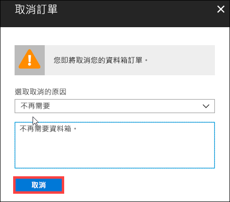

3.  一旦訂單取消後，入口網站會更新訂單狀態，並將它顯示為 [已取消]。

    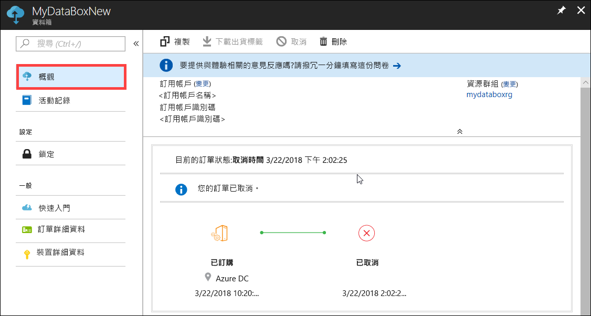

在取消訂單時，您不會收到電子郵件通知。

## 複製訂單

在某些情況下，複製會很有用。 例如，使用者已使用資料箱磁碟來傳送一些資料。 產生更多資料時，就會有更多磁碟需要將該資料傳送至 Azure。 在此情況下，只需複製相同的訂單即可。

請執行下列步驟來複製訂單。

1.  移至 [概觀 > 複製]。 

    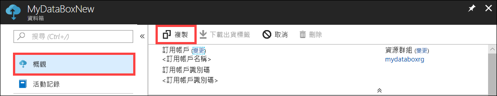

2.  所有的訂單詳細資料保持不變。 訂單名稱是原始訂單名稱附加上「-複製」。 請選取核取方塊，以確認您已檢閱隱私權資訊。 按一下頁面底部的 [新增] 。    

會在幾分鐘內建立複製，且入口網站更新會顯示新的訂單。

[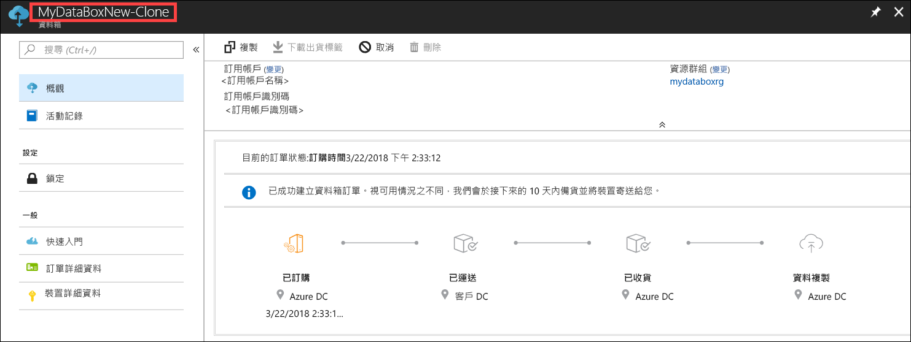](media/data-box-portal-ui-admin/clone-order3.png#lightbox) 

## 刪除訂單

在完成訂單時，您可能需要刪除訂單。 訂單會包含您的個人資訊，例如姓名、地址和連絡資訊。 刪除訂單時，會將此個人資訊刪除。

您只能將已完成或已取消的訂單刪除。 執行下列步驟來刪除訂單。

1. 移至 [所有資源]。 搜尋您的訂單。

    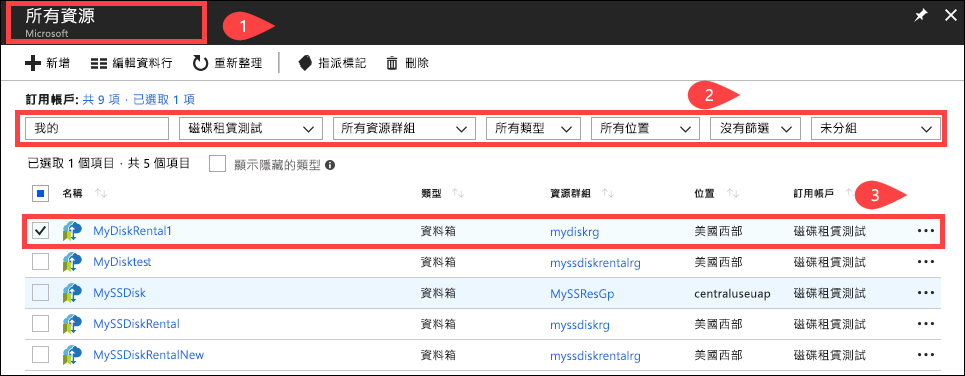

2. 按一下您想要刪除的訂單，並移至 [概觀]。 從命令列中，按一下 [刪除]。

    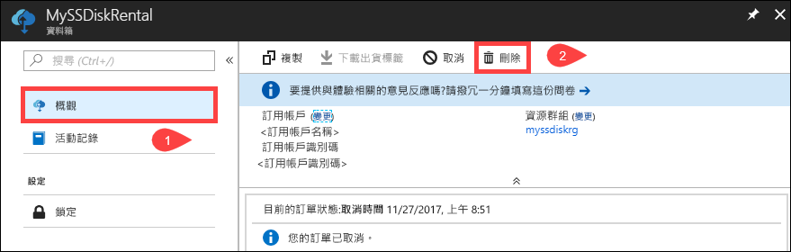

3. 當系統提示時，請輸入訂單的名稱來確認訂單刪除。 按一下 [刪除] 。

     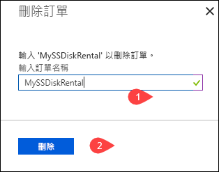

## 下載出貨標籤

如果您磁碟隨附的出貨標籤錯置或遺失，您可能需要下載出貨標籤。 

執行下列步驟，以下載出貨標籤。
1.  移至 [概觀 > 下載出貨標籤]。 只有在磁碟出貨之後，才可使用此選項。 

    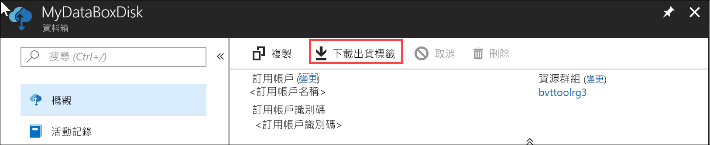

2.  這會下載下列退貨標籤。 儲存標籤、列印，並將其貼到退貨上。

    

## 編輯交貨地址

一旦下單後，您可能需要編輯交貨地址。 只有在分派磁碟前才可使用此功能。 一旦磁碟分派後，將無法再使用此選項。

執行下列步驟以編輯訂單。

1. 移至 [訂單詳細資料 > 編輯交貨地址]。

    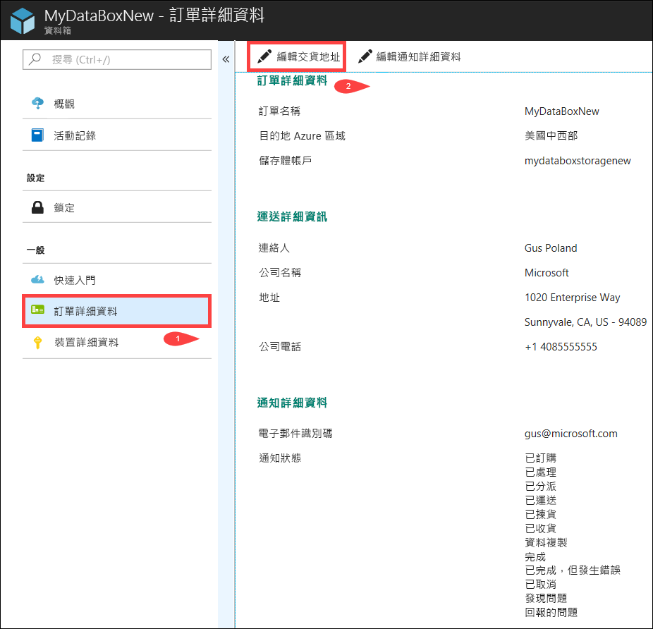

2. 您現在可以編輯交貨地址，然後儲存變更。

    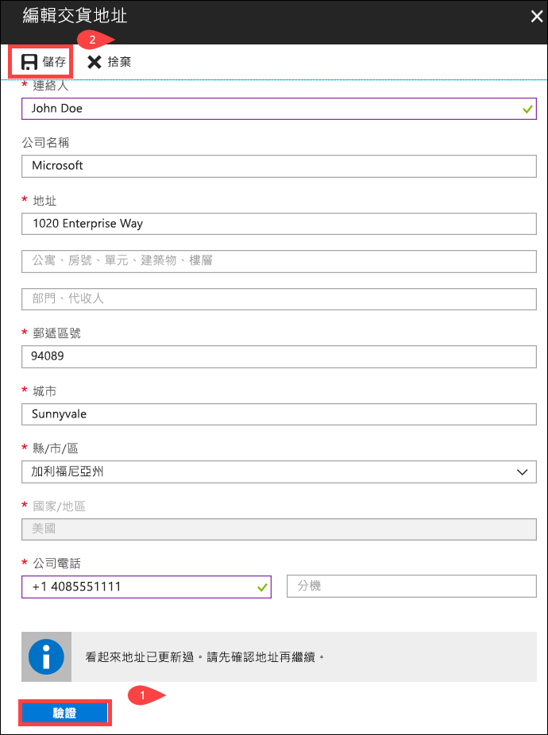

## 編輯通知詳細資料

您可能需要變更要接收訂單狀態電子郵件的使用者。 例如，在磁碟已送達或已取貨時，需要通知使用者。 資料複製完成時，可能需要通知另一位使用者，以便他在將來源中的資料刪除之前，可以確認資料位於 Azure 儲存體帳戶。 在這些情況下，您可以編輯通知詳細資料。

請執行下列步驟來編輯通知詳細資料。

1. 移至 [訂單詳細資料 > 編輯通知詳細資料]。

    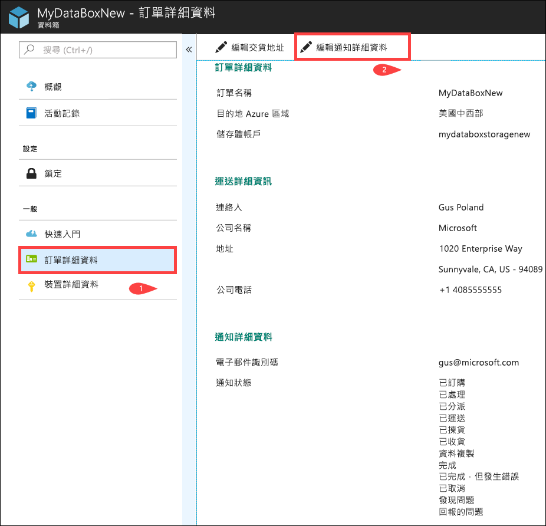

2. 您現在可以編輯通知詳細資料，然後儲存變更。
 
    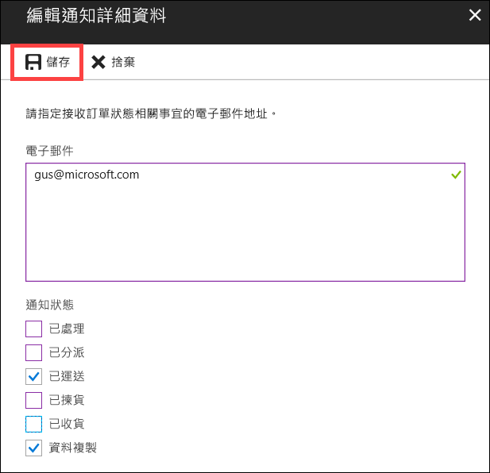

## 檢視訂單狀態

|訂單狀態 |說明 |
|---------|---------|
|訂購時間     | 已成功下單。   如果磁碟無法使用，您會收到通知。  如果可使用磁碟，Microsoft 會識別要寄送的磁碟，並準備磁碟包裹。        |
|已處理     | 訂單處理已完成。   在訂單處理期間，會發生下列動作：<li>使用 AES-128 BitLocker 加密將磁碟加密。 </li> <li>鎖定資料箱磁碟，以防止未經授權的存取。</li><li>在此程序期間，會產生解除鎖定磁碟的通行金鑰。</li>        |
|已分派     | 訂單已出貨。 您應該會在 1-2 天內收到訂單。        |
|已傳遞     | 訂單已傳遞到訂單中指定的地址。        |
|已取貨     |您的退貨已取貨。   一旦 Azure 資料中心收到出貨時，資料會自動上傳至 Azure。         |
|已收到     | Azure 資料中心已收到您的磁碟。 複製資料即將開始。        |
|已複製資料     |資料複製進行中。  等候資料複製完成。         |
|Completed       |已順利完成訂單。  從伺服器中刪除內部部署資料之前，請確認資料位於 Azure 中。         |
|已完成，但發生錯誤| 資料複製已完成，但收到錯誤。   使用 [概觀] 中提供的路徑來檢閱複製記錄。 如需詳細資訊，請移至[下載診斷記錄](data-box-disk-troubleshoot.md#download-diagnostic-logs)。   |
|Canceled            |訂單便會取消。   可能是您取消訂單或發現錯誤，而服務將訂單取消。     |

## 後續步驟

- 了解如何[針對資料箱磁碟問題進行疑難排解](data-box-disk-troubleshoot.md)。
