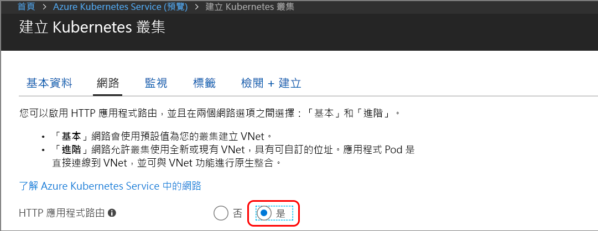

## 建立已針對 Azure Dev Spaces 啟用的 Kubernetes 叢集

1. 在 http://portal.azure.com 登入 Azure 入口網站。
1. 選擇 [建立資源] > 搜尋 **Kubernetes** > 選取 [Kubernetes Service] > [建立]。

   完成建立 AKS 叢集表單中每個標題底下的下列步驟。

    - **專案詳細資料**：選取 Azure 訂用帳戶，以及新的或現有的 Azure 資源群組。
    - **叢集詳細資料**：輸入 AKS 叢集的名稱、地區 (目前，您必須選擇 EastUS、WestEurope 或 CanadaEast)、版本及 DNS 名稱前置詞。
    - **級別**：選取 AKS 代理程式節點的 VM 大小和節點數目。 如果您開始使用 Azure Dev Spaces，一個節點就足以瀏覽所有功能。 節點計數可以輕易在叢集部署後隨時調整。 請注意，VM 大小無法在 AKS 叢集建立後變更。 不過，部署 AKS 叢集後，您就可以輕鬆地建立具有較大 VM 的新 AKS 叢集，而如果您需要相應增加，請使用 Dev Spaces 重新部署到該較大叢集。

   務必選擇 Kubernetes 1.9.6 版或更新版本。

   

   完成時，請選取 [下一步: 網路功能]。

1. 確定已啟用 [Http 應用程式路由]。

   

    > [!IMPORTANT]
    > 您務必要在建立 AKS 叢集時啟用 [Http 應用程式路由]。 您之後無法變更此設定。

1. 選取 [檢閱 + 建立]，然後在完成時選取 [建立]。
