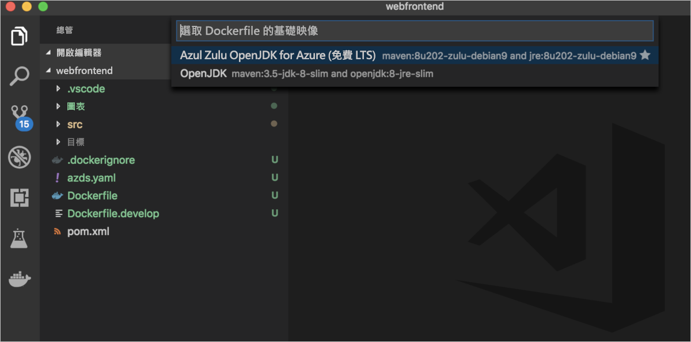
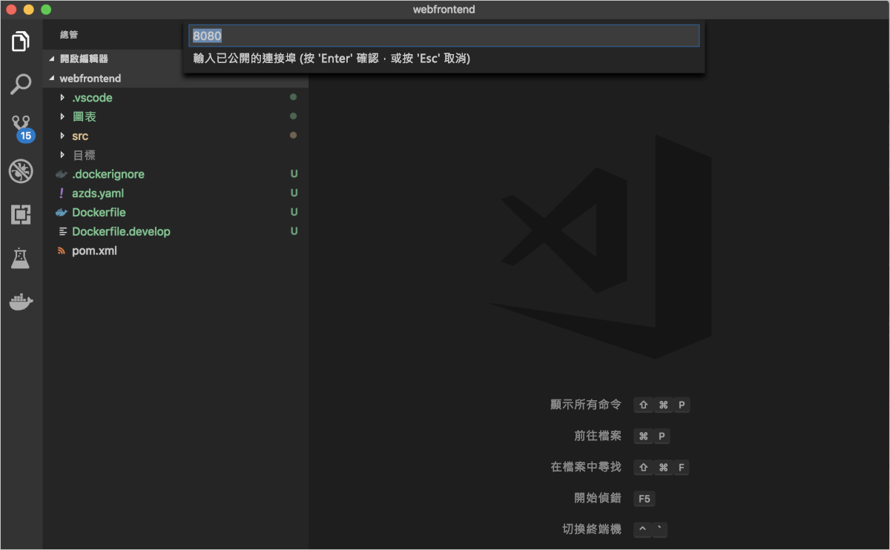
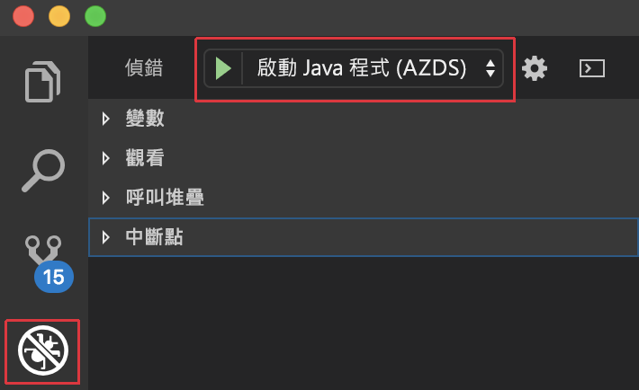

# <a name="quickstart-develop-with-java-on-kubernetes-using-azure-dev-spaces"></a>快速入門：使用 Azure Dev Spaces 在 Kubernetes 上透過 Java 進行開發

在本指南中，您將了解如何：

- 使用 Azure 中受管理的 Kubernetes 叢集，設定 Azure Dev Spaces。
- 使用 Visual Studio Code 和命令列在容器中反覆開發程式碼。
- 從 Visual Studio Code 對開發人員空間中的程式碼進行偵錯。


## <a name="prerequisites"></a>必要條件

- Azure 訂用帳戶。 如果您沒有帳戶，您可以建立[免費帳戶](https://azure.microsoft.com/free)。
- [已安裝 Visual Studio Code](https://code.visualstudio.com/download)。
-  已安裝適用於 Visual Studio Code 的 [Azure Dev Spaces](https://marketplace.visualstudio.com/items?itemName=azuredevspaces.azds) 和[適用於 Azure Dev Spaces 的 Java 偵錯工具](https://marketplace.visualstudio.com/items?itemName=vscjava.vscode-java-debugger-azds)擴充功能。
- [已安裝 Azure CLI](/cli/azure/install-azure-cli?view=azure-cli-latest)。
- [已安裝並設定 Maven](https://maven.apache.org)。

## <a name="create-an-azure-kubernetes-service-cluster"></a>建立 Azure Kubernetes Service 叢集

您必須在[支援的區域](https://docs.microsoft.com/azure/dev-spaces/#a-rapid,-iterative-kubernetes-development-experience-for-teams)中建立 AKS 叢集。 下列命令會建立名為 MyResourceGroup 的資源群組與名為 MyAKS 的 AKS 叢集。

```cmd
az group create --name MyResourceGroup --location eastus
az aks create -g MyResourceGroup -n MyAKS --location eastus --node-count 1 --generate-ssh-keys
```

## <a name="enable-azure-dev-spaces-on-your-aks-cluster"></a>在 AKS 叢集上啟用 Azure Dev Spaces

使用 `use-dev-spaces` 命令在 AKS 叢集上啟用 Dev Spaces，並遵循提示來進行。 下列命令會在 MyResourceGroup 群組中的 MyAKS 叢集上啟用 Dev Spaces，並建立「預設」開發空間。

```cmd
$ az aks use-dev-spaces -g MyResourceGroup -n MyAKS

'An Azure Dev Spaces Controller' will be created that targets resource 'MyAKS' in resource group 'MyResourceGroup'. Continue? (y/N): y

Creating and selecting Azure Dev Spaces Controller 'MyAKS' in resource group 'MyResourceGroup' that targets resource 'MyAKS' in resource group 'MyResourceGroup'...2m 24s

Select a dev space or Kubernetes namespace to use as a dev space.
 [1] default
Type a number or a new name: 1

Kubernetes namespace 'default' will be configured as a dev space. This will enable Azure Dev Spaces instrumentation for new workloads in the namespace. Continue? (Y/n): Y

Configuring and selecting dev space 'default'...3s

Managed Kubernetes cluster 'MyAKS' in resource group 'MyResourceGroup' is ready for development in dev space 'default'. Type `azds prep` to prepare a source directory for use with Azure Dev Spaces and `azds up` to run.
```

## <a name="get-sample-application-code"></a>取得應用程式範例的程式碼

在本文中，您會使用 [Azure Dev Spaces 應用程式範例](https://github.com/Azure/dev-spaces)來示範如何使用 Azure Dev Spaces。

請複製 GitHub 中的應用程式，然後瀏覽至 dev-spaces/samples/java/getting-started/webfrontend 目錄：

```cmd
git clone https://github.com/Azure/dev-spaces
cd dev-spaces/samples/java/getting-started/webfrontend
```

## <a name="prepare-the-application"></a>準備應用程式

使用 `azds prep` 命令，產生用於在 Kubernetes 中執行應用程式的 Docker 和 Helm 圖表資產：

```cmd
azds prep --public
```

您必須從 dev-spaces/samples/java/getting-started/webfrontend 目錄執行 `prep` 命令，以正確產生 Docker 和 Helm 圖表資產。

## <a name="build-and-run-code-in-kubernetes"></a>在 Kubernetes 中建置及執行程式碼

使用 `azds up` 命令在 AKS 中建置和執行程式碼：

```cmd
$ azds up
Using dev space 'default' with target 'MyAKS'
Synchronizing files...3s
Installing Helm chart...8s
Waiting for container image build...28s
Building container image...
Step 1/8 : FROM maven:3.5-jdk-8-slim
Step 2/8 : EXPOSE 8080
Step 3/8 : WORKDIR /usr/src/app
Step 4/8 : COPY pom.xml ./
Step 5/8 : RUN /usr/local/bin/mvn-entrypoint.sh     mvn package -Dmaven.test.skip=true -Dcheckstyle.skip=true -Dmaven.javadoc.skip=true --fail-never
Step 6/8 : COPY . .
Step 7/8 : RUN mvn package -Dmaven.test.skip=true -Dcheckstyle.skip=true -Dmaven.javadoc.skip=true
Step 8/8 : ENTRYPOINT ["java","-jar","target/webfrontend-0.1.0.jar"]
Built container image in 37s
Waiting for container...57s
Service 'webfrontend' port 'http' is available at http://webfrontend.1234567890abcdef1234.eus.azds.io/
Service 'webfrontend' port 80 (http) is available at http://localhost:54256
...
```

您可以藉由開啟公用 URL (顯示於 `azds up` 命令所產生的輸出中)，來查看服務的執行。 在此範例中，公用 URL 為 http://webfrontend.1234567890abcdef1234.eus.azds.io/。

如果您使用 Ctrl+c 停止 `azds up` 命令，則服務會繼續在 AKS 中執行，且公用 URL 會維持可供使用的狀態。

## <a name="update-code"></a>更新程式碼

若要部署更新過的服務版本，您可以在專案中更新任何檔案，然後重新執行 `azds up` 命令。 例如︰

1. 如果 `azds up` 仍在執行，請按 Ctrl+c。
1. 將 [`src/main/java/com/ms/sample/webfrontend/Application.java`](https://github.com/Azure/dev-spaces/blob/master/samples/java/getting-started/webfrontend/src/main/java/com/ms/sample/webfrontend/Application.java#L16) 中的第 16 行更新為：
    
    ```java
    return "Hello from webfrontend in Azure!";
    ```

1. 儲存您的變更。
1. 重新執行 `azds up` 命令：

    ```cmd
    $ azds up
    Using dev space 'default' with target 'MyAKS'
    Synchronizing files...1s
    Installing Helm chart...3s
    Waiting for container image build...
    ...    
    ```

1. 瀏覽至執行中的服務，然後觀察您的變更。
1. 按 Ctrl+c 來停止 `azds up` 命令。

## <a name="enable-visual-studio-code-to-debug-in-kubernetes"></a>啟用 Visual Studio Code 以在 Kubernetes 中進行偵錯

開啟 Visual Studio Code，依序按一下 [檔案] 和 [開啟...]，瀏覽至 dev-spaces/samples/java/getting-started/webfrontend 目錄，然後按一下[開啟]。

您現在已在 Visual Studio Code 中開啟 webfrontend 專案，亦即您使用 `azds up` 命令所執行的同一個服務。 若要使用 Visual Studio Code 在 AKS 中對這個服務進行偵錯，而非直接使用 `azds up`，您必須讓此專案做好準備，以使用 Visual Studio Code 與您的開發人員空間進行通訊。

若要在 Visual Studio Code 中開啟命令選擇區，請依序按一下 [檢視] 和 [命令選擇區]。 開始輸入 `Azure Dev Spaces`，然後按一下 `Azure Dev Spaces: Prepare configuration files for Azure Dev Spaces`。


當 Visual Studio Code 也提示您設定基礎映像和公開的連接埠時，請選擇 `Azul Zulu OpenJDK for Azure (Free LTS)` 作為基礎映像，選擇 `8080` 作為公開的連接埠。





此命令會讓您的專案做好準備，使其可以直接從 Visual Studio Code 執行於 Azure Dev Spaces 中。 其也會產生 .vscode 目錄，且專案的根目錄中會有偵錯設定。

## <a name="build-and-run-code-in-kubernetes-from-visual-studio"></a>從 Visual Studio 在 Kubernetes 中建置和執行程式碼

按一下左側的 [偵錯] 圖示，然後按一下頂端的 [啟動 Java 程式 (AZDS)]。



此命令會在 Azure Dev Spaces 中以偵錯模式建置和執行您的服務。 底部的 [終端機] 視窗會顯示您在 Azure Dev Spaces 中所執行服務的建置輸出和 URL。 [偵錯主控台] 會顯示記錄輸出。

> [!Note]
> 如果您未在 [命令選擇區] 中看到任何 Azure Dev Spaces 命令，請確定您已安裝[適用於 Azure Dev Spaces 的 Visual Studio Code 擴充功能](https://marketplace.visualstudio.com/items?itemName=azuredevspaces.azds)。 也請確認您已在 Visual Studio Code 中開啟 dev-spaces/samples/java/getting-started/webfrontend 目錄。

依序按一下 [偵錯] 和 [停止偵錯] 來停止偵錯工具。

## <a name="setting-and-using-breakpoints-for-debugging"></a>設定和使用偵錯的中斷點

使用 [啟動 Java 程式 (AZDS)] 以偵錯模式啟動您的服務。

依序按一下 [檢視] 和 [總管]，來瀏覽回到 [總管] 檢視。 開啟 `src/main/java/com/ms/sample/webfrontend/Application.java`，然後在第 16 行的某處按一下來將游標放在該處。 若要設定中斷點，請按 F9，或依序按一下 [偵錯] 和 [切換中斷點]。

在瀏覽器中開啟您的服務，並注意其中並未顯示任何訊息。 返回 Visual Studio Code，您會看到第 16 行已醒目提示。 您所設定的中斷點已讓服務在第 16 行暫停。 若要讓服務繼續，請按 F5，或依序按一下 [偵錯] 和 [繼續]。 返回您的瀏覽器，並注意現在會顯示訊息。

在連結了偵錯工具的 Kubernetes 中執行您的服務時，您可以完整地存取偵錯資訊，例如呼叫堆疊、區域變數和例外狀況資訊。

藉由將游標放在 `src/main/java/com/ms/sample/webfrontend/Application.java` 中的第 16 行上並按下 F9，即可移除中斷點。

## <a name="update-code-from-visual-studio-code"></a>從 Visual Studio Code 更新程式碼

在服務以偵錯模式執行時，更新 `src/main/java/com/ms/sample/webfrontend/Application.java` 中的第 16 行。 例如︰
```java
return "Hello from webfrontend in Azure while debugging!";
```

儲存檔案。 依序按一下 [偵錯] 和 [重新啟動偵錯]，或在 [偵錯工具列] 中按一下 [重新啟動偵錯] 按鈕。


在瀏覽器中開啟您的服務，並注意您已更新的訊息會顯示出來。

Azure Dev Spaces 會以累加方式重新編譯現有容器中的程式碼，以提供更快的編輯/偵錯迴圈，而不是在每次進行程式碼編輯時重新建置及重新部署新的容器映像。

## <a name="clean-up-your-azure-resources"></a>清除 Azure 資源

```cmd
az group delete --name MyResourceGroup --yes --no-wait
```

## <a name="next-steps"></a>後續步驟

了解 Azure Dev Spaces 如何協助您跨多個容器開發更複雜的應用程式，以及如何藉由在不同的空間中使用不同的程式碼版本或分支，來簡化共同開發。

> [!div class="nextstepaction"]
> [使用多個容器和小組開發](multi-service-java.md)
