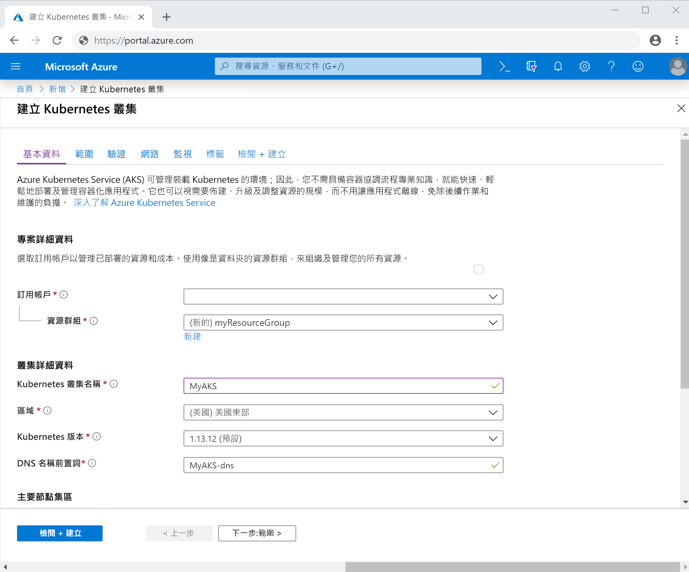
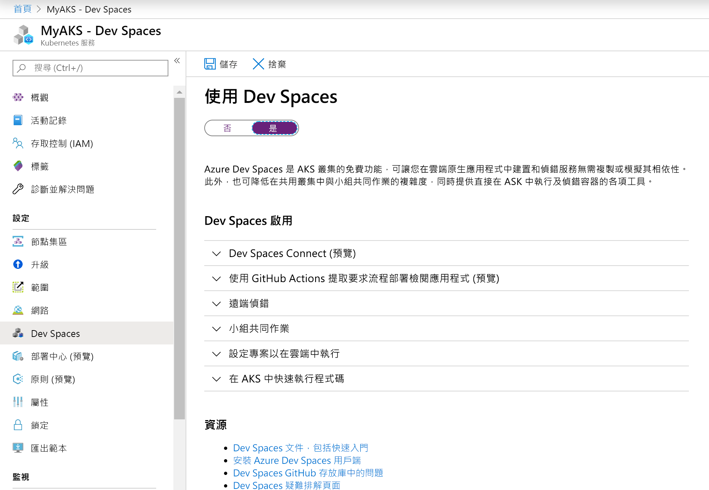

# <a name="quickstart-develop-with-net-core-on-kubernetes-with-azure-dev-spaces-visual-studio"></a>快速入門：使用 Azure Dev Spaces (Visual Studio) 在 Kubernetes 上使用 .NET Core 進行開發

在本指南中，您將了解如何：

- 使用 Azure 中受管理的 Kubernetes 叢集，設定 Azure Dev Spaces。
- 使用 Visual Studio 在容器中反覆開發程式碼。
- 使用 Visual Studio 對叢集中執行的程式碼進行偵錯。

## <a name="prerequisites"></a>必要條件

- Azure 訂用帳戶。 如果您沒有帳戶，您可以建立[免費帳戶](https://azure.microsoft.com/free)。
- 已安裝 Azure 開發工作負載的 Visual Studio 2019 (Windows 版)。 您也可以使用已安裝 Web 開發工作負載和[適用於 Kubernetes 的 Visual Studio Tools](https://aka.ms/get-vsk8stools) 的 Visual Studio 2017 (Windows 版)。 如果您尚未安裝 Visual Studio，請在[這裡](https://aka.ms/vsdownload?utm_source=mscom&utm_campaign=msdocs)下載。

## <a name="create-an-azure-kubernetes-service-cluster"></a>建立 Azure Kubernetes Service 叢集

您必須在[支援的區域][supported-regions]中建立 AKS 叢集。 若要建立叢集：

1. 登入 [Azure 入口網站](https://portal.azure.com)
1. 選取 [+ 建立資源] > [Kubernetes Service]  。 
1. 輸入 [訂用帳戶]  、[資源群組]  、[Kubernetes 叢集名稱]  、[區域]  、[Kubernetes 版本]  和 [DNS 名稱前置詞]  。

    

1. 按一下 [檢閱 + 建立]  。
1. 按一下頁面底部的 [新增]  。

## <a name="enable-azure-dev-spaces-on-your-aks-cluster"></a>在 AKS 叢集上啟用 Azure Dev Spaces

在 Azure 入口網站中瀏覽至您的 AKS 叢集，然後按一下 [Dev Spaces]  。 將 [啟用 Dev Spaces]  變更為 [是]  ，然後按一下 [儲存]  。



## <a name="create-a-new-aspnet-web-app"></a>建立新的 ASP.NET Web 應用程式

1. 開啟 Visual Studio。
1. 建立新專案。
1. 選擇 [ASP.NET Core Web 應用程式]  ，然後將您的專案命名為 webfrontend  。
1. 按一下 [確定]  。
1. 出現提示時，選擇 [Web 應用程式 (Model-View-Controller)]  作為範本。
1. 選取頂端的 [.NET Core]  和 [ASP.NET Core 2.0]  。
1. 按一下 [確定]  。

## <a name="connect-your-project-to-your-dev-space"></a>將專案連線至您的開發人員空間

在您的專案中，從啟動設定下拉式清單中選取 [Azure Dev Spaces]  ，如下所示。


在 [Azure Dev Spaces] 對話方塊中，選取您的 [訂用帳戶]  和 [Azure Kubernetes 叢集]  。 讓 [空間]  保持設定為 [預設]  ，然後啟用 [可公開存取]  核取方塊。 按一下 [確定]  。


此程序會將您的服務部署至具有可公開存取 URL 的「預設」  開發空間。 如果您選擇尚未設定要搭配 Azure Dev Spaces 使用的叢集，您會看到訊息詢問您是否要設定它。 按一下 [確定]  。


在「預設」  開發人員空間中執行的服務所具有的公用 URL 會顯示在 [輸出]  視窗中：

```cmd
Starting warmup for project 'webfrontend'.
Waiting for namespace to be provisioned.
Using dev space 'default' with target 'MyAKS'
...
Successfully built 1234567890ab
Successfully tagged webfrontend:devspaces-11122233344455566
Built container image in 39s
Waiting for container...
36s

Service 'webfrontend' port 'http' is available at http://webfrontend.1234567890abcdef1234.eus.azds.io/
Service 'webfrontend' port 80 (http) is available at http://localhost:62266
Completed warmup for project 'webfrontend' in 125 seconds.
```

在上述範例中，公用 URL 是 http://webfrontend.1234567890abcdef1234.eus.azds.io/。 瀏覽至您服務的公用 URL，並與您開發人員空間中執行的服務互動。

此程序可能已停用針對您服務的公用存取。 若要啟用公用存取，您可以更新[*values.yaml* 中的輸入值][ingress-update]。

## <a name="update-code"></a>更新程式碼

如果 Visual Studio 仍與您的開發人員空間保持連線，請按一下 [停止] 按鈕。 將 `Controllers/HomeController.cs` 中的第 20 行變更為：
    
```csharp
ViewData["Message"] = "Your application description page in Azure.";
```

儲存變更，並從啟動設定下拉式清單中，啟動會使用 **Azure Dev Spaces** 的服務。 在瀏覽器中開啟您服務的公用 URL，然後按一下 [關於]  。 您會發現更新過的訊息跑出來。

Azure Dev Spaces 會以累加方式重新編譯現有容器中的程式碼，以提供更快的編輯/偵錯迴圈，而不是在每次進行程式碼編輯時重新建置及重新部署新的容器映像。

## <a name="setting-and-using-breakpoints-for-debugging"></a>設定和使用偵錯的中斷點

如果 Visual Studio 仍與您的開發人員空間保持連線，請按一下 [停止] 按鈕。 開啟 `Controllers/HomeController.cs`，然後在第 20 行的某處按一下來將游標放在該處。 若要設定中斷點，請按 F9  ，或依序按一下 [偵錯]  和 [切換中斷點]  。 若要在您的開發人員空間中以偵錯模式啟動您的服務，請按 F5  或依序按一下 [偵錯]  和 [開始偵錯]  。

在瀏覽器中開啟您的服務，並注意其中並未顯示任何訊息。 返回 Visual Studio，您會看到第 20 行已醒目提示。 您所設定的中斷點已讓服務在第 20 行暫停。 若要讓服務繼續，請按 F5  ，或依序按一下 [偵錯]  和 [繼續]  。 返回您的瀏覽器，並注意現在會顯示訊息。

在連結了偵錯工具的 Kubernetes 中執行您的服務時，您可以完整地存取偵錯資訊，例如呼叫堆疊、區域變數和例外狀況資訊。

藉由將游標放在 `Controllers/HomeController.cs` 中的第 20 行上並按下 F9  ，即可移除中斷點。

## <a name="clean-up-your-azure-resources"></a>清除 Azure 資源

在 Azure 入口網站中瀏覽至您的資源群組，然後按一下 [刪除資源群組]  。 或者，您也可以使用 [az aks delete](/cli/azure/aks#az-aks-delete) 命令：

```cmd
az group delete --name MyResourceGroup --yes --no-wait
```

## <a name="next-steps"></a>後續步驟

> [!div class="nextstepaction"]
> [使用多個容器和小組開發](multi-service-netcore-visualstudio.md)

[ingress-update]: how-dev-spaces-works.md#how-running-your-code-is-configured
[supported-regions]: about.md#supported-regions-and-configurations
