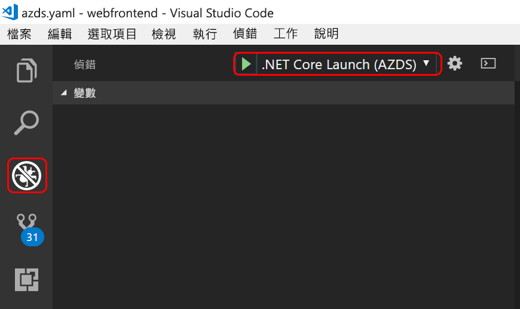

# <a name="quickstart-create-a-kubernetes-dev-space-with-azure-dev-spaces-net-core-and-vs-code"></a>快速入門：使用 Azure Dev Spaces 建立 Kubernetes 開發人員空間 (.NET Core 和 VS Code)

在本指南中，您將了解如何：

- 使用 Azure 中受管理的 Kubernetes 叢集，設定 Azure Dev Spaces。
- 使用 VS Code 和命令列在容器中反覆開發程式碼。
- 從 VS Code 對開發人員空間中的程式碼進行偵錯

> [!Note]
> **如果作業出現停滯的情況**，請參閱[疑難排解](troubleshooting.md)一節，或在此頁面上張貼留言。 您也可以嘗試進行更詳細的[教學課程](get-started-netcore.md)。

## <a name="prerequisites"></a>必要條件

- Azure 訂用帳戶。 如果您沒有帳戶，您可以建立[免費帳戶](https://azure.microsoft.com/free)。
- [Visual Studio Code](https://code.visualstudio.com/download)。
- [Azure CLI](/cli/azure/install-azure-cli?view=azure-cli-latest) 2.0.43 版或更新版本。
- 在 EastUS、CentralUS、WestUS2、WestEurope、CanadaCentral 或 CanadaEast 區域中執行 Kubernetes 1.9.6 或更新版本、並且已啟用 **HTTP 應用程式路由**的 Kubernetes 叢集。

    ```cmd
    az group create --name MyResourceGroup --location <region>
    az aks create -g MyResourceGroup -n MyAKS --location <region> --kubernetes-version 1.11.2 --enable-addons http_application_routing --generate-ssh-keys
    ```

## <a name="set-up-azure-dev-spaces"></a>設定 Azure Dev Spaces

Azure CLI 和 Azure Dev Spaces 擴充功能可以安裝在 Windows、Mac 或 Linux 機器上並加以執行。 若為 Linux，支援的散發套件如下：Ubuntu (18.04、16.04 和 14.04)、Debian 8 和 9、RHEL 7、Fedora 26+、CentOS 7、openSUSE 42.2 和 SLES 12。

請遵循下列步驟來設定 Azure Dev Spaces：

1. 在您的 AKS 叢集上設定 Dev Spaces：`az aks use-dev-spaces -g MyResourceGroup -n MyAKS`
1. 下載 VS Code 的 [Azure Dev Spaces 擴充功能](https://marketplace.visualstudio.com/items?itemName=azuredevspaces.azds)。 在擴充功能的 Marketplace 頁面上按一下 [安裝]，然後在 VS Code 再按一次。

## <a name="build-and-run-code-in-kubernetes"></a>在 Kubernetes 中建置及執行程式碼

1. 從 GitHub 下載範例程式碼：[https://github.com/Azure/dev-spaces](https://github.com/Azure/dev-spaces) 
1. 將目錄切換至 webfrontend 資料夾：`cd dev-spaces/samples/dotnetcore/getting-started/webfrontend`
1. 產生 Docker 和 Helm 圖表資產：`azds prep --public`
1. 在 AKS 中建置和執行程式碼。 在終端機視窗中，從 **webfrontend 資料夾**執行此命令：`azds up`
1. 掃描主控台輸出，以取得 `up` 命令所建立之 URL 的相關資訊。 它會在表單中： 

   `(pending registration) Service 'webfrontend' port 'http' will be available at <url>\r\nService 'webfrontend' port 80 (TCP) is available at http://localhost:<port>` 

   在瀏覽器視窗中開啟此 URL，您應該會看到 Web 應用程式載入。 
   
   > [!Note]
   > 第一次執行時，可能需要數分鐘的時間才能備妥公用 DNS。 如果無法解析公用 URL，您可以使用主控台輸出中顯示的替代 http://localhost:<portnumber> URL。 如果您使用 localhost URL，容器可能看起來像在本機執行，但實際是在 AKS 中執行。 為了方便您操作以及與本機電腦上的服務互動，Azure 開發人員空間會建立暫存的 SSH 通道，連到在 Azure 中執行的容器。 當 DNS 記錄備妥時，您可以返回且稍後嘗試公用 URL。

### <a name="update-a-content-file"></a>更新內容檔案

1. 找出檔案 (例如 `./Views/Home/Index.cshtml`) 並進行 HTML 編輯。 例如，將第 70 行 `<h2>Application uses</h2>` 變更如下：`<h2>Hello k8s in Azure!</h2>`
1. 儲存檔案。 稍後，您會在終端機視窗中看到一則訊息，指出執行中容器中的檔案已更新。
1. 移至您的瀏覽器並重新整理頁面。 您應該會看到網頁顯示更新後的 HTML。

發生什麼情形？ 編輯內容檔案 (例如 HTML 和 CSS) 時，不需要在 .NET Core Web 應用程式中重新編譯，所以作用中 `azds up` 命令會自動將任何修改過的內容檔案，直接同步處理到 Azure 中的執行中容器，您即可立即查看內容編輯。

### <a name="update-a-code-file"></a>更新程式碼檔案
更新程式碼檔案需要更多的工作，因為.NET Core 應用程式需要重建及產生更新後的應用程式二進位檔。

1. 在終端機視窗中，按 `Ctrl+C` (以停止 `azds up`)。
1. 開啟名為 `Controllers/HomeController.cs` 的程式碼檔案，然後編輯 [關於] 頁面將顯示的訊息：`ViewData["Message"] = "Your application description page.";`
1. 儲存檔案。
1. 在終端機視窗中執行 `azds up`。 

此命令會重建容器映像，並重新部署 Helm 圖表。 若要查看程式碼變更是否在執行中應用程式中生效，請移至 Web 應用程式中的 [關於] 功能表。

但是還有「更加快速的方法」可開發程式碼，您將在下一節中加以探索。 

## <a name="debug-a-container-in-kubernetes"></a>在 Kubernetes 中進行容器偵錯

在本節中，您將使用 VS Code 直接對您在 Azure 中執行的容器進行偵錯。 您也將了解如何取得更快速的編輯-執行-測試迴圈。


### <a name="initialize-debug-assets-with-the-vs-code-extension"></a>使用 VS Code 擴充功能初始化偵錯資產
首先您必須設定程式碼專案，讓 VS Code 與 Azure 中的開發人員空間通訊。 適用於 Azure Dev Spaces 的 VS Code 擴充功能提供協助程式命令，可以設定偵錯組態。 

開啟 [命令選擇區] (使用 [檢視 | 命令選擇區] 功能表)，然後使用自動完成功能以輸入及選取以下命令：`Azure Dev Spaces: Prepare configuration files for Azure Dev Spaces`。 

這樣會為 `.vscode` 資料夾底下的 Azure Dev Spaces 新增偵錯組態。 此命令不應與 `azds prep` 命令混淆；後者會設定要部署的專案。


### <a name="select-the-azds-debug-configuration"></a>選取 AZDS 偵錯組態
1. 若要開啟 [偵錯] 檢視，請按一下 VS Code 側邊的 [活動列] 中的 [偵錯] 圖示。
1. 選取 [.NET Core Launch (AZDS)] 作為作用中偵錯組態。



> [!Note]
> 如果您未在 [命令選擇區] 中看到任何 Azure 開發人員空間命令，請確定您已安裝適用於 Azure 開發人員空間的 VS Code 擴充功能。 請確定您在 VS Code 中開啟的工作區是包含 azds.yaml 的資料夾。


### <a name="debug-the-container-in-kubernetes"></a>在 Kubernetes 中進行容器偵錯
按 **F5** 可在 Kubernetes 中進行程式碼偵錯。

與 `up` 命令相同，程式碼也會同步到開發人員空間，且容器會建置並部署到 Kubernetes。 此時，偵錯工具當然會連結至遠端容器。

> [!Tip]
> VS Code 狀態列會顯示可點按的 URL。

在伺服器端程式碼檔案中設定中斷點，例如在 `Controllers/HomeController.cs` 來源檔案的 `Index()` 函式內。 重新整理瀏覽器頁面會導致叫用中斷點。

就如同已在本機執行程式碼一樣，您擁有偵錯資訊的完整存取權，例如呼叫堆疊、區域變數、例外狀況資訊等等。

### <a name="edit-code-and-refresh"></a>編輯程式碼並重新整理
使用有效的偵錯工具，進行程式碼編輯。 例如，在 `Controllers/HomeController.cs` 中修改 [關於] 頁面的訊息。 

```csharp
public IActionResult About()
{
    ViewData["Message"] = "My custom message in the About page.";
    return View();
}
```

儲存檔案，然後在 [偵錯動作] 窗格中，按一下 [重新整理] 按鈕。 


Azure 開發人員空間會以累加方式重新編譯現有容器中的程式碼，以提供更快的編輯/偵錯迴圈，而不是在每次進行程式碼編輯時重新建置及重新部署新的容器映像 (這通常要花費相當長的時間)。

請在瀏覽器中重新整理 Web 應用程式，並移至 [關於] 頁面。 您應會看到自訂訊息出現在 UI 中。

**您現在有辦法在 Kubernetes 中快速逐一查看程式碼及直接進行偵錯！**

## <a name="next-steps"></a>後續步驟

了解 Azure Dev Spaces 如何協助您跨多個容器開發更複雜的應用程式，以及如何藉由在不同的空間中使用不同的程式碼版本或分支，來簡化共同開發。 

> [!div class="nextstepaction"]
> [使用多個容器和小組開發](team-development-netcore.md)
