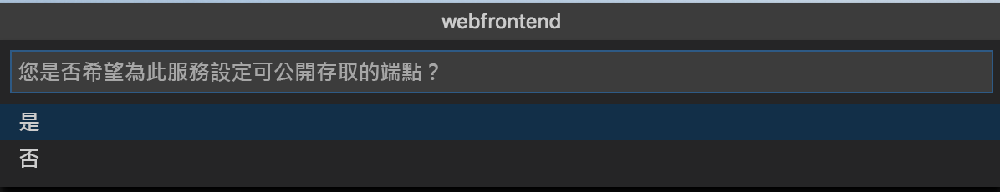
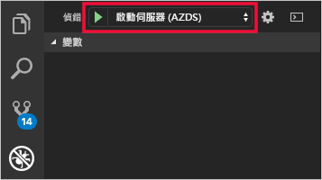
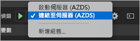

# <a name="quickstart-debug-and-iterate-with-visual-studio-code-and-nodejs-on-kubernetes-using-azure-dev-spaces"></a>快速入門：在 Kubernetes 上使用 Azure Dev Spaces 以 Visual Studio Code 和 Node.js 進行偵錯和逐一查看

在本指南中，您將了解如何：

- 使用 Azure 中受管理的 Kubernetes 叢集，設定 Azure Dev Spaces。
- 使用 Visual Studio Code 在容器中反覆開發程式碼。
- 從 Visual Studio Code 對開發人員空間中的程式碼進行偵錯。

Azure Dev Spaces 也可讓您使用下列工具進行偵錯和逐一查看：
- [Java 和 Visual Studio Code](quickstart-java.md)
- [.NET Core 和 Visual Studio Code](quickstart-netcore.md)
- [.NET Core 和 Visual Studio](quickstart-netcore-visualstudio.md)

## <a name="prerequisites"></a>必要條件

- Azure 訂用帳戶。 如果您沒有 Azure 訂用帳戶，您可以建立[免費帳戶](https://azure.microsoft.com/free)。
- [已安裝 Visual Studio Code](https://code.visualstudio.com/download)。
- 已安裝適用於 Visual Studio Code 的 [Azure Dev Spaces](https://marketplace.visualstudio.com/items?itemName=azuredevspaces.azds) 擴充功能。
- [已安裝 Azure CLI](/cli/azure/install-azure-cli?view=azure-cli-latest)。

## <a name="create-an-azure-kubernetes-service-cluster"></a>建立 Azure Kubernetes Service 叢集

您必須在[支援的區域][supported-regions]中建立 AKS 叢集。 下列命令會建立名為 MyResourceGroup  的資源群組與名為 MyAKS  的 AKS 叢集。

```cmd
az group create --name MyResourceGroup --location eastus
az aks create -g MyResourceGroup -n MyAKS --location eastus --disable-rbac --generate-ssh-keys
```

## <a name="enable-azure-dev-spaces-on-your-aks-cluster"></a>在 AKS 叢集上啟用 Azure Dev Spaces

使用 `use-dev-spaces` 命令在 AKS 叢集上啟用 Dev Spaces，並遵循提示來進行。 下列命令會在 MyResourceGroup  群組中的 MyAKS  叢集上啟用 Dev Spaces，並建立「預設」  開發空間。

> [!NOTE]
> `use-dev-spaces` 命令也會安裝 Azure Dev Spaces CLI (如果尚未安裝)。 您無法在 Azure Cloud Shell 中安裝 Azure Dev Spaces CLI。

```cmd
$ az aks use-dev-spaces -g MyResourceGroup -n MyAKS

'An Azure Dev Spaces Controller' will be created that targets resource 'MyAKS' in resource group 'MyResourceGroup'. Continue? (y/N): y

Creating and selecting Azure Dev Spaces Controller 'MyAKS' in resource group 'MyResourceGroup' that targets resource 'MyAKS' in resource group 'MyResourceGroup'...2m 24s

Select a dev space or Kubernetes namespace to use as a dev space.
 [1] default
Type a number or a new name: 1

Kubernetes namespace 'default' will be configured as a dev space. This will enable Azure Dev Spaces instrumentation for new workloads in the namespace. Continue? (Y/n): Y

Configuring and selecting dev space 'default'...3s

Managed Kubernetes cluster 'MyAKS' in resource group 'MyResourceGroup' is ready for development in dev space 'default'. Type `azds prep` to prepare a source directory for use with Azure Dev Spaces and `azds up` to run.
```

## <a name="get-sample-application-code"></a>取得應用程式範例的程式碼

在本文中，您會使用 [Azure Dev Spaces 應用程式範例](https://github.com/Azure/dev-spaces)來示範如何使用 Azure Dev Spaces。

從 GitHub 複製應用程式。

```cmd
git clone https://github.com/Azure/dev-spaces
```

## <a name="prepare-the-sample-application-in-visual-studio-code"></a>在 Visual Studio Code 中準備範例應用程式

開啟 Visual Studio Code，依序按一下 [檔案]  和 [開啟...]  ，瀏覽至 dev-spaces/samples/nodejs/getting-started/webfrontend  目錄，然後按一下[開啟]  。

您現在已在 Visual Studio Code 中開啟 *webfrontend* 專案。 若要在您的開發空間中執行應用程式，請在命令選擇區中使用 Azure Dev Spaces 擴充功能產生 Docker 和 Helm 圖表資產。

若要在 Visual Studio Code 中開啟命令選擇區，請依序按一下 [檢視]  和 [命令選擇區]  。 開始輸入 `Azure Dev Spaces`，然後按一下 `Azure Dev Spaces: Prepare configuration files for Azure Dev Spaces`。


當 Visual Studio Code 也提示您設定公用端點時，請選擇 `Yes` 以啟用公用端點。



此命令會產生 Dockerfile 和 Helm 圖表，讓您的專案準備好執行 Azure Dev Spaces。 其也會產生 .vscode  目錄，且專案的根目錄中會有偵錯設定。

## <a name="build-and-run-code-in-kubernetes-from-visual-studio-code"></a>從 Visual Studio Code 在 Kubernetes 中建置和執行程式碼

按一下左側的 [偵錯]  圖示，然後按一下頂端的 [啟動伺服器 (AZDS)]  。



此命令會在 Azure Dev Spaces 中建置和執行您的服務。 底部的 [終端機]  視窗會顯示您在 Azure Dev Spaces 中所執行服務的建置輸出和 URL。 [偵錯主控台]  會顯示記錄輸出。

> [!Note]
> 如果您未在 [命令選擇區]  中看到任何 Azure Dev Spaces 命令，請確定您已安裝[適用於 Azure Dev Spaces 的 Visual Studio Code 擴充功能](https://marketplace.visualstudio.com/items?itemName=azuredevspaces.azds)。 也請確認您已在 Visual Studio Code 中開啟 dev-spaces/samples/nodejs/getting-started/webfrontend  目錄。

您可以開啟公用 URL，查看執行的服務。

依序按一下 [偵錯]  和 [停止偵錯]  來停止偵錯工具。

## <a name="update-code"></a>更新程式碼

若要部署更新過的服務版本，您可以在專案中更新任何檔案，然後重新執行「啟動伺服器」  。 例如︰

1. 如果您的應用程式仍在執行中，請按一下 [偵錯]  ，然後按遺下 [停止偵錯]  來停止它。
1. 將 [`server.js` 中的第 13 行](https://github.com/Azure/dev-spaces/blob/master/samples/nodejs/getting-started/webfrontend/server.js#L13) \(英文\) 更新為：
    
    ```javascript
        res.send('Hello from webfrontend in Azure');
    ```

1. 儲存您的變更。
1. 重新執行「啟動伺服器」  。
1. 瀏覽至執行中的服務，然後觀察您的變更。
1. 依序按一下 [偵錯]  和 [停止偵錯]  來停止您的應用程式。

## <a name="setting-and-using-breakpoints-for-debugging"></a>設定和使用偵錯的中斷點

使用 [啟動伺服器 (AZDS)]  來啟動您的服務。

依序按一下 [檢視]  和 [總管]  ，來瀏覽回到 [總管]  檢視。 開啟 `server.js`，然後在第 13 行的某處按一下來將游標放在該處。 若要設定中斷點，請按 F9  ，或依序按一下 [偵錯]  和 [切換中斷點]  。

在瀏覽器中開啟您的服務，並注意其中並未顯示任何訊息。 返回 Visual Studio Code，您會看到第 13 行已醒目提示。 您所設定的中斷點已讓服務在第 13 行暫停。 若要讓服務繼續，請按 F5  ，或依序按一下 [偵錯]  和 [繼續]  。 返回您的瀏覽器，並注意現在會顯示訊息。

在連結了偵錯工具的 Kubernetes 中執行您的服務時，您可以完整地存取偵錯資訊，例如呼叫堆疊、區域變數和例外狀況資訊。

藉由將游標放在 `server.js` 中的第 13 行上並按下 *F9* 來移除中斷點。

依序按一下 [偵錯]  和 [停止偵錯]  來停止偵錯工具。

## <a name="update-code-from-visual-studio-code"></a>從 Visual Studio Code 更新程式碼

將偵錯模式變更為 [連結至伺服器 (AZDS)]  並啟動服務：



此命令會在 Azure Dev Spaces 中建置和執行您的服務。 其也會在您服務的容器中啟動 [nodemon](https://nodemon.io) 處理序，並讓 VS Code 與其連結。 Nodemon  處理序可在您變更了原始程式碼時讓系統自動重新啟動，以加快內部迴圈的開發速度，情形類似於在本機電腦上進行開發。

在服務啟動後，使用瀏覽器瀏覽至該服務，並與其互動。

在服務執行時，返回 VS Code 並更新 `server.js` 中的第 13 行。 例如︰
```javascript
    res.send('Hello from webfrontend in Azure while debugging!');
```

儲存檔案，並在瀏覽器中返回您的服務。 與服務互動，並注意您已更新的訊息會顯示出來。

在 nodemon  執行時，只要一偵測到程式碼有所變更，Node 處理序就會自動重新啟動。 這個自動重新啟動的處理序類似於在本機電腦上編輯和重新啟動服務的體驗，會提供內部迴圈開發體驗。

## <a name="clean-up-your-azure-resources"></a>清除 Azure 資源

```cmd
az group delete --name MyResourceGroup --yes --no-wait
```

## <a name="next-steps"></a>後續步驟

了解 Azure Dev Spaces 如何協助您跨多個容器開發更複雜的應用程式，以及如何藉由在不同的空間中使用不同的程式碼版本或分支，來簡化共同開發。

> [!div class="nextstepaction"]
> [使用多個容器和小組開發](multi-service-nodejs.md)


[supported-regions]: about.md#supported-regions-and-configurations
