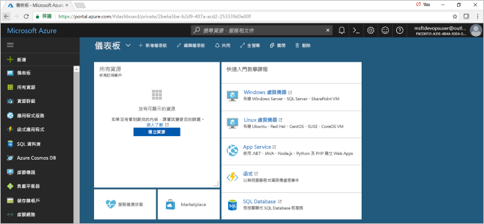
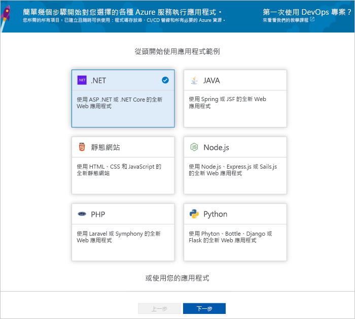
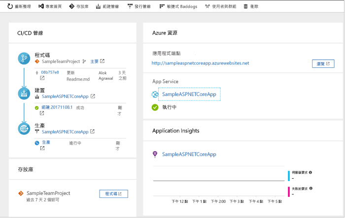
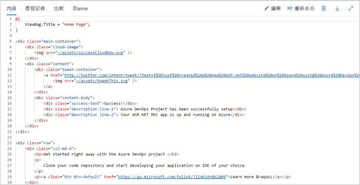

# 使用 Azure DevOps Projects 建立適用於 .NET 的 CI/CD 管線

使用 DevOps Projects 為您的 .NET Core 或 ASP.NET 應用程式設定持續整合 (CI) 與持續傳遞 (CD)。 DevOps Projects 可簡化 Azure Pipelines 中建置與發行管線的初始設定。

如果您沒有 Azure 訂用帳戶，可以透過 [Visual Studio Dev Essentials](https://visualstudio.microsoft.com/dev-essentials/) 取得一個免費的訂用帳戶。

## 登入 Azure 入口網站

DevOps Projects 會在 Azure DevOps 中建立 CI/CD 管線。 您可以建立新的 Azure DevOps 組織或使用現有組織。 DevOps Projects 也會在您選擇的 Azure 訂用帳戶中建立 Azure 資源。

1. 登入 [Microsoft Azure 入口網站](https://portal.azure.com)。

1. 在左側窗格中，選取左側瀏覽列中的 [建立資源]  圖示，然後搜尋 [DevOps Projects]  。  

3.  選取 [建立]  。

    

## 選取應用程式範例和 Azure 服務

1. 選取 **.NET** 範例應用程式。 .NET 範例包含開放原始碼 ASP.NET Framework 或跨平台.NET Core Framework 的選項。

   

2. 此範例為 ASP.NET Core MVC 應用程式。 選取 **.NET Core** 應用程式架構，然後選取 [下一步]  。    
    
3. 選取 [Windows Web 應用程式]  做為部署目標，然後選取 [下一步]  。 (選用) 您可以為您的部署選擇其他 Azure 服務。 您先前選擇的應用程式架構，會指出這裡可用的 Azure 服務部署目標類型。

## 設定 Azure DevOps 與 Azure 訂用帳戶 

1. 輸入**專案名稱**。

2. 免費建立新的 **Azure DevOps 組織**或從下拉式清單中選擇現有組織。

3. 選取 **Azure 訂用帳戶**，輸入 **Web 應用程式**名稱或採用預設值，然後選取 [完成]  。 在幾分鐘後，Azure 入口網站中便會顯示 DevOps Projects 部署概觀。 

4. 選取 [移至資源]  以檢視 DevOps 專案儀表板。 在右上角將 [專案]  釘選至儀表板以供快速存取。 範例應用程式已在 **Azure DevOps 組織**的存放庫中進行設定。 組建會執行，且您的應用程式會部署至 Azure。

5. 儀表板可顯示您的程式碼存放庫、您的 CI/CD 管線，和您在 Azure 中的應用程式。 從右側 Azure 資源下方選取 [瀏覽]  以檢視執行中應用程式。

    

## 認可程式碼變更並執行 CI/CD

DevOps Projects 會在 Azure Repos 或 GitHub 中建立 Git 存放庫。 若要檢視存放庫並變更您應用程式的程式碼，請執行下列作業：

1. 在 DevOps Project 儀表板的左側，選取您**主要**分支的連結。 此連結會開啟新建立 Git 存放庫的檢視。

2. 在接下來的幾個步驟中，您可以使用網頁瀏覽器，直接進行和認可**主要**分支的程式碼變更。 您也可以從存放庫頁面的右上方選取 [複製]  ，以複製最愛 IDE 中的 Git 存放庫。 

3. 在左側瀏覽應用程式檔案結構至 **Application/aspnet-core-dotnet-core/Pages/Index.cshtml**。

4. 選取 [編輯]  ，並進行 h2 標題的變更。 例如，輸入**立即開始使用 Azure DevOps Projects** 或進行其他變更。

      

5. 選取 [認可]  ，留下註解，然後再次選取 [認可]  。

6. 在瀏覽器中，移至 [Azure DevOps Projects 儀表板]。  您現在應該會看到正在進行中的組建。 您所做的變更會透過 CI/CD 管線自動建置及部署。

## 檢查 CI/CD 管線

在先前的步驟中，Azure DevOps Projects 已自動設定完整的 CI/CD 管線。 瀏覽管線，並視需要進行自訂。 請採取下列步驟，讓您自己熟悉 Azure DevOps 建置和發行管線。

1. 在 DevOps Projects 儀表板頂端選取 [建置管線]  。  
此連結會開啟瀏覽器索引標籤和新專案的 Azure DevOps 建置管線。

1. 選取省略符號 (...)。此動作會開啟功能表，您可以用它來啟動數個活動，例如將新的建置排入佇列、暫停建置，以及編輯建置管線。

1. 選取 [編輯]  。

    

1. 在此窗格中，您可以檢查建置管線的各種工作。  
 建置會執行各種工作，例如從 Git 存放庫擷取來源、還原相依性，以及發佈用來進行部署的輸出。

1. 在建置管線的頂端，選取建置管線名稱。

1. 將建置管線的名稱變更成較具描述性的名稱，並選取 [儲存並排入佇列]  ，然後選取 [儲存]  。

1. 在建置管線名稱下，選取 [記錄]  。   
在 [記錄]  窗格中，您可以看到近期建置變更的稽核線索。  Azure Pipelines 會追蹤對建置管線進行的任何變更，且可讓您比較版本。

1. 選取 [觸發程序]  。  
DevOps Projects 已自動建立 CI 觸發程序，且每次對存放庫的認可都會啟動新的建置。  您可以選擇性地選擇要在 CI 程序中包含還是排除分支。

1. 選取 [保留期]  。  
根據案例，您可以指定原則來保留或移除特定數目的組建。

1. 選取 [建置及發行]  ，然後選取 [版本]  。  
DevOps Projects 會建立發行管線來管理 Azure 的部署。

1.  從左側選取發行管線旁邊的省略符號 (...)，然後選取 [編輯]  。  
發行管線中包含管線，用來定義發行程序。  

1. 在 [成品]  下，選取 [置放]  。  您在先前步驟中檢查的建置管線會產生用於成品的輸出。 

1. 在 [置放]  圖示旁邊，選取 [持續部署觸發程序]  。  
這個發行管線已啟用 CD 觸發程序，每次有新的建置成品可用時，它就會執行部署。 您可以選擇性地停用觸發程序，因此需要手動執行部署。  

1. 從左側選取 [工作]  。   
工作是您部署程序所執行的活動。 在此範例中，會建立一個工作來部署到 Azure App Service。

1. 從右側選取 [檢視版本]  。 此檢視會顯示版本的歷程記錄。

1. 選取其中一個版本旁的省略符號 (...)，然後選取 [開啟]  。  
您可以瀏覽數個功能表，例如版本摘要、相關聯的工作項目及測試。

1. 選取 [認可]  。   
此檢視會顯示與特定部署相關聯的程式碼認可。 

1. 選取 [記錄]  。  
記錄包含關於部署程序的實用資訊。 您可以在部署期間和部署之後加以檢視。

## 清除資源

當您不再需要所建立的 Azure App Service 和其他相關資源時，可將其刪除。 請使用 DevOps Projects 儀表板上的 [刪除]  功能。

## 後續步驟

若要深入了解如何修改建置與發行管線以符合小組的需求，請參閱此教學課程：

> [!div class="nextstepaction"]
> [自訂 CD 程序](https://docs.microsoft.com/azure/devops/pipelines/release/define-multistage-release-process?view=vsts)

## 影片

> [!VIDEO https://www.youtube.com/embed/itwqMf9aR0w]
