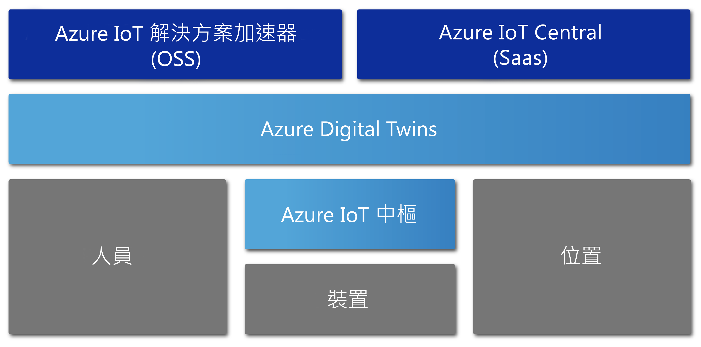

# Azure Digital Twins 概觀

Azure Digital Twins 是一項 Azure IoT 服務，其可建立完整的實體環境模型。 在其眾多功能之中，有一項功能是建立空間智慧圖形，用模型來呈現人員、空間和裝置之間的關聯性與互動情形。

Azure Digital Twins 可讓您查詢來自實體空間 (而非來自許多不同感應器) 的資料。 這項服務可協助您建置可重複使用、具有高度擴充性、可感知空間的體驗，以便將數位和實體世界的串流資料彼此連結。 無論您是要預測工廠的維護需求、分析電網的即時能源需求，還是要徹底利用辦公室的空閒空間，這些獨一無二的相關內容式功能皆可強化您的應用程式。

Azure Digital Twins 適用於各種環境類型，例如倉儲、辦公室、學校、醫院、銀行、運動場、工廠、停車場、公園、智慧電網和城市。 您可以想想以下案例：追蹤橫跨好幾個州的每日溫度、監控忙碌的無人機路徑、識別自駕車、分析大樓的使用率，或是找出店內最忙碌的結帳櫃台。 無論實際的商業案例為何，都可以透過 Azure Digital Twins 佈建對應的數位執行個體。

下列影片會深入探討 Digital Twins：

> [!VIDEO https://www.youtube.com/embed/TvN_NxpgyzQ]

## 主要功能

Azure Digital Twins 的主要功能包括：

### 空間智慧圖形

[空間智慧圖形](./concepts-objectmodel-spatialgraph.md) (又稱空間圖形) 是實體環境的虛擬示意圖，可讓您用模型來呈現人員、地點和裝置之間的關聯性。

假設有一個智慧型公用事業應用程式，其可能涉及連接到鄰近地區的數個電力用量電錶。 為了精確地監視及預測電力用量和電費，智慧型公用事業公司必須用模型來呈現每個裝置和感應器，並標上關於位置和客戶所需支付電費等內容。 空間智慧圖形可讓您用模型呈現這些複雜的關聯性種類。

### Digital Twins 物件模型

[Digital Twins 物件模型](./concepts-objectmodel-spatialgraph.md)是預先定義的裝置通訊協定和資料結構描述，可符合解決方案的網域專屬需求，以加速並簡化開發。

例如，會議室使用情况應用程式可以使用預先定義的空間類型，例如校園、大樓、樓層、會議室等。

### 多個巢狀租用戶

您可以建置會安全地調整並可供多個租用戶重複使用的解決方案。 您也可以建立多個可供存取並以隔離且安全的方式使用的子租用戶。

例如，空間使用情形應用程式可設定為將同一大樓內不同租用戶的資料彼此隔開，也可以設定為將單一租用戶在多棟大樓的資料合併。

### 進階計算功能

稱為[使用者定義函式](./concepts-user-defined-functions.md)的進階計算功能可讓您針對傳入的[裝置資料](./concepts-device-ingress.md)定義及執行自訂函式，以傳送訊號給預先定義的端點。 這項功能可改善裝置工作的自訂和自動化能力。

例如，智慧型農業應用程式可以包含使用者定義函式，來評估土壤濕度感應器讀數以及天氣預報，然後傳送關於灌溉需求的訊號。

### 內建的存取控制

存取和身分識別管理功能 (例如[角色型存取控制](./security-role-based-access-control.md)和 [Azure Active Directory](./security-authenticating-apis.md)) 可讓您安全地控制個人和裝置的存取權。

例如，設施管理應用程式可以設定為允許會議室使用者將溫度設定在一個指定範圍內，以及允許設施管理員將任何會議室內的溫度設定為任何值。

### 生態系統

您可以將 Azure Digital Twins 執行個體連線到許多功能強大的 Azure 服務，包括：Azure 串流分析、AI 和儲存體服務，以及 Azure 地圖服務、Microsoft 混合實境、Dynamics 365 或 Office 365。

例如，智慧型辦公大樓應用程式可以使用 Azure Digital Twins 來呈現位於許多樓層的小組和裝置。 由於裝置會將即時資料串流到已佈建的 Digital Twins 執行個體，所以 Azure 串流分析可以處理該項資料以提供可操作的重要見解。 然後，資料可以儲存在 Azure 儲存體並轉換為可共用的檔案格式，以便使用 Office 365 分散到整個組織。

## 受益於 Azure Digital Twins 的解決方案

Azure Digital Twins 很適合用來呈現真實世界和其諸多關聯性，因為其可簡化 IoT 模型、資料處理、事件處理和裝置追蹤等作業。 請想想以下幾個因使用此服務而受益的數種產業案例：

* 對房屋管理公司顯示一段時間的空間佔有率，以了解其辦公大樓的最佳設定方式。
* 觸發用來驅動保全分派的行動應用程式工單票證、安排清潔服務，以及零售門市或運動場地的任何其他服務。
* 顯示大樓使用情形，即時呈現大樓內已使用的會議室。 然後，協助使用者預約符合其需求的工作區。
* 追蹤資產位於空間內的哪些地方。
* 用模型來呈現使用者偏好和電網限制，讓電動車的充電模式最佳化。

## 其他 IoT 服務內容中的 Azure Digital Twins

Azure Digital Twins 會使用 Azure IoT 中樞來連接 IoT 裝置和感應器，讓一切資訊隨時符合真實世界的最新情形。 下圖顯示 Azure Digital Twins 與其他 Azure IoT 服務的關聯性：

如需其餘 IoT 生態系統更加詳細的說明，請參閱 [Azure IoT 技術和解決方案](https://docs.microsoft.com/azure/iot-fundamentals/iot-services-and-technologies)。

## 後續步驟

繼續進行 Azure Digital Twins 功能的簡短示範：

> [!div class="nextstepaction"]
> [快速入門：使用 Azure Digital Twins 尋找空閒會議室](./quickstart-view-occupancy-dotnet.md)

深入探索使用 Azure Digital Twins 的設施管理應用程式：

> [!div class="nextstepaction"]
> [教學課程：部署 Azure Digital Twins 及設定空間圖形](./tutorial-facilities-setup.md)

了解 Azure Digital Twins 的核心概念：

> [!div class="nextstepaction"]
> [了解 Digital Twins 物件模型和空間智慧圖形](./concepts-objectmodel-spatialgraph.md)
