# <a name="quickstart-create-a-hybrid-mode-instance-with-azure-portal--azure-database-migration-service"></a>快速入門：使用 Azure 入口網站和 Azure 資料庫移轉服務建立混合模式執行個體

Azure 資料庫移轉服務混合模式會使用裝載於內部部署的移轉背景工作角色，搭配在雲端中執行的 Azure 資料庫移轉服務執行個體，來管理資料庫移轉。 對於內部部署網路與 Azure 之間沒有站對站連線能力，或站對站連線頻寬有限等案例，混合模式特別有用。

>[!NOTE]
>目前，在混合模式中執行的 Azure 資料庫移轉服務支援 SQL Server 移轉至：
>
>- Azure SQL Database 受控執行個體 (近乎零停機時間 (上線))。
>- Azure SQL Database 單一資料庫 (有一些停機時間 (離線))。
>- MongoDb 移轉至 Azure CosmosDB (近乎零停機時間 (上限))。
>- MongoDb 移轉至 Azure CosmosDB (有一些停機時間 (離限))。

在此快速入門中，您會使用 Azure 入口網站，在混合模式中建立 Azure 資料庫移轉服務的執行個體。 之後，就能在內部部署網路中下載、安裝及設定混合式背景工作角色。 在預覽期間，您可以使用 Azure 資料庫移轉服務混合模式，將資料從內部部署 SQL Server 執行個體移轉到 Azure SQL Database。

> [!NOTE]
> Azure 資料庫移轉服務混合式安裝程式會在 Microsoft Windows Server 2012 R2、Window Server 2016、Windows Server 2019 和 Windows 10 上執行。

> [!IMPORTANT]
> Azure 資料庫移轉服務的混合式安裝程式需要 .NET 4.7.2 或更新版本。 若要尋找最新版本的 .NET，請參閱[下載 .NET Framework](https://dotnet.microsoft.com/download/dotnet-framework) 頁面。

如果您沒有 Azure 訂用帳戶，請在開始前建立[免費帳戶](https://azure.microsoft.com/free/)。

## <a name="sign-in-to-the-azure-portal"></a>登入 Azure 入口網站

開啟網頁瀏覽器，瀏覽至 [Microsoft Azure 入口網站](https://portal.azure.com/)，然後輸入您的認證來登入入口網站。

預設檢視是您的服務儀表板。

## <a name="register-the-resource-provider"></a>註冊資源提供者

建立第一個 Azure 資料庫移轉服務執行個體之前，請先註冊 Microsoft.DataMigration 資源提供者。

1. 在 Azure 入口網站中，選取 [訂用帳戶]  、選取您要在其中建立 Azure 資料庫移轉服務執行個體的訂用帳戶，然後選取 [資源提供者]  。

    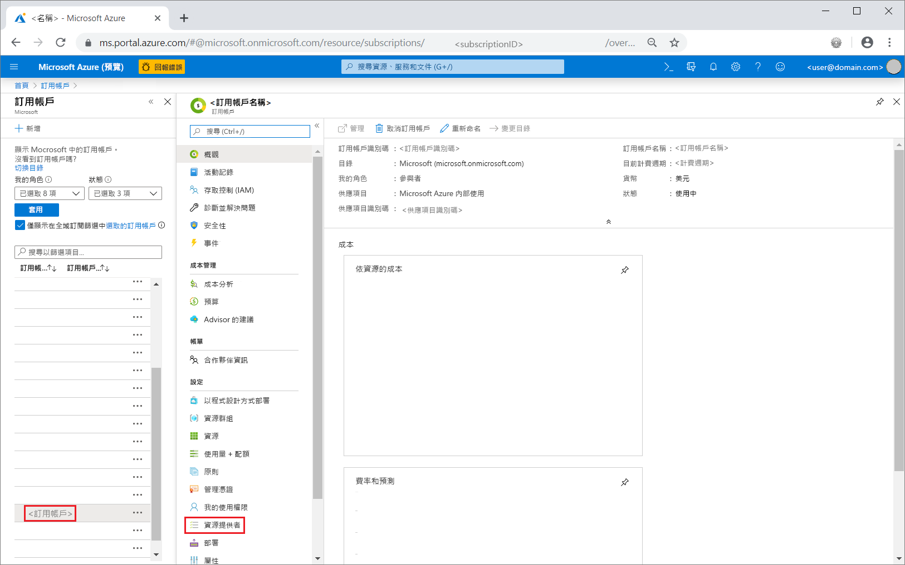

2. 搜尋移轉，然後在 [Microsoft.DataMigration]  的右邊，選取 [註冊]  。

    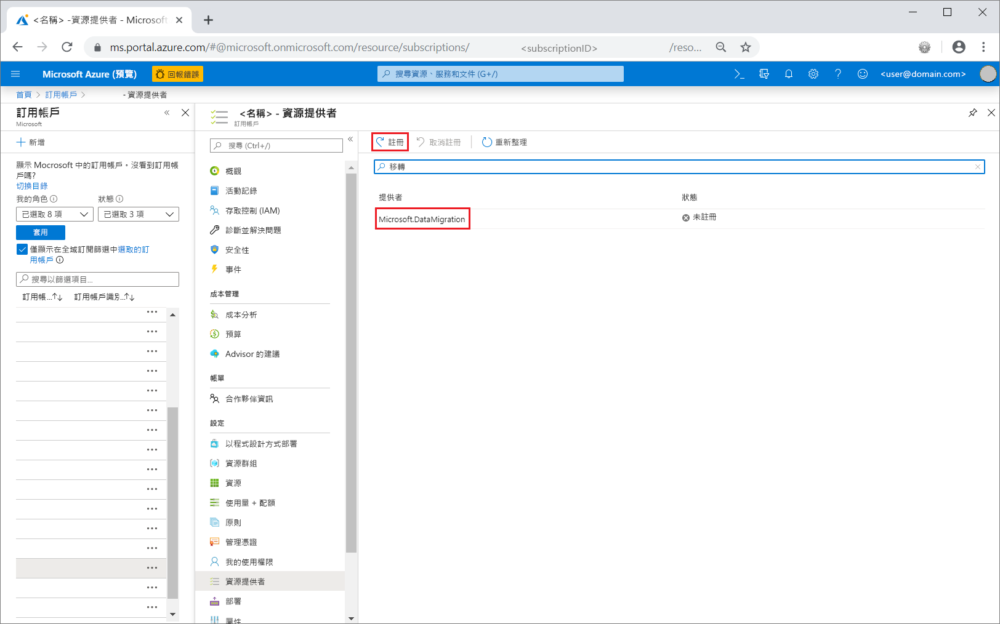

## <a name="create-an-instance-of-the-service"></a>建立服務執行個體

1. 選取 [+ 建立資源]  ，以建立 Azure 資料庫移轉服務的執行個體。

2. 搜尋適合「移轉」的 Marketplace，選取 [Azure 資料庫移轉服務]  ，並在 **Azure 資料庫移轉服務**畫面中，選取 [建立]  。

3. 在 [建立移轉服務]  畫面上：

    - 選擇易記又獨特的**服務名稱**，以識別您的 Azure 資料庫移轉服務執行個體。
    - 選取您要建立執行個體的 Azure **訂用帳戶**。
    - 選取現有的 [資源群組]  或建立新群組。
    - 選擇最接近您的來源或目標伺服器的**位置**。
    - 針對 [服務模式]  選取 [混合式 (預覽)]  。

           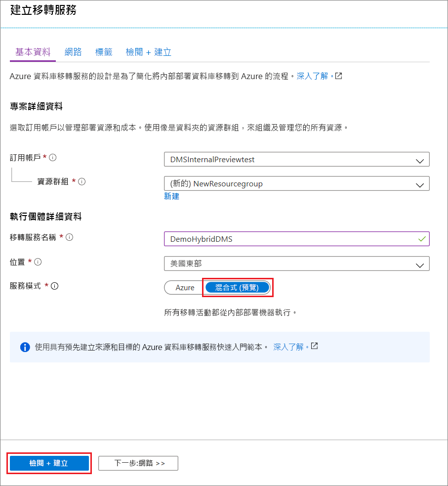

4. 選取 [檢閱 + 建立]  。

5. 在 [檢閱 + 建立]  索引標籤上，檢閱條款、確認所提供的其他資訊，然後選取 [建立]  。

    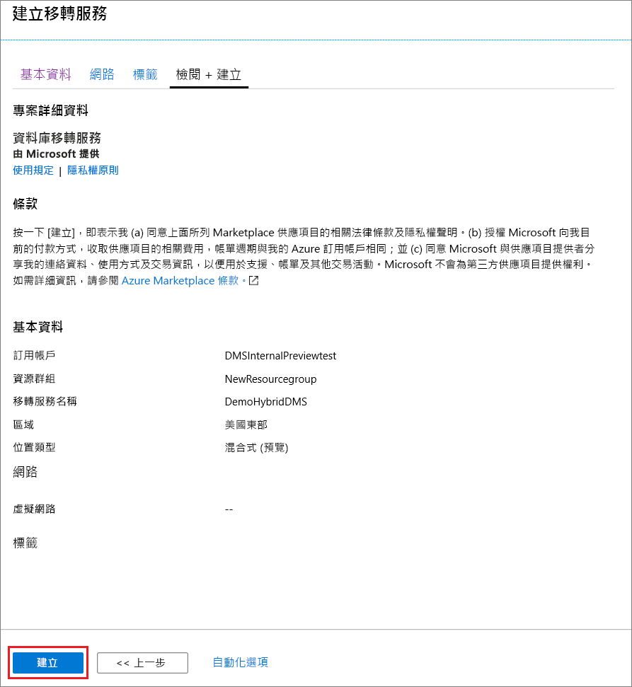

    數分鐘之後，您在混合模式中的 Azure 資料庫移轉服務執行個體就會建立且準備好進行設定。 Azure 資料庫移轉服務執行個體隨即顯示，如下圖所示：

    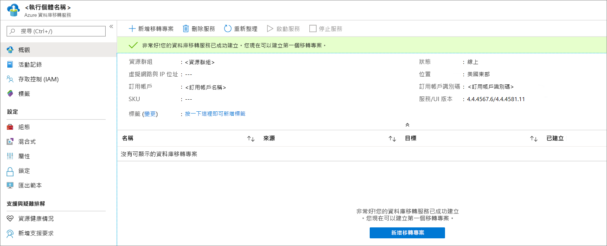

6. 建立服務之後，選取 [屬性]  ，然後複製 [資源識別碼]  方塊中顯示的值，您將使用此值來安裝 Azure 資料庫移轉服務混合式背景工作角色。

    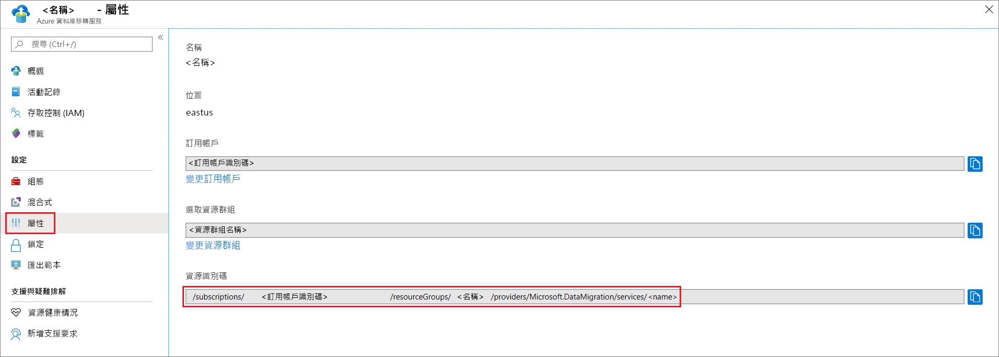

## <a name="create-azure-app-registration-id"></a>建立 Azure App 註冊識別碼

您需要建立一個 Azure App 註冊識別碼，讓內部部署混合式背景工作角色可用來與雲端中的 Azure 資料庫移轉服務進行通訊。

1. 在 Azure 入口網站中，依序選取 [Azure Active Directory]  、[應用程式註冊]  及 [新增註冊]  。
2. 指定應用程式的名稱，然後在 [支援的帳戶類型]  底下，選取支援的帳戶類型，以指定可以使用應用程式的人員。

    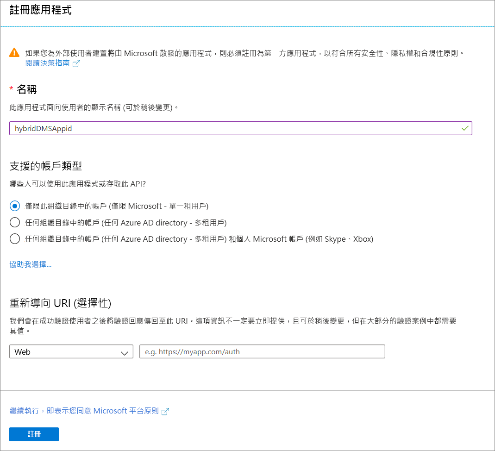

3. 使用 [重新導向 URI (選用)]  欄位的預設值，然後選取 [註冊]  。

4. 在應用程式識別碼註冊完成之後，記下您將在安裝混合式背景工作角色時使用的**應用程式 (用戶端) 識別碼**。

5. 在 Azure 入口網站中，瀏覽至 Azure 資料庫移轉服務、選取 [存取控制 (IAM)]  ，然後選取 [新增角色指派]  ，以將參與者存取權指派給應用程式識別碼。

    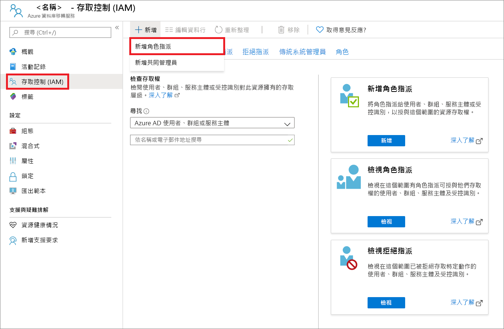

6. 選取 [參與者]  作為角色、將存取權指派給 [Azure AD 使用者或服務主體]  ，然後選取應用程式識別碼名稱。

    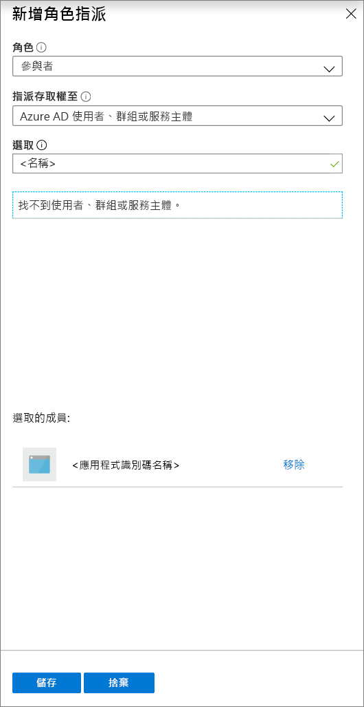

7. 選取 [儲存]  ，以在 Azure 資料庫移轉服務資源上儲存應用程式識別碼的角色指派。

## <a name="download-and-install-the-hybrid-worker"></a>下載並安裝混合式背景工作角色

1. 在 Azure 入口網站中，瀏覽至您的 Azure 資料庫移轉服務執行個體。

2. 在 [設定]  底下，選取 [混合式]  ，然後選取 [安裝程式下載]  ，以下載混合式背景工作角色。

    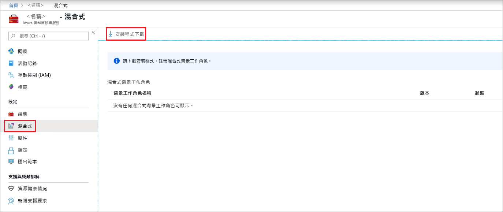

3. 在將裝載 Azure 資料庫移轉服務混合式背景工作角色的伺服器上，將 ZIP 檔案解壓縮。

    > [!IMPORTANT]
    > Azure 資料庫移轉服務的混合式安裝程式需要 .NET 4.7.2 或更新版本。 若要尋找最新版本的 .NET，請參閱[下載 .NET Framework](https://dotnet.microsoft.com/download/dotnet-framework) 頁面。

4. 在安裝資料夾中，找出並開啟 **dmsSettings.json** 檔案、指定 **ApplicationId** 和 **resourceId**，然後儲存檔案。

    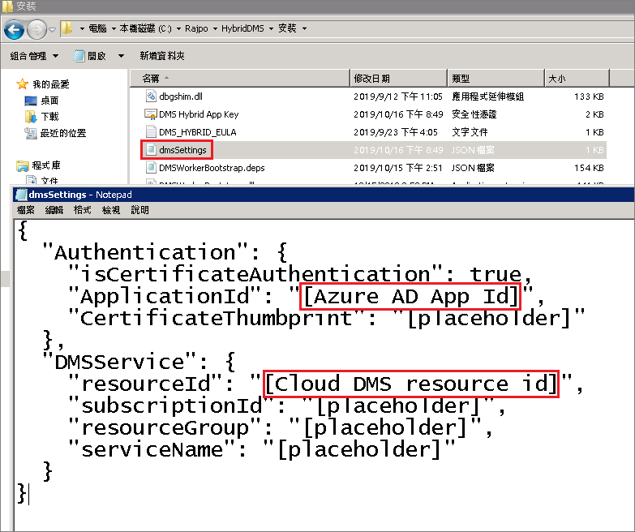

5. 使用下列命令，來產生 Azure 資料庫移轉服務可用於驗證來自混合式背景工作角色之通訊的憑證。

    ```
    <drive>:\<folder>\Install>DMSWorkerBootstrap.exe -a GenerateCert
    ```

    憑證會產生於安裝資料夾中。

    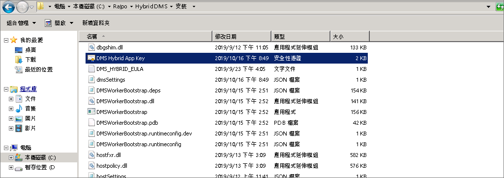

6. 在 Azure 入口網站中，瀏覽至 [應用程式識別碼]，在 [管理]  底下，選取 [憑證及祕密]  ，然後選取 [上傳憑證]  ，以選取您產生的公開憑證。

    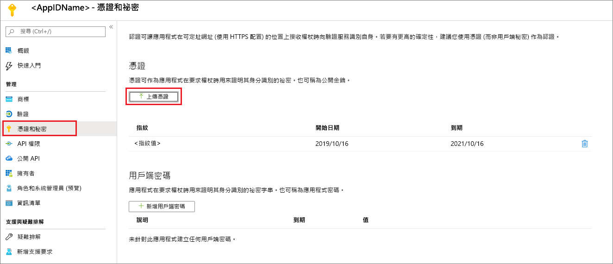

7. 執行下列命令，在您的內部部署伺服器上安裝 Azure 資料庫移轉服務混合式背景工作角色：

    ```
    <drive>:\<folder>\Install>DMSWorkerBootstrap.exe -a Install -IAcceptDMSLicenseTerms
    ```

    > [!NOTE]
    > 執行 install 命令時，您也可以使用下列參數：
    >
    > - **-TelemetryOptOut** - 阻止背景工作角色傳送遙測，但繼續以最少的方式在本機記錄。  安裝程式仍會傳送遙測。
    > - **-p {InstallLocation}** 。 能夠變更安裝路徑，其預設值為 “C:\Program Files\DatabaseMigrationServiceHybrid”。

8. 如果安裝程式正常執行且未產生錯誤，則服務會在 Azure 資料庫移轉服務中顯示上線狀態，而您已準備好移轉資料庫。

    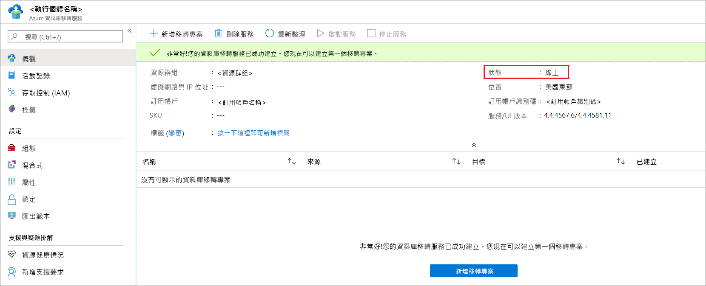

## <a name="uninstall-azure-database-migration-service-hybrid-mode"></a>解除安裝 Azure 資料庫移轉服務混合模式

在內部部署伺服器上，目前只能使用下列命令，透過 Azure 資料庫移轉服務混合式背景工作角色安裝程式，來支援解除安裝 Azure 資料庫移轉服務混合模式：

```
<drive>:\<folder>\Install>DMSWorkerBootstrap.exe -a uninstall
```

> [!NOTE]
> 執行解除安裝命令時，您也可以使用 "-ReuseCert" 參數，以保留 generateCert 工作流程所產生的 AdApp 憑證。  這可讓您使用先前產生並上傳的憑證。

## <a name="set-up-the-azure-database-migration-service-hybrid-worker-using-powershell"></a>使用 PowerShell 設定 Azure 資料庫移轉服務混合式背景工作角色

除了透過 Azure 入口網站安裝 Azure 資料庫移轉服務混合式背景工作角色之外，我們還提供 [PowerShell 指令碼](https://techcommunity.microsoft.com/gxcuf89792/attachments/gxcuf89792/MicrosoftDataMigration/119/1/DMS_Hybrid_Script.zip)，您可在混合模式中建立新的 Azure 資料庫移轉服務執行個體之後，將其用於自動執行背景工作角色安裝步驟。 指令碼：

1. 建立新的 AdApp。
2. 下載安裝程式。
3. 執行 generateCert 工作流程。
4. 上傳憑證。
5. 將 AdApp 作為參與者新增至您的 Azure 資料庫移轉服務執行個體。
6. 執行安裝工作流程。

當使用者已經在環境中具有所有必要的權限時，此指令碼適用於快速原型設計。 請注意，在您的生產環境中，AdApp 和 Cert 可能會有不同的需求，因此指令碼可能會失敗。

> [!IMPORTANT]
> 此指令碼假設在混合模式中有現有的 Azure 資料庫移轉服務執行個體，而使用的 Azure 帳戶有權限在租用戶中建立 AdApp 以及在訂用帳戶上修改 RBAC。

只要在指令碼頂端填入參數，然後從系統管理員 PowerShell 執行個體執行指令碼即可。

## <a name="next-steps"></a>後續步驟

> [!div class="nextstepaction"]
> [將 SQL Server 線上移轉至 Azure SQL Database 受控執行個體](tutorial-sql-server-managed-instance-online.md)
> [在離線狀態從 SQL Server 遷移至 Azure SQL Database 中的單一資料庫或集區資料庫](tutorial-sql-server-to-azure-sql.md)
