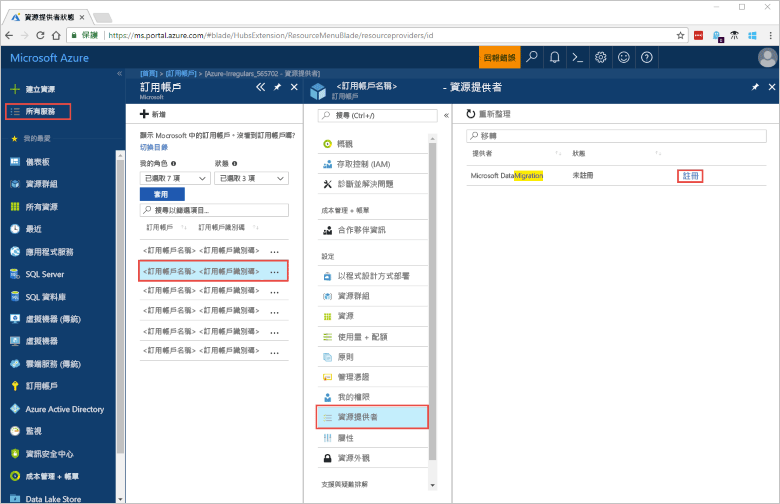
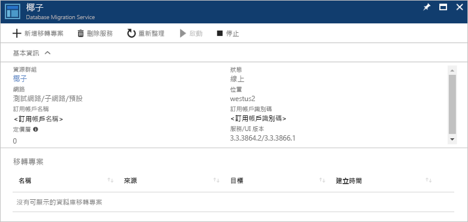

# 使用 Azure 入口網站建立 Azure 資料庫移轉服務的執行個體
在本快速入門中，使用 Azure 入口網站建立 Azure 資料庫移轉服務的執行個體。  建立服務之後，您可以使用它來將資料從內部部署 SQL Server 移轉到 Azure SQL Database。

如果您沒有 Azure 訂用帳戶，請在開始前建立[免費帳戶](https://azure.microsoft.com/free/)。

## 登入 Azure 入口網站
開啟網頁瀏覽器，瀏覽至 [Microsoft Azure 入口網站](https://portal.azure.com/)，然後輸入您的認證來登入入口網站。

預設檢視是您的服務儀表板。

## 註冊資源提供者
您必須在建立第一個資料庫移轉服務執行個體之前，註冊 Microsoft.DataMigration 資源提供者。

1. 在 Azure 入口網站中，選取 [所有服務]，然後選取 [訂用帳戶]。

2. 選取您要在其中建立 Azure 資料庫移轉服務執行個體的訂用帳戶，然後選取 [資源提供者]。

3. 搜尋移轉，然後在 [Microsoft.DataMigration] 的右邊，選取 [註冊]。

    

## 建立服務執行個體
1. 選取 [+ 建立資源] 以建立 Azure 資料庫移轉服務執行個體。

2. 搜尋適合「移轉」的市集，選取 [Azure 資料庫移轉服務]，並在 **Azure 資料庫移轉服務**畫面中，選取 [建立]。

3. 在 [建立移轉服務] 畫面上： 

    - 選擇易記又獨特的**服務名稱**，以便識別您的 Azure 資料庫移轉服務執行個體。
    - 選取您要建立執行個體的 Azure **訂用帳戶**。
    - 選取現有的 [資源群組] 或建立新群組。
    - 選擇最接近您的來源或目標伺服器的**位置**。
    - 選取現有的**虛擬網路** (VNET) 或建立虛擬網路。

        VNET 會為 Azure 資料庫移轉服務提供來源和目標環境的存取權。

        如需有關如何在 Azure 入口網站中建立 VNET 的詳細資訊，請參閱[使用 Azure 入口網站建立虛擬網路](https://aka.ms/vnet)一文。

    - 針對**定價層**選取 [基本：1 個 vCore]。

        

4. 選取 [建立] 。

    在幾分鐘之後，您的 Azure 資料庫移轉服務執行個體就會建立且可供使用。 您會看到如下圖所示的資料庫移轉服務：

    

## 清除資源
您可以刪除 [Azure 資源群組](../azure-resource-manager/resource-group-overview.md)，清除您在快速入門中建立的資源。 若要刪除資源群組，請瀏覽至您建立的 Azure 資料庫移轉服務執行個體。 選取**資源群組**名稱，然後選取 [刪除資源群組]。 這個動作會刪除資源群組中的所有資產，以及群組本身。

## 後續步驟
> [!div class="nextstepaction"]
> [將內部部署 SQL Server 移轉至 Azure SQL Database](tutorial-sql-server-to-azure-sql.md)