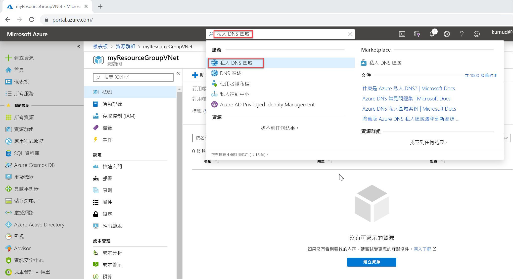

# <a name="quickstart-create-an-azure-private-dns-zone-using-the-azure-portal"></a>快速入門：使用 Azure 入口網站建立 Azure 私人 DNS 區域

此快速入門將逐步引導您使用 Azure 入口網站來建立第一個私人 DNS 區域與第一筆記錄。

DNS 區域用來裝載特定網域的 DNS 記錄。 若要開始將網域裝載到 Azure DNS 中，您必須建立該網域名稱的 DNS 區域。 接著在此 DNS 區域內，建立網域的每筆 DNS 記錄。 若要將私人 DNS 區域發佈至虛擬網路，指定可以在區域內解析記錄的虛擬網路清單。  這稱為「連結」  虛擬網路。 啟用自動註冊時，Azure DNS 也會在每次建立虛擬機器時更新區域記錄，變更其 IP 位址，或者在刪除虛擬機器時更新。

在此快速入門中，您可了解如何：

> [!div class="checklist"]
> * 建立私人 DNS 區域
> * 建立虛擬網路
> * 連結虛擬網路
> * 建立測試虛擬機器
> * 建立其他的 DNS 記錄
> * 測試私人區域

如果您沒有 Azure 訂用帳戶，請在開始前建立[免費帳戶](https://azure.microsoft.com/free/?WT.mc_id=A261C142F) 。

您可以依偏好使用 [Azure PowerShell](private-dns-getstarted-powershell.md) 或 [Azure CLI](private-dns-getstarted-cli.md) 來完成本快速入門。

## <a name="create-a-private-dns-zone"></a>建立私人 DNS 區域

下列範例會在稱為 **MyAzureResourceGroup** 的資源群組中建立稱為 **private.contoso.com** 的 DNS 區域。

DNS 區域包含網域的 DNS 項目。 若要開始將網域裝載到 Azure DNS 中，您應建立該網域名稱的 DNS 區域。



1. 在入口網站搜尋列上的搜尋文字方塊中輸入 **private dns zones**，然後按下 **Enter** 鍵。
1. 選取 [私人 DNS 區域]  。
2. 選取 [建立私人 DNS 區域]  。

1. 在 [建立私人 DNS 區域]  頁面上，輸入或選取下列值：

   - **資源群組**：選取 [新建]  ，輸入*MyAzureResourceGroup*，然後選取 [確定]  。 資源群組名稱在 Azure 訂用帳戶中必須是唯一的。 
   -  **名稱**：針對此範例，輸入 private.contoso.com  。
1. 針對 [資源群組位置]  ，選取 [美國中西部]  。

1. 選取 [檢閱 + 建立]  。

1. 選取 [建立]  。

建立區域可能需要幾分鐘的時間。

## <a name="create-a-virtual-network"></a>建立虛擬網路

1. 在入口網站頁面左上方，依序選取 [建立資源]  、[網路]  以及 [虛擬網路]  。
2. 在 [名稱]  中，輸入 **myAzureVNet**。
3. 針對 [資源群組]  ，選取 **MyAzureResourceGroup**。
4. 針對 [位置]  選取 [美國中西部]  。
5. 接受其他預設值，然後選取 [建立]  。

## <a name="link-the-virtual-network"></a>連結虛擬網路

若要將私人 DNS 區域連結至虛擬網路，您要建立虛擬網路連結。


1. 開啟 **MyAzureResourceGroup** 資源群組，並且選取 **private.contoso.com** 私人區域。
2. 在左窗格中，選取 [虛擬網路連結]  。
3. 選取 [新增]  。
4. 輸入 **myLink** 作為**連結名稱**。
5. 針對 [虛擬網路]  ，選取 [myAzureVNet]  。
6. 選取 [啟用自動註冊]  核取方塊。
7. 選取 [確定]  。

## <a name="create-the-test-virtual-machines"></a>建立測試虛擬機器

現在，請建立兩部虛擬機器，讓您可以測試私人 DNS 區域：

1. 在入口網站頁面左上方，選取 [建立資源]  ，然後選取 [Windows Server 2016 Datacenter]  。
1. 針對 [資源群組]，選取 **MyAzureResourceGroup**。
1. 輸入 **myVM01** 作為虛擬機器的名稱。
1. 針對 [區域]  選取 [美國中西部]  。
1. 輸入 **azureadmin** 作為系統管理員使用者名稱。
2. 輸入 **Azure12345678** 作為密碼，並且確認密碼。

5. 針對 [公用輸入連接埠]  選取 [允許選取的連接埠]  ，然後針對 [選取輸入連接埠]  選取 [RDP (3389)]  。
10. 接受頁面的其他預設值，然後按 **[下一步：磁碟 >]** 。
11. 接受 [磁碟]  頁面上的其他預設值，然後按 **[下一步：網路 >]** 。
1. 確定已針對虛擬網路選取 **myAzureVNet**。
1. 接受頁面的其他預設值，然後按 [**下一步：管理 >]** 。
2. 針對 [開機診斷]  選取 [關閉]  ，接受其他預設值，然後選取 [檢閱 + 建立]  。
1. 檢閱設定，然後按一下 [建立]  。

重複上述步驟，建立名為 **myVM02** 的另一部虛擬機器。

需要幾分鐘的時間讓這兩部虛擬機器完成。

## <a name="create-an-additional-dns-record"></a>建立其他的 DNS 記錄

 下列範例會在資源群組 **MyAzureResourceGroup** 中的 DNS 區域 **private.contoso.com** 中，建立具有相對名稱 **db** 的記錄。 記錄集的完整名稱是 **db.private.contoso.com**。 記錄類型是 "A"，IP 位址為 **myVM01**。

1. 開啟 **MyAzureResourceGroup** 資源群組，並且選取 **private.contoso.com** 私人區域。
2. 選取 [+ 記錄集]  。
3. 針對 [名稱]  輸入 **db**。
4. 針對 [IP 位址]  ，輸入您所看到 **myVM01** 的 IP 位址。 這樣應該就可以在虛擬機器啟動時自動註冊。
5. 選取 [確定]  。

## <a name="test-the-private-zone"></a>測試私人區域

現在，您可以測試 **private.contoso.com** 私人區域的名稱解析。

### <a name="configure-vms-to-allow-inbound-icmp"></a>設定 VM，以允許輸入 ICMP

您可以使用 Ping 命令來測試名稱解析。 因此，請在兩部虛擬機器上設定防火牆，以允許輸入的 ICMP 封包。

1. 連線至 myVM01，然後以系統管理員權限開啟 Windows PowerShell 視窗。
2. 執行以下命令：

   ```powershell
   New-NetFirewallRule –DisplayName "Allow ICMPv4-In" –Protocol ICMPv4
   ```

針對 myVM02 重複。

### <a name="ping-the-vms-by-name"></a>依照名稱 Ping VM

1. 從 myVM02 Windows PowerShell 命令提示字元中，使用自動註冊的主機名稱 Ping myVM01：
   ```
   ping myVM01.private.contoso.com
   ```
   您應該會看到如下所示的輸出：
   ```
   PS C:\> ping myvm01.private.contoso.com

   Pinging myvm01.private.contoso.com [10.2.0.4] with 32 bytes of data:
   Reply from 10.2.0.4: bytes=32 time<1ms TTL=128
   Reply from 10.2.0.4: bytes=32 time=1ms TTL=128
   Reply from 10.2.0.4: bytes=32 time<1ms TTL=128
   Reply from 10.2.0.4: bytes=32 time<1ms TTL=128

   Ping statistics for 10.2.0.4:
       Packets: Sent = 4, Received = 4, Lost = 0 (0% loss),
   Approximate round trip times in milli-seconds:
       Minimum = 0ms, Maximum = 1ms, Average = 0ms
   PS C:\>
   ```
2. 現在 Ping 您先前建立的 **db** 名稱：
   ```
   ping db.private.contoso.com
   ```
   您應該會看到如下所示的輸出：
   ```
   PS C:\> ping db.private.contoso.com

   Pinging db.private.contoso.com [10.2.0.4] with 32 bytes of data:
   Reply from 10.2.0.4: bytes=32 time<1ms TTL=128
   Reply from 10.2.0.4: bytes=32 time<1ms TTL=128
   Reply from 10.2.0.4: bytes=32 time<1ms TTL=128
   Reply from 10.2.0.4: bytes=32 time<1ms TTL=128

   Ping statistics for 10.2.0.4:
       Packets: Sent = 4, Received = 4, Lost = 0 (0% loss),
   Approximate round trip times in milli-seconds:
       Minimum = 0ms, Maximum = 0ms, Average = 0ms
   PS C:\>
   ```

## <a name="delete-all-resources"></a>刪除所有資源

當不再需要時，請刪除 **MyAzureResourceGroup** 資源群組，來刪除本快速入門中建立的資源。


## <a name="next-steps"></a>後續步驟

> [!div class="nextstepaction"]
> [Azure DNS 私人區域案例](private-dns-scenarios.md)

