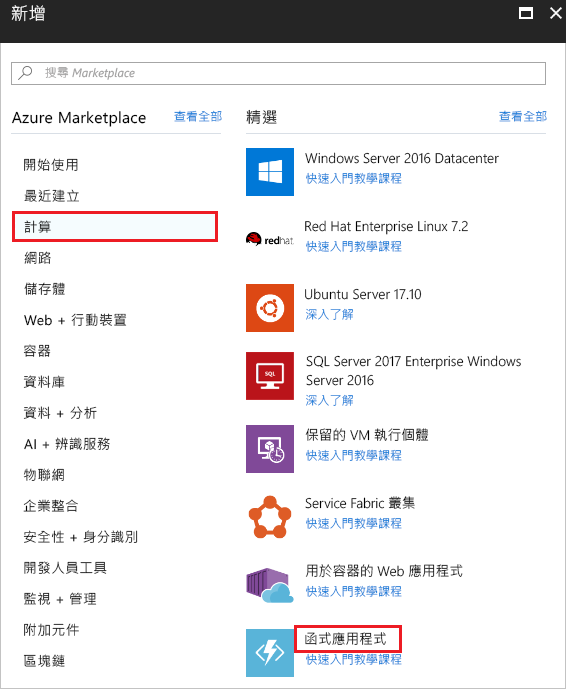
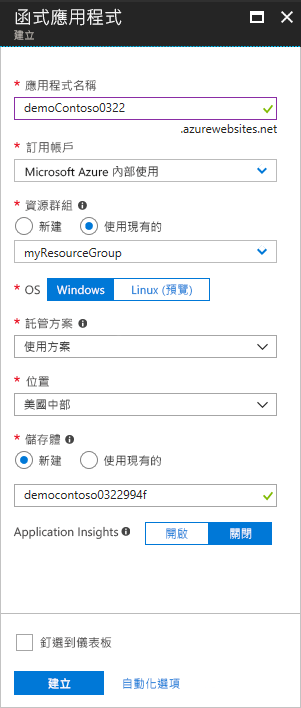
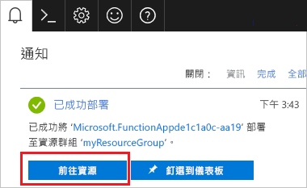
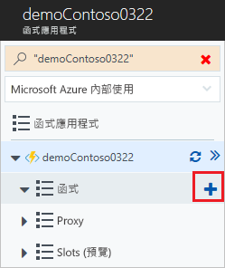
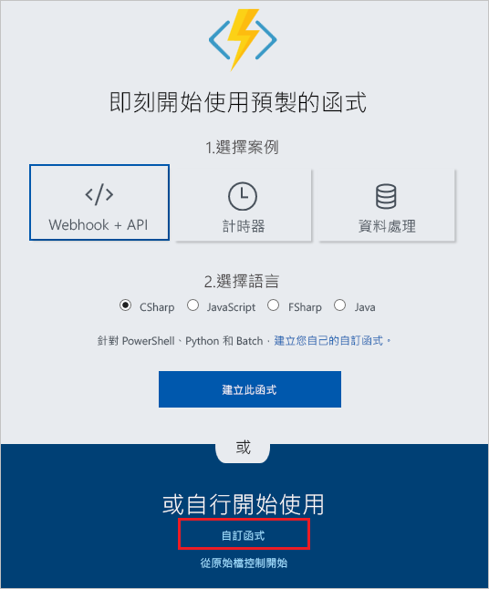
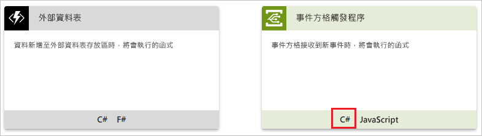
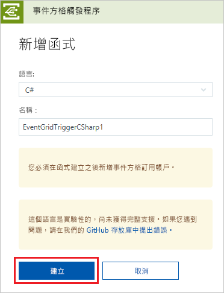
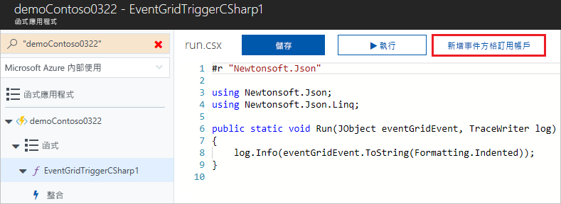
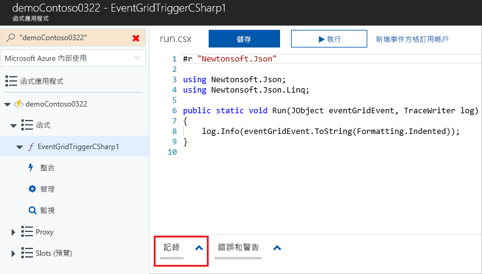
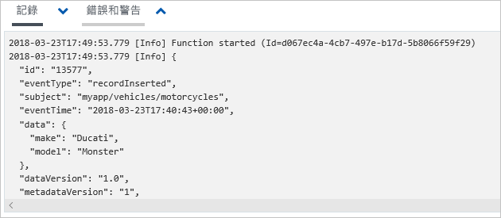

# <a name="create-and-route-custom-events-with-the-azure-portal-and-event-grid"></a>使用 Azure 入口網站和事件格線建立和路由傳送自訂事件

Azure Event Grid 是一項雲端事件服務。 在本文中，您可使用 Azure 入口網站建立自訂主題、訂閱主題，以及觸發事件來檢視結果。 您會將事件傳送至 Azure Function，以記錄事件資料。 當您完成時，您會看到事件資料已傳送至端點並已記錄。

[!INCLUDE [quickstarts-free-trial-note.md](../../includes/quickstarts-free-trial-note.md)]

## <a name="create-a-custom-topic"></a>建立自訂主題

Event Grid 主題會提供使用者定義的端點，作為您發佈事件的目的地。 

1. 登入 [Azure 入口網站](https://portal.azure.com/)。

1. 若要建立自訂主題，請選取 [建立資源]。 

   

1. 搜尋「Event Grid 主題」，並從可用的選項加以選取。

   

1. 選取 [建立] 。

   

1. 提供自訂主題的唯一名稱。 主題名稱必須是唯一的，因為它由 DNS 項目表示。 請勿使用圖片中顯示的名稱。 相反地，請建立您自己的名稱。 選取其中一個[支援區域](overview.md)。 提供資源群組的名稱。 選取 [建立] 。

   

1. 建立自訂主題之後，您會看到成功的通知。

   

   如果部署失敗，請找出造成錯誤的原因。 選取 [部署失敗]。

   

   選取錯誤訊息。

   

   下圖顯示部署會失敗是因為自訂主題的名稱已在使用中。 如果您看到此錯誤，請使用不同名稱來重試部署。

   

## <a name="create-an-azure-function"></a>建立 Azure 函式

訂閱主題之前，讓我們建立事件訊息的端點。 在本文中，您將使用 Azure Functions 建立端點的函式應用程式。

1. 若要建立函式，請選取 [建立資源]。

   

1. 選取 [計算] 和 [函式應用程式]。

   

1. 請提供 Azure Function 的唯一名稱。 請勿使用圖片中顯示的名稱。 選取您在本文中建立的資源群組。 針對主控方案，請使用 [取用方案]。 使用建議的新儲存體帳戶。 提供值之後，選取 [建立]。

   

1. 部署完成後，選取 [前往資源]。

   

1. 選取 [函式] 旁的 **+**。

   

1. 從可用的選項中，選取 [自訂函式]。

   

1. 向下捲動，直到您找到 [Event Grid 觸發程序]。 選取 [C#]。

   

1. 接受預設值，然後選取 [建立]。

   

您的函式現在已準備好接收事件。

## <a name="subscribe-to-a-topic"></a>訂閱主題

您可訂閱主題，告知 Event Grid 您想要追蹤的事件，以及要將事件傳送至何處。

1. 在 Azure 函式中，選取 [新增 Event Grid 訂用帳戶]。

   

1. 提供訂用帳戶的值。 針對主題類型，選取 [Event Grid 主題]。 針對訂用帳戶和資源群組，請選取您用來建立自訂主題的訂用帳戶和資源群組。 例如，選取自訂主題的名稱。 訂閱者端點已預先填入函式的 URL。

   

1. 在觸發事件之前開啟函式的記錄，您就可以看到事件傳送時的情形。 在 Azure 函式的底部，選取 [記錄]。

   

現在，讓我們觸發事件以了解 Event Grid 如何將訊息散發至您的端點。 為了簡化這篇文章，我們使用 Cloud Shell 將範例事件資料傳送至自訂主題。 一般而言，應用程式或 Azure 服務就會傳送事件資料。

[!INCLUDE [cloud-shell-try-it.md](../../includes/cloud-shell-try-it.md)]

## <a name="send-an-event-to-your-topic"></a>將事件傳送至主題

使用 Azure CLI 或 PowerShell 將測試事件傳送至您的自訂主題。

第一個範例會使用 Azure CLI。 它會取得主題的 URL 和金鑰，以及範例事件資料。 將您的主題名稱用於 `<topic_name>`。 若要查看完整事件，請使用 `echo "$body"`。 JSON 的 `data` 元素是您的事件承載。 任何語式正確的 JSON 都可以進入這個欄位。 您也可以使用主體欄位進行進階路由傳送或篩選。 CURL 是可傳送 HTTP 要求的公用程式。

```azurecli-interactive
endpoint=$(az eventgrid topic show --name <topic_name> -g myResourceGroup --query "endpoint" --output tsv)
key=$(az eventgrid topic key list --name <topic_name> -g myResourceGroup --query "key1" --output tsv)

body=$(eval echo "'$(curl https://raw.githubusercontent.com/Azure/azure-docs-json-samples/master/event-grid/customevent.json)'")

curl -X POST -H "aeg-sas-key: $key" -d "$body" $endpoint
```

第二個範例會使用 PowerShell 執行類似的步驟。

```azurepowershell-interactive
$endpoint = (Get-AzureRmEventGridTopic -ResourceGroupName gridResourceGroup -Name <topic-name>).Endpoint
$keys = Get-AzureRmEventGridTopicKey -ResourceGroupName gridResourceGroup -Name <topic-name>

$eventID = Get-Random 99999

#Date format should be SortableDateTimePattern (ISO 8601)
$eventDate = Get-Date -Format s

#Construct body using Hashtable
$htbody = @{
    id= $eventID
    eventType="recordInserted"
    subject="myapp/vehicles/motorcycles"
    eventTime= $eventDate   
    data= @{
        make="Ducati"
        model="Monster"
    }
    dataVersion="1.0"
}

#Use ConvertTo-Json to convert event body from Hashtable to JSON Object
#Append square brackets to the converted JSON payload since they are expected in the event's JSON payload syntax
$body = "["+(ConvertTo-Json $htbody)+"]"

Invoke-WebRequest -Uri $endpoint -Method POST -Body $body -Headers @{"aeg-sas-key" = $keys.Key1}
```

您已觸發此事件，而 Event Grid 會將訊息傳送至您在訂閱時設定的端點。 請觀看記錄，以查看事件資料。



## <a name="clean-up-resources"></a>清除資源

如果您打算繼續使用此事件，請勿清除在本文中建立的資源。 否則，請刪除您在本文建立的資源。

選取資源群組，然後選取 [刪除資源群組]。

## <a name="next-steps"></a>後續步驟

您現在知道如何建立自訂主題和事件訂閱，深入了解 Event Grid 可協助您：

- [關於 Event Grid](overview.md)
- [將 Blob 儲存體事件路由至自訂的 Web 端點](../storage/blobs/storage-blob-event-quickstart.md?toc=%2fazure%2fevent-grid%2ftoc.json)
- [使用 Azure Event Grid 和 Logic Apps 監視虛擬機器變更](monitor-virtual-machine-changes-event-grid-logic-app.md)
- [將巨量資料串流處理至資料倉儲](event-grid-event-hubs-integration.md)
