# <a name="create-and-route-custom-events-with-the-azure-portal-and-event-grid"></a>使用 Azure 入口網站和事件格線建立和路由傳送自訂事件

Azure Event Grid 是一項雲端事件服務。 在本文中，您可使用 Azure 入口網站建立自訂主題、訂閱自訂主題，以及觸發事件來檢視結果。 通常，您會將事件傳送至可處理事件資料及採取行動的端點。 不過，若要簡化這篇文章，您可將事件傳送至可收集及顯示訊息的 Web 應用程式。

當您完成時，您會看到事件資料已傳送至 Web 應用程式。

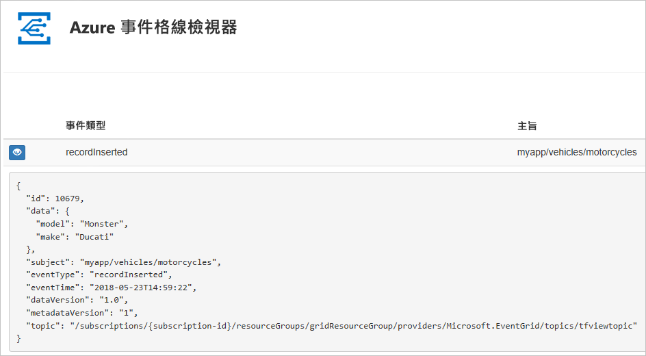

[!INCLUDE [quickstarts-free-trial-note.md](../../includes/quickstarts-free-trial-note.md)]

[!INCLUDE [event-grid-register-provider-portal.md](../../includes/event-grid-register-provider-portal.md)]

## <a name="create-a-custom-topic"></a>建立自訂主題

Event Grid 主題會提供使用者定義的端點，作為您發佈事件的目的地。 

1. 登入 [Azure 入口網站](https://portal.azure.com/)。

1. 若要建立自訂主題，請選取 [建立資源]。 

   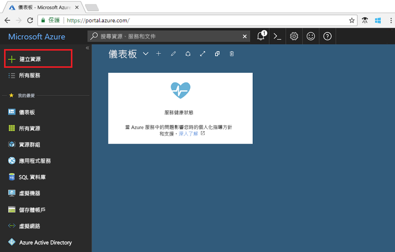

1. 搜尋「Event Grid 主題」，並從可用的選項加以選取。

   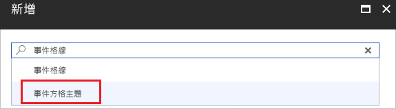

1. 選取 [建立] 。

   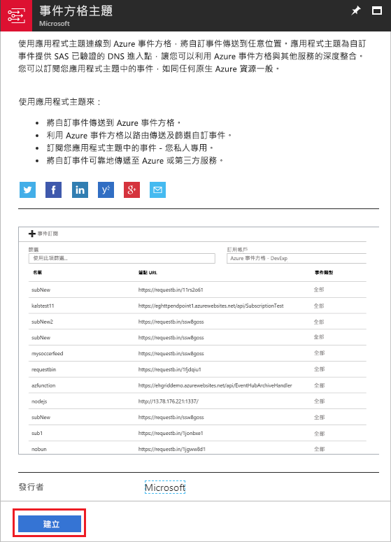

1. 提供自訂主題的唯一名稱。 主題名稱必須是唯一的，因為它由 DNS 項目表示。 請勿使用影像中顯示的名稱。 相反地，請建立您自己的名稱。 提供資源群組的名稱。 選取 [建立] 。

   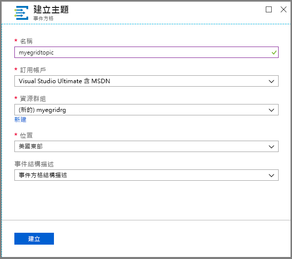

1. 建立自訂主題之後，您會看到成功的通知。

   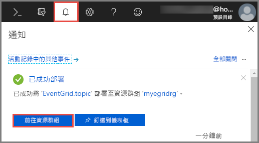

   如果部署失敗，請找出造成錯誤的原因。 選取 [部署失敗]。

   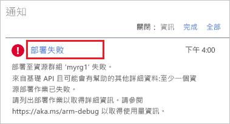

   選取錯誤訊息。

   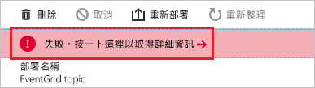

   下圖顯示部署會失敗是因為自訂主題的名稱已在使用中。 如果您看到此錯誤，請使用不同名稱來重試部署。

   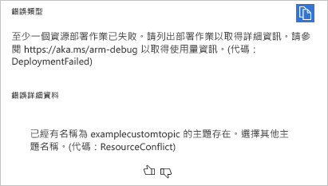

## <a name="create-a-message-endpoint"></a>建立訊息端點

訂閱自訂主題之前，讓我們建立事件訊息的端點。 通常，端點會根據事件資料採取動作。 若要簡化此快速入門，請部署[預先建置的 Web 應用程式](https://github.com/Azure-Samples/azure-event-grid-viewer)以顯示事件訊息。 已部署的解決方案包含 App Service 方案、App Service Web 應用程式，以及 GitHub 中的原始程式碼。

1. 選取 [部署至 Azure]，將解決方案部署至您的訂用帳戶。 在 Azure 入口網站中，提供參數的值。

   <a href="https://portal.azure.com/#create/Microsoft.Template/uri/https%3A%2F%2Fraw.githubusercontent.com%2FAzure-Samples%2Fazure-event-grid-viewer%2Fmaster%2Fazuredeploy.json" target="_blank"></a>

1. 部署需要幾分鐘的時間才能完成。 成功部署之後，檢視 Web 應用程式，確定它正在執行。 在網頁瀏覽器中，瀏覽至：`https://<your-site-name>.azurewebsites.net`

1. 您看到網站，但其中尚未發佈任何事件。

   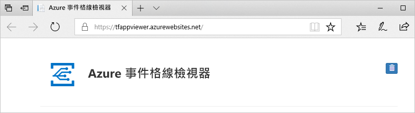

## <a name="subscribe-to-custom-topic"></a>訂閱自訂主題

您可訂閱事件方格主題，告知事件方格您想要追蹤的事件，以及要將事件傳送至何處。

1. 在入口網站中，選取自訂主題。

   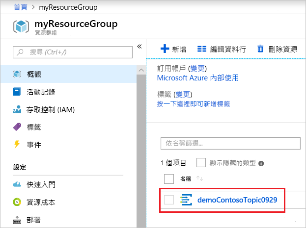

1. 選取 [+ 事件訂用帳戶]。

   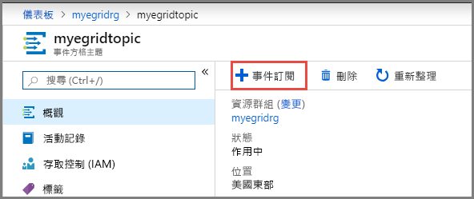

1. 選取 [Web Hook] 作為端點類型。 提供事件訂閱的名稱。

   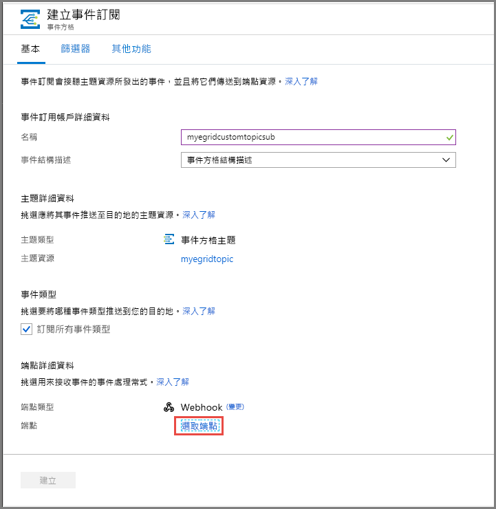

1. 選取 [選取端點]。 

1. 針對 Web Hook 端點，提供您的 Web 應用程式 URL，並將 `api/updates` 新增至首頁 URL。 選取 [確認選取項目]。

   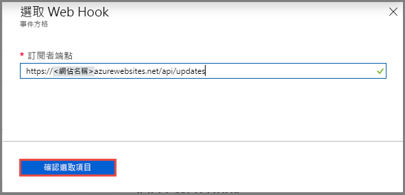

1. 完成提供事件訂閱值之後，選取 [建立]。

再次檢視 Web 應用程式，並注意訂用帳戶的驗證事件已傳送給它。 選取眼睛圖示來展開事件資料。 Event Grid 會傳送驗證事件，以便端點確認它要接收事件資料。 Web 應用程式包含用來驗證訂用帳戶的程式碼。

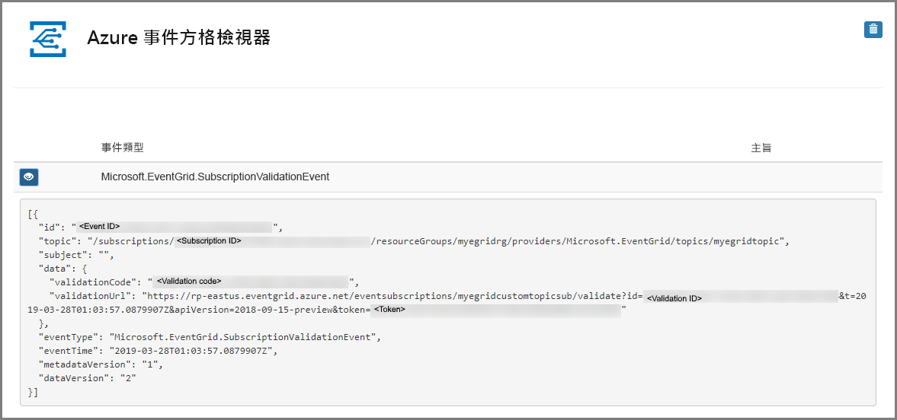

## <a name="send-an-event-to-your-topic"></a>將事件傳送至主題

現在，讓我們觸發事件以了解 Event Grid 如何將訊息散發至您的端點。 使用 Azure CLI 或 PowerShell 將測試事件傳送至您的自訂主題。 一般而言，應用程式或 Azure 服務就會傳送事件資料。

第一個範例會使用 Azure CLI。 它會取得自訂主題的 URL 和金鑰，以及範例事件資料。 將您的自訂主題名稱用於 `<topic_name>`。 這樣會建立範例事件資料。 JSON 的 `data` 元素是您的事件承載。 任何語式正確的 JSON 都可以進入這個欄位。 您也可以使用主體欄位進行進階路由傳送或篩選。 CURL 是可傳送 HTTP 要求的公用程式。

```azurecli-interactive
endpoint=$(az eventgrid topic show --name <topic_name> -g myResourceGroup --query "endpoint" --output tsv)
key=$(az eventgrid topic key list --name <topic_name> -g myResourceGroup --query "key1" --output tsv)

event='[ {"id": "'"$RANDOM"'", "eventType": "recordInserted", "subject": "myapp/vehicles/motorcycles", "eventTime": "'`date +%Y-%m-%dT%H:%M:%S%z`'", "data":{ "make": "Ducati", "model": "Monster"},"dataVersion": "1.0"} ]'

curl -X POST -H "aeg-sas-key: $key" -d "$event" $endpoint
```

第二個範例會使用 PowerShell 執行類似的步驟。

```azurepowershell-interactive
$endpoint = (Get-AzureRmEventGridTopic -ResourceGroupName gridResourceGroup -Name <topic-name>).Endpoint
$keys = Get-AzureRmEventGridTopicKey -ResourceGroupName gridResourceGroup -Name <topic-name>

$eventID = Get-Random 99999

#Date format should be SortableDateTimePattern (ISO 8601)
$eventDate = Get-Date -Format s

#Construct body using Hashtable
$htbody = @{
    id= $eventID
    eventType="recordInserted"
    subject="myapp/vehicles/motorcycles"
    eventTime= $eventDate   
    data= @{
        make="Ducati"
        model="Monster"
    }
    dataVersion="1.0"
}

#Use ConvertTo-Json to convert event body from Hashtable to JSON Object
#Append square brackets to the converted JSON payload since they are expected in the event's JSON payload syntax
$body = "["+(ConvertTo-Json $htbody)+"]"

Invoke-WebRequest -Uri $endpoint -Method POST -Body $body -Headers @{"aeg-sas-key" = $keys.Key1}
```

您已觸發此事件，而 Event Grid 會將訊息傳送至您在訂閱時設定的端點。 檢視您的 Web 應用程式以查看剛傳送的事件。

```json
[{
  "id": "1807",
  "eventType": "recordInserted",
  "subject": "myapp/vehicles/motorcycles",
  "eventTime": "2017-08-10T21:03:07+00:00",
  "data": {
    "make": "Ducati",
    "model": "Monster"
  },
  "dataVersion": "1.0",
  "metadataVersion": "1",
  "topic": "/subscriptions/{subscription-id}/resourceGroups/{resource-group}/providers/Microsoft.EventGrid/topics/{topic}"
}]
```


## <a name="clean-up-resources"></a>清除資源

如果您打算繼續使用此事件，請勿清除在本文中建立的資源。 否則，請刪除您在本文建立的資源。

選取資源群組，然後選取 [刪除資源群組]。

## <a name="next-steps"></a>後續步驟

您現在知道如何建立自訂主題和事件訂閱，深入了解 Event Grid 可協助您：

- [關於 Event Grid](overview.md)
- [將 Blob 儲存體事件路由至自訂的 Web 端點](../storage/blobs/storage-blob-event-quickstart.md?toc=%2fazure%2fevent-grid%2ftoc.json)
- [使用 Azure Event Grid 和 Logic Apps 監視虛擬機器變更](monitor-virtual-machine-changes-event-grid-logic-app.md)
- [將巨量資料串流處理至資料倉儲](event-grid-event-hubs-integration.md)
