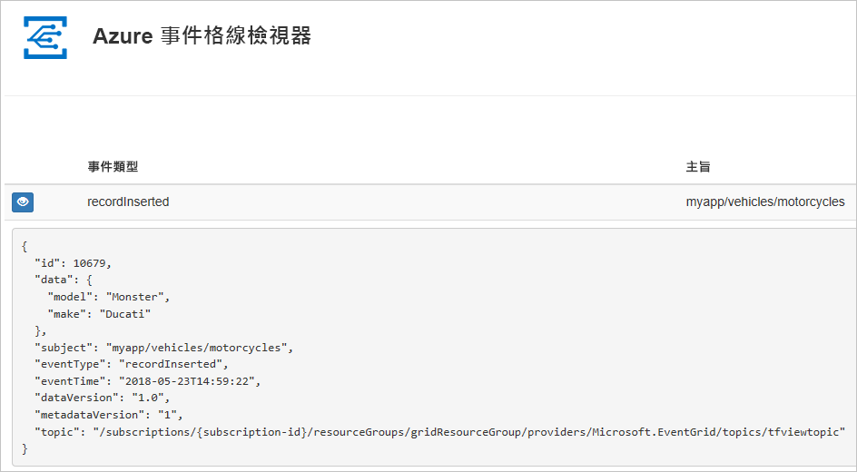
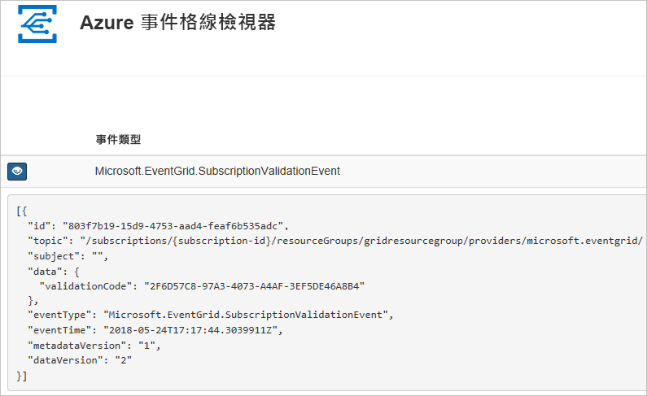

# <a name="create-and-route-custom-events-with-azure-powershell-and-event-grid"></a>使用 Azure PowerShell 和 事件格線建立和路由傳送自訂事件

Azure Event Grid 是一項雲端事件服務。 在本文中，您可使用 Azure PowerShell 建立自訂主題、訂閱主題，以及觸發事件來檢視結果。 通常，您會將事件傳送至可處理事件資料及採取行動的端點。 不過，若要簡化這篇文章，您可將事件傳送至可收集及顯示訊息的 Web 應用程式。

當您完成時，您會看到事件資料已傳送至 Web 應用程式。



[!INCLUDE [quickstarts-free-trial-note.md](../../includes/quickstarts-free-trial-note.md)]

本文需要您執行最新版本的 Azure PowerShell。 如果您需要安裝或升級，請參閱[安裝和設定 Azure PowerShell](/powershell/azure/install-azurerm-ps)。

## <a name="create-a-resource-group"></a>建立資源群組

Event Grid 為 Azure 資源，必須放入 Azure 資源群組中。 資源群組是在其中部署與管理 Azure 資源的邏輯集合。

使用 [New-AzureRmResourceGroup](/powershell/module/azurerm.resources/new-azurermresourcegroup) 命令建立資源群組。

下列範例會在 westus2 位置建立名為 gridResourceGroup 的資源群組。

```powershell-interactive
New-AzureRmResourceGroup -Name gridResourceGroup -Location westus2
```

[!INCLUDE [event-grid-register-provider-powershell.md](../../includes/event-grid-register-provider-powershell.md)]

## <a name="create-a-custom-topic"></a>建立自訂主題

Event Grid 主題會提供使用者定義的端點，作為您發佈事件的目的地。 下列範例可在您的資源群組中建立自訂主題。 以主題的唯一名稱取代 `<your-topic-name>`。 主題名稱必須是唯一的，因為它是 DNS 項目的一部分。

```powershell-interactive
$topicname="<your-topic-name>"

New-AzureRmEventGridTopic -ResourceGroupName gridResourceGroup -Location westus2 -Name $topicname
```

## <a name="create-a-message-endpoint"></a>建立訊息端點

訂閱主題之前，讓我們建立事件訊息的端點。 通常，端點會根據事件資料採取動作。 若要簡化此快速入門，請部署[預先建置的 Web 應用程式](https://github.com/Azure-Samples/azure-event-grid-viewer)以顯示事件訊息。 已部署的解決方案包含 App Service 方案、App Service Web 應用程式，以及 GitHub 中的原始程式碼。

以 Web 應用程式的唯一名稱取代 `<your-site-name>`。 Web 應用程式名稱必須是唯一的，因為它是 DNS 項目的一部分。

```powershell-interactive
$sitename="<your-site-name>"

New-AzureRmResourceGroupDeployment `
  -ResourceGroupName gridResourceGroup `
  -TemplateUri "https://raw.githubusercontent.com/Azure-Samples/azure-event-grid-viewer/master/azuredeploy.json" `
  -siteName $sitename `
  -hostingPlanName viewerhost
```

部署需要幾分鐘的時間才能完成。 成功部署之後，檢視 Web 應用程式，確定它正在執行。 在網頁瀏覽器中，瀏覽至：`https://<your-site-name>.azurewebsites.net`

您應會看到網站目前未顯示任何訊息。

## <a name="subscribe-to-a-topic"></a>訂閱主題

您可訂閱主題，告知 Event Grid 您想要追蹤的事件，以及要將事件傳送至何處。 下列範例可訂閱您所建立的主題，從 Web 應用程式傳遞 URL 作為事件通知的端點。

Web 應用程式的端點必須包含的尾碼 `/api/updates/`。

```powershell-interactive
$endpoint="https://$sitename.azurewebsites.net/api/updates"

New-AzureRmEventGridSubscription `
  -EventSubscriptionName demoViewerSub `
  -Endpoint $endpoint `
  -ResourceGroupName gridResourceGroup `
  -TopicName $topicname
```

再次檢視 Web 應用程式，並注意訂用帳戶的驗證事件已傳送給它。 選取眼睛圖示來展開事件資料。 Event Grid 會傳送驗證事件，以便端點確認它要接收事件資料。 Web 應用程式包含用來驗證訂用帳戶的程式碼。



## <a name="send-an-event-to-your-topic"></a>將事件傳送至主題

讓我們觸發事件以了解 Event Grid 如何將訊息散發至您的端點。 首先，讓我們取得主題的 URL 和金鑰。

```powershell-interactive
$endpoint = (Get-AzureRmEventGridTopic -ResourceGroupName gridResourceGroup -Name $topicname).Endpoint
$keys = Get-AzureRmEventGridTopicKey -ResourceGroupName gridResourceGroup -Name $topicname
```

為了簡化這篇文章，讓我們設定要傳送至自訂主題的範例事件資料。 一般而言，應用程式或 Azure 服務就會傳送事件資料。 下列範例會使用雜湊表來建構事件的資料 `htbody`，然後將其轉換成語式正確的 JSON 承載物件`$body`：

```powershell-interactive
$eventID = Get-Random 99999

#Date format should be SortableDateTimePattern (ISO 8601)
$eventDate = Get-Date -Format s

#Construct body using Hashtable
$htbody = @{
    id= $eventID
    eventType="recordInserted"
    subject="myapp/vehicles/motorcycles"
    eventTime= $eventDate   
    data= @{
        make="Ducati"
        model="Monster"
    }
    dataVersion="1.0"
}

#Use ConvertTo-Json to convert event body from Hashtable to JSON Object
#Append square brackets to the converted JSON payload since they are expected in the event's JSON payload syntax
$body = "["+(ConvertTo-Json $htbody)+"]"
```

如果您檢視 `$body`，您可以看到完整事件。 JSON 的 `data` 元素是您的事件承載。 任何語式正確的 JSON 都可以進入這個欄位。 您也可以使用主體欄位進行進階路由傳送或篩選。

現在，將事件傳送至主題。

```powershell-interactive
Invoke-WebRequest -Uri $endpoint -Method POST -Body $body -Headers @{"aeg-sas-key" = $keys.Key1}
```

您已觸發此事件，而 Event Grid 會將訊息傳送至您在訂閱時設定的端點。 檢視您的 Web 應用程式以查看剛傳送的事件。

```json
[{
  "id": "1807",
  "eventType": "recordInserted",
  "subject": "myapp/vehicles/motorcycles",
  "eventTime": "2018-01-25T15:58:13",
  "data": {
    "make": "Ducati",
    "model": "Monster"
  },
  "dataVersion": "1.0",
  "metadataVersion": "1",
  "topic": "/subscriptions/{subscription-id}/resourceGroups/{resource-group}/providers/Microsoft.EventGrid/topics/{topic}"
}]
```

## <a name="clean-up-resources"></a>清除資源

如果您打算繼續使用此事件或事件檢視器應用程式，請勿清除在本文中建立的資源。 否則，請使用下列命令來刪除您在本文建立的資源。

```powershell
Remove-AzureRmResourceGroup -Name gridResourceGroup
```

## <a name="next-steps"></a>後續步驟

您現在知道如何建立主題和事件訂閱，深入了解 Event Grid 可協助您：

- [關於 Event Grid](overview.md)
- [將 Blob 儲存體事件路由至自訂的 Web 端點](../storage/blobs/storage-blob-event-quickstart.md?toc=%2fazure%2fevent-grid%2ftoc.json)
- [使用 Azure Event Grid 和 Logic Apps 監視虛擬機器變更](monitor-virtual-machine-changes-event-grid-logic-app.md)
- [將巨量資料串流處理至資料倉儲](event-grid-event-hubs-integration.md)
