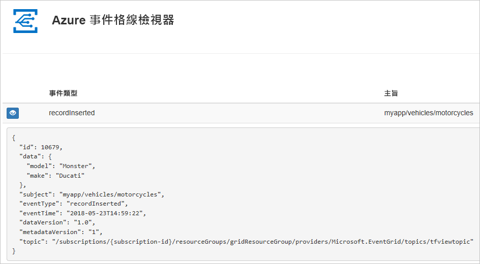
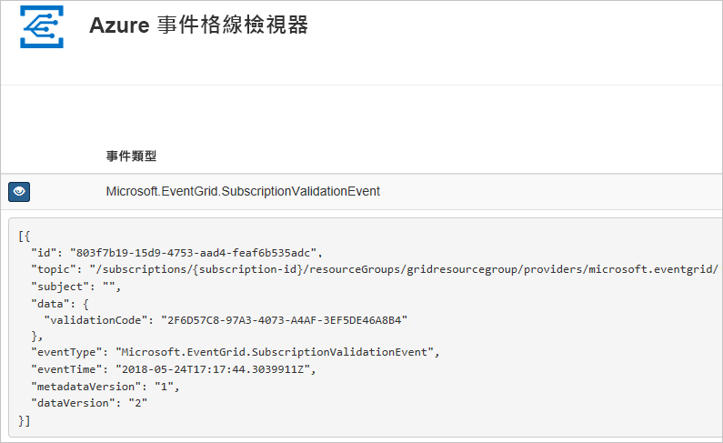

# <a name="create-and-route-custom-events-with-azure-cli-and-event-grid"></a>使用 Azure CLI 和事件格線建立和路由傳送自訂事件

Azure Event Grid 是一項雲端事件服務。 在本文中，您可使用 Azure CLI 建立自訂主題、訂閱自訂主題，以及觸發事件來檢視結果。 通常，您會將事件傳送至可處理事件資料及採取行動的端點。 不過，若要簡化這篇文章，您可將事件傳送至可收集及顯示訊息的 Web 應用程式。

當您完成時，您會看到事件資料已傳送至 Web 應用程式。



[!INCLUDE [quickstarts-free-trial-note.md](../../includes/quickstarts-free-trial-note.md)]

[!INCLUDE [cloud-shell-try-it.md](../../includes/cloud-shell-try-it.md)]

如果您選擇在本機安裝和使用 CLI，本文會要求您執行最新版的 Azure CLI (2.0.24 或更新版本)。 若要尋找版本，請執行 `az --version`。 如果您需要安裝或升級，請參閱[安裝 Azure CLI](/cli/azure/install-azure-cli)。

如果您未使用 Cloud Shell，必須先使用 `az login` 登入。

## <a name="create-a-resource-group"></a>建立資源群組

Event Grid 為 Azure 資源，必須放入 Azure 資源群組中。 資源群組是在其中部署與管理 Azure 資源的邏輯集合。

使用 [az group create](/cli/azure/group#az-group-create) 命令來建立資源群組。 

下列範例會在 westus2 位置建立名為 gridResourceGroup 的資源群組。

```azurecli-interactive
az group create --name gridResourceGroup --location westus2
```

[!INCLUDE [event-grid-register-provider-cli.md](../../includes/event-grid-register-provider-cli.md)]

## <a name="create-a-custom-topic"></a>建立自訂主題

Event Grid 主題會提供使用者定義的端點，作為您發佈事件的目的地。 下列範例可在您的資源群組中建立自訂主題。 以主題的唯一名稱取代 `<your-topic-name>`。 自訂主題名稱必須是唯一的，因為它是 DNS 項目的一部分。

```azurecli-interactive
topicname=<your-topic-name>

az eventgrid topic create --name $topicname -l westus2 -g gridResourceGroup
```

## <a name="create-a-message-endpoint"></a>建立訊息端點

訂閱自訂主題之前，讓我們建立事件訊息的端點。 通常，端點會根據事件資料採取動作。 若要簡化此快速入門，請部署[預先建置的 Web 應用程式](https://github.com/Azure-Samples/azure-event-grid-viewer)以顯示事件訊息。 已部署的解決方案包含 App Service 方案、App Service Web 應用程式，以及 GitHub 中的原始程式碼。

以 Web 應用程式的唯一名稱取代 `<your-site-name>`。 Web 應用程式名稱必須是唯一的，因為它是 DNS 項目的一部分。

```azurecli-interactive
sitename=<your-site-name>

az group deployment create \
  --resource-group gridResourceGroup \
  --template-uri "https://raw.githubusercontent.com/Azure-Samples/azure-event-grid-viewer/master/azuredeploy.json" \
  --parameters siteName=$sitename hostingPlanName=viewerhost
```

部署需要幾分鐘的時間才能完成。 成功部署之後，檢視 Web 應用程式，確定它正在執行。 在網頁瀏覽器中，瀏覽至：`https://<your-site-name>.azurewebsites.net`

您應會看到網站目前未顯示任何訊息。

## <a name="subscribe-to-a-custom-topic"></a>訂閱自訂主題

您可訂閱事件方格主題，告知事件方格您想要追蹤的事件，以及要將這些事件傳送至何處。 下列範例可訂閱您所建立的自訂主題，從 Web 應用程式傳遞 URL 作為事件通知的端點。

Web 應用程式的端點必須包含的尾碼 `/api/updates/`。

```azurecli-interactive
endpoint=https://$sitename.azurewebsites.net/api/updates

az eventgrid event-subscription create \
  -g gridResourceGroup \
  --topic-name $topicname \
  --name demoViewerSub \
  --endpoint $endpoint
```

再次檢視 Web 應用程式，並注意訂用帳戶的驗證事件已傳送給它。 選取眼睛圖示來展開事件資料。 Event Grid 會傳送驗證事件，以便端點確認它要接收事件資料。 Web 應用程式包含用來驗證訂用帳戶的程式碼。



## <a name="send-an-event-to-your-custom-topic"></a>將事件傳送至自訂主題

讓我們觸發事件以了解 Event Grid 如何將訊息散發至您的端點。 首先，讓我們取得自訂主題的 URL 和金鑰。

```azurecli-interactive
endpoint=$(az eventgrid topic show --name $topicname -g gridResourceGroup --query "endpoint" --output tsv)
key=$(az eventgrid topic key list --name $topicname -g gridResourceGroup --query "key1" --output tsv)
```

若要簡化這篇文章，您可使用要傳送至自訂主題的範例事件資料。 一般而言，應用程式或 Azure 服務就會傳送事件資料。 下列範例會建立範例事件資料：

```azurecli-interactive
event='[ {"id": "'"$RANDOM"'", "eventType": "recordInserted", "subject": "myapp/vehicles/motorcycles", "eventTime": "'`date +%Y-%m-%dT%H:%M:%S%z`'", "data":{ "make": "Ducati", "model": "Monster"},"dataVersion": "1.0"} ]'
```

JSON 的 `data` 元素是您的事件承載。 任何語式正確的 JSON 都可以進入這個欄位。 您也可以使用主體欄位進行進階路由傳送或篩選。

CURL 是可傳送 HTTP 要求的公用程式。 本文使用 CURL 將事件傳送到主題。 

```azurecli-interactive
curl -X POST -H "aeg-sas-key: $key" -d "$event" $endpoint
```

您已觸發此事件，而 Event Grid 會將訊息傳送至您在訂閱時設定的端點。 檢視您的 Web 應用程式以查看剛傳送的事件。

```json
[{
  "id": "1807",
  "eventType": "recordInserted",
  "subject": "myapp/vehicles/motorcycles",
  "eventTime": "2017-08-10T21:03:07+00:00",
  "data": {
    "make": "Ducati",
    "model": "Monster"
  },
  "dataVersion": "1.0",
  "metadataVersion": "1",
  "topic": "/subscriptions/{subscription-id}/resourceGroups/{resource-group}/providers/Microsoft.EventGrid/topics/{topic}"
}]
```

## <a name="clean-up-resources"></a>清除資源
如果您打算繼續使用此事件或事件檢視器應用程式，請勿清除在本文中建立的資源。 否則，請使用下列命令來刪除您在本文建立的資源。

```azurecli-interactive
az group delete --name gridResourceGroup
```

## <a name="next-steps"></a>後續步驟

您現在知道如何建立主題和事件訂閱，深入了解 Event Grid 可協助您：

- [關於 Event Grid](overview.md)
- [將 Blob 儲存體事件路由至自訂的 Web 端點](../storage/blobs/storage-blob-event-quickstart.md?toc=%2fazure%2fevent-grid%2ftoc.json)
- [使用 Azure Event Grid 和 Logic Apps 監視虛擬機器變更](monitor-virtual-machine-changes-event-grid-logic-app.md)
- [將巨量資料串流處理至資料倉儲](event-grid-event-hubs-integration.md)
