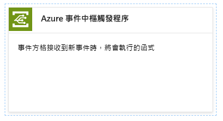
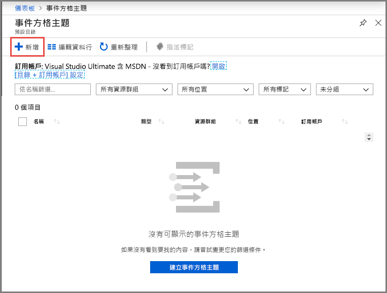
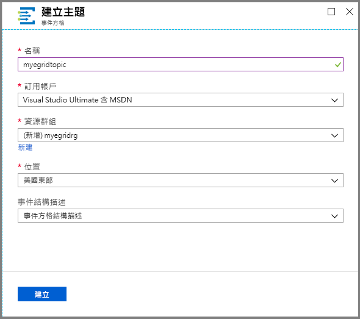
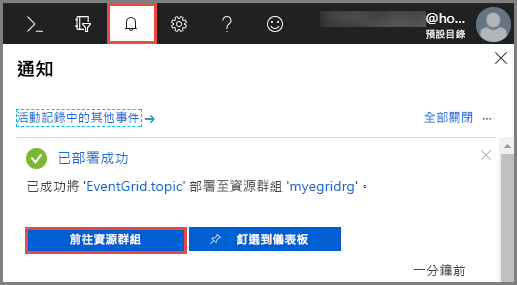
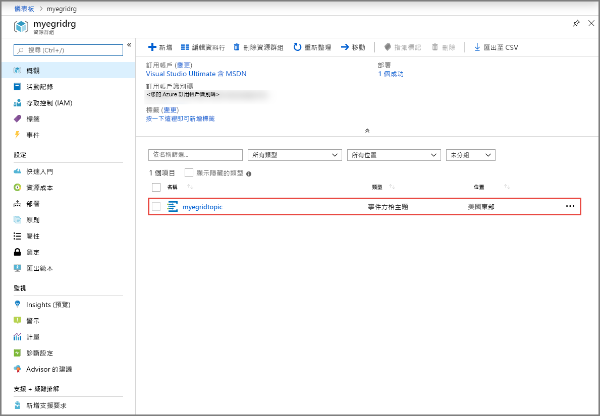
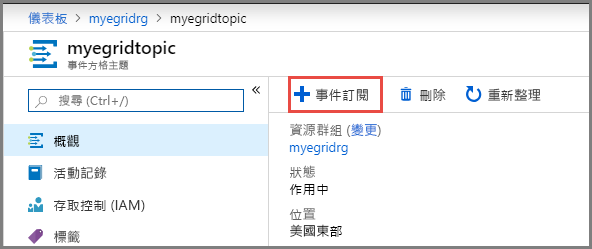
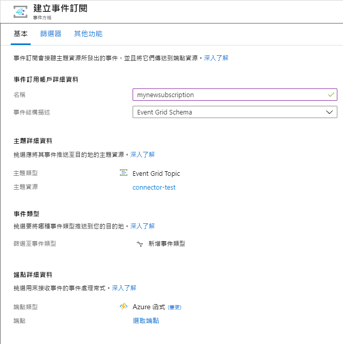
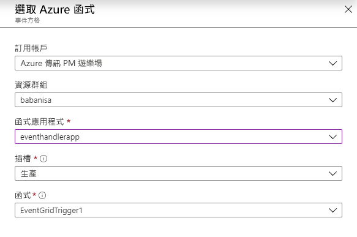
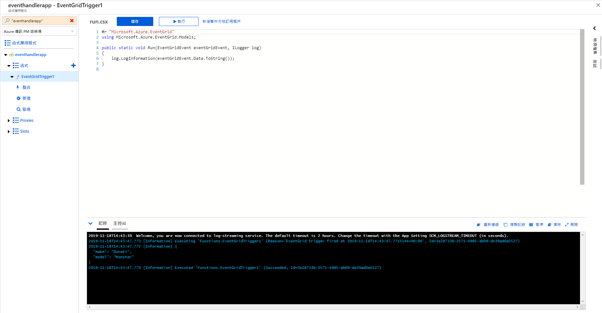
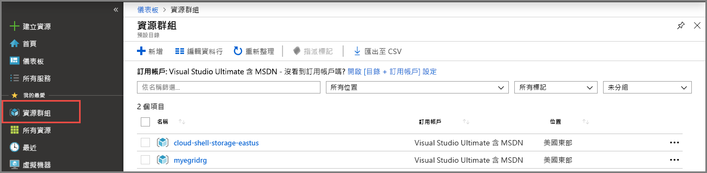

# <a name="quickstart-route-custom-events-to-an-azure-function-with-event-grid"></a>快速入門：使用事件方格將自訂事件路由至 Azure 函式

Azure Event Grid 是一項雲端事件服務。 Azure Functions 是其中一個支援的事件處理常式。 在本文中，您可使用 Azure 入口網站建立自訂主題、訂閱自訂主題，以及觸發事件來檢視結果。 您會將事件傳送至 Azure 函式。

[!INCLUDE [quickstarts-free-trial-note.md](../../includes/quickstarts-free-trial-note.md)]

## <a name="create-azure-function"></a>建立 Azure 函式

在訂閱自訂主題之前，我們要先建立用來處理事件的函式。 在 Azure 入口網站中，按一下 [建立資源] 並輸入 [函式]，然後選擇 [函式應用程式]，再按一下 [建立]。 選取資源群組下的 [新建]，並為其命名。 您將在本教學課程的其餘部分使用此名稱。 為函式應用程式提供名稱，保留 [程式碼] 上的 [發佈] 切換，選取任何執行階段和區域，然後點擊 [建立]。

函式應用程式準備就緒後，請瀏覽至該應用程式，然後按一下 [+ 新增函式]。 針對開發環境選取 [入口網站內]，然後點擊 [繼續]。 在 [建立函式] 底下選擇 [更多範本] 以檢視更多範本，然後搜尋 [Azure 事件方格觸發程序]，並加以選取。 如果這是您第一次使用此觸發程序，您可能必須按一下 [安裝] 以安裝延伸模組。



安裝延伸模組後，請按一下 [繼續]，為您的函式命名，然後點擊 [建立]。

[!INCLUDE [event-grid-register-provider-portal.md](../../includes/event-grid-register-provider-portal.md)]

## <a name="create-a-custom-topic"></a>建立自訂主題

Event Grid 主題會提供使用者定義的端點，作為您發佈事件的目的地。 

1. 登入 [Azure 入口網站](https://portal.azure.com/)。
2. 選取左導覽功能表中的 [所有服務]  ，搜尋**事件方格**，然後選取 [事件方格主題]  。 

    
3. 在 [事件方格主題]  頁面上，選取工具列上的 [+ 新增]  。 

    

4. 在 [建立主題]  頁面上，遵循下列步驟：

    1. 提供自訂主題的唯一 [名稱]  。 主題名稱必須是唯一的，因為它由 DNS 項目表示。 請勿使用影像中顯示的名稱。 而是建立您自己的名稱 - 它必須介於 3 到 50 個字元之間，且只包含值 a-z、A-Z、0-9 和 "-"。
    2. 選取您的 Azure **訂用帳戶**。
    3. 從先前的步驟中選取相同的資源群組。
    4. 選取事件方格主題的 [位置]  。
    5. 保留 [事件結構描述]  欄位的預設值 [事件方格結構描述]  。 

       
    6. 選取 [建立]  。 

5. 建立自訂主題之後，您會看到成功的通知。 選取 [前往資源群組]  。 

   

6. 在 [資源群組]  頁面上，選取事件方格主題。 

   

7. 您會看到您事件方格的 [事件方格主題]  頁面。 讓此頁面保持開啟。 您稍後會在快速入門中使用此值。 

    

## <a name="subscribe-to-custom-topic"></a>訂閱自訂主題

您可訂閱事件方格主題，告知事件方格您想要追蹤的事件，以及要將事件傳送至何處。

1. 現在，在您自訂主題的 [事件方格主題]  頁面上，選取工具列上的 [+ 事件訂閱]  。

   

2. 在 [建立事件訂閱]  頁面上，遵循下列步驟：
    1. 輸入事件訂閱的 [名稱]  。
    3. 針對 [端點類型]  ，選取 [Azure 函式]  。 
    4. 選擇 [選取端點]  。 

       

    5. 針對函式端點，選取您的函式應用程式所在的 Azure 訂用帳戶和資源群組，然後選取您先前建立的函式應用程式和函式。 選取 [確認選取項目]  。

       

    6. 回到 [建立事件訂閱]  頁面，選取 [建立]  。

## <a name="send-an-event-to-your-topic"></a>將事件傳送至主題

現在，讓我們觸發事件以了解 Event Grid 如何將訊息散發至您的端點。 使用 Azure CLI 或 PowerShell 將測試事件傳送至您的自訂主題。 一般而言，應用程式或 Azure 服務就會傳送事件資料。

第一個範例會使用 Azure CLI。 它會取得自訂主題的 URL 和金鑰，以及範例事件資料。 將您的自訂主題名稱用於 `<topic name>`。 這樣會建立範例事件資料。 JSON 的 `data` 元素是您的事件承載。 任何語式正確的 JSON 都可以進入這個欄位。 您也可以使用主體欄位進行進階路由傳送或篩選。 CURL 是可傳送 HTTP 要求的公用程式。


### <a name="azure-cli"></a>Azure CLI
1. 在 Azure 入口網站中選取 [Cloud Shell]  。 在 Cloud Shell 視窗的左上角，選取 [Bash]  。 

    
1. 執行下列命令以取得主題的**端點**：在您複製並貼上命令之後，請先更新 [主題名稱]  和 [資源群組名稱]  ，再執行命令。 

    ```azurecli
    endpoint=$(az eventgrid topic show --name <topic name> -g <resource group name> --query "endpoint" --output tsv)
    ```
2. 執行下列命令以取得主題的**索引鍵**：在您複製並貼上命令之後，請先更新 [主題名稱]  和 [資源群組名稱]  ，再執行命令。 

    ```azurecli
    key=$(az eventgrid topic key list --name <topic name> -g <resource group name> --query "key1" --output tsv)
    ```
3. 複製下列陳述式與事件定義，然後按 **ENTER**。 

    ```json
    event='[ {"id": "'"$RANDOM"'", "eventType": "recordInserted", "subject": "myapp/vehicles/motorcycles", "eventTime": "'`date +%Y-%m-%dT%H:%M:%S%z`'", "data":{ "make": "Ducati", "model": "Monster"},"dataVersion": "1.0"} ]'
    ```
4. 執行下列 **Curl** 命令來張貼事件：

    ```
    curl -X POST -H "aeg-sas-key: $key" -d "$event" $endpoint
    ```

### <a name="azure-powershell"></a>Azure PowerShell
第二個範例會使用 PowerShell 執行類似的步驟。

1. 在 Azure 入口網站中選取 [Cloud Shell]  (或者，移至 https://shell.azure.com/) 。 在 Cloud Shell 視窗的左上角，選取 [PowerShell]  。 請參閱 Azure CLI 區段中的範例 **Cloud Shell** 視窗映像。
2. 設定下列變數。 在您複製並貼上每個命令之後，請先更新 [主題名稱]  和 [資源群組名稱]  ，再執行命令：

    ```powershell
    $resourceGroupName = <resource group name>
    $topicName = <topic name>
    ```
3. 執行下列命令以取得主題的**端點**和**金鑰**：

    ```powershell
    $endpoint = (Get-AzEventGridTopic -ResourceGroupName $resourceGroupName -Name $topicName).Endpoint
    $keys = Get-AzEventGridTopicKey -ResourceGroupName $resourceGroupName -Name $topicName
    ```
4. 準備事件。 在 Cloud Shell 視窗中複製並執行陳述式。 

    ```powershell
    $eventID = Get-Random 99999

    #Date format should be SortableDateTimePattern (ISO 8601)
    $eventDate = Get-Date -Format s

    #Construct body using Hashtable
    $htbody = @{
        id= $eventID
        eventType="recordInserted"
        subject="myapp/vehicles/motorcycles"
        eventTime= $eventDate   
        data= @{
            make="Ducati"
            model="Monster"
        }
        dataVersion="1.0"
    }
    
    #Use ConvertTo-Json to convert event body from Hashtable to JSON Object
    #Append square brackets to the converted JSON payload since they are expected in the event's JSON payload syntax
    $body = "["+(ConvertTo-Json $htbody)+"]"
    ```
5. 使用 **Invoke-WebRequest** Cmdlet 來傳送事件。 

    ```powershell
    Invoke-WebRequest -Uri $endpoint -Method POST -Body $body -Headers @{"aeg-sas-key" = $keys.Key1}
    ```

### <a name="verify-in-the-event-grid-viewer"></a>在事件方格檢視器中驗證
您已觸發此事件，而 Event Grid 會將訊息傳送至您在訂閱時設定的端點。 瀏覽至事件方格觸發的函式，並開啟記錄。 您應該會在記錄中看到事件的資料承載複本。 若未看到，請先確定您已開啟 [記錄] 視窗，或點擊 [重新連線]，然後再次嘗試傳送測試事件。



## <a name="clean-up-resources"></a>清除資源
如果您打算繼續使用此事件，請勿清除在本文中建立的資源。 否則，請刪除您在本文建立的資源。

1. 選取左功能表上的 [資源群組]  。 如果您未在左側功能表上看到它，請選取左側功能表上的 [所有服務]  ，然後選取 [資源群組]  。 
2. 選取資源群組以啟動 [資源群組]  頁面。 
3. 選取工具列上的 [刪除資源群組]  。 
4. 輸入資源群組的名稱並選取 [刪除]  ，以確認刪除。 

    

    您在映像中看到的其他資源群組是由 Cloud Shell 視窗建立和使用。 如果您不打算稍後使用 Cloud Shell 視窗，請將它刪除。 
```

## Next steps

Now that you know how to create topics and event subscriptions, learn more about what Event Grid can help you do:

- [About Event Grid](overview.md)
- [Route Blob storage events to a custom web endpoint](../storage/blobs/storage-blob-event-quickstart.md?toc=%2fazure%2fevent-grid%2ftoc.json)
- [Monitor virtual machine changes with Azure Event Grid and Logic Apps](monitor-virtual-machine-changes-event-grid-logic-app.md)
- [Stream big data into a data warehouse](event-grid-event-hubs-integration.md)
