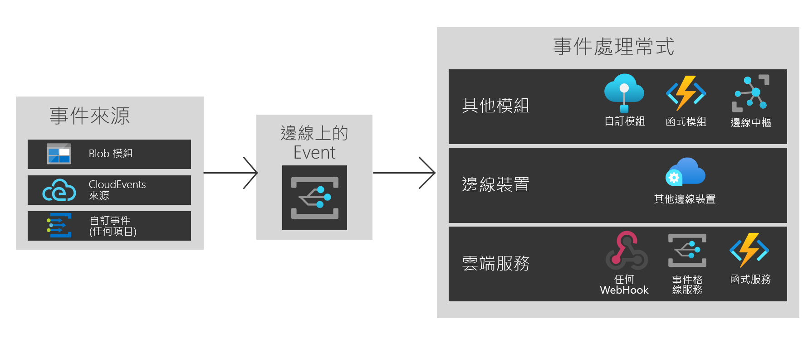

# 什麼是 Azure IoT Edge 上的 Azure 事件方格？
IoT Edge 上的事件方格可將 Azure 事件方格的強大功能和彈性導入 Edge，用於各種發佈/訂閱和事件驅動案例。 您可以建立主題、發佈事件及訂閱多個目的地，不論它們是相同裝置、其他 Edge 裝置或雲端服務中的模組。

就像在雲端一樣，IoT Edge 上的事件方格模組可處理大規模的事件路由、篩選和可靠傳遞。 篩選事件可確保只有相關的事件會使用進階字串、數值和布林值篩選傳送至不同的事件處理常式。 重試邏輯可確保事件即使在發佈時無法使用，也可送達目標模組、Edge 裝置或雲端服務。 它可讓您在 IoT Edge 上使用事件方格，作為強大的儲存和轉送機制。

IoT Edge 上的事件方格支援 CloudEvents v1.0 和自訂事件結構描述。 它也支援與雲端中的事件方格相同的發佈和訂閱語意，以便與 Azure 和第三方互通。

本文將概略說明 IoT Edge 上的 Azure 事件方格。 如需在 Edge 上使用此模組的逐步指示，請參閱 [在本機發佈、訂閱事件](pub-sub-events-webhook-local.md)。 

此圖說明「IoT Edge 上的事件方格」的部分使用方式，而不是完整的支援功能清單。

## 何時可使用 IoT Edge 上的事件方格

IoT Edge 上的事件方格可提供一致、易於使用且可靠的事件模型，用以在 Edge 和雲端之間建置事件驅動架構。

IoT Edge 上的事件方格是使用與 Azure 雲端服務對稱的執行階段介面區建立的，因此您可以在任何所需之處使用相同的事件和 API 呼叫。 現在，無論您是在雲端、Edge 或兩者之間進行發佈/訂閱，IoT Edge 都可作為可行的解決方案。

使用 IoT Edge 上的事件方格，可觸發模組之間的簡單工作流程。 例如，建立一個主題，並將儲存體模組中「由儲存體 Blob 建立」的事件發佈至主題。 現在，您可以訂閱該主題的一或數個函式或自訂模組。

在 Edge 裝置之間擴充您的功能。 如果您要發佈 Blob 模組事件，並且想要使用多個近端 Edge 裝置的計算能力，請建立跨裝置的訂用帳戶。

最後，請連線至雲端。 如果您的 Blob 模組事件要定期同步至雲端，請使用雲端上提供的進階計算功能，或傳送已處理的資料，建立額外的雲端服務訂用帳戶。

IoT Edge 上的事件方格提供彈性且可靠的分離事件架構。

## 事件來源

就像在雲端中，IoT Edge 上的事件方格也允許模組之間的直接整合，以建置事件驅動架構。 目前，事件可從下列位置傳送至 IoT Edge 上的事件方格：

* IoT Edge 上的 Azure Blob 儲存體
* CloudEvents 來源
* 透過 HTTP POST 的自訂容器和模組

## 事件處理常式

IoT Edge 上的事件方格可將事件傳送至您想要的任何位置。 目前支援的目的地如下：

* 其他模組，包括 IoT 中樞、函式和自訂模組
* 其他 Edge 裝置
* 雲端中裝載的服務，包括 Azure 事件方格和 Azure Functions
* Webhook

## 支援的環境
目前支援 Windows 64 位元、Linux 64 位元和 ARM 32 位元環境。

## 概念

Azure 事件方格中有五項概念可讓您開始使用：

* **事件** — 發生了什麼事。
* **事件來源** — 事件發生位置。
* **主題** — 發行者傳送事件的端點。
* **事件訂閱** — 用來路由傳送事件的端點或內建機制，有時會路由至多個處理常式。 處理常式也會使用訂閱來智慧地篩選內送事件。
* **事件處理常式** — 對事件做出回應的應用程式或服務。

## 成本

IoT Edge 上的事件方格在公開預覽期間可免費使用。

## 問題
使用 IoT Edge 上的事件方格時若有任何問題，請經由 [https://github.com/Azure/event-grid-iot-edge/issues](https://github.com/Azure/event-grid-iot-edge/issues) 加以回報。

## 後續步驟

* [在本機發佈、訂閱事件](pub-sub-events-webhook-local.md)
* [在雲端發佈、訂閱事件](pub-sub-events-webhook-cloud.md)
* [將事件轉送至事件方格雲端](forward-events-event-grid-cloud.md)
* [將事件轉送至 IoTHub](forward-events-iothub.md)
* [在本機回應 Blob 儲存體事件](react-blob-storage-events-locally.md)