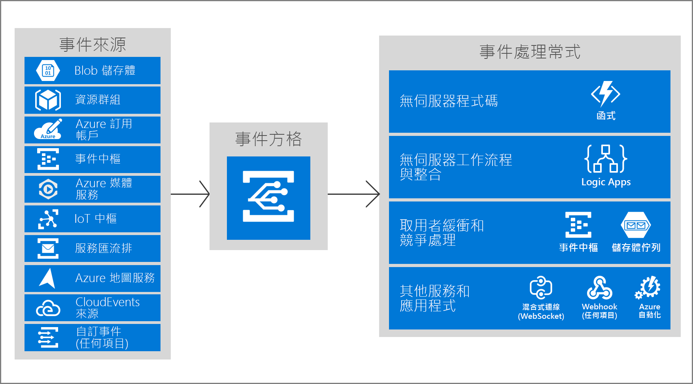

# Azure 事件方格簡介

Azure 事件方格可讓您以事件型架構輕鬆地建立應用程式。 首先，請選取您想要訂閱的 Azure 資源，然後提供事件處理常式或 WebHook 端點以作為事件的傳送目的地。 對於來自 Azure 服務 (例如儲存體 Blob 和資源群組) 的事件，事件方格內建了支援功能。 事件方格也支援您本身使用自訂主題的事件。 

您可以使用篩選器將特定事件路由傳送到不同的端點、多點傳送至多個端點，並確定您的事件會可靠地進行傳遞。

目前，Azure 事件方格在所有公用區域中均適用。 它尚不適用於 Azure 德國、Azure 中國或 Azure Government 雲端中。

此文章提供 Azure 事件方格的概觀。 若要開始使用事件方格，請參閱[使用 Azure 事件方格建立和路由傳送自訂事件](custom-event-quickstart.md)。 

請注意：此圖顯示事件方格如何連接來源和處理常式，但這並非完整的支援整合清單。

## 事件來源

如需各個來源的功能以及相關文件的完整資料，請參閱[事件來源](event-sources.md)。 目前支援將事件傳送到事件方格的 Azure 服務如下：

* Azure 訂用帳戶 (管理作業)
* Container Registry
* 自訂主題
* 事件中樞
* IoT 中樞
* 媒體服務
* 資源群組 (管理作業)
* 服務匯流排
* 儲存體 Blob
* 儲存體一般用途 v2 (GPv2)

## 事件處理常式

如需各個處理常式的功能以及相關文件的完整資料，請參閱[處理常式來源](event-handlers.md)。 目前支援處理來自事件方格之事件的 Azure 服務如下： 

* Azure 自動化
* Azure Functions
* 事件中樞
* 混合式連線
* Logic Apps
* Microsoft Flow
* 佇列儲存體
* Webhook

## 概念

Azure 事件方格中有五個概念可讓您開始進行：

* **事件** - 發生了什麼事。
* **事件來源** - 事件發生位置。
* **主題** - 要作為發行者所傳送之事件的目的地端點。
* **事件訂閱** - 用來路由事件的端點或內建機制，有時會路由到多個處理常式。 處理常式也會使用訂閱來智慧地篩選內送事件。
* **事件處理常式** - 對事件做出回應的應用程式或服務。

如需這些概念的詳細資訊，請參閱 [Azure 事件方格中的概念](concepts.md)。

## 功能

以下是 Azure 事件方格的一些主要功能︰

* **簡便性** - 點按即可瞄準從 Azure 資源到任何事件處理常式或端點的事件。
* **進階篩選** - 篩選事件類型或事件發佈路徑，以確定事件處理常式只會收到相關的事件。
* **展開傳送** - 讓多個端點訂閱相同的事件，以將事件的複本傳送到所需的多個位置。
* **可靠性** - 利用 24 小時的指數輪詢重試，來確保事件能夠傳遞出去。
* **依事件支付** - 只需就您使用的事件方格數量來付費。
* **高輸送量** - 在每秒支援數百萬個事件的事件方格上建置大量的工作負載。
* **內建事件** - 利用資源定義的內建事件來快速地啟動並執行。
* **自訂事件** - 使用「事件方格」路由、篩選並在應用程式中可靠地傳遞自訂事件。

如需事件方格、事件中樞和服務匯流排的比較，請參閱[選擇傳遞訊息的 Azure 服務](compare-messaging-services.md)。

## 我可以用事件方格來做什麼？

Azure 事件方格提供好幾種功能，可大幅提升無伺服器、作業自動化和整合工作： 

### 無伺服器應用程式架構

事件方格可連線資料來源與事件處理常式。 例如，使用事件方格來立即觸發無伺服器功能，以在每次相片新增至 Blob 儲存體容器時執行影像分析。 

### 作業自動化

事件方格可讓您加快自動化速度並簡化原則強制執行。 例如，事件方格可以在虛擬機器建立或 SQL Database 啟動時通知 Azure 自動化。 這些事件可用於自動檢查服務組態是否符合規範、將中繼資料放入作業工具、標記虛擬機器，或將工作項目歸檔。

### 應用程式整合

事件方格可連線您的應用程式與其他服務。 例如，建立自訂主體，將應用程式的事件資料傳送至事件方格，並利用其可靠的傳遞、進階路由以及與 Azure 的直接整合。 或者，您可以使用事件方格搭配 Logic Apps 隨處處理資料，而不需撰寫程式碼。 

## 事件方格的費用是多少？

Azure 事件方格使用依事件支付計價模式，因此您只需就使用量來付費。 每個月的前 100,000 個作業是免費的。 作業的定義為事件輸入、訂用帳戶傳遞嘗試、管理呼叫，以及以主旨後置詞進行篩選。 如需詳細資訊，請參閱[定價頁面](https://azure.microsoft.com/pricing/details/event-grid/)。

## 後續步驟

* [路由儲存體 Blob 事件](../storage/blobs/storage-blob-event-quickstart.md?toc=%2fazure%2fevent-grid%2ftoc.json)  
  使用事件方格回應儲存體 Blob 事件。
* [建立並訂閱自訂事件](custom-event-quickstart.md)  
  直接進入正題並開始使用 Azure 事件方格快速入門來將您自己的自訂事件傳送至任何端點。
* [使用 Logic Apps 來作為事件處理常式](monitor-virtual-machine-changes-event-grid-logic-app.md)  
  有關使用 Logic Apps 建置應用程式以回應事件方格所推送之事件的教學課程。
* [將巨量資料串流處理至資料倉儲](event-grid-event-hubs-integration.md)  
  使用 Azure Functions 將資料從事件中樞串流到 SQL 資料倉儲的教學課程。
* [ REST API 參考](/rest/api/eventgrid)  
  提供更多有關 Azure 事件方格的技術資訊，以及適用於管理事件訂閱、路由和篩選的參考。
