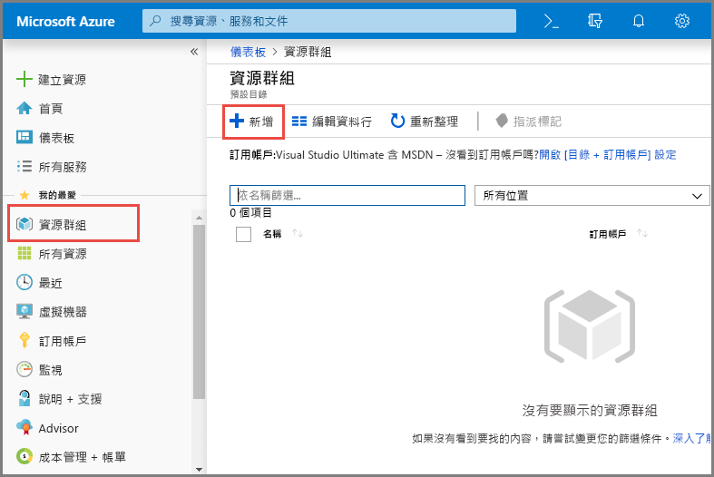
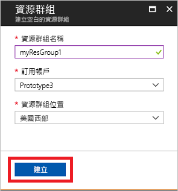
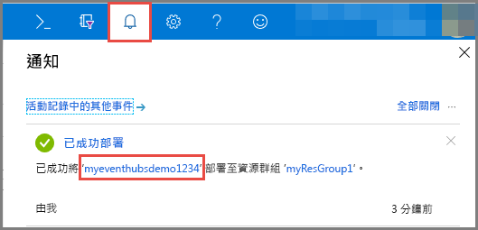
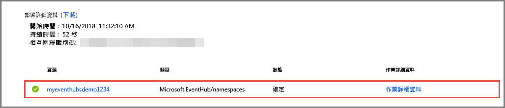
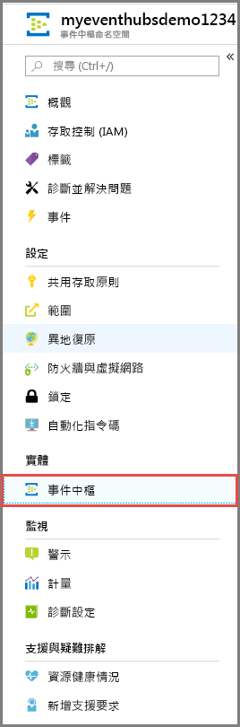
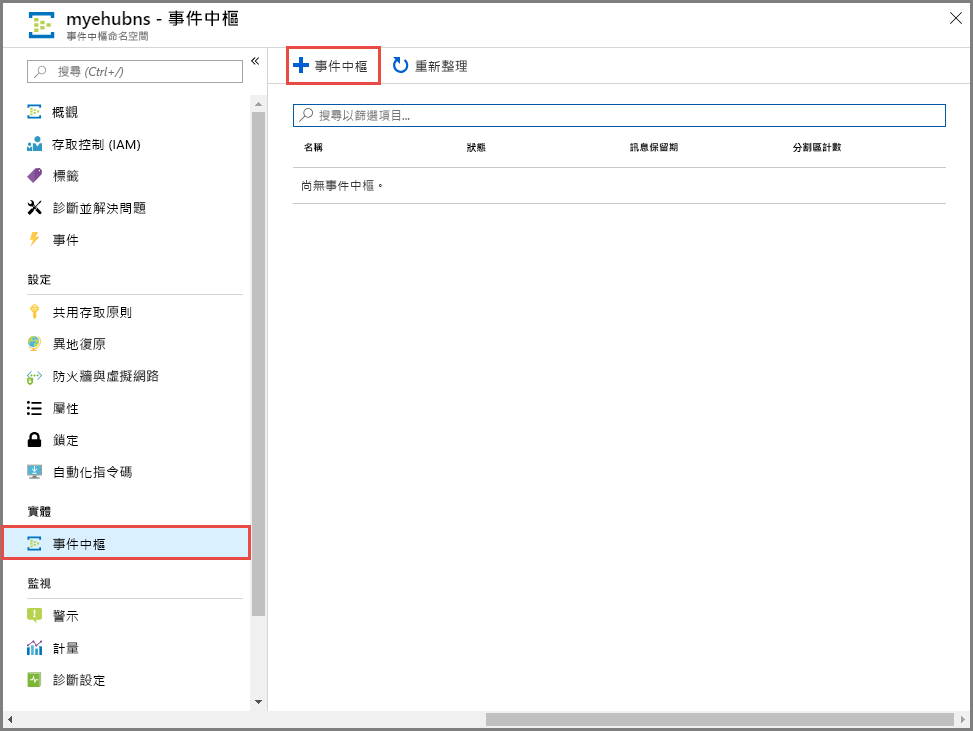
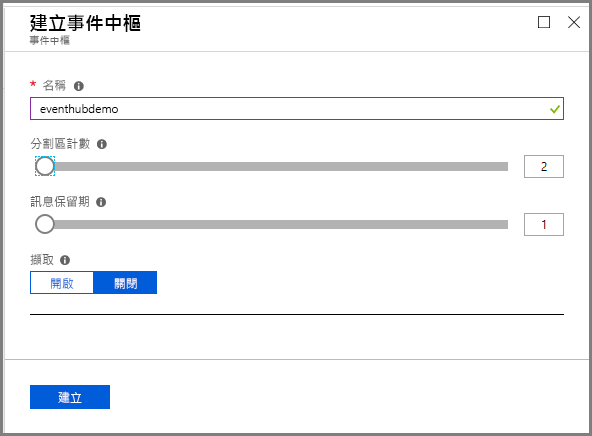

# 快速入門：使用 Azure 入口網站建立事件中樞
Azure 事件中樞是巨量資料串流平台和事件擷取服務，每秒可接收和處理數百萬個事件。 事件中樞可以處理及儲存分散式軟體和裝置所產生的事件、資料或遙測。 傳送至事件中樞的資料可以透過任何即時分析提供者或批次/儲存體配接器來轉換和儲存。 如需事件中樞的詳細概觀，請參閱[事件中樞概觀](event-hubs-about.md)和[事件中樞功能](event-hubs-features.md)。

在此快速入門中，您將使用 [Azure 入口網站](https://portal.azure.com)建立事件中樞。

## 必要條件

若要完成本快速入門，請確定您具備︰

- Azure 訂用帳戶。 如果您沒有 Azure 訂用帳戶，請在開始前[建立免費帳戶](https://azure.microsoft.com/free/)。
- [Visual Studio 2017 Update 3 (版本 15.3, 26730.01)](https://www.visualstudio.com/vs) 或更新版本。
- [.NET Standard SDK](https://www.microsoft.com/net/download/windows)，2.0 版或更新版本。

## 建立資源群組

資源群組是 Azure 資源的邏輯集合。 所有資源都會在資源群組中部署與管理。 執行下列動作來建立資源群組：

1. 登入 [Azure 入口網站](https://portal.azure.com)。
2. 在左側導覽中，按一下 [資源群組]。 然後按一下 [ **新增**]。

   

2. 輸入資源群組的唯一名稱。 系統會立即檢查名稱是否可用於目前選取的 Azure 訂用帳戶。

3. 在**訂用帳戶**中，按一下要在其中建立資源群組的 Azure 訂用帳戶名稱。

4. 選取資源群組的地理位置。

5. 按一下頁面底部的 [新增] 。

   

## 建立事件中樞命名空間

事件中樞命名空間提供唯一的範圍容器 (依其完整網域名稱來參考)，您可以在其中建立一或多個事件中樞。 若要使用入口網站在您的資源群組中建立命名空間，請執行下列動作：

1. 在 Azure 入口網站中，按一下畫面左上方的 [建立資源]。

2. 按一下 [物聯網]，然後按一下 [事件中樞]。

3. 在 [建立命名空間] 中，輸入命名空間名稱。 系統會立即檢查此名稱是否可用。

   

4. 確定命名空間名稱可用之後，請選擇定價層 ([基本] 或 [標準])。 此外，選擇要在其中建立資源的 Azure 訂用帳戶、資源群組和位置。
 
5. 按一下 [建立]  來建立命名空間。 您可能必須等候幾分鐘，讓系統完整佈建資源。
6. 選取 [警示]，然後選取與事件中樞命名空間同名的**部署**。 

   
6. 從部署中建立的資源清單中選取您的事件中樞命名空間。 

   
7. 在 [事件中樞命名空間] 頁面上，選取 [共用存取原則]，然後按一下 [RootManageSharedAccessKey]。
    
8. 按一下複製按鈕，將 **RootManageSharedAccessKey** 連接字串複製到剪貼簿。 將這個連接字串儲存在暫存位置，例如 [記事本]，供以日後使用。
    
## 建立事件中樞

若要在命名空間內建立事件中樞，請執行下列動作：

1. 在 [事件中樞命名空間] 頁面上，按一下 [事件中樞]。
   
    

1. 在視窗頂端，按一下 [+ 事件中樞]。
   
    
1. 輸入您的事件中樞名稱，然後按一下 [建立]。
   
    

恭喜！ 您已使用入口網站建立事件中樞命名空間和該命名空間內的事件中樞。 

## 後續步驟

在本文中，您已建立資源群組、事件中樞命名空間和事件中樞。 如需將事件傳送至事件中樞或從事件中樞接收事件的逐步指示，請參閱下列教學課程：  

- **將事件傳送至事件中樞**：[.NET Standard](event-hubs-dotnet-standard-getstarted-send.md)、[.NET Framework](event-hubs-dotnet-framework-getstarted-send.md)、[Java](event-hubs-java-get-started-send.md)、[Python](event-hubs-python-get-started-send.md)、[Node.js](event-hubs-node-get-started-send.md)、[Go](event-hubs-go-get-started-send.md)、[C](event-hubs-c-getstarted-send.md)
- **從事件中樞接收事件**：[.NET Standard](event-hubs-dotnet-standard-getstarted-receive-eph.md)、[.NET Framework](event-hubs-dotnet-framework-getstarted-receive-eph.md)、[Java](event-hubs-java-get-started-receive-eph.md)、[Python](event-hubs-python-get-started-receive.md)、[Node.js](event-hubs-node-get-started-receive.md)、[Go](event-hubs-go-get-started-receive-eph.md)、[Apache Storm](event-hubs-storm-getstarted-receive.md)

[Azure portal]: https://portal.azure.com/
[3]: ./media/event-hubs-quickstart-portal/sender1.png
[4]: ./media/event-hubs-quickstart-portal/receiver1.png
