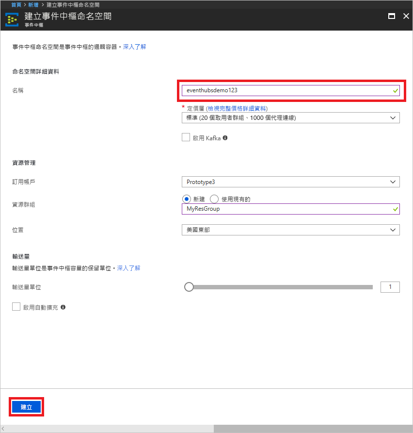
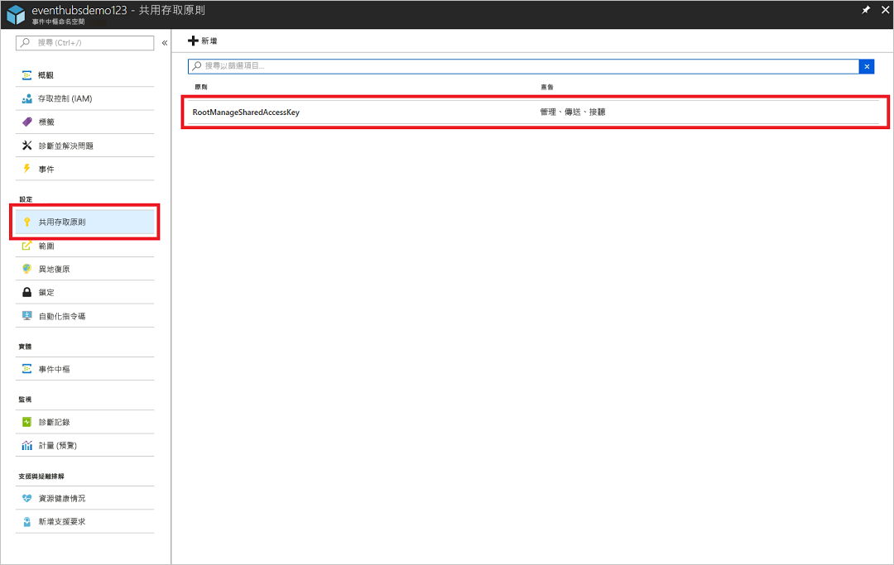

# 使用 Azure 入口網站來建立事件中樞命名空間和事件中樞

## 建立事件中樞命名空間

1. 登入 [Azure 入口網站][Azure portal]，然後按一下畫面左上方的 [建立資源]。
2. 按一下 [物聯網]，然後按一下 [事件中樞]。
   
    

3. 在 [建立命名空間] 中，輸入命名空間名稱。 系統會立即檢查此名稱是否可用。  

4. 確定命名空間名稱可用之後，請選擇定價層 ([基本] 或 [標準])。 此外，選擇要在其中建立資源的 Azure 訂用帳戶、資源群組和位置。
 
5. 按一下 [建立]  來建立命名空間。 您可能必須等候幾分鐘，讓系統完整佈建資源。

    

6. 在入口網站的命名空間清單中，按一下新建立的命名空間。

7. 按一下 [共用存取原則]，然後按一下 [RootManageSharedAccessKey]。
    
    

8. 按一下複製按鈕，將 **RootManageSharedAccessKey** 連接字串複製到剪貼簿。 將這個連接字串儲存在暫存位置，例如 [記事本]，供以日後使用。
    
    

## 建立事件中樞

1. 在事件中樞命名空間清單中，按一下新建立的命名空間。      
   
     

2. 在命名空間刀鋒視窗中，按一下 [事件中樞] 。
   
    

3. 在刀鋒視窗頂端，按一下 [+ 事件中樞] 。
   
    
4. 輸入您的事件中樞名稱，然後按一下 [建立]。 

現已建立事件中樞，您已具有傳送及接收事件所需的連接字串。

## 後續步驟

若要深入了解事件中樞，請造訪下列連結：

* [事件中心概觀](event-hubs-what-is-event-hubs.md)
* [事件中樞 API 概觀](event-hubs-api-overview.md)

[Azure portal]: https://portal.azure.com/