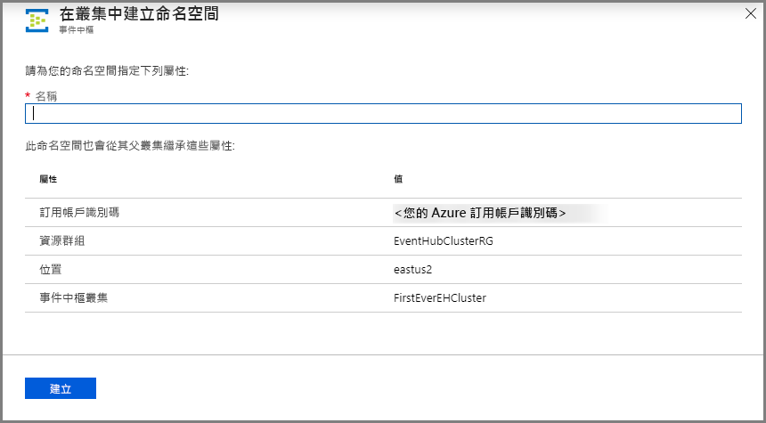

# 快速入門：使用 Azure 入口網站建立專用的事件中樞叢集 
事件中樞叢集可為有極嚴苛串流需求的客戶提供單一租用戶部署。 此供應項目可保證 99.99 % 的 SLA，且僅適用於專用定價層。 [事件中樞叢集](event-hubs-dedicated-overview.md)可在保證容量與提供亞秒延遲的情況下，每秒輸入數百萬個事件。 叢集內所建立的命名空間和事件中樞會包含標準供應項目以上的所有功能，但沒有任何輸入限制。 專案供應項目也包含熱門的[事件中樞擷取](event-hubs-capture-overview.md)功能，此功能完全免費，可讓您自動地對資料流進行批次處理並記錄至 [Azure Blob 儲存體](../storage/blobs/storage-blobs-introduction.md)或 [Azure Data Lake Storage Gen 1](../data-lake-store/data-lake-store-overview.md)。

專用叢集會依**容量單位 (CU)** (預先配置好數量的 CPU 和記憶體資源) 來佈建和計費。 您可以為每個叢集購買 1、2、4、8、12、16 或 20 個 CU。 在本快速入門中，我們將逐步引導您透過 Azure 入口網站建立 1 CU 事件中樞叢集。

> [!NOTE]
> 此自助式體驗目前在 [Azure 入口網站](https://aka.ms/eventhubsclusterquickstart)上提供預覽版。 如果您有任何關於專用供應項目的疑問，請連絡[事件中樞小組](mailto:askeventhubs@microsoft.com)。

## 必要條件
若要完成本快速入門，請確定您具備︰

- 一個 Azure 帳戶。 如果您沒有 Azure 帳戶，請先在開始前[購買帳戶](https://azure.microsoft.com/pricing/purchase-options/pay-as-you-go/)。 免費的 Azure 帳戶不支援此功能。 
- [Visual Studio](https://visualstudio.microsoft.com/vs/) 2017 Update 3 (版本 15.3, 26730.01) 或更新版本。
- [.NET Standard SDK](https://dotnet.microsoft.com/download)，2.0 版或更新版本。
- [建立資源群組](../event-hubs/event-hubs-create.md#create-a-resource-group)。

## 建立事件中樞專用叢集
事件中樞叢集提供唯一的範圍容器，您可以在其中建立一或多個命名空間。 在入口網站自助體驗的預覽階段，您可以在精選區域中建立 1 CU 叢集。 如果您需要大於 1 CU 的叢集，您可以在叢集建立後提交 Azure 支援要求來相應增加叢集。

若要使用 Azure 入口網站在資源群組中建立叢集，請完成下列步驟：

1. 遵循[此連結](https://aka.ms/eventhubsclusterquickstart)以在 Azure 入口網站上建立叢集。 相反地，選取左導覽窗格中的 [所有服務]  ，然後在搜尋列中輸入「事件中樞叢集」，並從結果清單中選取「事件中樞叢集」。
2. 在 [建立叢集]  頁面上，設定下列項目：
    1. 輸入**叢集的名稱**。 系統會立即檢查此名稱是否可用。
    2. 選取您要在其中建立叢集的**訂用帳戶**。
    3. 選取您要在其中建立叢集的**資源群組**。
    4. 選取叢集的**位置**。 如果您慣用的區域呈現灰色，則表示暫時無法使用，您可以提交[支援要求](#submit-a-support-request)給事件中樞小組。
    5. 選取頁面底部的 [下一步:  標記] 按鈕。 您可能必須等候幾分鐘，讓系統完整佈建資源。

        ![建立事件中樞叢集 - [基本資料] 頁面](./media/event-hubs-dedicated-cluster-create-portal/create-event-hubs-clusters-basics-page.png)
3. 在 [標記]  頁面上，設定下列項目：
    1. 為想要新增的標記輸入**名稱**和**值**。 此為**選用**步驟。  
    2. 選取 [檢閱 + 建立]  按鈕。

        ![[建立事件中樞叢集] 頁面 - [標記] 頁面](./media/event-hubs-dedicated-cluster-create-portal/create-event-hubs-clusters-tags-page.png)
4. 在 [檢閱 + 建立]  頁面上檢閱詳細資料，然後選取 [建立]  。 

    ![[建立事件中樞叢集] 頁面 - [檢閱 + 建立] 頁面](./media/event-hubs-dedicated-cluster-create-portal/create-event-hubs-clusters-review-create-page.png)

## 在叢集內建立命名空間和事件中樞

1. 若要在叢集內建立命名空間，請在叢集的 [事件中樞叢集]  頁面上，選取頂端功能表中的 [+命名空間]  。

    ![[叢集管理] 頁面 - [新增命名空間] 按鈕](./media/event-hubs-dedicated-cluster-create-portal/cluster-management-page-add-namespace-button.png)
2. 在 [建立命名空間] 頁面上，執行下列步驟：
    1. 輸入**命名空間的名稱**。  系統會檢查此名稱是否可用。
    2. 命名空間會繼承下列屬性：
        1. 訂用帳戶識別碼
        2. 資源群組
        3. 位置
        4. 叢集名稱
    3. 選取 [建立]  來建立命名空間。 現在，您可以管理叢集了。  

        
3. 命名空間建立好之後，您就可以[建立事件中樞](event-hubs-create.md#create-an-event-hub)，就和您一般會在命名空間內建立的一樣。 

## 提交支援要求

如果您想要在叢集建立後變更其大小，或如果您慣用的區域不適用，請依照下列步驟提交支援要求：

1. 在 [Azure 入口網站](https://portal.azure.com)中，選取左側功能表中的 [説明 + 支援]  。
2. 從 [支援] 功能表選取 [+ 新增支援要求]  。
3. 在支援頁面上，遵循下列步驟：
    1. 針對 [問題類型]  於下拉式清單中選取 [技術]  。
    2. 在 [訂用帳戶]  中，選取您的訂用帳戶。
    3. 針對 [服務]  選取 [我的服務]  ，然後選取 [事件中樞]  。
    4. 針對 [資源]  選取您的叢集 (如果其已經存在)，否則選取 [一般問題/資源無法使用]  。
    5. 針對 [問題類型]  選取 [配額]  。
    6. 針對 [問題子類型]  ，從下拉式清單中選取下列其中一個值：
        1. 選取 [要求專用 SKU]  以要求在您的區域中支援該功能。
        2. 如果您想要相應增加或相應減少專用叢集，請選取 [要求相應增加或相應減少專用叢集]  。 
    7. 針對 [主旨]  ，請描述問題。

        ![[支援票證] 頁面](./media/event-hubs-dedicated-cluster-create-portal/support-ticket.png)

 ## 刪除專用叢集
 
1. 若要刪除叢集，請從頂端功能表中選取 [刪除]  。 請注意，您的叢集在建立之後必須支付至少 4 小時的使用量。 
2. 隨即會出現訊息來確認您是否真的要刪除該叢集。
3. 輸入**叢集的名稱**，然後選取 [刪除]  來刪除叢集。

    ![[刪除叢集] 頁面](./media/event-hubs-dedicated-cluster-create-portal/delete-cluster-page.png)

## 後續步驟
在本文中，您已建立事件中樞叢集。 如需逐步指示以了解如何在事件中樞內傳送和接收事件，以及如何將事件擷取至 Azure 儲存體或 Azure Data Lake Store，請參閱下列教學課程：

- [在 .NET Core 上傳送和接收事件](event-hubs-dotnet-standard-getstarted-send.md)
- [使用 Azure 入口網站啟用事件中樞擷取](event-hubs-capture-enable-through-portal.md)
- [使用適用於 Apache Kafka 的 Azure 事件中樞](event-hubs-for-kafka-ecosystem-overview.md)
