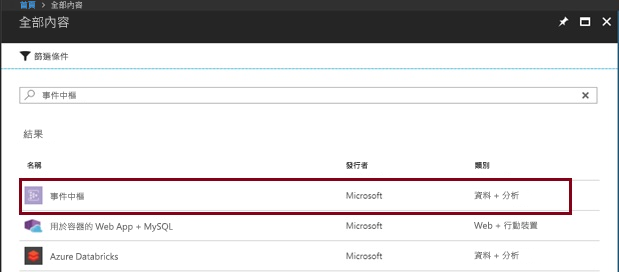
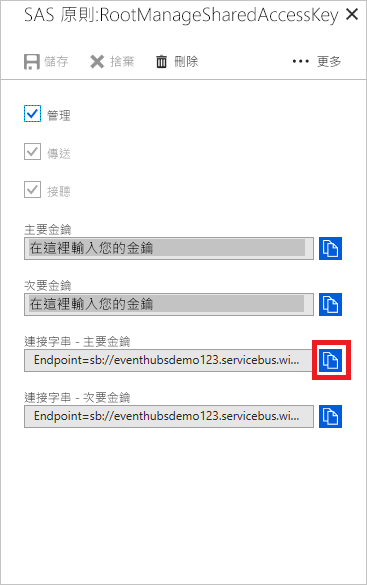

# <a name="stream-into-event-hubs-for-the-apache-kafka"></a>串流至適用於 Apache Kafka 的事件中樞
本快速入門說明如何串流至已啟用 Kafka 的事件中樞，而不需要變更通訊協定用戶端或執行您自己的叢集。 您將了解如何僅在應用程式中變更設定，就能讓產生者和取用者與已啟用 Kafka 的事件中樞交談。 Azure 事件中樞支援 [Apache Kafka 1.0 版](https://kafka.apache.org/10/documentation.html)。

> [!NOTE]
> 您可在 [GitHub](https://github.com/Azure/azure-event-hubs-for-kafka/tree/master/quickstart/java) 上取得此範例

## <a name="prerequisites"></a>必要條件

若要完成本快速入門，請確定您具備下列必要條件︰

* 請參閱[適用於 Apache Kafka 的事件中樞](event-hubs-for-kafka-ecosystem-overview.md)一文。
* Azure 訂用帳戶。 如果您沒有 Azure 訂用帳戶，請在開始前建立[免費帳戶](https://azure.microsoft.com/free/?ref=microsoft.com&utm_source=microsoft.com&utm_medium=docs&utm_campaign=visualstudio)。
* [Java Development Kit (JDK) 1.7+](http://www.oracle.com/technetwork/java/javase/downloads/index.html)。
* [下載](http://maven.apache.org/download.cgi)及[安裝](http://maven.apache.org/install.html) Maven 二進位封存檔。
* [Git](https://www.git-scm.com/)
* [已啟用 Kafka 的事件中樞命名空間](event-hubs-create.md)

## <a name="create-a-kafka-enabled-event-hubs-namespace"></a>建立已啟用 Kafka 的事件中樞命名空間

1. 登入 [Azure 入口網站][Azure 入口網站]，然後按一下畫面左上方的 [建立資源]。

2. 搜尋事件中樞，並選取選項，如下所示：
    
    
 
3. 提供唯一名稱並在命名空間上啟用 Kafka。 按一下頁面底部的 [新增] 。
    
    
 
4. 建立命名空間後，在 [設定] 索引標籤上，按一下 [共用存取原則] 以取得連接字串。

    ![按一下 [共用存取原則]](./media/event-hubs-create/create-event-hub7.png)

5. 您可以選擇預設的 **RootManageSharedAccessKey**，或新增新的原則。 按一下原則名稱並複製連接字串。 
    
    
 
6. 將連接字串新增到應用程式組態。

您現在可以將事件從使用 Kafka 通訊協定的應用程式串流到事件中樞。

## <a name="send-and-receive-messages-with-kafka-in-event-hubs"></a>使用事件中樞內的 Kafka 傳送及接收訊息

1. 複製[適用於 Kafka 的 Azure 事件中樞存放庫](https://github.com/Azure/azure-event-hubs-for-kafka)。

2. 瀏覽至 `azure-event-hubs-for-kafka/quickstart/java/producer`。

3. 在 `src/main/resources/producer.config` 中更新產生者的組態詳細資料，如下所示：

    ```xml
    bootstrap.servers={YOUR.EVENTHUBS.FQDN}:9093
    security.protocol=SASL_SSL
    sasl.mechanism=PLAIN
    sasl.jaas.config=org.apache.kafka.common.security.plain.PlainLoginModule required username="$ConnectionString" password="{YOUR.EVENTHUBS.CONNECTION.STRING}";
    ```
    
4. 執行產生者程式碼，並串流至已啟用 Kafka 的事件中樞：
   
    ```shell
    mvn clean package
    mvn exec:java -Dexec.mainClass="TestProducer"                                    
    ```
    
5. 瀏覽至 `azure-event-hubs-for-kafka/quickstart/java/consumer`。

6. 在 `src/main/resources/consumer.config` 中更新取用者的組態詳細資料，如下所示：
   
    ```xml
    bootstrap.servers={YOUR.EVENTHUBS.FQDN}:9093
    security.protocol=SASL_SSL
    sasl.mechanism=PLAIN
    sasl.jaas.config=org.apache.kafka.common.security.plain.PlainLoginModule required username="$ConnectionString" password="{YOUR.EVENTHUBS.CONNECTION.STRING}";
    ```

7. 執行取用者程式碼，並使用 Kafka 用戶端從已啟用 Kafka 的事件中樞進行處理：

    ```java
    mvn clean package
    mvn exec:java -Dexec.mainClass="TestConsumer"                                    
    ```

如果事件中樞 Kafka 叢集包含事件，您現在應該會開始從取用者接收到這些事件。

## <a name="next-steps"></a>後續步驟
在本文中，您已了解如何串流至已啟用 Kafka 的事件中樞，而不需要變更通訊協定用戶端或執行您自己的叢集。 若要深入了解，請繼續下列教學課程：

* [了解事件中樞](event-hubs-what-is-event-hubs.md)
* [了解適用於 Kafka 的事件中樞](event-hubs-for-kafka-ecosystem-overview.md)
* [在適用於 Kafka 的事件中樞上探索更多範例 (GitHub)](https://github.com/Azure/azure-event-hubs-for-kafka)
* 使用 [MirrorMaker](https://cwiki.apache.org/confluence/pages/viewpage.action?pageId=27846330)，[將事件從 Kafka 內部部署串流至雲端上已啟用 Kafka 的事件中樞](event-hubs-kafka-mirror-maker-tutorial.md)。
* 了解如何使用 [Apache Flink](event-hubs-kafka-flink-tutorial.md) 或 [Akka Streams](event-hubs-kafka-akka-streams-tutorial.md) 串流至已啟用 Kafka 的事件中樞。
