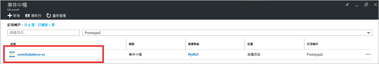
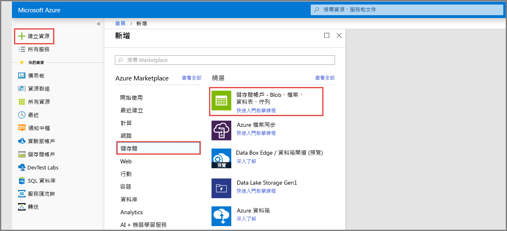
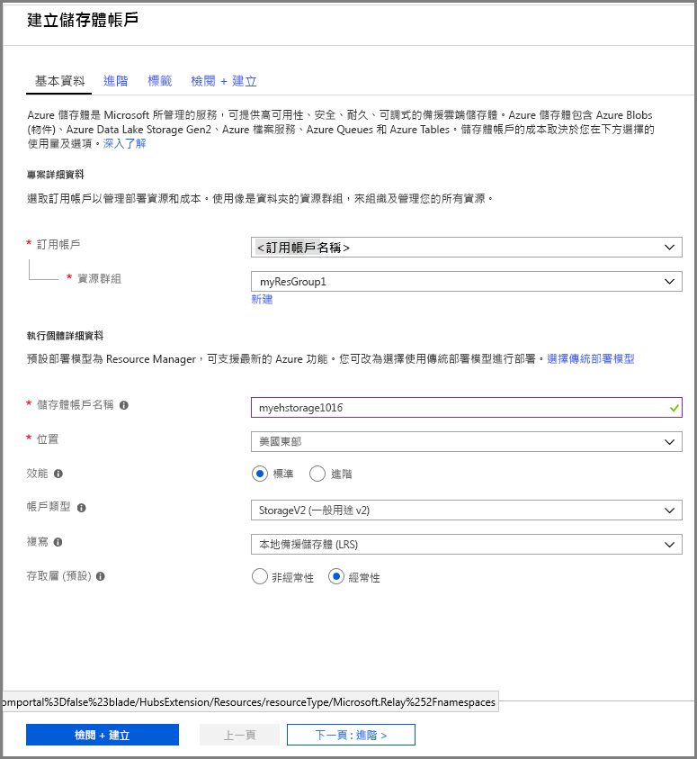
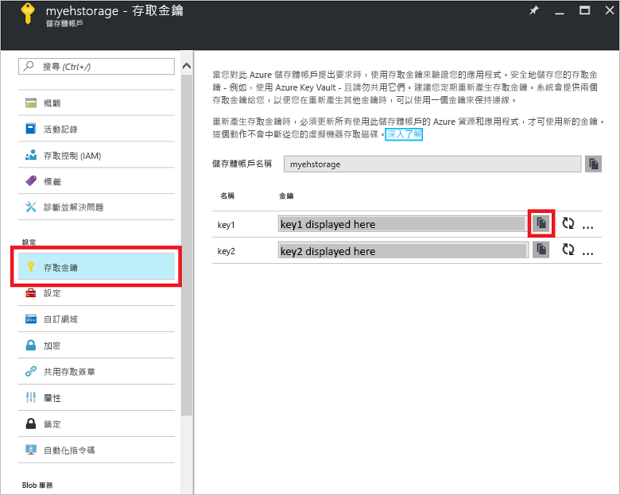

# 快速入門：使用 Azure 入口網站建立事件中樞

Azure 事件中樞是可高度調整的資料串流平台和擷取服務，每秒可接收和處理數百萬個事件。 本快速入門將示範如何使用 [Azure 入口網站](https://portal.azure.com)建立事件中樞，然後使用 .NET Standard SDK 在事件中樞中進行傳送和接收。

若要完成本快速入門，您需要 Azure 訂用帳戶。 如果您沒有 Azure 訂用帳戶，請在開始前[建立免費帳戶][]。

## 必要條件

若要完成本快速入門，請確定您具備︰

- [Visual Studio 2017 Update 3 (版本 15.3, 26730.01)](http://www.visualstudio.com/vs) 或更新版本。
- [.NET Standard SDK](https://www.microsoft.com/net/download/windows)，2.0 版或更新版本。

## 建立資源群組

資源群組是 Azure 資源的邏輯集合。 所有資源都會在資源群組中部署與管理。 執行下列動作來建立資源群組：

1. 在左側導覽中，按一下 [資源群組]。 然後按一下 [ **新增**]。

   ![][1]

2. 輸入資源群組的唯一名稱。 系統會立即檢查名稱是否可用於目前選取的 Azure 訂用帳戶。

3. 在**訂用帳戶**中，按一下要在其中建立資源群組的 Azure 訂用帳戶名稱。

4. 選取資源群組的地理位置。

5. 按一下頁面底部的 [新增] 。

   ![][2]

## 建立事件中樞命名空間

事件中樞命名空間提供唯一的範圍容器 (依其完整網域名稱來參考)，您可以在其中建立一或多個事件中樞。 若要使用入口網站在您的資源群組中建立命名空間，請執行下列作業：

1. 登入 [Azure 入口網站][]，然後按一下畫面左上方的 [建立資源]。

2. 按一下 [物聯網]，然後按一下 [事件中樞]。

3. 在 [建立命名空間] 中，輸入命名空間名稱。 系統會立即檢查此名稱是否可用。

   

4. 確定命名空間名稱可用之後，請選擇定價層 ([基本] 或 [標準])。 此外，選擇要在其中建立資源的 Azure 訂用帳戶、資源群組和位置。
 
5. 按一下 [建立]  來建立命名空間。 您可能必須等候幾分鐘，讓系統完整佈建資源。

6. 在入口網站的命名空間清單中，按一下新建立的命名空間。

7. 按一下 [共用存取原則]，然後按一下 [RootManageSharedAccessKey]。
    
8. 按一下複製按鈕，將 **RootManageSharedAccessKey** 連接字串複製到剪貼簿。 將這個連接字串儲存在暫存位置，例如 [記事本]，供以日後使用。
    
## 建立事件中樞

若要在命名空間內建立事件中樞，請執行下列作業：

1. 在事件中樞命名空間清單中，按一下新建立的命名空間。      
   
     

2. 在命名空間視窗中，按一下 [事件中樞] 。
   
    

1. 在視窗頂端，按一下 [+新增事件中樞]。
   
    
1. 輸入您的事件中樞名稱，然後按一下 [建立]。
   
    

恭喜！ 您已使用入口網站建立事件中樞命名空間和該命名空間內的事件中樞。

## 建立事件處理器主機的儲存體帳戶

事件處理器主機是一個智慧型代理程式，透過管理持續檢查點以及平行接收，簡化來自事件中樞的事件接收作業。 若要使用檢查點，事件處理器主機需要儲存體帳戶。 下列範例會示範如何建立儲存體帳戶，以及如何取得其存取金鑰：

1. 登入 [Azure 入口網站][Azure 入口網站]，然後按一下畫面左上方的 [新增]。

2. 按一下 [儲存體]，然後按一下 [儲存體帳戶]。
   
    

3. 在 [建立儲存體帳戶]中，輸入儲存體帳戶名稱。 選擇要在其中建立資源的 Azure 訂用帳戶、資源群組和位置。 接著，按一下 [建立]。
   
    

4. 在儲存體帳戶清單中，按一下新建立的儲存體帳戶。

5. 在 [儲存體帳戶] 視窗中，按一下 [存取金鑰]。 複製 **key1** 的值以便稍後使用。
   
    

## 下載及執行範例

下一個步驟是執行範例程式碼，以將事件傳送至事件中樞，並使用事件處理器主機接收這些事件。 

首先，從 GitHub 下載 [SampleSender](https://github.com/Azure/azure-event-hubs/tree/master/samples/DotNet/Microsoft.Azure.EventHubs/SampleSender) 和 [SampleEphReceiver](https://github.com/Azure/azure-event-hubs/tree/master/samples/DotNet/Microsoft.Azure.EventHubs/SampleEphReceiver)，或是複製 [azure-event-hubs repo](https://github.com/Azure/azure-event-hubs)。

### 傳送者

1. 開啟 Visual Studio，從 [檔案] 功能表中，按一下 [開啟]，然後按一下 [專案/解決方案]。

2. 找出先前下載的 **SampleSender** 範例資料夾，然後按兩下 SampleSender.sln 檔案來將專案載入 Visual Studio 中。

3. 在 [方案總管] 中，按兩下 Program.cs 以在 Visual Studio 編輯器中開啟此檔案。

4. 以您在建立命名空間時取得的連接字串取代 `EventHubConnectionString` 值。

5. 以您在該命名空間內建立的事件中樞名稱取代 `EventHubName`。

6. 從 [建置] 功能表中，按一下 [建置方案] 以確定沒有任何錯誤。

### 接收者

1. 開啟 Visual Studio，從 [檔案] 功能表中，按一下 [開啟]，然後按一下 [專案/解決方案]。

2. 找出步驟 1 中下載的 **SampleEphReceiver** 範例資料夾，然後按兩下 SampleEphReceiver.sln 檔案來將專案載入 Visual Studio 中。

3. 在 [方案總管] 中，按兩下 Program.cs 以在 Visual Studio 編輯器中開啟此檔案。

4. 取代下列變數值：
    1. `EventHubConnectionString`：以您在建立命名空間時取得的連接字串取代。
    2. `EventHubName`：以您在該命名空間內建立的事件中樞名稱取代。
    3. `StorageContainerName`：儲存體容器的名稱。 為容器提供唯一名稱，當您執行應用程式時，系統就會為您建立容器。
    4. `StorageAccountName`：您建立的儲存體帳戶名稱。
    5. `StorageAccountKey`：從 Azure 入口網站取得的儲存體帳戶金鑰。

5. 從 [建置] 功能表中，按一下 [建置方案] 以確定沒有任何錯誤。

### 執行應用程式

首先，執行 **SampleSender** 應用程式，並觀察正在傳送的 100 則訊息。 按下 [Enter] 可結束程式。

![][3]

然後，執行 **SampleEphReceiver** 應用程式，並觀察事件處理器主機正在接收的訊息。

![][4]
 
## 清除資源

您可以使用入口網站移除儲存體帳戶、命名空間和事件中樞。 

1. 在 Azure 入口網站的左側窗格中，按一下 [所有資源]。 
2. 按一下要刪除的儲存體帳戶或命名空間。 刪除命名空間時，也會移除其內部的任何事件中樞。
3. 在畫面頂端的功能表列上，按一下 [刪除]。 確認刪除。 

## 後續步驟

在本文中，您已建立從事件中樞傳送和接收事件所需的事件中樞命名空間和其他資源。 若要深入了解，請繼續下列教學課程：

> [!div class="nextstepaction"]
> [在事件中樞資料流上將資料異常視覺化](event-hubs-tutorial-visualize-anomalies.md)

[建立免費帳戶]: https://azure.microsoft.com/free/?ref=microsoft.com&utm_source=microsoft.com&utm_medium=docs&utm_campaign=visualstudio
[Azure 入口網站]: https://portal.azure.com/
[1]: ./media/event-hubs-quickstart-portal/resource-groups1.png
[2]: ./media/event-hubs-quickstart-portal/resource-groups2.png
[3]: ./media/event-hubs-quickstart-portal/sender1.png
[4]: ./media/event-hubs-quickstart-portal/receiver1.png
