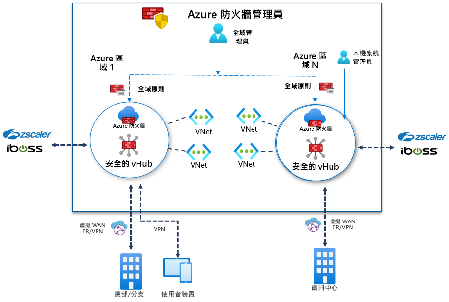

# 什麼是 Azure 防火牆管理員預覽？

[!INCLUDE [Preview](../../includes/firewall-manager-preview-notice.md)]

Azure 防火牆管理員預覽是一種安全性管理服務，能為雲端式安全性周邊提供集中的安全性原則及路由管理。 它適用於 [Azure 虛擬 WAN 中樞](../virtual-wan/virtual-wan-about.md#resources)，這是一項由 Microsoft 管理的資源，可讓您輕鬆建立中樞和輪輻架構。 當安全性和路由原則與這類中樞相關聯時，我們即稱之為 *[安全虛擬中樞](secured-virtual-hub.md)* 。 

## Azure 防火牆管理員預覽功能

Azure 防火牆管理員預覽提供下列功能：

### 集中的 Azure 防火牆部署和設定

您可以集中部署及設定多個跨不同 Azure 區域和訂用帳戶的 Azure 防火牆執行個體。 

### 階層式原則 (全域和本機)

您可以使用 Azure 防火牆管理員預覽，跨多個受保護的虛擬中樞集中管理 Azure 防火牆原則。 您的中央 IT 小組可以撰寫全域防火牆原則，以在多個小組間強制執行全組織的防火牆原則。 在本機撰寫的防火牆原則可讓 DevOps 自助模型獲得更高的靈活性。

### 與第三方安全性即服務整合，以獲得進階安全性

除了 Azure 防火牆之外，您還可以整合第三方安全性即服務 (SECaaS) 提供者，為您的 VNet 和分支網際網路連線提供額外的網路保護。

- VNet 對網際網路 (V2I) 流量篩選

   - 使用您慣用的第三方安全性提供者來篩選輸出虛擬網路流量。
   - 針對在 Azure 上執行的雲端工作負載，使用進階使用者感知網際網路保護。

- 分支對網際網路 (B2I) 流量篩選

   利用您的 Azure 連線和全域散發，輕鬆地為分支對網際網路案例新增第三方篩選。

如需關於信任的安全性提供者的詳細資訊，請參閱[什麼是 Azure 防火牆管理員信任的安全性合作夥伴 (預覽)？](trusted-security-partners.md)

### 集中式路由管理

輕鬆地將流量路由傳送到安全中樞以進行篩選和記錄，而無須在輪輻虛擬網路上手動設定使用者定義路由 (UDR)。 您可以使用第三方提供者進行分支對網際網路 (B2I) 流量篩選，且此篩選可以與分支對 VNet (B2V)、VNet 對 VNet (V2V) 和 VNet 對網際網路 (V2I) 的 Azure 防火牆並存。 如果 B2V 或 V2V 不需要 Azure 防火牆，您也可以使用第三方提供者進行 V2I 流量篩選。 

## 區域可用性

公開預覽支援下列區域：

- 歐洲西部、歐洲北部、法國中部、法國南部、英國南部、英國西部
- 澳大利亞東部、澳大利亞中部、澳大利亞中部 2、澳大利亞東南部
- 加拿大中部
- 美國東部、美國西部、美國東部 2、美國中南部、美國西部 2、美國中部、美國中北部、美國中西部

Azure 防火牆原則只能在這些區域中建立，但可跨區域使用。 例如，您可以在美國西部建立原則，並將其用於美國東部。 

## 已知問題

Azure 防火牆管理員預覽有下列已知問題：

|問題  |說明  |緩和  |
|---------|---------|---------|
|不支援手動建立的中央 Vnet|目前，Azure 防火牆管理員支援使用虛擬中樞建立的網路。 尚不支援使用您自己手動建立的中樞 VNet。|目前，請搭配使用 Azure 防火牆管理員與使用虛擬中樞建立的中樞和輪輻網路。 正在修正。
|第三方篩選限制|不支援將第三方提供者的 V2I 流量篩選與 Azure 防火牆 B2V 和 V2V 搭配使用。|目前正在調查中。|
|目前不支援流量分割|目前不支援 Office 365 和 Azure 公用 PaaS 流量分割。 因此，若為 V2I 或 B2I 選取第三方提供者，也會透過合作夥伴服務傳送所有的 Azure 公用 PaaS 和 Office 365 流量。|目前正在調查中樞的流量分割。
|每個區域一個中樞|每個區域不能有超過一個中樞|在區域中建立多個虛擬 WAN。|
|基本原則必須位於與本機原則相同的區域中|在與基底原則相同的區域中建立您所有的本機原則。 您仍可將在某個區域中建立的原則套用到另一個區域的安全中樞上。|目前正在調查中。|
|安全虛擬中樞無法執行中樞間通訊|目前尚不支援安全虛擬中樞對安全虛擬中樞的通訊。|目前正在調查中。|
|所有共用相同虛擬 WAN 的安全虛擬中樞，都必須位於相同的資源群組中。|此行為與現今的虛擬 WAN 中樞一致。|建立多個虛擬 WAN，以允許在不同的資源群組中建立安全虛擬中樞。|

## 後續步驟

- 檢閱 [Azure 防火牆管理員預覽部署概觀](deployment-overview.md)
- 了解[安全虛擬中樞](secured-virtual-hub.md)。