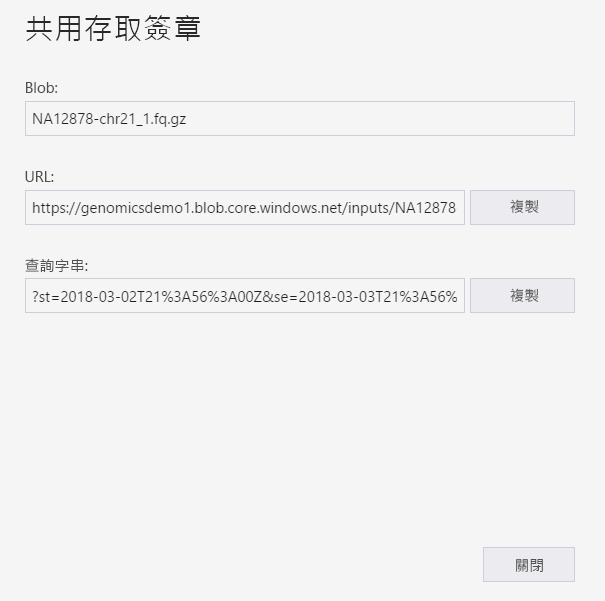
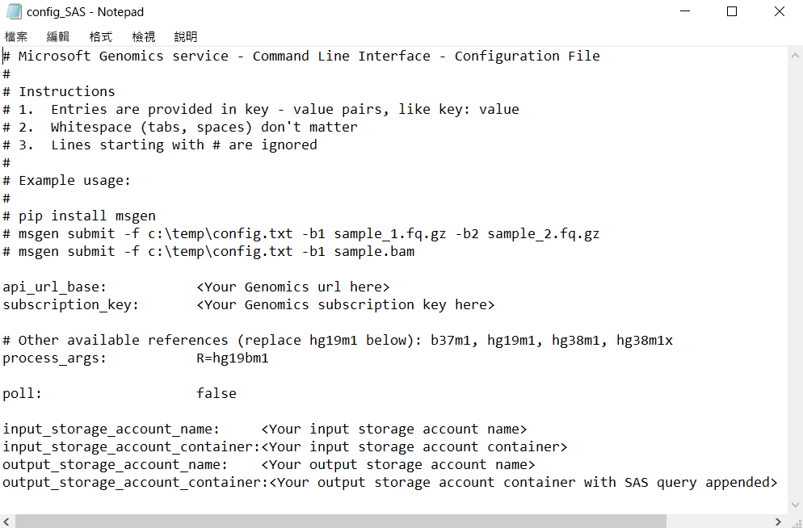

# <a name="submit-a-workflow-to-microsoft-genomics-using-a-sas-instead-of-a-storage-account-key"></a>使用 SAS (而非儲存體帳戶金鑰) 將工作流程提交到 Microsoft Genomics 

此快速入門示範如何使用包含[共用存取簽章 (SAS)](https://docs.microsoft.com/azure/storage/common/storage-dotnet-shared-access-signature-part-1)的 config.txt 檔案 (而非儲存體帳戶金鑰)，將工作流程提交到 Microsoft Genomics 服務。 如果對於在 config.txt 檔案中看得見儲存體帳戶金鑰有安全性疑慮，此功能很有用。 此文章假設您已安裝並執行 `msgen` 用戶端，且熟悉如何使用 Azure 儲存體。 如果您已使用提供的範例資料成功地提交工作流程，即準備好繼續進行此快速入門。 

## <a name="what-is-a-sas"></a>什麼是 SAS？
[共用存取簽章 (SAS)](https://docs.microsoft.com/azure/storage/common/storage-dotnet-shared-access-signature-part-1) 可提供您儲存體帳戶中資源的委派存取。 透過 SAS，您可以對用戶端授與儲存體帳戶中資源的存取權，而不必共用帳戶金鑰。 這是在您應用程式中使用共用存取簽章的重點 - SAS 是共用儲存體資源的安全方式，而不會危害您的帳戶金鑰。

提交到 Microsoft Genomics 的 SAS 應該是[服務 SAS](https://docs.microsoft.com/rest/api/storageservices/Constructing-a-Service-SAS)，它只會將存取權委派給輸入和輸出檔案儲存所在的 blob 或容器。 

服務等級共用存取簽章 (SAS) 權杖的 URI 包含 SAS 將委派存取權之資源的 URI，後面接著 SAS 權杖。 SAS 權杖是一個查詢字串，其中包含驗證 SAS 以及指定資源所需的所有資訊、可供存取的權限、簽章的有效時間間隔、提出要求的支援 IP 位址或位址範圍、用於進行要求的支援通訊協定、與要求相關聯的選擇性存取原則識別碼，以及簽章本身。 

## <a name="sas-needed-for-submitting-a-workflow-to-the-microsoft-genomics-service"></a>將工作流程提交到 Microsoft Genomics 服務時所需的 SAS
提交到 Microsoft Genomics 服務的每個工作流程都需要兩個或多個 SAS 權杖，一個用於每個輸入檔案，一個用於輸出容器。

輸入檔案的 SA 應該具有下列屬性：
1.  範圍 (帳戶、容器、blob)：blob
2.  到期時間：現在起 48 小時
3.  權限：讀取

輸出容器的 SAS 應該具有下列屬性：
1.  範圍 (帳戶、容器、blob)：容器
2.  到期時間：現在起 48 小時
3.  權限：讀取、寫入、刪除


## <a name="create-a-sas-for-the-input-files-and-the-output-container"></a>建立輸入檔案的 SAS 和輸出容器
建立 SAS 權杖有兩種方式：使用 Azure 儲存體總管或以程式設計方式。  如果撰寫程式碼，您可以自行建構 SAS，或在您慣用的語言中使用 Azure 儲存體 SDK。


### <a name="set-up-create-a-sas-using-azure-storage-explorer"></a>設定：使用 Azure 儲存體總管建立 SAS

[Azure 儲存體總管](https://azure.microsoft.com/features/storage-explorer/)是一個工具，可管理您儲存在 Azure 儲存體中的資源。  您可以在[這裡](https://docs.microsoft.com/azure/vs-azure-tools-storage-manage-with-storage-explorer)進一步了解如何使用 Azure 儲存體總管。

輸入檔案的 SAS 應受限於特定輸入檔案 (blob)。 若要建立 SAS 權杖，請遵循[這些指示](https://docs.microsoft.com/azure/storage/blobs/storage-quickstart-blobs-storage-explorer#work-with-shared-access-signatures)。 建立 SAS 後，會提供包含查詢字串的完整 URL 以及其本身的查詢字串，並可從畫面中複製。

 


### <a name="set-up-create-a-sas-programattically"></a>設定：以程式設計方式建立 SAS

若要使用 Azure 儲存體 SDK 建立 SAS，請參閱數種語言的現有文件 (包括 [.NET](https://docs.microsoft.com/azure/storage/blobs/storage-dotnet-shared-access-signature-part-2#generate-a-shared-access-signature-uri-for-a-blob)、[Python](https://docs.microsoft.com/azure/storage/blobs/storage-python-how-to-use-blob-storage) 和 [Node.js](https://docs.microsoft.com/azure/storage/blobs/storage-nodejs-how-to-use-blob-storage#work-with-shared-access-signatures))。 

若要在不使用 SDK 的情況下建立 SAS，可以直接建構 SAS 查詢字串，包括驗證 SAS 所需的所有資訊。 這些[指示](https://docs.microsoft.com/rest/api/storageservices/constructing-a-service-sas)詳細說明 SAS 查詢字串的元件，以及如何建構它。 如這些[指示](https://docs.microsoft.com/rest/api/storageservices/service-sas-examples)所述，使用 blob/容器驗證資訊，藉由產生 HMAC 來建立必要的 SAS 簽章。


## <a name="add-the-sas-to-the-configtxt-file"></a>將 SAS 新增至 config.txt 檔案
若要使用 SAS 查詢字串透過 Microsoft Genomics 服務來執行工作流程，可編輯 config.txt 檔案，以從 config.txt 檔案中移除金鑰。 然後，將 SAS 查詢字串 (開頭為`?`) 附加至輸出容器名稱，如下所示。 



使用 Microsoft Genomics Python 用戶端搭配下列命令來提交工作流程，並將對應的 SAS 查詢字串附加至每個輸入 Blob 名稱：

```python
msgen submit -f [full path to your config file] -b1 [name of your first paired end read file, SAS query string appended] -b2 [name of your second paired end read file, SAS query string appended]
```

### <a name="if-adding-the-input-file-names-to-the-configtxt-file"></a>如果將輸入檔案名稱新增至 config.txt 檔案
或者，可以將雙端 (paired end) 讀取檔案的名稱直接新增至 config.txt 檔案，並如下所示附加 SAS 查詢權杖：


在此情況下，使用 Microsoft Genomics Python 用戶端搭配下列命令來提交工作流程，並省略 `-b1` 和 `-b2` 命令：

```python
msgen submit -f [full path to your config file] 
```

## <a name="next-steps"></a>後續步驟
在此文章中，您已使用 SAS 權杖 (而非帳戶金鑰)，透過 `msgen` Python 用戶端將工作流程提交到 Microsoft Genomics 服務。 如需有關工作流程提交以及可與 Microsoft Genomics 服務搭配使用之其他命令的詳細資訊，請參閱我們的[常見問題集](frequently-asked-questions-genomics.md)。 
