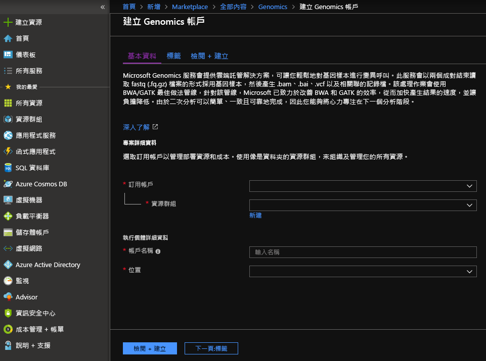
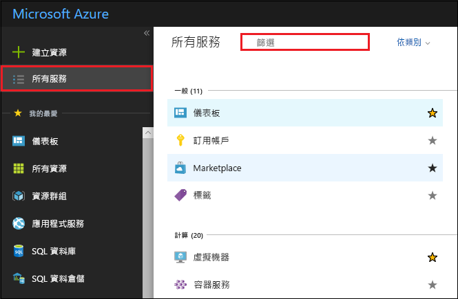
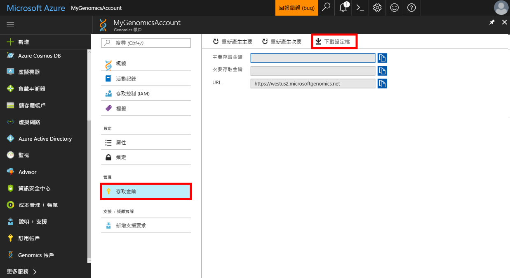

# <a name="quickstart-run-a-workflow-through-the-microsoft-genomics-service"></a>快速入門：透過 Microsoft Genomics 服務執行工作流程

此快速入門示範如何將輸入資料載入 Azure Blob 儲存體中，並透過 Microsoft Genomics 服務執行工作流程。 Microsoft Genomics 是用於基因組次級分析的可調式安全服務，可快速處理基因組，從原始讀取開始，並產生對齊的讀取和變數呼叫。 

只需幾個步驟就可開始使用： 
1.  設定：透過 Azure 入口網站建立 Microsoft Genomics 帳戶，並在本機環境中安裝 Microsoft Genomics Python 用戶端。 
2.  上傳輸入資料：透過 Azure 入口網站建立 Microsoft Azure 儲存體帳戶，並上傳輸入檔案。 必須配對並讀取輸入檔案 (fastq 或 bam 檔案)。
3.  執行：使用 Microsoft Genomics 命令列介面，透過 Microsoft Genomics 服務執行工作流程。 

如需有關 Microsoft Genomics 的詳細資訊，請參閱[什麼是 Microsoft Genomics？](overview-what-is-genomics.md)

## <a name="set-up-create-a-microsoft-genomics-account-in-the-azure-portal"></a>設定：在 Azure 入口網站中建立 Microsoft Genomics 帳戶

若要建立 Microsoft Genomics 帳戶，請瀏覽至 [Azure 入口網站](https://portal.azure.com/#create/Microsoft.Genomics)。 如果您還沒有 Azure 訂用帳戶，請在建立 Microsoft Genomics 帳戶之前先建立一個。 




使用下列資訊設定 Genomics 帳戶，如上圖所示。 

 |**設定**          |  **建議的值**  | **欄位描述** |
 |:-------------       |:-------------         |:----------            |
 |帳戶名稱         | MyGenomicsAccount     |請選擇唯一的帳戶識別碼。 如需有效的名稱，請參閱[命名規則](https://docs.microsoft.com/azure/architecture/best-practices/naming-conventions) |
 |訂用帳戶         | 您的訂用帳戶名稱|這是您 Azure 服務的計費單位 - 如需關於您訂用帳戶的詳細資訊，請參閱[訂用帳戶](https://account.azure.com/Subscriptions) |      
 |資源群組       | MyResourceGroup       |  資源群組可讓您將多個 Azure 資源 (儲存體帳戶、Genomics 帳戶等) 群組為單一群組來簡化管理。 如需詳細資訊，請參閱 [資源群組] (https://docs.microsoft.com/azure/azure-resource-manager/resource-group-overview#resource-groups)。 如需有效的資源群組名稱，請參閱[命名規則](https://docs.microsoft.com/azure/architecture/best-practices/naming-conventions) |
 |位置                   | 美國西部 2                    |    可在美國西部 2、西歐和東南亞提供服務 |


您可以按一下頂端功能表列中的 [通知] 來監視部署程序。


## <a name="set-up-install-the-microsoft-genomics-python-client"></a>設定：安裝 Microsoft Genomics Python 用戶端

使用者必須在其本機環境中安裝 Python 和 Microsoft Genomics Python 用戶端。 

### <a name="install-python"></a>安裝 Python

Microsoft Genomics Python 用戶端與 Python 2.7 相容。 12 或更新的 2.7.xx 版本；2.7.15 是撰寫此文章時的最新版本；2.7.14 是建議的版本。 您可以在[這裡](https://www.python.org/downloads/)找到下載。 

注意：Python 3.x 與 Python 2.7.xx 不相容。  MSGen 是 Python 2.7 應用程式。 執行 MSGen 時，請確定您作用中的 Python 環境使用的是 Python 的 2.7.xx 版本。 嘗試搭配使用 MSGen 與 Python 的 3.x 版時，可能會發生錯誤。


### <a name="install-the-microsoft-genomics-client"></a>安裝 Microsoft Genomics 用戶端

使用 Python pip 來安裝 Microsoft Genomics 用戶端 `msgen`。 下列指示假設 Python 已在您的系統路徑中。 如果您遇到 pip 安裝無法辨識的問題，必須將 Python 和指令碼子資料夾新增至您的系統路徑。


```
pip install --upgrade --no-deps msgen
pip install msgen
```


如果您不需要安裝 `msgen` 作為全系統的二進位及修改全系統的 Python 套件，請使用 `–-user` 旗標與 `pip`。
如果您使用的是以套件為基礎的安裝或 setup.py，就已安裝所有必要套件。 否則，msgen 的基本必要套件為 

 * [Azure-storage](https://pypi.python.org/pypi/azure-storage)。 
 * [要求](https://pypi.python.org/pypi/requests)。 


您可以使用 `pip`、`easy_install` 或透過標準 `setup.py` 程序來安裝這些套件。 


### <a name="test-the-microsoft-genomics-client"></a>測試 Microsoft Genomics 用戶端
若要測試 Microsoft Genomics 用戶端，請從 Genomics 帳戶下載設定檔。 按一下左上方的 [所有服務]、進行篩選，然後選取 Genomics 帳戶，即可瀏覽至 Genomics 帳戶。





選取您剛建立的 Genomics 帳戶，瀏覽至 [存取金鑰]，並下載設定檔。




測試 Microsoft Genomics Python 用戶端可使用下列命令


```
msgen list -f “<full path where you saved the config file>”
```

## <a name="create-a-microsoft-azure-storage-account"></a>建立 Microsoft Azure 儲存體帳戶 
Microsoft Genomics 服務預期會輸入儲存為 Azure 儲存體帳戶中的區塊 blob。 它也會將輸出檔案作為區塊 Blob 寫入 Azure 儲存體帳戶中的使用者指定容器。 輸入和輸出可以位於不同的儲存體帳戶中。
如果您在 Azure 儲存體帳戶中已擁有您的資料，就只需要確定資料與 Genomics 帳戶在相同的位置。 否則，執行 Genomics 服務時，就會產生輸出費用。 如果您還沒有 Microsoft Azure 儲存體帳戶，就需要建立並上傳您的資料。 您可以在[這裡](https://docs.microsoft.com/azure/storage/common/storage-create-storage-account)找到更多 Azure 儲存體帳戶的相關資訊，包括儲存體帳戶的說明，以及它所提供的服務。 若要建立 Microsoft Azure 儲存體帳戶，請瀏覽至 [Azure 入口網站](https://portal.azure.com/#create/Microsoft.StorageAccount-ARM )。  


使用下列資訊設定儲存體帳戶，如上圖所示。 使用儲存體帳戶的大部分標準選項，僅將帳戶指定為 blob 儲存體，而非一般用途。 Blob 儲存體的下載及上傳速度可能快 2-5 倍。 


 |**設定**          |  **建議的值**  | **欄位描述** |
 |:-------------------------       |:-------------         |:----------            |
 |名稱         | MyStorageAccount     |請選擇唯一的帳戶識別碼。 如需有效的名稱，請參閱[命名規則](https://docs.microsoft.com/azure/architecture/best-practices/naming-conventions) |
 |部署模型         | Resource Manager| Resource Manager 是建議的部署模型。 如需詳細資訊，請參閱[了解資源管理員部署](https://docs.microsoft.com/azure/azure-resource-manager/resource-manager-deployment-model) |      
 |帳戶類型       | Blob 儲存體       |  Blob 儲存體的下載及上傳速度可能比一般用途的快 2-5 倍。 |
 |效能                  | 標準                   | 預設值是 [標準]。 如需標準和進階儲存體帳戶的詳細資訊，請參閱 [Microsoft Azure 儲存體簡介](https://docs.microsoft.com/azure/storage/common/storage-introduction)    |
 |複寫                  | 本地備援儲存體                  | 本地備援儲存體會在您建立儲存體帳戶的區域資料中心內複寫資料。 如需詳細資訊，請參閱 [Azure 儲存體複寫](https://docs.microsoft.com/azure/storage/common/storage-redundancy)    |
 |需要安全傳輸                  | 已停用                 | 預設值為停用。 如需有關資料傳輸安全性的詳細資訊，請參閱[需要安全傳輸](https://docs.microsoft.com/azure/storage/common/storage-require-secure-transfer)    |
 |存取層                  | 經常性存取                   | 經常性存取表示會更頻繁地存取儲存體帳戶中的物件。    |
 |訂用帳戶         | 您的 Azure 訂用帳戶 |如需訂用帳戶的詳細資訊，請參閱[訂用帳戶](https://account.azure.com/Subscriptions) |      
 |資源群組       | MyResourceGroup       |  您可以選取相同的資源群組作為 Genomics 帳戶。 如需有效的資源群組名稱，請參閱[命名規則](https://docs.microsoft.com/azure/architecture/best-practices/naming-conventions) |
 |位置                  | 美國西部 2                  | 使用相同位置作為 Genomics 帳戶的位置，可減少輸出費用並降低延遲。 可在美國西部2、美國西部 2、西歐和東南亞提供 Genomics 服務    |
 |虛擬網路                | 已停用                   | 預設值為停用。 如需詳細資訊，請參閱 [Azure 虛擬網路](https://docs.microsoft.com/azure/storage/common/storage-network-security)    |


然後，按一下 [建立] 來建立儲存體帳戶。 如同建立 Genomics 帳戶，您可以按一下最上層功能表列中的 [通知] 來監視部署程序。 


## <a name="upload-input-data-to-your-storage-account"></a>將輸入資料上傳至儲存體帳戶

Microsoft Genomics 服務預期會使用配對的結束讀取作為輸入檔案。 您可以選擇要上傳自己的資料，或是使用提供給您的公開可用範例資料進行瀏覽。 如果您要使用公開可用的範例資料，它會裝載在這裡：


[https://msgensampledata.blob.core.windows.net/small/chr21_1.fq.gz](https://msgensampledata.blob.core.windows.net/small/chr21_1.fq.gz)
[https://msgensampledata.blob.core.windows.net/small/chr21_2.fq.gz](https://msgensampledata.blob.core.windows.net/small/chr21_2.fq.gz)


在儲存體帳戶內，您必須建立一個輸入資料的 blob 容器，和輸出資料的第二個 blob 容器。  將輸入資料上傳到您的輸入 blob 容器。 您可使用各種工具來執行，包括 [Microsoft Azure 儲存體總管](https://azure.microsoft.com/features/storage-explorer/)、[blobporter](https://github.com/Azure/blobporter) 或 [AzCopy](https://docs.microsoft.com/azure/storage/common/storage-use-azcopy?toc=%2fazure%2fstorage%2fblobs%2ftoc.json)。 


## <a name="run-a-workflow-through-the-microsoft-genomics-service-using-the-python-client"></a>使用 Python 用戶端透過 Microsoft Genomics 服務執行工作流程 

若要透過 Microsoft Genomics 服務來執行工作流程，可編輯 config.txt 檔案來指定您資料的輸入和輸出儲存體容器。
開啟您從 Genomics 帳戶下載的 config.txt 檔案。 您必須指定的小節包括您的訂用帳戶金鑰，以及底部的六個項目、儲存體帳戶名稱、輸入和輸出的金鑰與容器名稱。 您可以在入口網站中瀏覽至儲存體帳戶的 [存取金鑰]，或直接從 Azure 儲存體總管找到此資訊。  


### <a name="submit-your-workflow-to-the-microsoft-genomics-service-the-microsoft-genomics-client"></a>將工作流程提交到 Microsoft Genomics 用戶端 Microsoft Genomics 服務

使用 Microsoft Genomics Python 用戶端搭配下列命令來提交工作流程：


```python
msgen submit -f [full path to your config file] -b1 [name of your first paired end read] -b2 [name of your second paired end read]
```


您可以使用下列命令來檢視工作流程的狀態： 
```python
msgen list -f c:\temp\config.txt 
```


一旦工作流程完成後，您可以在所設定的輸出容器中檢視 Azure 儲存體帳戶的輸出檔案。 


## <a name="next-steps"></a>後續步驟
在此文章中，您已將範例輸入資料上傳到 Azure 儲存體，並已透過 `msgen` Python 用戶端將工作流程提交到 Microsoft Genomics 服務。 若要了解有關可與 Microsoft Genomics 服務搭配使用的其他輸入檔案類型詳細資訊，請參閱下列頁面：[配對的 FASTQ](quickstart-input-pair-FASTQ.md) | [BAM](quickstart-input-BAM.md) | [多個 FASTQ 或 BAM](quickstart-input-multiple.md)。 您也可以使用我們的 [Azure Notebook 教學課程](http://aka.ms/genomicsnotebook)來探索此教學課程。
