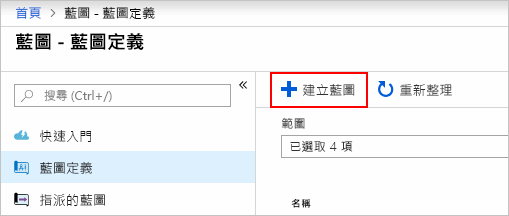
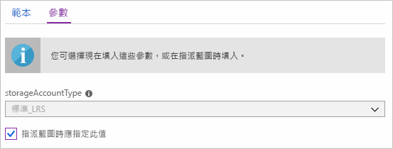
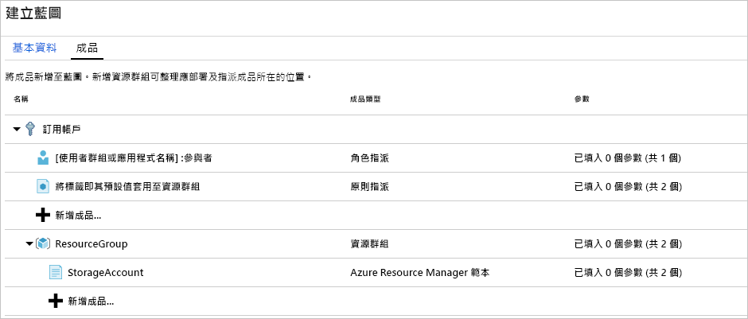
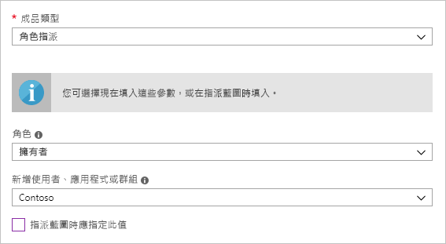
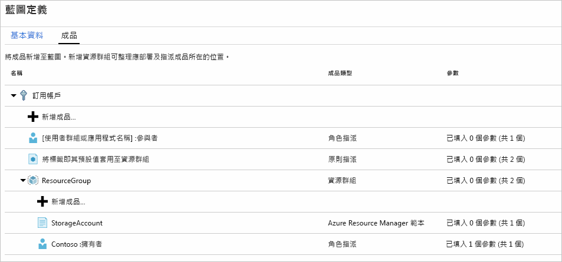
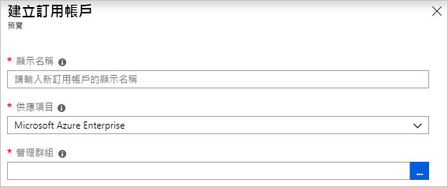
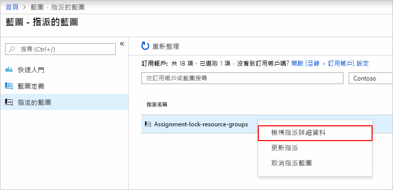

# <a name="define-and-assign-an-azure-blueprint-in-the-portal"></a>在入口網站中定義和指派 Azure 藍圖

了解如何建立及指派有助於定義常用模式的藍圖，以根據 Resource Manager 範本、原則、安全性等，開發出可重複使用並可快速部署的組態。 在本教學課程中，您將了解如何使用 Azure 藍圖在您的組織中處理藍圖的建立、發佈和指派等常見工作，例如：

> [!div class="checklist"]
> - 建立新藍圖並新增各種支援成品
> - 變更仍在**草稿**狀態的現有藍圖
> - 將藍圖標示為**已發佈**，代表藍圖已可供指派
> - 將藍圖指派給現有的訂用帳戶
> - 檢查指派的藍圖的狀態和進度
> - 移除已指派給訂用帳戶的藍圖

如果您沒有 Azure 訂用帳戶，請在開始前建立 [免費帳戶](https://azure.microsoft.com/free) 。

## <a name="create-a-blueprint"></a>建立藍圖

定義合規性標準模式的第一個步驟，即是以可用的資源規劃藍圖。 在此範例中，會新建立名為「MyBlueprint」的藍圖，用以設定訂用帳戶的角色和原則指派、新增資源群組、在新資源群組上建立 Resource Manager 的範本和角色指派。

1. 在左側窗格中選取 [所有服務]。 搜尋並選取 [藍圖]。

1. 在頁面左側選取 [藍圖定義]，然後按一下頁面頂端的 [+ 建立藍圖] 按鈕。

   - 或是在 [開始使用] 頁面按一下 [建立]，即可直接建立藍圖。

   

1. 提供藍圖的 [藍圖名稱]，例如「MyBlueprint」(僅限使用字母和數字，最多 48 個字元，不可加入空格或特殊字元)，但暫且將 [藍圖描述] 保留為空白。  在 [定義位置] 方塊中，按一下右側的省略符號，選取您要從中儲存藍圖的[管理群組](../management-groups/overview.md)或訂用帳戶，然後按一下 [選取]。

1. 確認資訊正確無誤 (之後無法變更 [藍圖名稱] 和 [定義位置] 欄位)，然後按一下頁面底部的 [下一步：**成品]** 或頁面頂端的 [成品] 索引標籤。

1. 新增訂用帳戶的角色指派：以滑鼠左鍵按一下 [訂用帳戶] 底下的 [+ 新增成品...] 資料列，即可在瀏覽器右側開啟 [新增成品] 視窗。 選取 [角色指派] 作為 [成品類型]。 在 [角色] 下方選取 [參與者]，然後在 [新增使用者、應用程式或群組] 欄位勾選代表**動態參數**的核取方塊。 按一下 [新增] 將此成品新增至藍圖。

   

   > [!NOTE]
   > 大部分_成品_均可支援參數。 在藍圖建立期間，獲得指派值的參數是**靜態參數**。 如果是在藍圖指派期間受指派的參數，則為**動態參數**。 如需詳細資訊，請參閱[藍圖參數](./concepts/parameters.md)。

1. 新增訂用帳戶的原則指派：以滑鼠左鍵按一下角色指派成品下方的 [+ 新增成品...] 資料列。 選取 [原則指派] 作為 [成品類型]。 將 [類型] 變更為 [內建]，然後在 [搜尋] 中輸入「標籤」。 按一下 [搜尋] 進行篩選。 按一下 [將標籤及其預設值套用至資源群組]，加以選取。 按一下 [新增] 將此成品新增至藍圖。

1. 按一下 [將標籤及其預設值套用至資源群組] 原則指派的資料列。 在藍圖定義中提供成品參數的視窗隨即開啟，可用來根據此藍圖設定所有指派的參數 (**靜態參數**)，而不需要在指派期間設調 (**動態參數**)。 此範例會在藍圖指派期間使用**動態參數**，以便保留預設值並按一下 [取消]。

1. 新增訂用帳戶的資源群組：以滑鼠左鍵按一下 [訂用帳戶] 底下的 [+ 新增成品...] 資料列。 選取 [資源群組] 作為 [成品類型]。 將 [成品顯示名稱]、[資源群組名稱] 和 [位置] 欄位保留為空白，但請務必勾選每個參數屬性的核取方塊，將其設為**動態參數**。 按一下 [新增] 將此成品新增至藍圖。

1. 在資源群組下新增範本：以滑鼠左鍵按一下 [+ 新增成品...] **ResourceGroup** 項目下方的資料列。 [成品類型] 請選擇「Azure Resource Manager 範本 」，並將 [成品顯示名稱] 設為「StorageAccount」，將 [描述] 留白。 在編輯器方塊的 [範本] 索引標籤中，貼上以下的 Resource Manager 範本。 貼上範本之後，請選取 [參數] 索引標籤，並請留意已偵測到範本參數 **storageAccountType** 和**位置**。 系統會自動偵測並填入每個參數，但將其設定為**動態參數**。 取消勾選 **storageAccountType** 核取方塊，並留意下拉式清單中僅包含 Resource Manager 範本的 **allowedValues** 下方所含的值。 勾選方塊，將其設回**動態參數**。 按一下 [新增] 將此成品新增至藍圖。

   > [!IMPORTANT]
   > 如果要匯入範本，請確定檔案僅有 JSON，不含 HTML。 指向 GitHub 上的 URL 時，請確定您是按下 [RAW] 取得單純的 JSON 檔案，而不是以 HTML 包裝用於在 GitHub 上顯示的檔案。 如果匯入的範本並非單純的 JSON，則會發生錯誤。

   ```json
   {
       "$schema": "https://schema.management.azure.com/schemas/2015-01-01/deploymentTemplate.json#",
       "contentVersion": "1.0.0.0",
       "parameters": {
           "storageAccountType": {
               "type": "string",
               "defaultValue": "Standard_LRS",
               "allowedValues": [
                   "Standard_LRS",
                   "Standard_GRS",
                   "Standard_ZRS",
                   "Premium_LRS"
               ],
               "metadata": {
                   "description": "Storage Account type"
               }
           },
           "location": {
               "type": "string",
               "defaultValue": "[resourceGroup().location]",
               "metadata": {
                   "description": "Location for all resources."
               }
           }
       },
       "variables": {
           "storageAccountName": "[concat('store', uniquestring(resourceGroup().id))]"
       },
       "resources": [{
           "type": "Microsoft.Storage/storageAccounts",
           "name": "[variables('storageAccountName')]",
           "location": "[parameters('location')]",
           "apiVersion": "2018-07-01",
           "sku": {
               "name": "[parameters('storageAccountType')]"
           },
           "kind": "StorageV2",
           "properties": {}
       }],
       "outputs": {
           "storageAccountName": {
               "type": "string",
               "value": "[variables('storageAccountName')]"
           }
       }
   }
   ```

   

1. 完成的藍圖應該如下所示： 請注意，每個成品的 [參數] 資料行都會出現「已填入 _x_ 個參數，共 _y_ 個」。 在每次指派藍圖時都會設定**動態參數**。

   

1. 加入所有計劃中的成品之後，按一下頁面底部的 [儲存草稿]。

## <a name="edit-a-blueprint"></a>編輯藍圖

在[建立藍圖](#create-a-blueprint) 時，並未提供描述，也未在新的資源群組內新增角色指派。 依照下列步驟可以修正這兩個問題：

1. 在頁面左側選取 [藍圖定義]。

1. 在藍圖清單中，以滑鼠右鍵按一下您先前建立的藍圖，然後選取 [編輯藍圖]。

1. 在 [藍圖描述] 中，提供藍圖及其構成成品的相關資訊。  在此案例中，請輸入類似如下的內容：「此藍圖設定的是訂用帳戶的標記原則和角色指派，且會建立資源群組，並將資源範本和角色指派部署到該資源群組。」

1. 按一下頁面底部的 [下一步: **成品]** 或頁面頂端的 [成品] 索引標籤。

1. 在資源群組下新增角色指派：以滑鼠左鍵按一下 [資源群組] 項目底下的 [+ 新增成品...] 資料列。 選取 [角色指派] 作為 [成品類型]。 在 [角色] 下方選取 [擁有者]，並取消勾選 [新增使用者、應用程式或群組] 欄位，然後搜尋並選取所要新增的使用者、應用程式或群組。 此成品會在每次指派此藍圖時使用設定相同的**靜態參數**。 按一下 [新增] 將此成品新增至藍圖。

   

1. 完成的藍圖應該如下所示： 請注意，新增的角色指派會顯示**已填入 1 個參數，共 1 個**，表示這是**靜態參數**。

   

1. 更新之後，按一下 [儲存草稿]。

## <a name="publish-a-blueprint"></a>發佈藍圖

將所有規劃好的成品新增到藍圖之後，即可發佈藍圖。
發佈後即可將藍圖指派給訂用帳戶。

1. 在頁面左側選取 [藍圖定義]。

1. 在藍圖清單中，以滑鼠右鍵按一下您先前建立的藍圖，然後選取 [發佈藍圖]。

1. 在開啟的對話方塊，填妥**版本** (僅限字母、數字和連字號，長度上限為 20 個字元)，例如「v1」，並**變更附註** (選擇性)，例如「首次發佈」。

1. 按一下頁面底端的 [發佈]。

## <a name="assign-a-blueprint"></a>指派藍圖

發佈藍圖後，即可將藍圖指派給訂用帳戶。 將您建立的藍圖指派給管理群組階層下的其中一個訂用帳戶。 如果將藍圖儲存到某訂用帳戶，則只能將其指派給該訂用帳戶。

1. 在頁面左側選取 [藍圖定義]。

1. 在藍圖清單中，以滑鼠右鍵按一下您先前建立的藍圖 (或選取省略符號)，然後選取 [指派藍圖]。

1. 在 [指派藍圖] 頁面上，從 [訂用帳戶] 下拉式清單選取要部署此藍圖的訂用帳戶。

   - 如果 [Azure 計費](../../billing/index.md)中有支援的企業供應項目，則會在 [訂用帳戶] 方塊下方啟動 [新建] 連結。

     1. 選取 [新建] 以建立新的訂用帳戶，而不選取現有的訂用帳戶。

        

     1. 提供新訂用帳戶的**顯示名稱**。

     1. 從下拉式清單中選取可用的**供應項目**。

     1. 使用省略符號選取訂用帳戶將成為其子系的[管理群組](../management-groups/index.md)。

     1. 選取頁面底部的 [建立]。

     > [!IMPORTANT]
     > 選取 [建立] 後，會立即建立新的訂用帳戶。

   > [!NOTE]
   > 每個選取的每個訂用帳戶均會建立指派，如此可在稍後變更單一訂用帳戶的指派，而不需強制變更其餘選取的訂用帳戶。

1. 提供此指派的唯一名稱，作為 [指派的名稱]。

1. 在 [位置] 中，選取將建立受控識別的區域。 Azure 藍圖會使用此受控識別來部署指派的藍圖之中的所有成品。 若要深入了解，請參閱[適用於 Azure 資源的受控識別](../../active-directory/managed-identities-azure-resources/overview.md)。

1. 請將「v1」項目上**已發佈**版本的 [藍圖定義版本] 下拉式清單保留原樣 (預設為最新的**已發佈**版本)。

1. [鎖定指派] 請保留 [不要鎖定] 的預設值。 如需詳細資訊，請參閱[藍圖資源鎖定](./concepts/resource-locking.md)。

1. 對於訂用帳戶層級角色指派 **[使用者群組或應用程式名稱]: 參與者**，請搜尋並選取使用者、應用程式或群組。

1. 訂用帳戶等級的原則指派，則請將 [標記名稱] 設為「CostCenter」，並將 [標記值] 設為「ContosoIT」。

1. 對於「Resourcegroup」，請填妥「StorageAccount」的 [名稱]，並在 [位置] 的下拉式清單中選擇 [美國東部 2]。

   > [!NOTE]
   > 藍圖定義期間在資源群組下新增的每個成品，均是為了配合其將部署的資源群組或物件所建立的。 不接受參數的成品，或是在指派時並未定義任何參數的成品，僅會列出內容資訊。

1. 在 Azure Resource Manager 範本「StorageAccount」中，**storageAccountType** 參數請選擇「Standard_GRS」。

1. 請閱讀頁面底端的 [資訊] 方塊，然後按一下 [指派]。

## <a name="track-deployment-of-a-blueprint"></a>追蹤藍圖的部署情況

將藍圖指派到一個或多個訂用帳戶時，會發生兩件事：

- 藍圖會依據所指派到的訂用帳戶新增至 [指派的藍圖] 頁面
- 藍圖定義的所有成品開始進行部署

請在藍圖被指派到訂用帳戶之後，確認部署的進度。

1. 選取頁面左側的 [指派的藍圖]。

1. 在藍圖清單中，以滑鼠右鍵按一下您先前指派的藍圖，然後選取 [檢視指派詳細資料]。

   

1. 在 [藍圖指派] 頁面上，驗證已成功部署所有成品，且部署期間並未出現任何錯誤。 如果發生錯誤，請參閱[疑難排解藍圖](./troubleshoot/general.md)的步驟，判斷發生錯誤的原因。

## <a name="unassign-a-blueprint"></a>取消指派藍圖

如果不再需要，請從訂用帳戶中移除藍圖指派。 較新的藍圖可以更新後的模式、原則和設計取代此藍圖。 移除藍圖時，會將指派為該藍圖一部份的成品保留下來。 若要移除藍圖指派，請按照下列步驟操作：

1. 選取頁面左側的 [指派的藍圖]。

1. 在藍圖清單中，選取要取消指派的藍圖，然後按一下頁面頂端的 [取消指派藍圖] 按鈕。

1. 閱讀確認訊息，然後按一下 [確定]。

## <a name="delete-a-blueprint"></a>刪除藍圖

1. 在頁面左側選取 [藍圖定義]。

1. 以滑鼠右鍵按一下要刪除的藍圖，並選取 [刪除藍圖]，然後按一下確認對話方塊中的 [是]。

> [!NOTE]
> 以此方法刪除藍圖，也會將所選藍圖的**已發佈版本**全數刪除。 若要刪除單一版本，請開啟藍圖，按一下 [已發佈版本] 索引標籤，選取並按一下要刪除的版本，然後按一下 [刪除此版本]。 此外，需先刪除藍圖的所有指派項目，否則無法刪除具有指派項目的藍圖。

## <a name="next-steps"></a>後續步驟

- 了解[藍圖生命週期](./concepts/lifecycle.md) (英文)
- 了解如何使用[靜態和動態參數](./concepts/parameters.md) (英文)
- 了解如何自訂[藍圖排序順序](./concepts/sequencing-order.md) (英文)
- 了解如何使用[藍圖資源鎖定](./concepts/resource-locking.md)
- 了解如何[更新現有的指派](./how-to/update-existing-assignments.md)
- 使用[一般疑難排解](./troubleshoot/general.md)來解決藍圖指派期間發生的問題