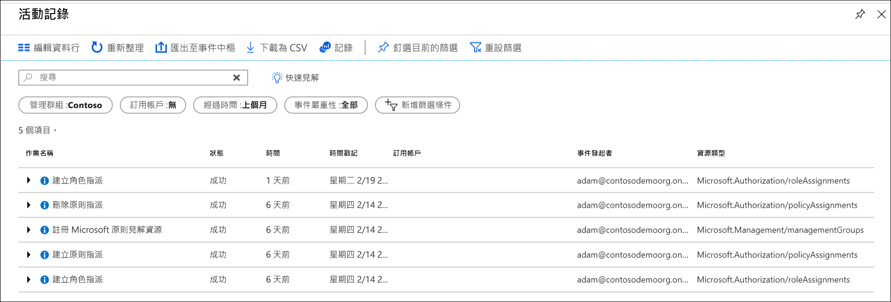

# <a name="manage-your-resources-with-management-groups"></a>利用管理群組來管理您的資源

如果貴組織有多個訂用帳戶，您可能需要一個方法來有效率地管理這些訂用帳戶的存取、原則和相容性。 Azure 管理群組可以在訂用帳戶之上提供範圍層級。 您要將訂用帳戶整理到稱為「管理群組」的容器中，並將治理條件套用至管理群組。 管理群組內的所有訂用帳戶都會自動繼承套用到管理群組的條件。

無論具有何種類型的訂用帳戶，管理群組都可為您提供企業級的大規模管理功能。  若要深入了解管理群組，請參閱[使用 Azure 管理群組來組織資源](overview.md)。

[!INCLUDE [GDPR-related guidance](../../../includes/gdpr-intro-sentence.md)]

## <a name="change-the-name-of-a-management-group"></a>變更管理群組的名稱

您可以使用入口網站、PowerShell 或 Azure CLI 來變更管理群組的名稱。

### <a name="change-the-name-in-the-portal"></a>在入口網站中變更名稱

1. 登入 [Azure 入口網站](https://portal.azure.com)。

1. 選取 [所有服務] > [管理群組]。

1. 選取您需要重新命名的管理群組。

1. 選取 [**詳細資料**]。

1. 選取頁面頂端的 [重新命名群組] 選項。

   ![[管理群組] 頁面上的 [重新命名群組] 選項](./media/detail_action_small.png)

1. 功能表開啟時，輸入您要顯示的新名稱。

   

1. 選取 [ **儲存**]。

### <a name="change-the-name-in-powershell"></a>在 PowerShell 中變更名稱

若要更新顯示名稱, 請使用**AzManagementGroup**。 例如, 若要將管理群組顯示名稱從 "Contoso IT" 變更為 "Contoso Group", 您可以執行下列命令:

```azurepowershell-interactive
Update-AzManagementGroup -GroupName 'ContosoIt' -DisplayName 'Contoso Group'
```

### <a name="change-the-name-in-azure-cli"></a>在 Azure CLI 中變更名稱

對於 Azure CLI，請使用 update 命令。

```azurecli-interactive
az account management-group update --name 'Contoso' --display-name 'Contoso Group'
```

## <a name="delete-a-management-group"></a>刪除管理群組

若要刪除管理群組，必須符合下列需求：

1. 管理群組下沒有任何子管理群組或訂用帳戶。

   - 若要將訂用帳戶移出管理群組，請參閱[將訂用帳戶移至另一個管理群組](#move-subscriptions-in-the-hierarchy)。

   - 若要將管理群組移至另一個管理群組，請參閱[在階層中移動管理群組](#move-management-groups-in-the-hierarchy)。

1. 您具有管理群組 (「擁有者」、「參與者」或「管理群組參與者」) 的寫入權限。 若要查看您有哪些權限，請選取管理群組，然後選取 **IAM**。 若要深入了解 RBAC 角色，請參閱[使用 RBAC 管理存取權與權限](../../role-based-access-control/overview.md)。  

### <a name="delete-in-the-portal"></a>在入口網站中刪除

1. 登入 [Azure 入口網站](https://portal.azure.com)。

1. 選取 [所有服務] > [管理群組]。

1. 選取您要刪除的管理群組。

1. 選取 [**詳細資料**]。

1. 選取 [刪除]

    > [!TIP]
    > 如果無法使用圖示，將您的滑鼠選取器停留在圖示上會顯示原因。

   ![[刪除群組] 選項](./media/delete.png)

1. 視窗隨即開啟，確認您是否要刪除管理群組。

   ![[刪除群組] 確認視窗](./media/delete_confirm.png)

1. 選取 [是]。

### <a name="delete-in-powershell"></a>在 PowerShell 中刪除

在 PowerShell 中使用**AzManagementGroup**命令來刪除管理群組。

```azurepowershell-interactive
Remove-AzManagementGroup -GroupName 'Contoso'
```

### <a name="delete-in-azure-cli"></a>在 Azure CLI 中刪除

針對 Azure CLI，使用 az account management-group delete 命令。

```azurecli-interactive
az account management-group delete --name 'Contoso'
```

## <a name="view-management-groups"></a>檢視管理群組

只您在管理群組中具有直接或繼承的 RBAC 角色，您就可以檢視該管理群組。  

### <a name="view-in-the-portal"></a>在入口網站中檢視

1. 登入 [Azure 入口網站](https://portal.azure.com)。

1. 選取 [所有服務] > [管理群組]。

1. [管理群組階層] 頁面將會載入。 此頁面可讓您探索所有可存取的管理群組和訂用帳戶。 選取群組名稱即可前往階層中的下一個層級。 瀏覽方式與檔案總管相同。

1. 若要查看管理群組的詳細資訊，請選取管理群組標題旁的 **(詳細資料)** 連結。 如果此連結無法使用，表示您沒有檢視該管理群組的權限。

   

### <a name="view-in-powershell"></a>在 PowerShell 中檢視

您可以使用 AzManagementGroup 命令來取出所有群組。  如需管理群組取得 Powershell 命令的完整清單, 請參閱[Az .resources](/powershell/module/az.resources/Get-AzManagementGroup)模組。  

```azurepowershell-interactive
Get-AzManagementGroup
```

對於單一管理群組的資訊，請使用 -GroupName 參數

```azurepowershell-interactive
Get-AzManagementGroup -GroupName 'Contoso'
```

若要傳回特定管理群組和其底下階層的所有層級, 請使用 **-Expand**和 **-遞迴**參數。  

```azurepowershell-interactive
PS C:\> $response = Get-AzManagementGroup -GroupName TestGroupParent -Expand -Recurse
PS C:\> $response

Id                : /providers/Microsoft.Management/managementGroups/TestGroupParent
Type              : /providers/Microsoft.Management/managementGroups
Name              : TestGroupParent
TenantId          : 00000000-0000-0000-0000-000000000000
DisplayName       : TestGroupParent
UpdatedTime       : 2/1/2018 11:15:46 AM
UpdatedBy         : 00000000-0000-0000-0000-000000000000
ParentId          : /providers/Microsoft.Management/managementGroups/00000000-0000-0000-0000-000000000000
ParentName        : 00000000-0000-0000-0000-000000000000
ParentDisplayName : 00000000-0000-0000-0000-000000000000
Children          : {TestGroup1DisplayName, TestGroup2DisplayName}

PS C:\> $response.Children[0]

Type        : /managementGroup
Id          : /providers/Microsoft.Management/managementGroups/TestGroup1
Name        : TestGroup1
DisplayName : TestGroup1DisplayName
Children    : {TestRecurseChild}

PS C:\> $response.Children[0].Children[0]

Type        : /managementGroup
Id          : /providers/Microsoft.Management/managementGroups/TestRecurseChild
Name        : TestRecurseChild
DisplayName : TestRecurseChild
Children    :
```

### <a name="view-in-azure-cli"></a>在 Azure CLI 中檢視

您可以使用 list 命令來擷取所有群組。  

```azurecli-interactive
az account management-group list
```

如需單一管理群組的資訊，請使用 show 命令

```azurecli-interactive
az account management-group show --name 'Contoso'
```

若要傳回特定管理群組和其底下階層的所有層級, 請使用 **-Expand**和 **-遞迴**參數。

```azurecli-interactive
az account management-group show --name 'Contoso' -e -r
```

## <a name="move-subscriptions-in-the-hierarchy"></a>在階層中移動訂用帳戶

建立管理群組的其中一個原因是要將訂用帳戶組合在一起。 只有管理群組和訂用帳戶才能設為另一個管理群組的子群組。 移至管理群組的訂用帳戶會繼承父管理群組中的所有使用者存取權和原則。

若要移動訂用帳戶, 下列所有 RBAC 許可權都必須為 true:

- 子訂用帳戶上的「擁有者」角色。
- 目標父管理群組上的「擁有者」、「參與者」或「管理群組參與者」角色。
- 現有父管理群組上的「擁有者」、「參與者」或「管理群組參與者」角色。

如果目標或現有的父管理群組是根管理群組, 則不適用許可權需求。 因為根管理群組是所有新管理群組和訂用帳戶的預設登陸點, 所以您不需要它的許可權來移動專案。

如果訂用帳戶上的「擁有者」角色繼承自目前的管理群組, 則您的移動目標會受到限制。 您只能將訂用帳戶移至具有擁有者角色的另一個管理群組。 因為您會失去訂用帳戶的擁有權, 所以無法將它移至您是參與者的管理群組。 如果您直接指派給訂用帳戶的「擁有者」角色 (不是繼承自管理群組), 您可以將它移至您是參與者的任何管理群組。

若要查看 Azure 入口網站中的許可權, 請選取管理群組, 然後選取 [ **IAM**]。 若要深入了解 RBAC 角色，請參閱[使用 RBAC 管理存取權與權限](../../role-based-access-control/overview.md)。

### <a name="move-subscriptions-in-the-portal"></a>在入口網站中移動訂用帳戶

#### <a name="add-an-existing-subscription-to-a-management-group"></a>將現有的訂用帳戶新增到管理群組

1. 登入 [Azure 入口網站](https://portal.azure.com)。

1. 選取 [所有服務] > [管理群組]。

1. 選取您計畫要作為父代的管理群組。

1. 在頁面頂端，選取 [新增訂用帳戶]。

1. 在清單中選取具有正確識別碼的訂用帳戶。

   

1. 選取 [儲存]。

#### <a name="remove-a-subscription-from-a-management-group"></a>從管理群組移除訂用帳戶

1. 登入 [Azure 入口網站](https://portal.azure.com)。

1. 選取 [所有服務] > [管理群組]。

1. 選取您正在規劃且目前為父代的管理群組。  

1. 針對清單中您需要移動的訂用帳戶資料列，選取資料列結尾省略符號。

   

1. 選取 [移動]。

1. 在開啟的功能表上，選取**父管理群組**。

   

1. 選取 [ **儲存**]。

### <a name="move-subscriptions-in-powershell"></a>在 PowerShell 中移動訂用帳戶

若要在 PowerShell 中移動訂用帳戶, 請使用 AzManagementGroupSubscription 命令。  

```azurepowershell-interactive
New-AzManagementGroupSubscription -GroupName 'Contoso' -SubscriptionId '12345678-1234-1234-1234-123456789012'
```

若要移除與訂用帳戶與管理群組之間的連結, 請使用 AzManagementGroupSubscription 命令。

```azurepowershell-interactive
Remove-AzManagementGroupSubscription -GroupName 'Contoso' -SubscriptionId '12345678-1234-1234-1234-123456789012'
```

### <a name="move-subscriptions-in-azure-cli"></a>在 Azure CLI 中移動訂用帳戶

若要在 CLI 移動訂用帳戶，您可以使用 add 命令。

```azurecli-interactive
az account management-group subscription add --name 'Contoso' --subscription '12345678-1234-1234-1234-123456789012'
```

若要將訂用帳戶從管理群組中移除，請使用 subscription remove 命令。  

```azurecli-interactive
az account management-group subscription remove --name 'Contoso' --subscription '12345678-1234-1234-1234-123456789012'
```

## <a name="move-management-groups-in-the-hierarchy"></a>移動階層中的管理群組  

當您移動父管理群組時, 該群組下的階層會隨之移動。 如需移動管理群組的存取權, 請參閱[管理群組存取權](index.md#management-group-access)。

### <a name="move-management-groups-in-the-portal"></a>在入口網站中移動管理群組

1. 登入 [Azure 入口網站](https://portal.azure.com)。

1. 選取 [所有服務] > [管理群組]。

1. 選取您計畫要作為父代的管理群組。

1. 在頁面頂端，選取 [新增管理群組]。

1. 在開啟的功能表中，選取是要新的管理群組還是使用現有管理群組。

   - 選取新項目即會建立新的管理群組。
   - 選取現有項目即會顯示您可移至此管理群組之所有管理群組的下拉式清單。  

   

1. 選取 [ **儲存**]。

### <a name="move-management-groups-in-powershell"></a>在 PowerShell 中移動管理群組

在 PowerShell 中使用 AzManagementGroup 命令, 將管理群組移至不同的群組下。

```azurepowershell-interactive
$parentGroup = Get-AzManagementGroup -GroupName ContosoIT
Update-AzManagementGroup -GroupName 'Contoso' -ParentId $parentGroup.id
```  

### <a name="move-management-groups-in-azure-cli"></a>在 Azure CLI 中移動管理群組

您可以透過 Azure CLI 使用 update 命令來移動管理群組。

```azurecli-interactive
az account management-group update --name 'Contoso' --parent ContosoIT
```

## <a name="audit-management-groups-using-activity-logs"></a>使用活動記錄稽核管理群組

[Azure 活動記錄](../../azure-monitor/platform/activity-logs-overview.md)中支援管理群組。 您可以查詢與其他 Azure 資源位於相同中央位置的管理群組所發生的所有事件。  例如，您可以看到對特定的管理群組的所有角色指派或原則指派變更。



在 Azure 入口網站外部查詢管理群組時，管理群組的目標範圍像是 **"/providers/Microsoft.Management/managementGroups/{yourMgID}"** 。

## <a name="referencing-management-groups-from-other-resource-providers"></a>參考來自其他資源提供者的管理群組

從其他資源提供者的動作參考管理群組時, 請使用下列路徑作為範圍。 使用 PowerShell、Azure CLI 和 REST Api 時, 會使用此路徑。  

>"/providers/Microsoft.Management/managementGroups/{yourMgID}"

使用此路徑的範例是在 PowerShell 中指派新的角色指派給管理群組

```azurepowershell-interactive
New-AzRoleAssignment -Scope "/providers/Microsoft.Management/managementGroups/Contoso"
```

在管理群組中抓取原則定義時, 會使用相同的範圍路徑。

```http
GET https://management.azure.com/providers/Microsoft.Management/managementgroups/MyManagementGroup/providers/Microsoft.Authorization/policyDefinitions/ResourceNaming?api-version=2018-05-01
```

## <a name="next-steps"></a>後續步驟

若要深入了解管理群組，請參閱：

- [建立管理群組以組織 Azure 資源](create.md)
- [如何變更、刪除或管理您的管理群組](manage.md)
- [檢閱 Azure PowerShell 資源模組中的管理群組](/powershell/module/az.resources#resources)
- [檢閱 REST API 中的管理群組](/rest/api/resources/managementgroups)
- [檢閱 Azure CLI 中的管理群組](/cli/azure/account/management-group)