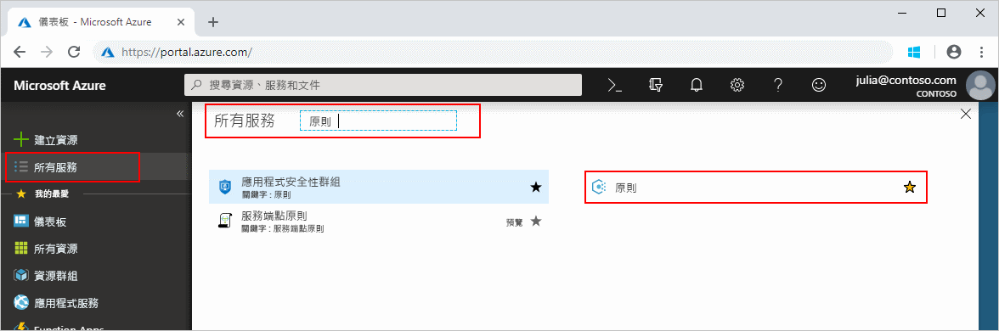
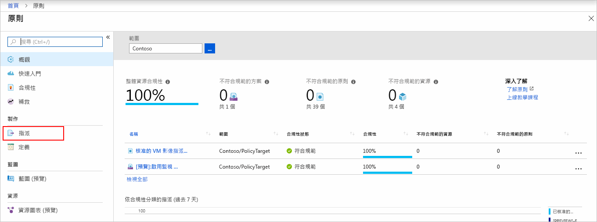
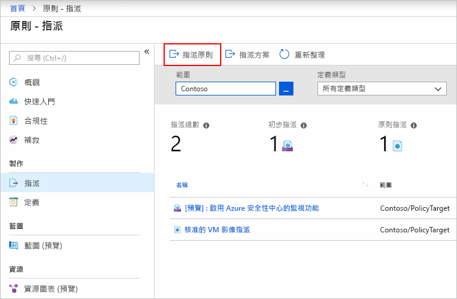
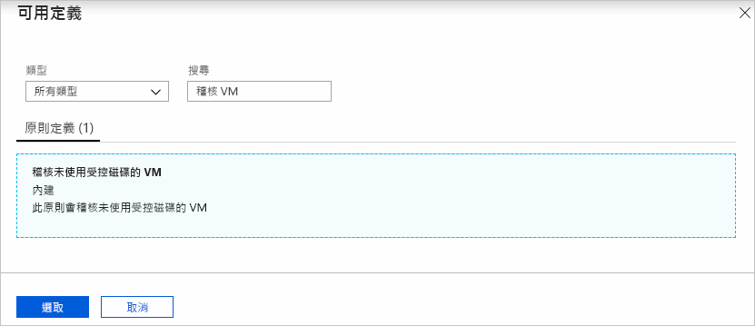
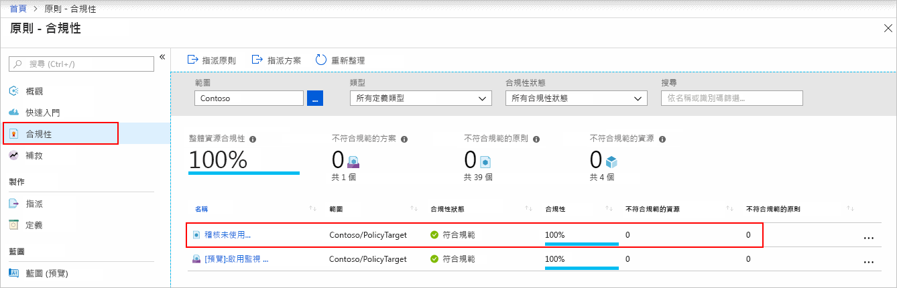
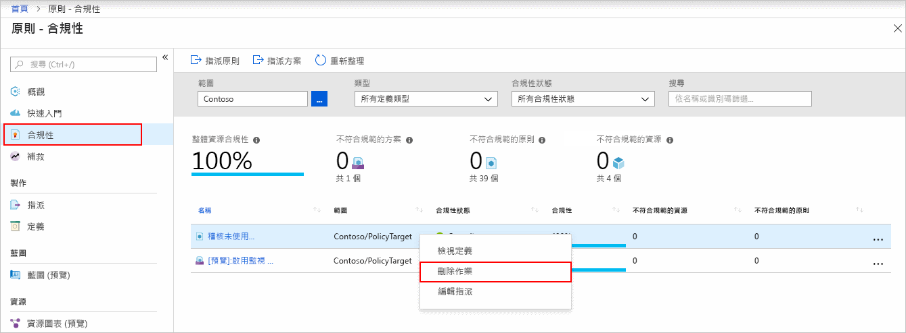

# 建立原則指派，以識別 Azure 環境中的不相容資源

了解 Azure 中合規性的第一個步驟是識別您資源的狀態。
本快速入門會逐步引導您完成程序來建立原則指派，以識別出未使用受控磁碟的虛擬機器。

在此程序結束時，您將會成功識別出未使用受控磁碟的虛擬機器。 它們不符合原則指派的規範。

如果您沒有 Azure 訂用帳戶，請在開始前建立[免費帳戶](https://azure.microsoft.com/free/)。

## 建立原則指派

在本快速入門中，您會建立一個原則指派，並且指派「稽核沒有受控磁碟的虛擬機器」原則定義。

1. 藉由按一下 [所有服務] 然後搜尋並選取 [原則]，在 Azure 入口網站中啟動 Azure 原則服務。

   

1. 選取 Azure 原則分頁左側的 [指派]。 指派是已指派在特定範圍內發生的原則。

   

1. 從 [原則 - 指派] 分頁頂端選取 [指派原則]。

   

1. 在 [指派原則] 頁面上，按一下省略符號並選取管理群組或訂用帳戶來選取 [範圍]。 選擇性地選取資源群組。 範圍會決定在哪些資源或資源群組上強制執行原則指派。  然後，按一下位於 [範圍] 分頁底部的 [選取]。

   這個範例會使用 **Contoso** 訂用帳戶。 您的訂用帳戶不同。

1. 您可以根據**範圍**來排除資源。  **排除項目**會在低於**範圍**層級的層級上啟動。 **排除項目**是選擇性項目，所以目前將其保留為空白。

1. 選取 [原則定義] 省略符號以開啟可用定義的清單。 Azure 原則隨附您可以使用的內建原則定義。 有許多可供使用，例如：

   - 強制執行標籤和其值
   - 套用標籤和其值
   - 需要 SQL Server 12.0 版

   如需所有可用內建原則的完整清單，請參閱[原則範例](./samples/index.md)。

1. 搜尋原則定義清單以尋找「稽核未使用受控磁碟的 VM」定義。 按一下該原則，然後按一下 [選取]。

   

1. [指派名稱] 會自動填入您選取的原則名稱，但您可加以變更。 在此範例中，請保留「稽核未使用受控磁碟的 VM」。 您也可以新增選擇性的 [描述]。 描述會提供有關此原則指派的詳細資料。 **指派者**將根據登入者自動填入。 這是選擇性欄位，因此可以輸入自訂值。

1. 讓 [建立受控識別] 保持未選取狀態。 但是，當要指派的原則或方案包含具有 [deployIfNotExists](./concepts/effects.md#deployifnotexists) 效果的原則時，「必須」勾選此項目。 由於本快速入門中所使用的原則並未包含該效果，因此請將其保留為空白。 如需詳細資訊，請參閱[受控識別](../../active-directory/managed-identities-azure-resources/overview.md)和[補救安全性的運作方式](./how-to/remediate-resources.md#how-remediation-security-works)。

1. 按一下 [指派]。

您現在可以識別不相容的資源，以了解環境的相容性狀態。

## 識別不相容的資源

選取分頁左半部的 [合規性]，並找出您所建立的 [稽核不是使用受控磁碟的 VM] 原則指派。

如果有任何現有資源不符合這個新指派的規範，它們會顯示在 [不符合規範的資源] 下。

根據現有資源評估條件，而且結果為 true 時，這些資源都會標示為不符合原則規範。 下表顯示不同的原則效果如何與結果合規性狀態的條件評估搭配使用。 雖然您在 Azure 入口網站中沒有看到評估邏輯，但是會顯示合規性狀態結果。 合規性狀態結果是符合規範和不符合規範其中之一。

| **資源狀態** | **效果** | **原則評估** | **合規性狀態** |
| --- | --- | --- | --- |
| exists | 拒絕、稽核、附加\*、DeployIfNotExist\*、AuditIfNotExist\* | True | 不符合規範 |
| exists | 拒絕、稽核、附加\*、DeployIfNotExist\*、AuditIfNotExist\* | False | 相容 |
| 新增 | 稽核、AuditIfNotExist\* | True | 不符合規範 |
| 新增 | 稽核、AuditIfNotExist\* | False | 相容 |

\* Append、DeployIfNotExist 和 AuditIfNotExist 效果需要 IF 陳述式為 TRUE。 這些效果也需要存在條件為 FALSE，以呈現不符合規範。 若為 TRUE，IF 條件會觸發相關資源的存在條件評估。

## 清除資源

此集合中的其他指南是以本快速入門為基礎。 如果您打算繼續進行後續的教學課程，請勿清除在此快速入門中建立的資源。 如果您不打算繼續，請使用下列步驟，在 Azure 入口網站中刪除本快速入門所建立的所有資源。

1. 選取 Azure 原則分頁左半部的 [合規性] (或 [指派])，並找出您所建立的 [稽核不是使用受控磁碟的 VM] 原則指派。

1. 以滑鼠右鍵按一下 [稽核不是使用受控磁碟的 VM] 原則指派，並選取 [刪除指派]

   

## 後續步驟

在本快速入門中，您會將原則定義指派至範圍，並評估其更新狀態報告。 原則定義可確保範圍中的所有資源都符合規範，並且識別哪些資源不符合。

若要深入了解指派原則，以確保所建立的**未來**資源是相容的，請繼續進行教學課程：

> [!div class="nextstepaction"]
> [建立及管理原則](./tutorials/create-and-manage.md)