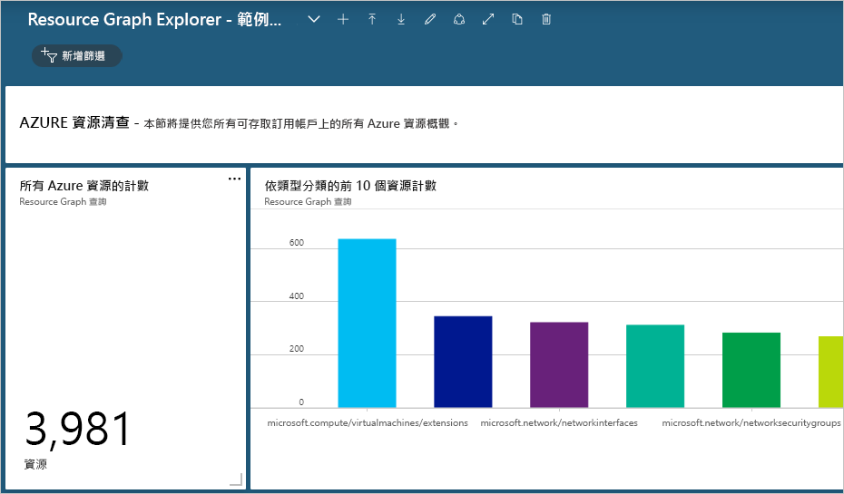
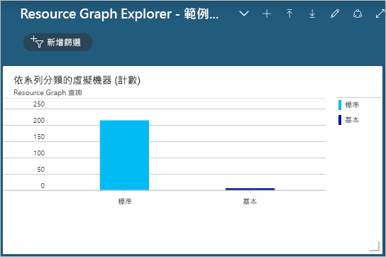

# <a name="quickstart-run-your-first-resource-graph-query-using-azure-resource-graph-explorer"></a>快速入門：使用 Azure Resource Graph Explorer 執行您的第一個 Resource Graph 查詢

Azure Resource Graph 的功能可直接透過 Azure Resource Graph Explorer 在 Azure 入口網站中取得。 Resource Graph Explorer 會提供可瀏覽的相關資訊，以讓您了解所能查詢的 Azure Resource Manager 資源類型和屬性。 Resource Graph Explorer 也提供了全新介面，供您處理多個查詢、評估結果，甚至是將某些查詢的結果轉換成可釘選到 Azure 儀表板的圖表。

在本快速入門結束時，您將會使用過 Azure 入口網站和 Resource Graph Explorer 來執行您的第一個 Resource Graph 查詢，並將結果釘選到儀表板。

如果您沒有 Azure 訂用帳戶，請在開始前建立[免費帳戶](https://azure.microsoft.com/free/)。

## <a name="run-your-first-resource-graph-query"></a>執行第一個 Resource Graph 查詢

開啟 [Azure 入口網站](https://portal.azure.com)以尋找並使用 Resource Graph Explorer，然後遵循下列步驟來執行您的第一個 Resource Graph 查詢：

1. 在左側窗格中選取 [所有服務]  。 搜尋並選取 [Resource Graph Explorer]  。

1. 在視窗的 [查詢 1]  部分，輸入查詢 `project name, type | limit 5`，然後選取 [執行查詢]  。

   > [!NOTE]
   > 由於此查詢範例並未提供排序修飾詞 (例如 `order by`)，因此執行此查詢多次將可能會對每個要求產生一組不同的資源。

1. 在 [結果]  索引標籤中檢閱查詢回應。選取 [訊息]  索引標籤以查看查詢的詳細資料，包括結果計數和查詢的持續時間。 此索引標籤下會顯示錯誤 (如果有的話)。

1. 將查詢更新為依**名稱**屬性排序 (`order by` name)：`project name, type | limit 5 | order by name asc`。 然後，選取 [執行查詢]  。

   > [!NOTE]
   > 如同第一個查詢一樣，多次執行此查詢可能會為每個要求產生不同的資源集。 查詢命令的順序很重要。 在此範例中，`order by` 會出現在 `limit` 之後。 這會先限制查詢結果，然後將結果進行排序。

1. 將查詢更新為第一個依**名稱**屬性排序 (`order by`)，然後限制 (`limit`) 為只顯示前五個結果：`project name, type | order by name asc | limit 5`。 然後，選取 [執行查詢]  。

執行最終查詢數次後，假設您的環境中未變更任何內容，傳回的結果將會一致且符合預期 - 依**名稱**屬性排序，但仍限制為只顯示前五個結果。

### <a name="schema-browser"></a>結構描述瀏覽器

結構描述瀏覽器位於 Resource Graph Explorer 的左窗格。 這份資源清單中所顯示的 Azure「資源類型」  ，全都既獲得 Azure Resource Graph 支援，又存在於您有權存取的租用戶中。 展開資源類型或子屬性便會顯示可用來建立 Resource Graph 查詢的子屬性。 選取資源類型會將 `where type =="<resource type>"` 放入查詢方塊。 選取其中一個子屬性會將 `where <propertyName> == "INSERT_VALUE_HERE"` 新增至查詢方塊。 結構描述瀏覽器非常適合用來探索要在查詢中使用的屬性。 請務必將 _INSERT\_VALUE\_HERE_ 取代為您自己的值，並使用條件、運算子和函式調整查詢以達到您想要的結果。

## <a name="create-a-chart-from-the-resource-graph-query"></a>從 Resource Graph 查詢建立圖表

在執行上述最後一個查詢後，如果您選取 [圖表]  索引標籤，就會收到「結果集與圓形圖視覺效果不相容」的訊息。 列出結果的查詢不能製成圖表，但提供資源計數的查詢可以。 讓我們使用[查詢範例 - 依 OS 類型計算虛擬機器數目](./samples/starter.md#count-virtual-machines-by-os-type)，從 Resource Graph 查詢建立視覺效果。

1. 在視窗的 [查詢 1]  部分輸入下列查詢，然後選取 [執行查詢]  。

   ```kusto
   where type =~ 'Microsoft.Compute/virtualMachines'
   | summarize count() by tostring(properties.storageProfile.osDisk.osType)
   ```

1. 選取 [結果]  索引標籤，並請注意此查詢的回應會提供計數。

1. 選取 [圖表]  索引標籤。現在，查詢會產生視覺效果了。 將類型從 [選取圖表類型]  變更為 [長條圖]  或 [環圈圖]  ，以試驗可用的視覺效果選項。

## <a name="pin-the-query-visualization-to-a-dashboard"></a>將查詢視覺效果釘選到儀表板

當您從可視覺化的查詢獲得結果時，便可將該資料視覺效果釘選到您的其中一個儀表板。 在執行上述查詢後，請遵循下列步驟：

1. 選取 [儲存]  ，然後提供名稱「依 OS 類型的 VM」。 然後，選取右窗格底部的 [儲存]  。

1. 選取 [執行查詢]  以重新執行查詢 (因為您已完成儲存)。

1. 在 [圖表]  索引標籤上，選取資料視覺效果。 然後，選取 [釘選到儀表板]  。

1. 選取所顯示的入口網站通知，或從左窗格選取 [儀表板]  。

現在，您的儀表板上會有該查詢，並有符合查詢名稱的圖格標題。 如果您釘選的查詢尚未儲存，該查詢的名稱會改為「查詢 1」。

每次載入儀表板時，查詢和所產生的資料視覺效果都會執行並更新，從而直接在您的工作流程中提供 Azure 環境的即時動態深入解析。

> [!NOTE]
> 產生清單的查詢也可以釘選到儀表板。 此功能並非只適用於查詢的資料視覺效果。

## <a name="import-example-resource-graph-explorer-dashboards"></a>匯入 Resource Graph Explorer 儀表板範例

若要提供 Resource Graph 查詢的範例，以及提供使用 Resource Graph Explorer 來增強 Azure 入口網站工作流程的方法，請試用這些儀表板範例。

- [Resource Graph Explorer - 儀表板範例 #1](https://github.com/Azure-Samples/Governance/blob/master/src/resource-graph/portal-dashboards/sample-1/resourcegraphexplorer-sample-1.json)

  [](./media/arge-sample1-large.png#lightbox)

- [Resource Graph Explorer - 儀表板範例 #2](https://github.com/Azure-Samples/Governance/blob/master/src/resource-graph/portal-dashboards/sample-2/resourcegraphexplorer-sample-2.json)

  [](./media/arge-sample2-large.png#lightbox)

> [!NOTE]
> 上述儀表板範例螢幕擷取畫面中的計數和圖表會隨著 Azure 環境而有所不同。

1. 選取並下載您想要評估的儀表板範例。

1. 在 Azure 入口網站中，從左窗格選取 [儀表板]  。

1. 選取 [上傳]  ，然後找出並選取已下載的儀表板範例檔案。 然後選取 [開啟]  。

隨即會自動顯示匯入的儀表板。 其現在已存在於 Azure 入口網站，因此您可以視需要探索並進行變更，或從範例建立新的儀表板來與您的小組共用。 如需如何使用儀表板的詳細資訊，請參閱[在 Azure 入口網站中建立和共用儀表板](../../azure-portal/azure-portal-dashboards.md)。

## <a name="clean-up-resources"></a>清除資源

如果您想要從 Azure 入口網站環境中移除 Resource Graph 儀表板範例，則可以使用下列步驟來進行：

1. 從左窗格選取 [儀表板]  。

1. 從 [儀表板] 下拉式選單中，選取您想要刪除的 Resource Graph 儀表板範例。

1. 從儀表板頂端的 [儀表板] 功能表中選取 [刪除]  ，然後選取 [確定]  來確認要刪除。

## <a name="next-steps"></a>後續步驟

- 了解關於[查詢語言](./concepts/query-language.md)的詳細資訊
- 了解[探索資源](./concepts/explore-resources.md)
- 使用 [Azure CLI](first-query-azurecli.md) 執行第一個查詢
- 請參閱[入門查詢](./samples/starter.md)的範例
- 請參閱[進階查詢](./samples/advanced.md)的範例
- 在 [UserVoice](https://feedback.azure.com/forums/915958-azure-governance) 上提供意見反應