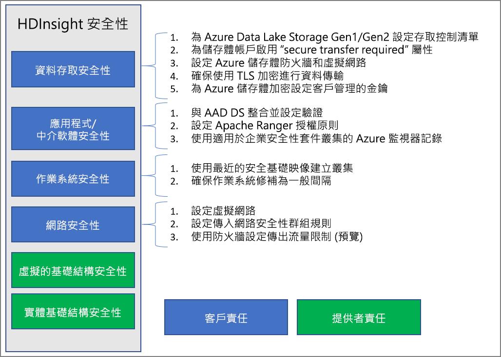

# Azure HDInsight 中的企業安全性概觀

Azure HDInsight 提供多種方法來滿足您的企業安全性需求。 根據預設，大部分解決方案均未啟用。 此彈性可讓您選擇對您而言最重要的安全性功能，並協助您避免對不想要的功能付費。 這也表示您必須負責確保已針對您的設定和環境啟用正確的解決方案。

本文依照四個傳統安全性要素來劃分安全性解決方案，藉以探討安全性解決方案：周邊安全性、驗證、授權和加密。

本文也介紹 **Azure HDInsight 企業安全性套件 (ESP)** ，其提供以 Active Directory 為基礎的驗證、多使用者支援，以及 HDInsight 叢集的角色型存取控制。

## 企業安全性要素

探討企業安全性的其中一種方式，就是根據控制項的類型將安全性解決方案分成四個主要群組。 這些群組也稱為安全性要素，如下所示：周邊安全性、驗證、授權和加密。

### 周邊安全性

透過[虛擬網路](../hdinsight-plan-virtual-network-deployment.md)可達成 HDInsight 中的周邊安全性。 企業系統管理員可以在虛擬網路 (VNET) 內部建立叢集，並使用網路安全性群組 (NSG) 限制對虛擬網路的存取。 只有輸入 NSG 規則中允許的 IP 位址能夠與 HDInsight 叢集通訊。 此設定可提供周邊安全性。

在 VNET 中部署的所有叢集也會有一個私人端點，該端點會解析為 VNET 內的私人 IP，以便對叢集閘道進行私人 HTTP 存取。

### Authentication

HDInsight 的[企業安全性套件](apache-domain-joined-architecture.md)提供 Active Directory 型驗證、多使用者支援和角色型存取控制。 透過使用 [Azure Active Directory Domain Services](../../active-directory-domain-services/overview.md) 即可達成 Active Directory 整合。 利用這些功能，您可以建立已加入受控 Active Directory 網域的 HDInsight 叢集。 接著，您可以設定企業員工清單，指出可驗證及登入叢集的員工。

企業員工可以藉由這項設定，便能使用其網域認證來登入叢集節點。 他們也可以使用其網域認證向其他已核准的端點 (例如 Apache Ambari 檢視、ODBC、JDBC、PowerShell 和 REST API) 進行驗證，以與叢集進行互動。 

### Authorization

大多數企業所依循的最佳做法，就是確保並非每一位員工都能存取所有的企業資源。 同樣地，系統管理員可以針對叢集資源定義角色型存取控制原則。 這僅適用於 ESP 叢集。

Hadoop 系統管理員可以設定角色型存取控制 (RBAC)，以使用 Apache Ranger 中的外掛程式來保護 [Hive](apache-domain-joined-run-hive.md)、[HBase](apache-domain-joined-run-hbase.md) 和 [Kafka](apache-domain-joined-run-kafka.md)。 設定 RBAC 原則可讓您將權限與組織中的角色產生關聯。 這一層的抽象概念可讓您更輕鬆地確保人員只擁有執行其職責所需的權限。 Ranger 也可讓您稽核員工的存取資料以及對存取控制原則所做的任何變更。

例如，系統管理員可以設定 [Apache Ranger](https://ranger.apache.org/) 以設定 Hive 的存取控制原則。 這種功能可確保資料列層級和資料行層級的篩選 (資料遮罩)，並篩選來自未經授權使用者的敏感性資料。

### 稽核

若要追蹤資源的未經授權存取或意外存取，就必須針對叢集資源和資料的所有存取進行稽核。 防止未經授權的使用者存取 HDInsight 叢集資源並保護資料是非常重要的。

系統管理員可以檢視和報告所有對於 HDInsight 叢集資源和資料的存取。 針對在 Apache Ranger 支援的端點中所建立的存取控制原則，系統管理員也可以檢視和報告存取控制原則的所有變更。 

若要存取 Apache Ranger 和 Ambari audit 稽核記錄以及 ssh 存取記錄，請[啟用 Azure 監視器](../hdinsight-hadoop-oms-log-analytics-tutorial.md)並檢視相關的稽核記錄。

### 加密

若要符合組織安全性和合規性需求，保護資料就非常重要。 除了限制未經授權的員工存取資料之外，您還應該將資料加密。

HDInsight 叢集的兩個資料存放區 (Azure Blob 儲存體和 Azure Data Lake Storage Gen1/Gen2) 都支援透明伺服器端的待用[資料加密](../../storage/common/storage-service-encryption.md)。 安全的 HDInsight 叢集會完美地與此伺服器端待用資料加密功能配合運作。

## 共同責任模式

下圖摘要說明主要系統安全性區域，以及您可在各區域中使用的安全性解決方案。 它也強調哪些安全性區域是您身為客戶的責任，而哪些區域是服務提供者的 HDInsight 責任。

下表提供每種安全性解決方案的資源連結。

| 安全性區域 | 可用的解決方案 | 負責方 |
|---|---|---|
| 資料存取安全性 | 設定 Azure Data Lake Storage Gen1 和 Gen2 的[存取控制清單 (ACL)](../../storage/blobs/data-lake-storage-access-control.md)  | Customer |
|  | 在儲存體帳戶上啟用 [[需要安全傳輸]](../../storage/common/storage-require-secure-transfer.md) 屬性。 | Customer |
|  | 設定 [Azure 儲存體防火牆](../../storage/common/storage-network-security.md)和虛擬網路 | Customer |
|  | 確定已針對傳輸中的資料啟用 [TLS 加密](../../storage/common/storage-security-tls.md)。 | Customer |
|  | 設定[客戶管理的金鑰](../../storage/common/storage-encryption-keys-portal.md)以進行 Azure 儲存體加密 | Customer |
| 應用程式和中介軟體安全性 | 與 AAD-DS 整合並[設定驗證](apache-domain-joined-configure-using-azure-adds.md) | Customer |
|  | 設定 [Apache Ranger 授權](apache-domain-joined-run-hive.md)原則 | Customer |
|  | 使用 [Azure 監視器記錄](../hdinsight-hadoop-oms-log-analytics-tutorial.md) | Customer |
| 作業系統安全性 | 使用最新安全基底映射建立叢集 | Customer |
|  | 確保定期進行 [OS 修補](../hdinsight-os-patching.md) | Customer |
| 網路安全性 | 設定[虛擬網路](../hdinsight-plan-virtual-network-deployment.md) |
|  | 設定[輸入網路安全性群組 (NSG) 規則](../hdinsight-plan-virtual-network-deployment.md#networktraffic) | Customer |
|  | 使用防火牆 (預覽) 設定[輸出流量限制](../hdinsight-restrict-outbound-traffic.md) | Customer |
| 虛擬化基礎結構 | N/A | HDInsight (雲端提供者) |
| 實體基礎結構安全性 | N/A | HDInsight (雲端提供者) |

## 後續步驟

* [規劃具有 ESP 的 HDInsight 叢集](apache-domain-joined-architecture.md)
* [設定具有 ESP 的 HDInsight 叢集](apache-domain-joined-configure.md)
* [管理具有 ESP 的 HDInsight 叢集](apache-domain-joined-manage.md)
