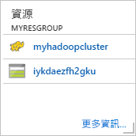
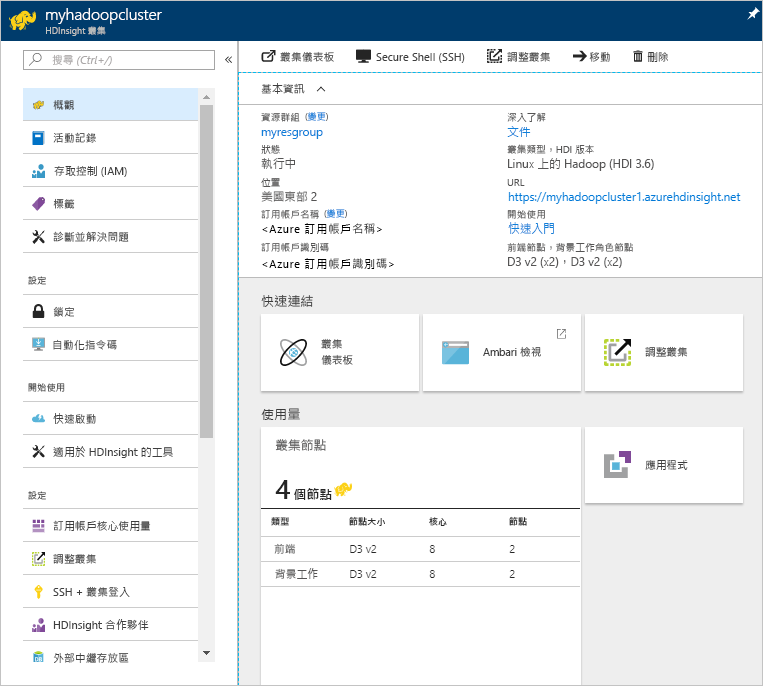

# Hadoop 教學課程：開始在 HDInsight 中使用 Hadoop

了解如何在 HDInsight 中建立 [Hadoop](http://hadoop.apache.org/) 叢集，以及如何在 HDInsight 中執行 Hive 作業。 [Apache Hive](https://hive.apache.org/) 是 Hadoop 生態系統中最受歡迎的元件。 HDInsight 目前隨附 [7 個不同的叢集類型](./apache-hadoop-introduction.md#cluster-types-in-hdinsight)。 每種叢集類型都支援一組不同的元件。 所有叢集類型都支援 Hive。 如需 HDInsight 中支援的元件清單，請參閱 [HDInsight 在 Hadoop 叢集版本中提供的新功能](../hdinsight-component-versioning.md)  

[!INCLUDE [delete-cluster-warning](../../../includes/hdinsight-delete-cluster-warning.md)]

## 先決條件
開始進行本教學課程之前，您必須具備：

* **Azure 訂用帳戶**︰若要建立一個月的免費試用帳戶，請瀏覽至 [azure.microsoft.com/free](https://azure.microsoft.com/free)。

## 建立叢集

大部分 Hadoop 作業都是批次作業。 您會建立叢集、執行一些工作，然後刪除叢集。 在本節中，您會在 HDInsight 中使用 [Azure Resource Manager 範本](../../azure-resource-manager/resource-group-template-deploy.md)建立 Hadoop 叢集。 進行本教學課程並不需要具備 Resource Manager 範本經驗。 如需其他叢集建立方法及了解本教學課程中使用的屬性，請參閱 [建立 HDInsight 叢集](../hdinsight-hadoop-provision-linux-clusters.md)。

本教學課程中使用的 Resource Manager 範本位於 [GitHub](https://azure.microsoft.com/resources/templates/101-hdinsight-linux-ssh-password/) 中。 

1. 按一下以下影像，在 Azure 入口網站中登入 Azure 並開啟 Resource Manager 範本。 
   
    

2. 輸入或選取下列值：

    * **訂用帳戶**：選取您的 Azure 訂用帳戶。
    * **資源群組**：建立資源群組，或選取現有的資源群組。  資源群組是 Azure 元件的容器。  在此案例中，資源群組包含 HDInsight 叢集和相依的 Azure 儲存體帳戶。 
    * **位置**：選取您要建立叢集的 Azure 位置。  選擇靠近您的位置，以獲得最佳效能。 
    * **叢集類型**：請為本教學課程選取 [hadoop]。
    * **叢集名稱**：請輸入 Hadoop 叢集的名稱。 由於 HDInsight 中的所有叢集共用相同的 DNS 命名空間，因此這個名稱必須是唯一的。 名稱最多可包含 59 個字元，而這些字元可以是字母、數字和連字號。 請注意，名稱的第一個和最後一個字元不可以是連字號。
    * **叢集登入名稱和密碼**：預設登入名稱是 **admin**。密碼長度至少必須為 10 個字元，且必須包含至少一個數字、一個大寫字母及一個小寫字母、一個非英數字元 (除了字元 ' " ` \)。 
    * **SSH 使用者名稱和密碼**：預設使用者名稱是 **sshuser**。  您可以將 SSH 使用者名稱重新命名。  SSH 使用者密碼與叢集登入密碼具有相同的需求。   
   
    。
     
    某些屬性已硬式編碼在範本中。  您可以從範本設定這些值。
    
    每個叢集都具備 [Azure 儲存體帳戶](../hdinsight-hadoop-use-blob-storage.md)或 [Azure Data Lake 帳戶](../hdinsight-hadoop-use-data-lake-store.md)相依性。 也稱為預設儲存體帳戶。 HDInsight 叢集與其預設儲存體帳戶必須並存於相同的 Azure 區域。 刪除叢集並不會刪除儲存體帳戶。 
        
    如需這些屬性的詳細說明，請參閱[在 HDInsight 中建立Hadoop 叢集](../hdinsight-hadoop-provision-linux-clusters.md)。

3. 選取 [我同意上方所述的條款及條件] 和 [釘選到儀表板]，然後按一下 [購買]。 您會在入口網站儀表板上看到標題為 [進行範本部署] 的新圖格。 大約需要 20 分鐘的時間來建立叢集。 

4. 建立叢集後，此圖格的標題會變更為您指定的資源群組名稱。 按一下此圖格，可以看到叢集和所列叢集的預設儲存體。
   
    

4. 按一下叢集名稱以開啟叢集。

   

## 執行 Hive 查詢

[Apache Hive](hdinsight-use-hive.md) 是 HDInsight 中使用的最受歡迎元件。 有許多方法可在 HDInsight 上執行 Hive 工作。 在本教學課程中，您將從入口網站使用 Ambari Hive 檢視。 如需提交 Hive 工作的其他方法，請參閱 [在 HDInsight 中使用 Hive](hdinsight-use-hive.md)。

1. 若要開啟 Ambari，請從先前的螢幕擷取畫面中按一下 [叢集儀表板]，然後按一下 [HDInsight 叢集儀表板]。  您也可以瀏覽至 **https://&lt;ClusterName>.azurehdinsight.net**，其中 &lt;ClusterName> 是您在上一節建立的叢集。

2. 輸入您在建立叢集時所指定的 Hadoop 使用者名稱和密碼。 預設的使用者名稱為 **admin**。

3. 開啟 [Hive 檢視]  ，如下列螢幕擷取畫面所示：
   
    

4. 在 [查詢] 索引標籤中，將下列 HiveQL 陳述式貼到工作表中：
   
        SHOW TABLES;

    
   
   > [!NOTE]
   > Hive 需要分號。       
   > 
   > 

5. 按一下 [Execute (執行)] 。 [結果] 索引標籤會出現 [查詢] 索引標籤下方，並顯示作業相關資訊。 
   
    查詢完成之後，[查詢] 索引標籤會顯示作業的結果。 您應該會看到一個名為 hivesampletable 的資料表。 所有 HDInsight 叢集都提供此範例 Hive 資料表。
   
    

6. 重複步驟 4 和 5，以執行下列查詢：
   
        SELECT * FROM hivesampletable;
   
7. 您也可以儲存查詢的結果。 按一下右側的功能表按鈕，並指定您是否要以 CSV 檔案格式下載結果，或將其儲存至與叢集相關聯的儲存體帳戶。

    

完成 Hive 工作之後，您可以[將結果匯出至 Azure SQL 資料庫或 SQL Server 資料庫](apache-hadoop-use-sqoop-mac-linux.md)，也可以[使用 Excel 將結果視覺化](apache-hadoop-connect-excel-power-query.md)。 如需在 HDInsight 中使用 Hive 的詳細資訊，請參閱 [搭配 HDInsight 中的 Hadoop 使用 Hive 和 HiveQL 來分析範例 Apache log4j 檔案](hdinsight-use-hive.md)。

## 清除教學課程
完成本教學課程之後，您可以刪除叢集。 利用 HDInsight，您的資料會儲存在 Azure 儲存體中，以便您在未使用叢集時安全地進行刪除。 您也需支付 HDInsight 叢集的費用 (即使未使用)。 由於叢集費用是儲存體費用的許多倍，所以刪除未使用的叢集符合經濟效益。 

> [!NOTE]
> 使用 [Azure Data Factory](../hdinsight-hadoop-create-linux-clusters-adf.md)，您可以視需要建立 HDInsight 叢集，並進行 TimeToLive 設定以自動刪除叢集。 
> 
> 

**刪除叢集和/或預設儲存體帳戶**

1. 回到瀏覽器索引標籤，您可在其中存取 Azure 入口網站。 您應該位於叢集的 [概觀] 頁面上。 如果您只想要刪除該叢集，但保留預設儲存體帳戶，則可按一下 [刪除]：

    
1. 按一下右側的資源群組名稱 (在上一個螢幕擷取畫面中反白顯示) 以開啟資源群組頁面。
2. 按一下 [刪除資源群組] 以刪除包含叢集和預設儲存體帳戶的資源群組，或按一下 [資源] 圖格上的叢集名稱，然後按一下 [刪除]。 請注意，刪除資源群組會刪除儲存體帳戶。 如果您想要保留儲存體帳戶，請選擇只刪除叢集。

## 疑難排解

如果您在建立 HDInsight 叢集時遇到問題，請參閱[存取控制需求](../hdinsight-administer-use-portal-linux.md#create-clusters)。

## 後續步驟
在本教學課程中，您已經學會如何使用 Resource Manager 範本建立以 Linux 為基礎的 HDInsight 叢集，以及如何執行基本的 Hive 查詢。

若要深入了解如何使用 HDInsight 分析資料，請參閱下列文章：

* 若要深入了解如何搭配 HDInsight 使用 Hive，包括如何從 Visual Studio 執行 Hive 查詢，請參閱[搭配 HDInsight 使用 Hive](hdinsight-use-hive.md)。
* 若要了解用來轉換資料的 Pig 語言，請參閱[搭配 HDInsight 使用 Pig](hdinsight-use-pig.md)。
* 若要了解 MapReduce (一種撰寫程式以處理 Hadoop 資料的方式)，請參閱[搭配 HDInsight 使用 MapReduce](hdinsight-use-mapreduce.md)。
* 若要了解如何使用適用於 Visual Studio 的 HDInsight 工具來分析 HDInsight 資料，請參閱 [開始使用 Visual Studio Hadoop tools for HDInsight](apache-hadoop-visual-studio-tools-get-started.md)。

如果您準備好開始使用您自己的資料，並需要進一步了解 HDInsight 儲存資料的方式或如何將資料匯入 HDInsight，請參閱下列文章：

* 如需有關 HDInsight 如何使用 Azure 儲存體的資訊，請參閱 [搭配 HDInsight 使用 Azure 儲存體](../hdinsight-hadoop-use-blob-storage.md)。
* 如需關於如何上傳資料到 HDInsight 的資訊，請參閱[將資料上傳到 HDInsight](../hdinsight-upload-data.md)。

如果您想要深入了解如何建立或管理 HDInsight 叢集，請參閱下列文章：

* 若要了解如何管理以 Linux 為基礎的 HDInsight 叢集，請參閱 [使用 Ambari 管理 HDInsight 叢集](../hdinsight-hadoop-manage-ambari.md)。
* 若要深入了解建立 HDInsight 叢集時可選取的選項，請參閱 [使用自訂選項在 Linux 上建立 HDInsight](../hdinsight-hadoop-provision-linux-clusters.md)。
* 如果您已熟悉 Linux 和 Hadoop，但想要知道在 HDInsight 上有關 Hadoop 的特定資訊，請參閱 [在 Linux 上使用 HDInsight](../hdinsight-hadoop-linux-information.md)。 本文提供的資訊如下：
  
  * 裝載於叢集上的服務 (例如 Ambari 和 WebHCat) URL
  * Hadoop 檔案和範例在本機檔案系統上的位置
  * Azure 儲存體 (WASB) (而非 HDFS) 做為預設資料儲存體的使用方式

[1]: ../HDInsight/apache-hadoop-visual-studio-tools-get-started.md

[hdinsight-provision]: hdinsight-provision-linux-clusters.md
[hdinsight-upload-data]: hdinsight-upload-data.md
[hdinsight-use-hive]: hdinsight-use-hive.md
[hdinsight-use-pig]: hdinsight-use-pig.md

