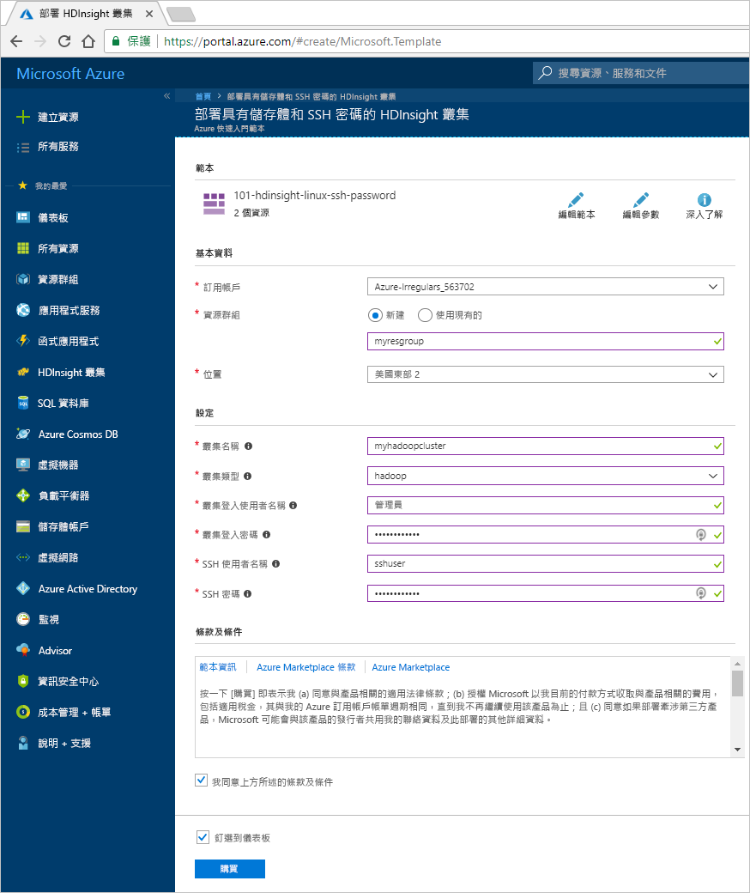
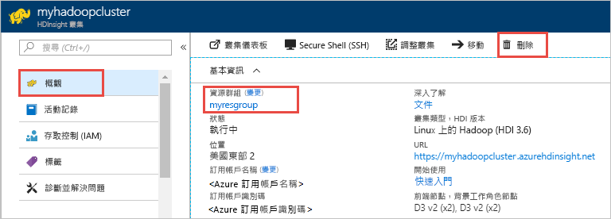

# 快速入門：使用 Resource Manager 範本在 Azure HDInsight 中建立 Apache Hadoop 叢集

在本快速入門中，您會了解如何使用 Resource Manager 範本在 Azure HDInsight 中建立 Apache Hadoop 叢集。

類似範本可在 [Azure 快速入門範本](https://azure.microsoft.com/resources/templates/?resourceType=Microsoft.Hdinsight&pageNumber=1&sort=Popular)中看到。 您可以在[這裡](https://docs.microsoft.com/azure/templates/microsoft.hdinsight/allversions)找到範本參考。  您也可以使用 [Azure 入口網站](apache-hadoop-linux-create-cluster-get-started-portal.md)建立叢集。  

HDInsight 目前隨附 [7 個不同的叢集類型](../hdinsight-overview.md#cluster-types-in-hdinsight)。 每種叢集類型都支援一組不同的元件。 所有叢集類型都支援 Hive。 如需 HDInsight 中支援的元件清單，請參閱 [HDInsight 在 Hadoop 叢集版本中提供的新功能](../hdinsight-component-versioning.md)  

如果您沒有 Azure 訂用帳戶，請在開始之前先[建立免費帳戶](https://azure.microsoft.com/free/)。

## 建立 Hadoop 叢集

1. 選取下方的 [部署至 Azure]  按鈕來登入 Azure，並在 Azure 入口網站中開啟 Resource Manager 範本。
   
    

2. 輸入或選取下列值：

    |屬性  |說明  |
    |---------|---------|
    |**訂用帳戶**     |  選取 Azure 訂用帳戶。 |
    |**資源群組**     | 建立資源群組，或選取現有的資源群組。  資源群組是 Azure 元件的容器。  在此案例中，資源群組包含 HDInsight 叢集和相依的 Azure 儲存體帳戶。 |
    |**位置**     | 選取您要建立叢集的 Azure 位置。  選擇靠近您的位置，以獲得最佳效能。 |
    |**叢集名稱**     | 輸入 Hadoop 叢集的名稱。 由於 HDInsight 中的所有叢集共用相同的 DNS 命名空間，因此這個名稱必須是唯一的。 名稱只能包含小寫字母、數字和連字號，且必須以字母開頭。  每個連字號前後都必須緊接非連字號的字元。  名稱長度也必須為 3 到 59 個字元。 |
    |**叢集類型**     | 選取 [Hadoop]  。 |
    |**叢集登入名稱和密碼**     | 預設登入名稱為 **admin**。密碼長度至少必須為 10 個字元，且必須包含至少一個數字、一個大寫字母及一個小寫字母、一個非英數字元 (除了字元 ' " ` \)。 確定您**不會提供**常見密碼，例如 "Pass@word1"。|
    |**SSH 使用者名稱和密碼**     | 預設的使用者名稱為 **sshuser**。  您可以將 SSH 使用者名稱重新命名。  SSH 使用者密碼與叢集登入密碼具有相同的需求。|

    某些屬性已硬式編碼在範本中。  您可以從範本設定這些值。 如需這些屬性的詳細說明，請參閱[在 HDInsight 中建立 Apache Hadoop 叢集](../hdinsight-hadoop-provision-linux-clusters.md)。

    > [!NOTE]  
    > 您提供的值必須是唯一且應該遵循命名方針。 範本不會執行驗證檢查。 如果您提供的值已在使用中或未遵循方針，則會在提交範本之後收到錯誤。  

    

3. 選取 [我同意上方所述的條款及條件]  ，然後選取 [購買]  。 您會收到一則通知，內容指出您的部署正在進行中。  大約需要 20 分鐘的時間來建立叢集。

4. 叢集建立好之後，您會收到**部署成功**通知，內有 [移至資源群組]  連結。  [資源群組]  頁面會列出新的 HDInsight 叢集以及與叢集相關聯的預設儲存體。 每個叢集都具備 [Azure 儲存體帳戶](../hdinsight-hadoop-use-blob-storage.md)或 [Azure Data Lake Storage 帳戶](../hdinsight-hadoop-use-data-lake-store.md)相依性。 也稱為預設儲存體帳戶。 HDInsight 叢集及其預設儲存體帳戶必須共置於相同的 Azure 區域中。 刪除叢集並不會刪除儲存體帳戶。

> [!NOTE]  
> 如需其他叢集建立方法及了解本快速入門中所使用的屬性，請參閱[建立 HDInsight 叢集](../hdinsight-hadoop-provision-linux-clusters.md)。

## 清除資源

完成此快速入門之後，您可以刪除叢集。 利用 HDInsight，您的資料會儲存在 Azure 儲存體中，以便您在未使用叢集時安全地進行刪除。 您也需支付 HDInsight 叢集的費用 (即使未使用)。 由於叢集費用是儲存體費用的許多倍，所以刪除未使用的叢集符合經濟效益。

> [!NOTE]  
> 如果您要「立即」  繼續下一個教學課程，以了解如何使用 HDInsight 上的 Hadoop 來執行 ETL 作業，則建議讓叢集保持執行狀態。 這是因為在教學課程中，您必須重新建立 Hadoop 叢集。 不過，如果您不會立即開始下一個教學課程，則現在就必須刪除該叢集。

**刪除叢集和/或預設儲存體帳戶**

1. 回到瀏覽器索引標籤，您可在其中存取 Azure 入口網站。 您應該位於叢集的 [概觀] 頁面上。 如果您只想刪除叢集，但保留預設儲存體帳戶，請選取 [刪除]  。

    

2. 如果您想要刪除叢集以及預設儲存體帳戶，則選取資源群組名稱 (上一個螢幕擷取畫面中醒目提示的項目) 來開啟資源群組頁面。

3. 選取 [刪除資源群組]  以刪除資源群組，其中包含了叢集和預設儲存體帳戶。 請注意，刪除資源群組會刪除儲存體帳戶。 如果您想要保留儲存體帳戶，請選擇只刪除叢集。

## 後續步驟

在本快速入門中，您已了解如何使用 Resource Manager 範本在 HDInsight 中建立 Apache Hadoop 叢集。 在下一篇文章中，您將了解如何使用 HDInsight 上的 Hadoop 來執行擷取、轉換及載入 (ETL) 作業。

> [!div class="nextstepaction"]
>[使用 HDInsight 上的互動式查詢來擷取、轉換和載入資料](../interactive-query/interactive-query-tutorial-analyze-flight-data.md)