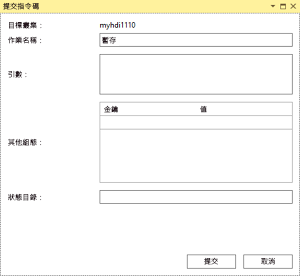
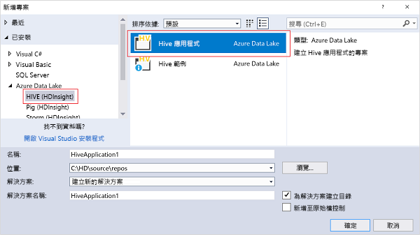

# 使用 Data Lake Tools for Visual Studio 連線至 Azure HDInsight 及執行 Hive 查詢

了解如何使用 Data Lake Tools for Visual Studio (也稱為 Azure Data Lake and Stream Analytics Tools for Visual Studio) 來連線到 [Azure HDInsight](../hdinsight-hadoop-introduction.md) 中的 Hadoop 叢集及提交 Hive 查詢。 

如需使用 HDInsight 的詳細資訊，請參閱 [HDInsight 簡介](../hdinsight-hadoop-introduction.md)和[開始使用 HDInsight](apache-hadoop-linux-tutorial-get-started.md)。 

如需連線到 Storm 叢集的詳細資訊，請參閱[使用 Visual Studio 開發 HDInsight 上 Apache Storm 的 C# 拓撲](../storm/apache-storm-develop-csharp-visual-studio-topology.md)。

您可以使用 Data Lake Tools for Visual Studio 來存取 Azure Data Lake Analytics 和 HDInsight。 如需 Data Lake Tools 的相關資訊，請參閱[使用 Data Lake Tools for Visual Studio 開發 U-SQL 指令碼](../../data-lake-analytics/data-lake-analytics-data-lake-tools-get-started.md)。

## 必要條件

若要完成本教學課程並使用 Data Lake Tools for Visual Studio，您需要下列項目：

* Azure HDInsight 叢集。 若要建立 HDInsight 叢集，請參閱[在 Azure HDInsight 中開始使用 Hadoop](apache-hadoop-linux-tutorial-get-started.md)。 若要執行互動式 Hive 查詢，您需要 [HDInsight 互動式查詢](../interactive-query/apache-interactive-query-get-started.md)叢集。
* 已安裝 Visual Studio 2017、2015 或 2013 的電腦。
    
    > [!NOTE]
    > Data Lake Tools for Visual Studio 目前只有英文版。
    > 
    > 

## 安裝或更新 Data Lake Tools for Visual Studio

### 安裝 Data Lake Tools

預設會針對 Visual Studio 2017 安裝 Data Lake Tools。 如果是舊版 Visual Studio，您可以使用 [Web Platform Installer](https://www.microsoft.com/web/downloads/platform.aspx) 來安裝 Data Lake Tools。 選擇與您的 Visual Studio 版本相符的 Data Lake Tools 版本。 

### 安裝 Visual Studio

如果您沒有安裝 Visual Studio，請使用 [Web Platform Installer](https://www.microsoft.com/web/downloads/platform.aspx) 來安裝最新版的 Visual Studio Community 和 Azure SDK：

### 更新工具

1. 開啟 Visual Studio。
2. 在 [工具] 功能表上，選取 [擴充功能和更新]。
3. 展開 [更新]，然後選取 [Azure Data Lake and Stream Analytics Tools] \(若已安裝)。

> [!NOTE]
>
> 您只可以使用 Data Lake Tools 2.3.0.0 版或更新版本，連線到互動式查詢叢集及執行互動式 Hive 查詢。

## 連線到 Azure 訂用帳戶
您可以使用 Data Lake Tools for Visual Studio 連線到您的 HDInsight 叢集、執行一些基本管理作業，以及執行 Hive 查詢。

> [!NOTE]
> 如需連線到一般 Hadoop 叢集的相關資訊，請參閱[使用 Visual Studio 撰寫和提交 Hive 查詢](http://blogs.msdn.com/b/xiaoyong/archive/2015/05/04/how-to-write-and-submit-hive-queries-using-visual-studio.aspx)。
> 
> 

若要連線到您的 Azure 訂用帳戶：

1. 開啟 Visual Studio。
2. 在 [檢視] 功能表上選取 [伺服器總管]。
3. 在 [伺服器總管] 中，展開 [Azure]，然後展開 [HDInsight]。
   
   > [!NOTE]
   > 此時 [HDInsight 工作清單] 視窗應會開啟。 如果您沒看到該視窗，請在 [檢視] 功能表上選取 [其他視窗]，然後選取 [HDInsight 工作清單視窗]。  
   > 
   > 
4. 輸入您的 Azure 訂用帳戶認證，然後選取 [登入]。 只有您從未在此電腦上從 Visual Studio 連線到 Azure 訂用帳戶時，才需要驗證。
5. 在 [伺服器總管] 中，現有 HDInsight 叢集的清單隨即出現。 如果您沒有任何叢集，可以使用 Azure 入口網站、Azure PowerShell 或 HDInsight SDK 來建立一個。 如需詳細資訊，請參閱[建立 HDInsight 叢集](../hdinsight-hadoop-provision-linux-clusters.md)。
   
   
6. 展開某個 HDInsight 叢集。 **Hive 資料庫**、預設儲存體帳戶、連結的儲存體帳戶，以及 **Hadoop 服務記錄**隨即出現。 您可以進一步展開這些實體。

在連線到您的 Azure 訂用帳戶之後，您可以執行下列工作。

若要從 Visual Studio 連線到 Azure 入口網站：

1. 在 [伺服器總管] 中，選取 [Azure] > [HDInsight]。
2. 在 HDInsight 叢集上按一下滑鼠右鍵，然後選取 [在 Azure 入口網站中管理叢集]。

若要從 Visual Studio 提出問題及提供意見反應：

1. 在 [工具] 功能表上，選取 [HDInsight]。
2. 若要提出問題，請選取 [MSDN 論壇]。 若要提供意見反應，請選取 [提供意見反應]。

## 瀏覽連結的資源
在 [伺服器總管] 中，您可以看到預設的儲存體帳戶，以及任何連結的儲存體帳戶。 如果您展開預設儲存體帳戶，您可以看到儲存體帳戶上的容器。 預設儲存體帳戶和預設容器皆已標示。 在任何容器上按一下滑鼠右鍵以檢視容器內容。

開啟容器之後，您可以使用下列按鈕來上傳、刪除及下載 Blob：

## 執行互動式 Hive 查詢
[Apache Hive](http://hive.apache.org) 是以 Hadoop 為基礎的資料倉儲基礎結構。 Hive 用於進行資料彙整、查詢及分析。 您可以使用 Data Lake Tools for Visual Studio 從 Visual Studio 執行 Hive 查詢。 如需 Hive 的詳細資訊，請參閱[使用 Hive 搭配 HDInsight](hdinsight-use-hive.md)。

[互動式查詢](../interactive-query/apache-interactive-query-get-started.md)在 Apache Hive 2.1 中使用 [LLAP 上的 Hive](https://cwiki.apache.org/confluence/display/Hive/LLAP)。 互動式查詢可將互動功能整合到已儲存的大型資料集上的複雜資料倉儲樣式查詢。 相較於傳統的 Hive 批次作業，在互動式查詢上執行 Hive 查詢比較快速。 如需詳細資訊，請參閱[執行 Hive 批次作業](#run-hive-batch-jobs)。

> [!NOTE]
>
> 只有在您連線到 [HDInsight 互動式查詢](../interactive-query/apache-interactive-query-get-started.md)叢集時，您才可以執行互動式 Hive 查詢。

您也可以使用 Data Lake Tools for Visual Studio 來查看 Hive 作業的內容。 Data Lake Tools for Visual Studio 會收集和呈現特定 Hive 作業的 Yarn 記錄。

### 檢視 **hivesampletable**
所有 HDInsight 叢集均有一個稱為 hivesampletable 的預設範例 Hive 資料表。 此 Hive 資料表會定義如何列出 Hive 資料表、檢視資料表結構描述，以及列出 Hive 資料表中的資料列。

若要列出 Hive 資料表和檢視 Hive 資料表結構描述：

1. 若要查看資料表結構描述，請在 [伺服器總管] 中，選取 [Azure] > [HDInsight]。 選取您的叢集，然後選取 [Hive 資料庫] > [預設值] > [hivesampletable]。
2. 在 [hivesampletable] 上按一下滑鼠右鍵，然後按一下 [檢視前 100 個資料列] 來列出資料列。 這相當於使用 Hive ODBC 驅動程式來執行下列 Hive 查詢：
   
     `SELECT * FROM hivesampletable LIMIT 100`
   
   您可以自訂資料列計數。
   
   

### 建立 Hive 資料表
若要建立 Hive 資料表，您可以使用 GUI 或使用 Hive 查詢。 如需使用 Hive 查詢的相關資訊，請參閱 [執行 Hive 查詢](#run.queries)。

若要建立 Hive 資料表：

1. 在 [伺服器總管] 中，選取 [Azure] > [HDInsight 叢集]。 選取您的 HDInsight 叢集，然後選取 [Hive 資料庫]。
2. 請以滑鼠右鍵按一下 [預設值]，然後選取 [建立資料表]。
3. 設定資料表。  
4. 選取 [建立資料表] 以提交作業來建立新的 Hive 資料表。
   
    

### 驗證和執行 Hive 查詢
您有兩個選項可建立和執行 Hive 查詢：

* 建立特定查詢
* 建立 Hive 應用程式

若要建立、驗證和執行特定查詢：

1. 在 [伺服器總管] 中，選取 [Azure] > [HDInsight 叢集]。
2. 在您想要執行查詢的叢集上按一下滑鼠右鍵，然後選取 [撰寫 Hive 查詢]。  
3. 輸入 Hive 查詢。 

    Hive 編輯器支援 Intellisense。 Data Lake Tools for Visual Studio 支援在編輯 Hive 指令碼時載入遠端中繼資料。 例如，如果您輸入 **SELECT * FROM**，IntelliSense 會列出所有建議的資料表名稱。 若已指定資料表名稱，IntelliSense 會列出資料行名稱。 此工具支援大部分的 Hive DML 陳述式、子查詢及內建 UDF。
   
    
   
    
   
   > [!NOTE]
   > IntelliSense 只建議 HDInsight 工具列中已選取的叢集中繼資料。
   > 
   
4. (選擇性) 若要檢查指令碼語法錯誤，請選取 [驗證指令碼]。
   
    
5. 選取 [提交] 或 [提交 (進階)]。 如果您選取進階提交選項，請設定指令碼的 [作業名稱]、[引數]、[其他組態] 和 [狀態目錄]：
   
    
   
    提交作業之後，[Hive 作業摘要] 視窗隨即出現。
   
    
6. 使用 [重新整理] 按鈕來更新狀態，直到工作狀態變更為 [已完成] 為止。
7. 選取底部的連結以查看 [作業查詢]、[作業輸出]、[作業記錄] 或 [Yarn 記錄]。

若要建立和執行 Hive 解決方案：

1. 在 [檔案] 功能表上，選取 [新增]，然後選取 [專案]。
2. 在左窗格中，選取 [HDInsight]。 在中間窗格中，選取 [Hive 應用程式]。 輸入屬性，然後選取 [確定]。
   
    
3. 在 [方案總管] 中，按兩下 **Script.hql** 來開啟指令碼。
4. 若要驗證 Hive 指令碼，請選取 [驗證指令碼] 按鈕。 或者，您可以滑鼠右鍵按一下 Hive 編輯器中的指令碼，然後從操作功能表中選取 [驗證指令碼]。

### 檢視 Hive 工作
您可以檢視 Hive 工作的工作查詢、工作輸出、工作記錄和 Yarn 記錄。 如需詳細資訊，請參閱上面的螢幕擷取畫面。

在工具的最新版本中，您可以藉由收集和呈現 Yarn 記錄來查看 Hive 作業的內容。 Yarn 記錄可協助您調查效能問題。 如需 HDInsight 如何收集 Yarn 記錄的詳細資訊，請參閱[以程式設計方式存取 HDInsight 應用程式記錄](../hdinsight-hadoop-access-yarn-app-logs.md)。

若要檢視 Hive 作業：

1. 在 [伺服器總管] 中，展開 [Azure]，然後展開 [HDInsight]。
2. 在某個 HDInsight 叢集上按一下滑鼠右鍵，然後選取 [檢視作業]。 在該叢集上執行的 Hive 作業清單隨即出現。  
3. 選取一個工作。 在 [Hive 作業摘要] 視窗中，選取下列其中一項：
    - **作業查詢**
    - **工作輸出**
    - **作業記錄**  
    - **Yarn 記錄**
   
    

### 透過 HiveServer2 的更快速路徑 Hive 執行
> [!NOTE]
> 此功能只適用於 HDInsight 3.2 版或更新版本中的叢集。
 
Data Lake Tools for Visual Studio 用來透過 [WebHCat](https://cwiki.apache.org/confluence/display/Hive/WebHCat) (也稱為 Templeton) 提交 Hive 作業。 用於提交 Hive 作業的這個方法傳回作業詳細資料和錯誤資訊所需的時間很長。

為了解決此效能問題，Data Lake Tools for Visual Studio 可略過 RDP/SSH 並透過 HiveServer2 直接在叢集中執行 Hive 作業。

除了提升效能，採用此方法，也可以在 Apache Tez 圖表上和在工作詳細資料中檢視 Hive。

在 HDInsight 3.2 版或更新版本的叢集中，[透過 HiveServer2 執行] 按鈕隨即出現：

您也可以即時查看串流送回的記錄。 如果 Hive 查詢是在 Tez 中執行，您也可以查看作業圖表。

### 透過 HiveServer2 執行與透過 WebHCat 提交查詢

雖然透過 HiveServer2 執行查詢可讓您獲得許多效能方面的優點，但這個方法仍有幾項限制。 其中有些限制讓這個方法不適合用於生產環境。 

下表顯示透過 HiveServer2 執行查詢與透過 WebHCat 提交查詢之間的差異：

|  | 透過 HiveServer2 執行 | 透過 WebHCat 提交 |
| --- | --- | --- |
| 執行查詢 |會排除 WebHCat 中的額外負荷 (WebHCat 會啟動名為 TempletonControllerJob 的 MapReduce 作業)。 |如果查詢是透過 WebHCat 執行，WebHCat 就會啟動帶來額外延遲的 MapReduce 作業。 |
| 將記錄檔串流回來 |幾近即時。 |只在工作結束時才提供工作執行記錄檔。 |
| 檢視工作歷程記錄 |如果查詢是透過 HiveServer2 執行，系統將不會保存查詢的作業歷程記錄 (作業記錄、作業輸出)。 您可以在 Yarn UI 中檢視應用程式的有限資訊。 |如果查詢是透過 WebHCat 執行，系統將不會保存查詢的作業歷程記錄 (作業記錄、作業輸出)。 您可以使用 Visual Studio、HDInsight SDK 或 PowerShell 來檢視作業歷程記錄。 |
| 關閉視窗 |透過 HiveServer2 執行是「同步進行的」。 如果關閉視窗，則會取消查詢執行。 |透過 WebHCat 提交是「非同步進行的」。 您可以透過 WebHCat 提交查詢，然後關閉 Visual Studio。 您隨時可以回來查看結果。 |

### Tez Hive 工作效能圖表
在 Data Lake Tools for Visual Studio 中，您可以查看效能圖表，其中顯示 Tez 執行引擎所執行的 Hive 作業。 如需啟用 Tez 的相關資訊，請參閱[在 HDInsight 中使用 Hive](hdinsight-use-hive.md)。 

您在 Visual Studio 中提交 Hive 作業之後，Visual Studio 會在作業完成時顯示圖表。 您可能需要選取 [重新整理] 按鈕，才能檢視最新的作業狀態。

> [!NOTE]
> 此功能只適用於 HDInsight 3.2.4.593 版或更新版本中的叢集。 此功能只適用於已完成的作業。 您也必須透過 WebHCat 提交作業，才能使用這項功能。 當您透過 HiveServer2 執行查詢時會出現下列影像： 
> 
> 

為了協助您更了解 Hive 查詢，這一版中新增了 [Hive 運算子] 檢視。 若要檢視頂點內的所有運算子，可按兩下作業圖表的頂點。 您也可以指向特定運算子，以查看有關運算子的更多詳細資料。

### Hive on Tez 作業的工作執行檢視
您可以使用 Hive on Tez 作業的 [工作執行檢視] 來取得 Hive 作業的結構化和視覺化資訊。 您也可以取得更多作業詳細資料。 如果發生效能問題，您可以使用此檢視來取得有關問題的更多詳細資料。 例如，您可以取得每個工作的運作方式資訊，以及每個工作的詳細資訊 (資料讀取/寫入、排程/開始/結束時間等)。 使用此資訊，根據視覺化資訊來微調作業組態或系統架構。

## 執行 Hive 批次作業
針對 HDInsight 叢集測試 Hive 指令碼十分耗時 (但互動式查詢叢集例外)。 此程序可能需要數秒鐘或更多的時間。 Data Lake Tools for Visual Studio 可以在本機驗證 Hive 指令碼，而不需要連線到即時叢集。 如需執行互動式查詢的詳細資訊，請參閱[執行互動式 Hive 查詢](#run-interactive-hive-queries)。

您可以使用 Data Lake Tools for Visual Studio 來查看 Hive 作業的內容，方法是收集和呈現特定 Hive 作業的 Yarn 記錄。

若要深入了解如何執行 Hive 批次作業，請參閱[執行互動式 Hive 查詢](#run-interactive-hive-queries)。 該節中的資訊適用於長時間執行 Hive 批次作業。

## 執行 Pig 指令碼
您可以使用 Data Lake Tools for Visual Studio 來建立 Pig 指令碼並提交至 HDInsight 叢集。 首先，從範本建立 Pig 專案。 然後，將指令碼提交至 HDInsight 叢集。

## 意見反應和已知問題
* 目前 HiveServer2 結果會以純文字格式顯示，但不太理想。 Microsoft 正努力修正這個問題。
* 尚未修正以下問題：未顯示以 null 值開頭的結果。 如果您因為此問題而遭到封鎖，請連絡支援小組。
* Visual Studio 所建立的 HQL 指令碼是根據使用者的所在區域設定進行編碼。 如果您將指令碼當作二進位檔案上傳到叢集，則指令碼不會正確執行。

## 後續步驟
在本文中，您已了解如何使用 Data Lake Tools for Visual Studio 套件從 Visual Studio 連線到 HDInsight 叢集。 您也了解如何執行 Hive 查詢。 如需詳細資訊，請參閱這些文章：

* [在 HDInsight 中使用 Hadoop Hive](hdinsight-use-hive.md)
* [開始在 HDInsight 中使用 Hadoop](apache-hadoop-linux-tutorial-get-started.md)
* [在 HDInsight 上提交 Hadoop 工作](submit-apache-hadoop-jobs-programmatically.md)
* [在 HDInsight 中使用 Hadoop 分析 Twitter 資料](../hdinsight-analyze-twitter-data.md)

