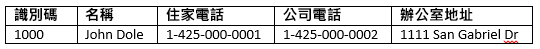
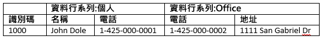

# <a name="quickstart-query-apache-hbase-in-azure-hdinsight-with-hbase-shell"></a>快速入門：使用 HBase Shell 在 Azure HDInsight 中查詢 Apache HBase

在本快速入門中，您將了解如何使用 Apache HBase Shell 來建立 HBase 資料表、插入資料，然後查詢資料表。

如果您沒有 Azure 訂用帳戶，請在開始前建立[免費帳戶](https://azure.microsoft.com/free/?WT.mc_id=A261C142F)。

## <a name="prerequisites"></a>必要條件

* Apache HBase 叢集。 請參閱[建立叢集](../hadoop/apache-hadoop-linux-tutorial-get-started.md#create-cluster)以建立 HDInsight 叢集。  請確定您選擇的是 [HBase]  叢集類型。

* SSH 用戶端。 如需詳細資訊，請參閱[使用 SSH 連線至 HDInsight (Apache Hadoop)](../hdinsight-hadoop-linux-use-ssh-unix.md)。

## <a name="create-a-table-and-manipulate-data"></a>建立資料表並操作資料

對大多數人而言，資料會以表格形式出現：



在 HBase (實作 [Cloud BigTable](https://cloud.google.com/bigtable/)) 中，相同的資料看起來如下：



您可以使用 SSH 來連線到 HBase 叢集，然後使用 Apache HBase Shell 來建立 HBase 資料表、插入資料及查詢資料。

1. 使用 `ssh` 命令來連線至您的 HBase 叢集。 編輯以下命令並將 `CLUSTERNAME` 取代為您叢集的名稱，然後輸入命令：

    ```cmd
    ssh sshuser@CLUSTERNAME-ssh.azurehdinsight.net
    ```

2. 使用 `hbase shell` 命令來啟動 HBase 互動式殼層。 在您的 SSH 連線中輸入下列命令：

    ```bash
    hbase shell
    ```

3. 使用 `create` 命令來建立含兩個資料行系列的 HBase 資料表。 輸入下列命令：

    ```hbase
    create 'Contacts', 'Personal', 'Office'
    ```

4. 使用 `list` 命令來列出 HBase 中的所有資料表。 輸入下列命令：

    ```hbase
    list
    ```

5. 使用 `put` 命令來將值插入特定資料表中之指定資料列的指定資料行。 輸入下列命令：

    ```hbase
    put 'Contacts', '1000', 'Personal:Name', 'John Dole'
    put 'Contacts', '1000', 'Personal:Phone', '1-425-000-0001'
    put 'Contacts', '1000', 'Office:Phone', '1-425-000-0002'
    put 'Contacts', '1000', 'Office:Address', '1111 San Gabriel Dr.'
    ```

6. 使用 `scan` 命令來掃描並傳回 `Contacts` 資料表資料。 輸入下列命令：

    ```hbase
    scan 'Contacts'
    ```

7. 使用 `get` 命令來擷取資料列的內容。 輸入下列命令：

    ```hbase
    get 'Contacts', '1000'
    ```

    您會看到與使用 `scan` 命令類似的結果，因為只有一個資料列。

8. 使用 `delete` 命令來刪除資料表中資料格的值。 輸入下列命令：

    ```hbase
    delete 'Contacts', '1000', 'Office:Address'
    ```

9. 使用 `disable` 命令來停用資料表。 輸入下列命令：

    ```hbase
    disable 'Contacts'
    ```

10. 使用 `drop` 命令來將資料表從 HBase 卸除。 輸入下列命令：

    ```hbase
    drop 'Contacts'
    ```

11. 使用 `exit` 命令來停止 HBase 互動式殼層。 輸入下列命令：

    ```hbase
    exit
    ```

如需 HBase 資料表結構描述的詳細資訊，請參閱 [Apache HBase 結構描述設計簡介](http://0b4af6cdc2f0c5998459-c0245c5c937c5dedcca3f1764ecc9b2f.r43.cf2.rackcdn.com/9353-login1210_khurana.pdf) \(英文\)。 如需其他 HBase 命令，請參閱 [Apache HBase 參考指南](https://hbase.apache.org/book.html#quickstart) \(英文\)。

## <a name="clean-up-resources"></a>清除資源

完成此快速入門之後，您可以刪除叢集。 利用 HDInsight，您的資料會儲存在 Azure 儲存體中，以便您在未使用叢集時安全地進行刪除。 您也需支付 HDInsight 叢集的費用 (即使未使用)。 由於叢集費用是儲存體費用的許多倍，所以刪除未使用的叢集符合經濟效益。

若要刪除叢集，請參閱[使用您的瀏覽器、PowerShell 或 Azure CLI 刪除 HDInsight 叢集](../hdinsight-delete-cluster.md)。

## <a name="next-steps"></a>後續步驟

在本快速入門中，您已了解如何使用 Apache HBase Shell 來建立 HBase 資料表、插入資料，然後查詢資料表。 若要深入了解儲存在 HBase 中的資料，下一篇文章將會說明如何使用 Apache Spark 來執行查詢。

> [!div class="nextstepaction"]
> [使用 Apache Spark 來讀取和寫入 Apache HBase 資料](../hdinsight-using-spark-query-hbase.md)