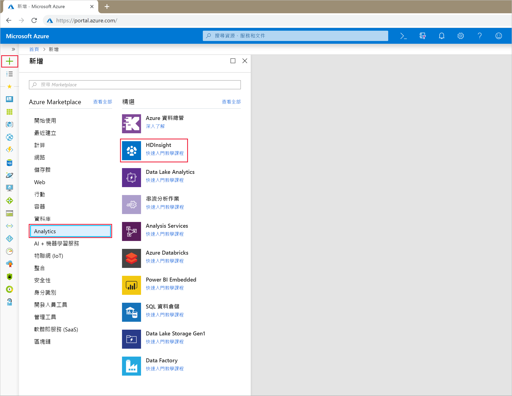

# <a name="start-with-apache-kafka-on-hdinsight"></a>開始使用 Apache Kafka on HDInsight

了解如何在 Azure HDInsight 上建立和使用 [Apache Kafka](https://kafka.apache.org) 叢集。 Kafka 是 HDInsight 提供的開放原始碼分散式串流平台。 它通常作為訊息代理程式，因為它提供了類似於發佈-訂閱訊息佇列的功能。 Kafka 通常會搭配 Apache Spark 和 Apache Storm 使用，可進行傳訊、活動追蹤、串流彙總或資料轉換。

[!INCLUDE [delete-cluster-warning](../../../includes/hdinsight-delete-cluster-warning.md)]

## <a name="create-a-kafka-cluster"></a>建立 Kafka 叢集

若要在 HDInsight 叢集上建立 Kafka，請使用下列步驟：

1. 從 [Azure 入口網站](https://portal.azure.com)，選取 [+ 建立資源]、[資料 + 分析]，然後選取 [HDInsight]。
   
    

2. 從 [基本概念]，輸入以下資訊：

    * **叢集名稱**︰HDInsight 叢集的名稱。 此名稱必須是唯一的。
    * **訂用帳戶**：選取要使用的訂用帳戶。
    * **叢集類型**：選取此項目，然後在 [叢集組態] 中設定下列值︰

        * **叢集類型**：Kafka
        * **版本**：Kafka 0.10.0 (HDI 3.6)

        使用 [選取] 按鈕來儲存叢集類型設定。

        

    * **叢集登入使用者名稱**和**叢集登入密碼**：透過 HTTPS 存取叢集時使用的登入資訊。 您會使用這些認證來存取例如 Ambari Web UI 或 REST API 等服務。
    * **安全殼層 (SSH) 使用者名稱**：透過 SSH 存取叢集時使用的登入資訊。 依預設，密碼要與叢集登入密碼相同。
    * **資源群組**：在其中建立叢集的資源群組。
    * **位置**：在其中建立叢集的 Azure 區域。

        > [!IMPORTANT]
        > 若要獲得高度資料可用性，建議您選取包含__三個故障網域__的位置 (區域)。 如需詳細資訊，請參閱[資料高可用性](#data-high-availability)一節。
   
 

3. 使用 [下一步] 按鈕來完成基本設定。

4. 從 [儲存體]，選取或建立儲存體帳戶。 本文件的步驟是將其他欄位保留為預設值。 使用 [下一步] 按鈕以儲存儲存體組態。

    

5. 從 [應用程式 (選擇性)]，選取 [下一步] 以繼續。 這個範例不需要任何應用程式。

6. 從 [叢集大小]，選取 [下一步] 以繼續。

    > [!WARNING]
    > 若要保證 Kafka 在 HDInsight 上的可用性，您的叢集必須包含至少三個背景工作角色節點。 如需詳細資訊，請參閱[資料高可用性](#data-high-availability)一節。

    

    > [!IMPORTANT]
    > [每個背景工作角色節點的磁碟數] 項目會設定 HDInsight 上 Kafka 的延展性。 HDInsight 上的 Kafka 會在叢集中使用虛擬機器的本機磁碟。 Kafka 的 I/O 非常大量，因此會使用 [Azure 受控磁碟](../../virtual-machines/windows/managed-disks-overview.md)來提供高輸送量，並提供每個節點更多儲存空間。 受控磁碟的類型可以是__標準__ (HDD) 或__進階__ (SSD)。 進階磁碟會與 DS 和 GS 系列搭配使用。 所有其他的 VM 類型是使用標準磁碟。

7. 從 [進階設定]，選取 [下一步] 以繼續。

8. 從 [摘要] 檢閱叢集組態。 使用 [編輯] 連結來變更所有不正確的設定。 最後，使用 [建立] 按鈕來建立叢集。
   
    
   
    > [!NOTE]
    > 建立叢集可能需要花費 20 分鐘的時間。

## <a name="connect-to-the-cluster"></a>連接到叢集

> [!IMPORTANT]
> 執行下列步驟時，您必須使用 SSH 用戶端。 如需詳細資訊，請參閱[搭配 HDInsight 使用 SSH](../hdinsight-hadoop-linux-use-ssh-unix.md) 文件。

若要使用 SSH 連線到叢集，您必須提供 SSH 使用者帳戶名稱和叢集名稱。 在下列範例中，使用帳戶名稱和叢集名稱來取代 `sshuser` 和 `clustername`：

```ssh sshuser@clustername-ssh.azurehdinsight.net```

出現提示時，輸入您用於 SSH 帳戶的密碼。

如需相關資訊，請參閱[搭配 HDInsight 使用 SSH](../hdinsight-hadoop-linux-use-ssh-unix.md)。

## <a id="getkafkainfo"></a>取得 Zookeeper 和訊息代理程式主機資訊

使用 Kafka 時，您必須知道 Zookeeper 主機和訊息代理程式主機。 這些主機可搭配 Kafka API 以及 Kafka 隨附的許多公用程式使用。

使用下列步驟來建立包含主機資訊的環境變數：

1. 在連往叢集的 SSH 連線中，使用下列命令來安裝 `jq` 公用程式。 此公用程式用來剖析 JSON 文件，而且在擷取訊息代理程式主機資訊時很有用︰
   
    ```bash
    sudo apt -y install jq
    ```

2. 若要將環境變數設為叢集名稱，請使用下列命令：

    ```bash
    read -p "Enter the HDInsight cluster name: " CLUSTERNAME
    ```

3. 若要使用 Zookeeper 主機資訊設定環境變數，請使用下列命令：

    ```bash
    export KAFKAZKHOSTS=`curl -sS -u admin -G https://$CLUSTERNAME.azurehdinsight.net/api/v1/clusters/$CLUSTERNAME/services/ZOOKEEPER/components/ZOOKEEPER_SERVER | jq -r '["\(.host_components[].HostRoles.host_name):2181"] | join(",")' | cut -d',' -f1,2`
    ```

    出現提示時，輸入叢集登入帳戶的密碼 (管理員)。

4. 若要確認是否已正確設定環境變數，請使用下列命令：

    ```bash
     echo '$KAFKAZKHOSTS='$KAFKAZKHOSTS
    ```

    此命令會傳回類似以下文字的資訊：

    `zk0-kafka.eahjefxxp1netdbyklgqj5y1ud.ex.internal.cloudapp.net:2181,zk2-kafka.eahjefxxp1netdbyklgqj5y1ud.ex.internal.cloudapp.net:2181`

5. 若要使用 Kafka 訊息代理程式主機資訊來設定環境變數，請使用下列命令：

    ```bash
    export KAFKABROKERS=`curl -sS -u admin -G https://$CLUSTERNAME.azurehdinsight.net/api/v1/clusters/$CLUSTERNAME/services/KAFKA/components/KAFKA_BROKER | jq -r '["\(.host_components[].HostRoles.host_name):9092"] | join(",")' | cut -d',' -f1,2`
    ```

    出現提示時，輸入叢集登入帳戶的密碼 (管理員)。

6. 若要確認是否已正確設定環境變數，請使用下列命令：

    ```bash   
    echo '$KAFKABROKERS='$KAFKABROKERS
    ```

    此命令會傳回類似以下文字的資訊：
   
    `wn1-kafka.eahjefxxp1netdbyklgqj5y1ud.cx.internal.cloudapp.net:9092,wn0-kafka.eahjefxxp1netdbyklgqj5y1ud.cx.internal.cloudapp.net:9092`
   
> [!WARNING]
> 請勿認為從此工作階段傳回的資訊永遠都正確無誤。 調整叢集時，會新增或移除新的訊息代理程式。 如果發生失敗且節點被更換，則節點的主機名稱可能會變更。
>
> 您應在使用 Zookeeper 和訊息代理程式主機資訊不久前擷取該資訊，以確保您具備有效的資訊。

## <a name="create-a-topic"></a>建立主題

Kafka 會將資料串流儲存在名為 *topics* 的類別中。 在連往叢集前端節點的 SSH 連線中，使用 Kafka 所提供的指令碼來建立主題︰

```bash
/usr/hdp/current/kafka-broker/bin/kafka-topics.sh --create --replication-factor 3 --partitions 8 --topic test --zookeeper $KAFKAZKHOSTS
```

此命令會使用 `$KAFKAZKHOSTS` 中儲存的主機資訊連線到 Zookeeper。 然後建立名為 **test** 的 Kafka 主題。 您可以確認使用下列指令碼建立的主題可列出主題︰

```bash
/usr/hdp/current/kafka-broker/bin/kafka-topics.sh --list --zookeeper $KAFKAZKHOSTS
```

此命令的輸出會在叢集上列出 Kafka 主題。

## <a name="produce-and-consume-records"></a>產生和取用記錄

Kafka 會在主題中儲存「記錄」。 記錄是由「產生者」產生，並由「取用者」取用。 產生者會在 Kafka「訊息代理程式」中產生記錄。 HDInsight 叢集中的每個背景工作節點都是 Kafka 訊息代理程式。

若要將記錄儲存至您稍早建立的 test 主題，然後利用取用者進行讀取，請使用下列步驟：

1. 在 SSH 工作階段中，使用 Kafka 提供的指令碼將記錄寫入主題︰
   
    ```bash
    /usr/hdp/current/kafka-broker/bin/kafka-console-producer.sh --broker-list $KAFKABROKERS --topic test
    ```
   
    在此命令之後，您會抵達空白行。

2. 在空白行中輸入文字訊息並按一下 enter 鍵。 如此輸入幾個訊息，然後使用 **Ctrl + C** 返回一般提示。 每一行都會以個別記錄傳送至 Kafka 主題。

3. 使用 Kafka 提供的指令碼來讀取主題中的記錄︰
   
    ```bash
    /usr/hdp/current/kafka-broker/bin/kafka-console-consumer.sh --bootstrap-server $KAFKABROKERS --topic test --from-beginning
    ```
   
    此命令會擷取主題中的記錄並加以顯示。 使用 `--from-beginning` 告知取用者從串流的開頭開始，所以會擷取所有的記錄。

    > [!NOTE]
    > 如果您使用舊版 Kafka，請以 `--zookeeper $KAFKAZKHOSTS` 取代 `--bootstrap-server $KAFKABROKERS`。

4. 使用 __Ctrl + C__ 來停止取用者。

您也可以利用程式設計方式建立產生者和取用者。 如需使用此 API 的範例，請參閱[採用 HDInsight 的 Kafka 產生者和取用者 API](apache-kafka-producer-consumer-api.md) 文件。

## <a name="data-high-availability"></a>資料高可用性

每個 Azure 區域 (位置) 提供_容錯網域_。 容錯網域是 Azure 資料中心內基礎硬體的邏輯群組。 每個容錯網域會共用通用電源和網路交換器。 實作 HDInsight 叢集內節點的虛擬機器和受控磁碟會分散於這些容錯網域。 此架構會限制實體硬體故障的潛在影響。

如需區域中的容錯網域數目的資訊，請參閱 [Linux 虛擬機器的可用性](../../virtual-machines/windows/manage-availability.md#use-managed-disks-for-vms-in-an-availability-set)文件。

> [!IMPORTANT]
> 可能的話，請使用包含三個容錯網域的 Azure 區域，並使用複寫因子 3 建立主題。

如果您使用只包含兩個容錯網域的區域，則請使用複寫因子 4 將複本平均分散於兩個容錯網域。

### <a name="kafka-and-fault-domains"></a>Kafka 和容錯網域

Kafka 不知道容錯網域。 為主題建立副本時，可能無法正確發散副本以實現高可用性。 若要確保高可用性，請使用[Kafka 分割重新平衡工具](https://github.com/hdinsight/hdinsight-kafka-tools)。 必須從 Kafka 叢集前端節點的 SSH 工作階段執行此工具。

若要確保 Kafka 資料的最高可用性，您應該在下列時間重新平衡您主題的磁碟分割複本：

* 建立新主題或磁碟分割時

* 相應增加叢集時

## <a name="delete-the-cluster"></a>刪除叢集

[!INCLUDE [delete-cluster-warning](../../../includes/hdinsight-delete-cluster-warning.md)]

## <a name="troubleshoot"></a>疑難排解

如果您在建立 HDInsight 叢集時遇到問題，請參閱[存取控制需求](../hdinsight-administer-use-portal-linux.md#create-clusters)。

## <a name="next-steps"></a>後續步驟

在本文件中，您已學會使用 Apache Kafka on HDInsight 的基本概念。 使用下列各項來深入了解 Kafka 的使用方式︰

* [分析 Kafka 日誌](apache-kafka-log-analytics-operations-management.md)
* [在Kafka 叢集之間複寫資料](apache-kafka-mirroring.md)
* [採用 HDInsight 的 Kafka 產生者和取用者 API](apache-kafka-producer-consumer-api.md)
* [採用 HDInsight 的 Kafka Streams API](apache-kafka-streams-api.md)
* [搭配 HDInsight 上的 Kafka 使用 Apacha Spark 串流 (DStream)](../hdinsight-apache-spark-with-kafka.md)
* [搭配 HDInsight 上的 Kafka 使用 Spark 結構化串流](../hdinsight-apache-kafka-spark-structured-streaming.md)
* [使用 Apache Spark 結構化串流將資料從 HDInsight 上的 Kafka 移至 Cosmos DB](../apache-kafka-spark-structured-streaming-cosmosdb.md)
* [使用 Apache Storm 搭配 HDInsight 上的 Kafka](../hdinsight-apache-storm-with-kafka.md)
* [透過 Azure 虛擬網路連線到 Kafka](apache-kafka-connect-vpn-gateway.md)
* [使用 Kafka 搭配 Azure Container Service](apache-kafka-azure-container-services.md)
* [使用 Kafka 搭配 Azure 函式應用程式](apache-kafka-azure-functions.md)
