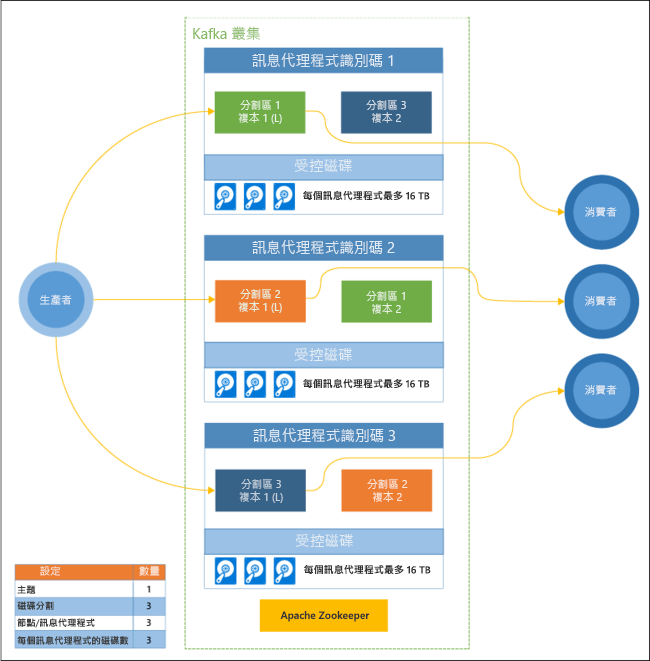

# 什麼是 HDInsight 上的 Apache Kafka？

[Apache Kafka](https://kafka.apache.org) 是開放原始碼分散式串流平台，可用來建置即時串流資料管線和應用程式。 Kafka 也提供類似於訊息佇列的訊息代理程式功能，可讓您發佈和訂閱具名資料流。 

HDInsight 上的 Apache Kafka 特定特性如下：

* 它是一個受控服務，可提供簡化的設定程序。 結果會是已經過測試且 Microsoft 支援的設定。

* Microsoft 會針對 Kafka 執行時間提供 99.9% 的服務等級協定 (SLA)。 如需詳細資訊，請參閱[適用於 HDInsight 的 SLA 資訊](https://azure.microsoft.com/support/legal/sla/hdinsight/v1_0/)文件。

* 它會使用 Azure 受控磁碟作為 Kafka 的備份存放區。 受控磁碟可針對每個 Kafka 訊息代理程式最多提供 16 TB 的儲存空間。 如需使用 HDInsight 上的 Kafka 設定受控磁碟的資訊，請參閱[提高 HDInsight 上的 Kafka 延展性](apache-kafka-scalability.md)。

    如需受控磁碟的詳細資訊，請參閱 [Azure 受控磁碟](../../virtual-machines/windows/managed-disks-overview.md)。

* Kafka 是針對機架的單一維度檢視而設計的。 Azure 會將一個機架分隔成兩個維度：更新網域 (UD) 和容錯網域 (FD)。 Microsoft 所提供的工具會重新平衡各 UD 和 FD 的 Kafka 分割區和複本。 

    如需詳細資訊，請參閱[使用 HDInsight 上的 Kafka 確保高可用性](apache-kafka-high-availability.md)文件。

* HDInsight 可讓您在叢集建立後，變更背景工作節點 (裝載 Kafka 訊息代理程式的節點) 的數目。 您可以從 Azure 入口網站、Azure PowerShell 及其他 Azure 管理介面執行調整。 對於 Kafka，您應該在調整作業完成後重新平衡磁碟分割複本。 重新平衡資料分割可讓 Kafka 利用新的背景工作節點數。

    如需詳細資訊，請參閱[使用 HDInsight 上的 Kafka 確保高可用性](apache-kafka-high-availability.md)文件。

* Azure Log Analytics 可用來監視 HDInsight 上的 Kafka。 Log Analytics 會呈現虛擬機器層級資訊，例如磁碟和 NIC 計量，以及來自 Kafka 的 JMX 計量。

    如需詳細資訊，請參閱[針對 HDInsight 上的 Kafka 分析記錄](apache-kafka-log-analytics-operations-management.md)。

### HDInsight 上的 Kafka 架構

下圖顯示的典型 Kafka 設定會使用取用者群組、分割及複寫，以提供具有容錯功能的事件平行讀取：

Apache ZooKeeper 會管理 Kafka 叢集的狀態。 Zookeeper 是針對並行、彈性且低度延遲的交易所建置的。 

Kafka 會在「主題」中儲存記錄 (資料)。 記錄是由「產生者」產生，並由「取用者」取用。 產生者會在 Kafka「訊息代理程式」中傳送記錄。 HDInsight 叢集中的每個背景工作節點都是 Kafka 訊息代理程式。 

主題會將記錄分割至各個訊息代理程式。 取用記錄時，您可以針對每個分割區最多使用一個取用者，以達到資料平行處理。

複寫用於將分割區複製到各個節點，以防止節點 (訊息代理程式) 中斷。 圖表中以 *(L)* 表示的分割區是指定分割區的前端項目。 使用 ZooKeeper 所管理的狀態，可將生產者流量路由傳送至每個節點的前端項目。

## 為何使用 HDInsight 上的 Kafka？

以下是可以使用 HDInsight 上的 Kafka 執行的常見工作和模式：

* **複寫 Kafka 資料**：Kafka 提供 MirrorMaker 公用程式，該公用程式可在 Kafka 叢集之間複寫資料。

    如需使用 MirrorMaker 的詳細資訊，請參閱[透過 HDInsight 上的 Kafka 複寫 Kafka 主題](apache-kafka-mirroring.md)。

* **發佈-訂閱傳訊模式**︰Kafka 提供生產者 API，可將記錄發佈到 Kafka 主題。 訂閱主題時會使用取用者 API。

    如需詳細資訊，請參閱[開始使用 HDInsight 上的 Kafka](apache-kafka-get-started.md)。

* **串流處理**︰Kafka 通常與 Apache Storm 或 Spark 一起用來處理即時串流。 Kafka 0.10.0.0 (HDInsight 3.5 和 3.6 版) 引進串流 API，讓您不需要 Storm 或 Spark 就能建置串流解決方案。

    如需詳細資訊，請參閱[開始使用 HDInsight 上的 Kafka](apache-kafka-get-started.md)。

* **水平縮放**︰Kafka 可將串流分割給 HDInsight 叢集的各節點。 取用者處理程序可以與個別的資料分割相關聯，在取用記錄時可平衡負載。

    如需詳細資訊，請參閱[開始使用 HDInsight 上的 Kafka](apache-kafka-get-started.md)。

* **依序傳遞**︰在每個資料分割內，記錄會依收到時的順序儲存在串流中。 每個資料分割與一個取用者處理序建立關聯之後，就能保證依序處理記錄。

    如需詳細資訊，請參閱[開始使用 HDInsight 上的 Kafka](apache-kafka-get-started.md)。

## 使用案例

* **傳訊**︰Kafka 支援發佈-訂閱傳訊模式，通常作為訊息代理程式。

* **活動追蹤**︰Kafka 能夠依序登載記錄，可用來追蹤和重新建立活動。 例如，網站或應用程式中的使用者動作。

* **彙總**︰您可以利用串流處理來彙總不同串流的資訊，將資訊結合並集中而成為可操作的資料。

* **轉換**︰您可以利用串流處理來結合並充實多個輸入主題的資料，而成為一個或多個輸出主題。

## 後續步驟

使用下列連結以了解如何使用 HDInsight 上的 Apache Kafka：

* [快速入門：建立 HDInsight 上的 Kafka](apache-kafka-get-started.md)

* [教學課程：使用 Apache Spark 搭配 HDInsight 上的 Kafka](../hdinsight-apache-spark-with-kafka.md)

* [教學課程：使用 Apache Storm 搭配 HDInsight 上的 Kafka](../hdinsight-apache-storm-with-kafka.md)
