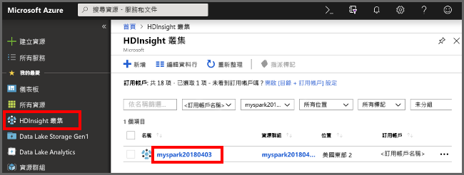
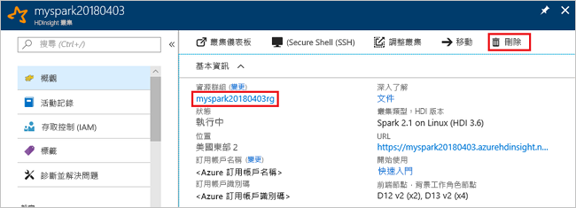

# <a name="quickstart-create-a-spark-cluster-in-hdinsight-using-powershell"></a>快速入門：使用 PowerShell 在 HDInsight 中建立 Spark 叢集
了解如何在 Azure HDInsight 中建立 Apache Spark 叢集，以及如何對 Hive 資料表執行 Spark SQL 查詢。 Apache Spark 能夠運用記憶體內部處理，使得資料分析及叢集運算更為快速。 如需 Spark on HDInsight 相關資訊，請參閱[概觀：Azure HDInsight 上的 Apache Spark](apache-spark-overview.md)。

在本快速入門中，您會使用 Azure PowerShell 來建立 HDInsight Spark 叢集。 叢集會使用 Azure 儲存體 Blob 作為叢集存放區。 如需有關如何使用 Data Lake Storage Gen2 的詳細資訊，請參閱[快速入門：在 HDInsight 中設定叢集](../../storage/data-lake-storage/quickstart-create-connect-hdi-cluster.md)。

> [!IMPORTANT]
> 不論使用與否，HDInsight 叢集都是按分鐘計費。 請務必在使用完叢集後將其刪除。 如需詳細資訊，請參閱本文的[清除資源](#clean-up-resources)一節。

如果您沒有 Azure 訂用帳戶，請在開始之前先[建立免費帳戶](https://azure.microsoft.com/free/)。

## <a name="create-an-hdinsight-spark-cluster"></a>建立 HDInsight Spark 叢集

建立 HDInsight 叢集，包括建立下列 Azure 物件和資源：

- Azure 資源群組。 Azure 資源群組是一個適用於 Azure 資源的容器。 
- Azure 儲存體帳戶或 Azure Data Lake Store。  每個 HDInsight 叢集都需要相依的資料儲存體。 在本快速入門中，您會建立儲存體帳戶。
- 不同叢集類型的 HDInsight 叢集。  在本快速入門中，您會建立 Spark 2.3 叢集。

您會使用 PowerShell 指令碼來建立資源。  當您執行指令碼時，系統會提示您輸入下列值：

|參數|值|
|------|------|
|Azure 資源群組名稱 | 提供資源群組的唯一名稱。|
|位置| 指定 Azure 區域，例如「美國中部」。 |
|預設儲存體帳戶名稱 | 提供儲存體帳戶的唯一名稱。 |
|叢集名稱 | 提供 HDInsight Spark 叢集的唯一名稱。|
|叢集登入認證 | 您稍後會在本快速入門中使用此帳戶連線到叢集儀表板。|
|SSH 使用者認證 | SSH 用戶端可以用來建立含有 HDInsight 叢集的遠端命令列工作階段。|


1. 按一下以下程式碼區塊右上角的 [試用] 以開啟 [Azure Cloud Shell](../../cloud-shell/overview.md)，然後遵循指示連線到 Azure。
2. 複製以下 PowerShell 指令碼並貼到 Cloud Shell 中。 

    ```azurepowershell-interactive
    ### Create a Spark 2.3 cluster in Azure HDInsight
        
    # Create the resource group
    $resourceGroupName = Read-Host -Prompt "Enter the resource group name"
    $location = Read-Host -Prompt "Enter the Azure region to create resources in, such as 'Central US'"
    New-AzureRmResourceGroup -Name $resourceGroupName -Location $location
    
    $defaultStorageAccountName = Read-Host -Prompt "Enter the default storage account name"
    
    # Create an Azure storae account and container
    New-AzureRmStorageAccount `
        -ResourceGroupName $resourceGroupName `
        -Name $defaultStorageAccountName `
        -Type Standard_LRS `
        -Location $location
    $defaultStorageAccountKey = (Get-AzureRmStorageAccountKey `
                                    -ResourceGroupName $resourceGroupName `
                                    -Name $defaultStorageAccountName)[0].Value
    $defaultStorageContext = New-AzureStorageContext `
                                    -StorageAccountName $defaultStorageAccountName `
                                    -StorageAccountKey $defaultStorageAccountKey
    
    # Create a Spark 2.3 cluster
    $clusterName = Read-Host -Prompt "Enter the name of the HDInsight cluster"
    # Cluster login is used to secure HTTPS services hosted on the cluster
    $httpCredential = Get-Credential -Message "Enter Cluster login credentials" -UserName "admin"
    # SSH user is used to remotely connect to the cluster using SSH clients
    $sshCredentials = Get-Credential -Message "Enter SSH user credentials"
    
    # Default cluster size (# of worker nodes), version, type, and OS
    $clusterSizeInNodes = "1"
    $clusterVersion = "3.6"
    $clusterType = "Spark"
    $clusterOS = "Linux"
    
    # Set the storage container name to the cluster name
    $defaultBlobContainerName = $clusterName
    
    # Create a blob container. This holds the default data store for the cluster.
    New-AzureStorageContainer `
        -Name $clusterName -Context $defaultStorageContext 
    
    $sparkConfig = New-Object "System.Collections.Generic.Dictionary``2[System.String,System.String]"
    $sparkConfig.Add("spark", "2.3")
    
    # Create the HDInsight cluster
    New-AzureRmHDInsightCluster `
        -ResourceGroupName $resourceGroupName `
        -ClusterName $clusterName `
        -Location $location `
        -ClusterSizeInNodes $clusterSizeInNodes `
        -ClusterType $clusterType `
        -OSType $clusterOS `
        -Version $clusterVersion `
        -ComponentVersion $sparkConfig `
        -HttpCredential $httpCredential `
        -DefaultStorageAccountName "$defaultStorageAccountName.blob.core.windows.net" `
        -DefaultStorageAccountKey $defaultStorageAccountKey `
        -DefaultStorageContainer $clusterName `
        -SshCredential $sshCredentials 
    
    Get-AzureRmHDInsightCluster -ResourceGroupName $resourceGroupName -ClusterName $clusterName
    ```
大約需要 20 分鐘的時間來建立叢集。 您必須先建立叢集，才能繼續前往下一個工作階段。

如果您在建立 HDInsight 叢集時遇到問題，可能是您沒有這麼做的適當權限。 如需詳細資訊，請參閱[存取控制需求](../hdinsight-administer-use-portal-linux.md#create-clusters)。

## <a name="create-a-jupyter-notebook"></a>建立 Jupyter Notebook

Jupyter Notebook 是支援各種程式設計語言的互動式 Notebook 環境。 Notebook 可讓您與資料互動、將程式碼與 Markdown 文字相結合，並執行簡單的視覺效果。 

1. 開啟 [Azure 入口網站](https://portal.azure.com)。
2. 選取 [HDInsight 叢集]，然後選取您所建立的叢集。

    

3. 從入口網站中選取 [叢集儀表板]，然後選取 [Jupyter Notebook]。 出現提示時，輸入叢集的叢集登入認證。

   

4. 選取 [新增] > [PySpark] 來建立 Notebook。 

   

   新的 Notebook 隨即建立並以 Untitled(Untitled.pynb) 名稱開啟。


## <a name="run-spark-sql-statements"></a>執行 Spark SQL 陳述式

SQL (結構化查詢語言) 是最常見且廣泛使用的語言，可用於查詢及定義資料。 Spark SQL 可作為 Apache Spark 的擴充功能，可讓您使用熟悉的 SQL 語法來處理結構化資料。

1. 確認核心已就緒。 當您在 Notebook 中的核心名稱旁邊看到一個空心圓時，表示核心已準備就緒。 實心圓表示核心忙碌中。

    

    當您第一次啟動 Notebook 時，核心會在背景執行某些工作。 等待核心準備就緒。 
2. 將以下程式碼貼入空白儲存格，然後按下 **SHIFT + ENTER** 鍵以執行此程式碼。 此命令會列出叢集上的 Hive 資料表：

    ```PySpark
    %%sql
    SHOW TABLES
    ```
    當您使用 Jupyter Notebook 搭配 HDInsight Spark 叢集時，您可取得預設的 `sqlContext`，用來執行使用 Spark SQL 的 Hive 查詢。 `%%sql` 會告知 Jupyter Notebook 使用預設的 `sqlContext` 來執行 Hive 查詢。 此查詢會擷取 Hive 資料表 (**hivesampletable**) 中的前 10 個資料列，依預設所有 HDInsight 叢集均隨附該資料表。 大約需要 30 秒才能取得結果。 輸出看起來如下： 

    

    每當您在 Jupyter 中執行查詢時，網頁瀏覽器視窗標題將會顯示 Notebook 標題和 **(忙碌)** 狀態。 您也會在右上角的 **PySpark** 文字旁看到一個實心圓。
    
2. 執行另一個查詢，以查看 `hivesampletable` 中的資料。

    ```PySpark
    %%sql
    SELECT * FROM hivesampletable LIMIT 10
    ```
    
    畫面應會重新整理以顯示查詢輸出。

    

2. 從 Notebook 的 [檔案] 功能表中，選取 [關閉並終止]。 關閉 Notebook 可釋出叢集資源。

## <a name="clean-up-resources"></a>清除資源
HDInsight 會將您的資料儲存於 Azure 儲存體或 Azure Data Lake Store 中，以便您在未使用叢集時安全地進行刪除。 您也需支付 HDInsight 叢集的費用 (即使未使用)。 由於叢集費用是儲存體費用的許多倍，所以刪除未使用的叢集符合經濟效益。 如果您打算立即進行[後續步驟](#next-steps)中所列的教學課程，則建議保留叢集。

切換回 Azure 入口網站，然後選取 [刪除]。



您也可以選取資源群組名稱來開啟資源群組頁面，然後選取 [刪除資源群組]。 刪除資源群組時，會同時刪除 HDInsight Spark 叢集及預設儲存體帳戶。

## <a name="next-steps"></a>後續步驟 

在本快速入門中，您已了解如何建立 HDInsight Spark 叢集和執行基本的 Spark SQL 查詢。 前往下一個教學課程，以了解如何使用 HDInsight Spark 叢集來執行範例資料的互動式查詢。

> [!div class="nextstepaction"]
>[在 Spark 上執行互動式查詢](./apache-spark-load-data-run-query.md)
