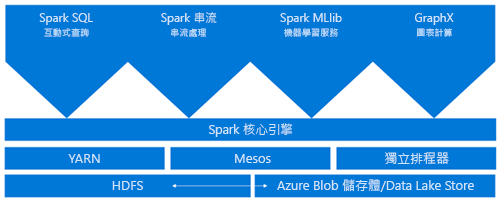
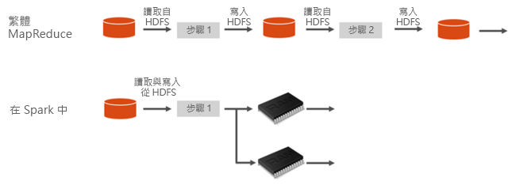
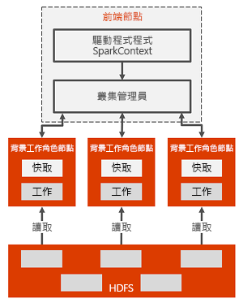

# 什麼是 Azure HDInsight 中的 Apache Spark

*Apache Spark* 會平行處理可支援記憶體內部處理的架構，以大幅提升巨量資料分析應用程式的效能。 Azure HDInsight 中的 Apache Spark 是 Microsoft 在雲端的 Apache Spark 實作。 HDInsight 讓您能夠更輕鬆地在 Azure 中建立並設定 Spark 叢集。 HDInsight 中的 Spark 叢集也能與 Azure 儲存體和 Azure Data Lake Store 相容。 因此，您可以使用 HDInsight Spark 叢集來處理儲存於 Azure 的資料。 如需元件和版本資訊，請參閱 [Azure HDInsight 中的 Hadoop 元件和版本](../hdinsight-component-versioning.md)。

## 什麼是 Spark？

Spark 提供用於記憶體內部叢集運算的基本項目。 Spark 作業可將資料載入並快取到記憶體，以便重複查詢。 記憶體內部計算速度比磁碟型應用程式 (例如 Hadoop) 還要快，後者會透過 HDFS 共用資料。 Spark 也會整合到 Scala 程式設計語言中，讓您處理分散式資料集 (像是本機集合)。 您不需要將一切建構成對應和縮減作業。

HDInsight 中的 Spark 叢集可提供完全受控的 Spark 服務。 以下列出在 HDInsight 中建立 Spark 叢集的優點。

| 功能 | 說明 |
| --- | --- |
| 輕鬆建立 |您可以使用 Azure 入口網站、Azure PowerShell 或 HDInsight .NET SDK，在幾分鐘內便能於 HDInsight 中建立新的 Spark 叢集。 請參閱 [開始使用 HDInsight 中的 Spark 叢集](apache-spark-jupyter-spark-sql.md) |
| 容易使用 |HDInsight 上的 Spark 叢集包含 Jupyter 和 Zeppelin Notebook。 您可以使用這些 Notebook 來進行互動式的資料處理和視覺化。|
| REST API |HDInsight 中的 Spark 叢集包含 [Livy](https://github.com/cloudera/hue/tree/master/apps/spark/java#welcome-to-livy-the-rest-spark-server)，它是 REST-API 型 Spark 作業伺服器，可用來遠端提交及監視作業。 |
| 支援 Azure Data Lake Store | HDInsight 中的 Spark 叢集可以使用 Azure Data Lake Store 作為主要儲存體或額外的儲存體。 如需有關 Data Lake Store 的詳細資訊，請參閱 [Azure Data Lake Store 概觀](../../data-lake-store/data-lake-store-overview.md)。 |
| Azure 服務整合 |HDInsight 中的 Spark 叢集隨附連至 Azure 事件中樞的連接器。 除了 Spark 所提供的 [Kafka](http://kafka.apache.org/) \(英文\) 之外，您還可以使用事件中樞來建置串流應用程式。 |
| ML Server 的支援 | 在 HDInsight 中會以 **ML 服務**叢集類型的形式提供 ML Server 的支援。 您可以設定 ML 服務叢集，以 Spark 叢集所承諾的速度來執行分散式 R 運算。 如需詳細資訊，請參閱[開始使用 HDInsight 中的 ML Server](../r-server/r-server-get-started.md)。 |
| 第三方 IDE 整合 | HDInsight 提供數個 IDE 外掛程式，以用來建立應用程式，並將應用程式提交至 HDInsight Spark 叢集。 如需詳細資訊，請參閱[使用 Azure Toolkit for IntelliJ IDEA](apache-spark-intellij-tool-plugin.md)、[使用 HDInsight for VSCode](../hdinsight-for-vscode.md) 和[Use Azure Toolkit for Eclipse](apache-spark-eclipse-tool-plugin.md)。|
| 並行查詢 |HDInsight 中的 Spark 叢集支援並行查詢。 此功能可讓來自單一使用者的多個查詢或來自不同使用者與應用程式的多個查詢，一起共用相同的叢集資源。 |
| SSD 快取 |您可以選擇將資料快取在記憶體中，或快取在連接叢集節點的 SSD 中。 記憶體快取能提供最高的查詢效能，但可能所費不貲。 SSD 快取提供改善查詢效能的絕佳選項，而且您不需要建立大小可讓整個資料集納入記憶體的叢集。 |
| BI 工具整合 |HDInsight 中的 Spark 叢集會為資料分析提供 BI 工具 (例如 [Power BI](http://www.powerbi.com/)) 的連接器。 |
| 預先載入的 Anaconda 程式庫 |HDInsight 中的 Spark 叢集隨附預先安裝的 Anaconda 程式庫。 [Anaconda](http://docs.continuum.io/anaconda/) 為機器學習、資料分析、視覺化等主題提供將近 200 個程式庫。 |
| 延展性 | HDInsight 可讓您變更叢集節點數目。 此外，由於所有資料都儲存在 Azure 儲存體或 Data Lake Store 內，因此您可以在不遺失資料的情況下卸除 Spark 叢集。 |
| SLA |HDInsight 中的 Spark 叢集隨附全天候支援，以及保證正常運作時間達 99.9% 的 SLA。 |

依預設，HDInsight 中的 Spark 叢集能經由叢集提供下列元件。

* [Spark Core](https://spark.apache.org/docs/1.5.1/)。 包括 Spark Core、Spark SQL、Spark 串流 API、GraphX 及 MLlib。
* [Anaconda](http://docs.continuum.io/anaconda/)
* [Livy](https://github.com/cloudera/hue/tree/master/apps/spark/java#welcome-to-livy-the-rest-spark-server)
* [Jupyter Notebook](https://jupyter.org)
* [Zeppelin Notebook](http://zeppelin-project.org/)

HDInsight 中的 Spark 叢集也提供 [ODBC 驅動程式](http://go.microsoft.com/fwlink/?LinkId=616229) \(英文\)，讓您能從 BI 工具 (例如 Microsoft Power BI) 連線到 HDInsight 中的 Spark 叢集。

## Spark 叢集架構

您可以藉由了解 Spark 在 HDInsight 叢集上的執行方式，輕鬆地了解 Spark 的元件。

Spark 應用程式會在叢集上以獨立的處理序組合來執行，並由主程式 (稱為驅動程式) 中的 SparkContext 物件來協調。

SparkContext 可以連線到數種類型的叢集管理員，而叢集管理員可以在各個應用程式之間配置資源。 這些叢集管理員包括 Apache Mesos、Apache YARN 或 Spark 叢集管理員。 在 HDInsight 中，使用 YARN 叢集管理員可執行 Spark。 一旦連線之後，Spark 就會取得叢集中背景工作節點上的執行程式，也就是為應用程式執行運算和儲存資料的處理序。 接下來，它會將您的應用程式程式碼 (由傳遞到 SparkContext 的 JAR 或 Python 檔案所定義) 傳送到執行程式。 最後，SparkContext 會將工作傳送到執行程式來執行。

SparkContext 會執行使用者的主要函式，並在背景工作節點上執行各種平行作業。 然後，SparkContext 會收集作業的結果。 背景工作節點會在 Hadoop 分散式檔案系統 (HDFS) 中讀取和寫入資料。 背景工作節點也會將記憶體內部已轉換的資料快取為彈性分散式資料集 (RDD)。

SparkContext 會連線到 Spark 主節點，並負責將應用程式轉換為個別工作的有向圖 (DAG)，這類工作會在背景工作節點的執行程式處理序內執行。 每個應用程式都會取得自己的執行程式處理序，而這些處理序會在整個應用程式的持續時間保持運作，並且在多個執行緒中執行工作。

## HDInsight 中的 Spark 使用案例

HDInsight 中的 Spark 叢集適用於下列重要案例：

- 互動式資料分析和 BI

    HDInsight 中的 Apache Spark 會將資料儲存在 Azure 儲存體或 Azure Data Lake Store 中。 商務專家和重要決策者可以利用這些資料來進行分析及建立報告，並使用 Microsoft Power BI 來根據分析資料建置互動式報告。 分析師可以從叢集儲存體中的非結構化/半結構化資料著手、使用 Notebook 來定義資料的結構描述，然後再使用 Microsoft Power BI 來建置資料模型。 HDInsight 中的 Spark 叢集也支援 Tableau 等多種第三方 BI 工具，以方便資料分析師、商務專家及重要決策者使用。

    [教學課程：使用 Power BI 將 Spark 資料視覺化](apache-spark-use-bi-tools.md)
- Spark 機器學習服務

    Apache Spark 隨附 [MLlib](http://spark.apache.org/mllib/)，這是以 Spark 為基礎的機器學習程式庫，您可以從 HDInsight 中的 Spark 叢集使用。 HDInsight 中的 Spark 叢集也包含 Anaconda，這是提供各種機器學習套件的 Python 發行版本。 搭配內建的 Jupyter 和 Zeppelin Notebook 支援，就能擁有適用於建立機器學習應用程式的環境。

    [教學課程：利用 HVAC 資料來預測建築物的溫度](apache-spark-ipython-notebook-machine-learning.md) [教學課程：預測食品檢查結果](apache-spark-machine-learning-mllib-ipython.md)    
- Spark 串流和即時資料分析

    HDInsight 上的 Spark 叢集提供豐富的支援供您建置即時分析解決方案。 雖然 Spark 已附有從 Kafka、Flume、Twitter、ZeroMQ 或 TCP 通訊端等眾多來源擷取資料的連接器，不過 HDInsight 中的 Spark 仍加入首屈一指的支援，供您從 Azure 事件中樞擷取資料。 事件中樞是 Azure 上最廣泛使用的佇列服務。 擁有立即可用的事件中樞支援，讓 HDInsight 中的 Spark 叢集成為建置即時分析管線的理想平台。
    
## 我該從哪裡開始？

您可以使用下列文章來深入了解 HDInsight 中的 Spark：

- [快速入門：在 HDInsight 中建立 Spark 叢集並利用 Jupyter 來執行互動式查詢](./apache-spark-jupyter-spark-sql.md)
- [教學課程：使用 Jupyter 來執行 Spark 作業](./apache-spark-load-data-run-query.md)
- [教學課程：使用 BI 工具來分析資料](./apache-spark-use-bi-tools.md)
- [教學課程：使用 Spark 來進行機器學習](./apache-spark-ipython-notebook-machine-learning.md)
- [教學課程：使用 IntelliJ 來建立 Scala Maven 應用程式](./apache-spark-create-standalone-application.md)

## 後續步驟

在本概觀中，您已對 Azure HDInsight 中的 Apache Spark 有了一些基本了解。 請前往下一篇文章，以了解如何建立 HDInsight Spark 叢集以及執行某些 Spark SQL 查詢：

- [在 HDInsight 中建立 Spark 叢集](./apache-spark-jupyter-spark-sql.md)

