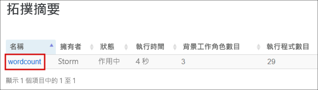
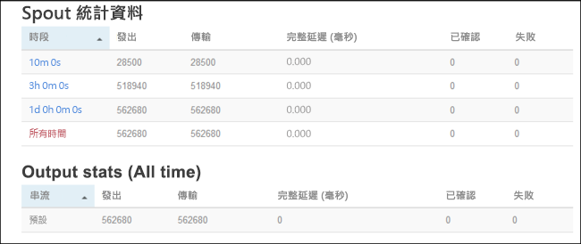

# <a name="quickstart-create-and-monitor-an-apache-storm-topology-in-azure-hdinsight"></a>快速入門：建立和監視 Azure HDInsight 中的 Apache Storm 拓撲

Apache Storm 是一個可處理資料串流的分散式、容錯、即時的運算系統。 在 Storm on Azure HDInsight 中，您可以建立雲端式 Storm 叢集，以執行即時的巨量資料分析。

在本快速入門中，您可以使用 Apache [storm-starter](https://github.com/apache/storm/tree/v2.0.0/examples/storm-starter) 專案的範例來監視 Apache Storm 拓撲並將其建立到現有的 Apache Storm 叢集。

## <a name="prerequisites"></a>必要條件

* HDInsight 上的 Apache Storm 叢集。 請參閱[使用 Azure 入口網站建立 Apache Hadoop 叢集](../hdinsight-hadoop-create-linux-clusters-portal.md)，然後選取 [Storm]  作為 [叢集類型]  。

* SSH 用戶端。 如需詳細資訊，請參閱[使用 SSH 連線至 HDInsight (Apache Hadoop)](../hdinsight-hadoop-linux-use-ssh-unix.md)。

## <a name="create-the-topology"></a>建立拓撲

1. 連線至 Storm 叢集。 編輯以下命令並將 `CLUSTERNAME` 取代為 Storm 叢集的名稱，然後輸入命令：

    ```cmd
    ssh sshuser@CLUSTERNAME-ssh.azurehdinsight.net
    ```

2. **WordCount** 範例會包含在位於 `/usr/hdp/current/storm-client/contrib/storm-starter/` 的 HDInsight 叢集。 拓撲會產生隨機的句子並計算單字出現的次數。 使用下列命令啟動叢集上的 **wordcount** 拓撲：

    ```bash
    storm jar /usr/hdp/current/storm-client/contrib/storm-starter/storm-starter-topologies-*.jar org.apache.storm.starter.WordCountTopology wordcount
    ```

## <a name="monitor-the-topology"></a>監視拓撲

Storm 提供 Web 介面來處理執行中的拓撲，包含在您的 HDInsight 叢集中。

使用下列步驟以 Storm UI 監視拓撲。

1. 若要顯示 Storm UI，開啟網頁瀏覽器並前往 `https://CLUSTERNAME.azurehdinsight.net/stormui`。 將 `CLUSTERNAME` 取代為您的叢集名稱。

2. 在 [拓撲摘要]  下，選取 [名稱]  欄中的 [wordcount]  項目。 關於拓撲的詳細資訊隨即顯示。

    

    新頁面提供以下資訊：

    |屬性 | 說明 |
    |---|---|
    |拓撲統計資料|拓撲效能的基本資訊，已整理為時間範圍。 選取特定的時間範圍，可以變更頁面中其他區段所顯示之資訊的時間範圍。|
    |Spout|Spout 的基本資訊，包括每個 spout 傳回的最後一個錯誤。|
    |Bolt|Bolt 的基本資訊。|
    |拓撲設定|拓撲組態的詳細資訊。|
    |啟動|繼續處理已停用的拓撲。|
    |停用|暫停執行中拓撲。|
    |重新平衡|調整拓撲的平行處理原則。 變更叢集中的節點數目之後，您應該重新平衡執行中拓撲。 重新平衡調整平行處理原則，以彌補叢集中增加/減少的節點數目。 如需詳細資訊，請參閱 [Understanding the parallelism of an Apache Storm topology](https://storm.apache.org/documentation/Understanding-the-parallelism-of-a-Storm-topology.html) (了解 Apache Storm 拓撲的平行處理原則)。|
    |終止|在指定的逾時之後終止 Storm 拓撲。|

3. 在此頁面中，選取 [Spouts]  或 [Bolts]  區段中的一個項目。 關於所選元件的詳細資訊隨即顯示。

    

    新頁面會顯示以下資訊：

    |屬性 | 說明 |
    |---|---|
    |Spout/Bolt 統計資料|元件效能的基本資訊，已整理為時間範圍。 選取特定的時間範圍，可以變更頁面中其他區段所顯示之資訊的時間範圍。|
    |輸入統計資料 (僅限 Bolt)|提供的資訊是關於產生 bolt 所使用之資料的元件。|
    |輸出統計資料|此 bolt 發出之資料的資訊。|
    |執行程式|此元件之執行個體的資訊。|
    |Errors|此元件產生的錯誤。|

4. 檢視 spout 或 bolt 的詳細資料時，請在 [執行程式]  區段的 [連接埠]  欄中選取一個項目，以檢視特定元件執行個體的詳細資料。

        2015-01-27 14:18:02 b.s.d.task [INFO] Emitting: split default ["with"]
        2015-01-27 14:18:02 b.s.d.task [INFO] Emitting: split default ["nature"]
        2015-01-27 14:18:02 b.s.d.executor [INFO] Processing received message source: split:21, stream: default, id: {}, [snow]
        2015-01-27 14:18:02 b.s.d.task [INFO] Emitting: count default [snow, 747293]
        2015-01-27 14:18:02 b.s.d.executor [INFO] Processing received message source: split:21, stream: default, id: {}, [white]
        2015-01-27 14:18:02 b.s.d.task [INFO] Emitting: count default [white, 747293]
        2015-01-27 14:18:02 b.s.d.executor [INFO] Processing received message source: split:21, stream: default, id: {}, [seven]
        2015-01-27 14:18:02 b.s.d.task [INFO] Emitting: count default [seven, 1493957]

    在此範例中，「七」  這個字出現 1493957 次。 此計數就是啟動拓撲後，該字所出現的次數。

## <a name="stop-the-topology"></a>停止拓撲

返回 word-count 拓撲的 [拓撲摘要]  頁面，然後選取 [拓撲動作]  區段中的 [終止]  按鈕。 出現提示時，請先輸入要等候 10 秒，再停止拓撲。 逾時期限過後，當您瀏覽儀表板的 [Storm UI]  區段時，就不會再看到拓撲。

## <a name="clean-up-resources"></a>清除資源

完成此快速入門之後，您可以刪除叢集。 利用 HDInsight，您的資料會儲存在 Azure 儲存體中，以便您在未使用叢集時安全地進行刪除。 您也需支付 HDInsight 叢集的費用 (即使未使用)。 由於叢集費用是儲存體費用的許多倍，所以刪除未使用的叢集符合經濟效益。

若要刪除叢集，請參閱[使用您的瀏覽器、PowerShell 或 Azure CLI 刪除 HDInsight 叢集](../hdinsight-delete-cluster.md)。

## <a name="next-steps"></a>後續步驟

在本快速入門中，您可以使用 Apache [storm-starter](https://github.com/apache/storm/tree/v2.0.0/examples/storm-starter) 專案的範例來監視 Apache Storm 拓撲並將其建立到現有的 Apache Storm 叢集。 請前往下一篇文章，以了解管理和監視 Apache Storm 拓撲的基本概念。

> [!div class="nextstepaction"]
>[部署和管理 HDInsight 上的 Apache Storm 拓撲](./apache-storm-deploy-monitor-topology-linux.md)