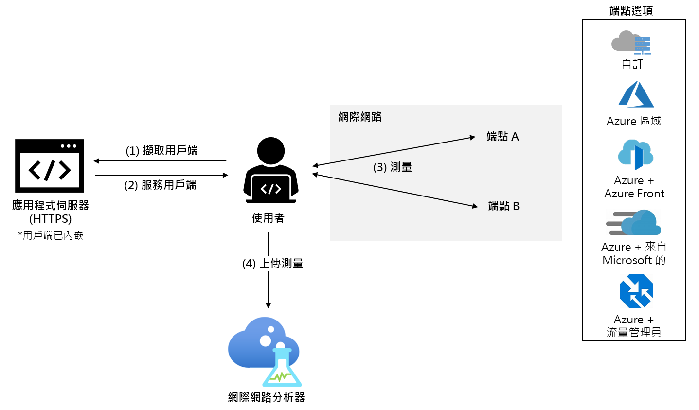

# 什麼是 Internet Analyzer？ (預覽)

Internet Analyzer 是一種用戶端測量平台，可用於測試網路基礎結構變更如何影響客戶的效能。 不論您是要從內部部署遷移至 Azure，還是要評估新的 Azure 服務，Internet Analyzer 都可讓您在遷移之前，從您使用者的資料和 Microsoft 的豐富分析中學習，以便進一步了解搭配 Azure 的網路架構並予以最佳化。

Internet Analyzer 會使用 Web 應用程式中內嵌的小型 JavaScript 用戶端來測量從終端使用者到所選網路目的地 (我們稱之為「端點」  ) 集合的延遲。 Internet Analyzer 可讓您設定多個並存測試，讓您能隨著基礎結構和客戶需求演化來評估各種案例。 Internet Analyzer 提供自訂和預先設定的端點，同時提供給您為使用者做出可信任效能決策的便利性和彈性。 

> [!IMPORTANT]
> 此公開預覽版是在沒有服務等級協定的情況下提供，不得用於生產工作負載。 可能不支援特定功能、可能已經限制功能，或者可能無法在所有 Azure 位置提供使用。 如需詳細資訊，請參閱 [Microsoft Azure 預覽專用的補充使用條款](https://azure.microsoft.com/support/legal/preview-supplemental-terms/)。
>

## 快速且可自訂的測試

Internet Analyzer 解決了下列作業的效能相關問題：雲端移轉、部署到新的或其他 Azure 區域，或是在 Azure 中測試新的應用程式和內容傳遞平台，例如 [Azure Front Door](https://azure.microsoft.com/services/frontdoor/) 和 [Microsoft Azure CDN](https://azure.microsoft.com/services/cdn/)。 

您在 Internet Analyzer 中建立的每項測試都是由兩個端點 (端點 A 和端點 B) 所組成。端點 B 的效能分析是相對於端點 A。 

您可以設定自己的自訂端點，或從各種預先設定的 Azure 端點中選取。 自訂端點應用來評估內部部署工作負載、您在其他雲端提供者中的執行個體，或您的自訂 Azure 組態。 測試可由兩個自訂端點組成；不過，至少有一個自訂端點必須裝載在 Azure 中。 預先設定的 Azure 端點可讓您快速且輕鬆地評估熱門 Azure 網路平台 (例如 Azure Front Door、Azure 流量管理員和 Azure CDN) 的效能。 

在預覽期間，可以使用下列預先設定的端點： 

* **Azure 區域**
    * 巴西南部
    * 印度中部
    * 美國中部
    * 東亞
    * 美國東部
    * 日本西部
    * 北歐
    * 南非北部
    * 東南亞 
    * 阿拉伯聯合大公國北部
    * 英國西部  
    * 西歐
    * 美國西部 
    * 美國西部 2
* **多個 Azure 區域組合** 
    * 美國東部、巴西南部 
    * 美國東部、東亞 
    * 西歐、巴西南部
    * 西歐、東南亞
    * 西歐、阿拉伯聯合大公國北部
    * 美國西部、美國東部 
    * 美國西部、西歐
    * 美國西部、阿拉伯聯合大公國北部
    * 西歐、阿拉伯聯合大公國北部、東南亞
    * 美國西部、西歐、東亞
    * 美國西部、北歐、東南亞、阿拉伯聯合大公國北部、南非北部 
* **Azure 與 Azure Front Door** - 部署於上列任意一個或多個 Azure 區域組合上
* **Azure 與來自 Microsoft 的 Azure CDN** - 部署於上列任意一個 Azure 區域組合上
* **Azure 與 Azure 流量管理員** - 部署於上列任意多個 Azure 區域組合上

## 建議的測試案例 

為了協助您為客戶做出最佳的效能決策，Internet Analyzer 可讓您針對特定的終端使用者群體評估兩個端點。 

雖然 Internet Analyzer 可以回答許多問題，但其中一些最常見的問題如下： 
* 遷移至雲端有何效能影響？ 
    * *建議的測試：自訂 (您目前的內部部署基礎結構) 與Azure (任何預先設定的端點)*
* 將資料放在邊緣與放在資料中心有何價值？ 
    *  *建議的測試：Azure 與 Azure Front、Azure 與來自 Microsoft 的 Azure CDN*
* Azure Front 有何效能優勢？
    *  *建議的測試：自訂/Azure/CDN 與Azure Front Door*
* 來自 Microsoft 的 Azure CDN 有何效能優勢？ 
    *  *建議的測試：自訂/Azure/AFD 與來自 Microsoft 的 Azure CDN*
* 來自 Microsoft 的 Azure CDN 如何堆疊？ 
    *  *建議的測試：自訂 (其他 CDN 端點) 與來自 Microsoft 的 Azure CDN*
* 在每個區域中何種雲端最適合您的終端使用者群體？ 
    *  *建議的測試：自訂 (其他雲端服務) 與Azure (任何預先設定的端點)*

## 運作方式

若要使用 Internet Analyzer，請在 Microsoft Azure 入口網站中設定 Internet Analyzer 資源，並在您的應用程式中安裝小型 JavaScript 用戶端。 用戶端會透過 HTTPS 下載一個像素的影像，藉此測量從終端使用者到所選端點的延遲。 收集延遲測量之後，用戶端會將測量資料傳送至 Internet Analyzer。

當使用者造訪 Web 應用程式時，JavaScript 用戶端會選取兩個端點來測量所有已設定的測試。 針對每個端點，用戶端會執行「冷」  和「暖」  測量。 除了在使用者與端點 (例如 DNS 解析、TCP 連線交握和 SSL/TLS 交涉) 之間的純網路延遲外，「冷」  測量還會產生額外的延遲。 「暖」  測量會緊接在「冷」  測量完成後，並利用新式瀏覽器的持續 TCP 連線管理來取得端對端延遲的精確量值。 當使用者的瀏覽器支援時，會使用 W3C 資源計時 API 進行精確的測量時間。 目前，只會使用暖延遲測量來進行分析。

## 計分卡 

測試開始之後，遙測資料會顯示在您的 Internet Analyzer 資源的 [計分卡] 索引標籤底下。系統一律會彙總此資料。 使用下列篩選條件來變更您看到的資料檢視： 

* **測試：** 選取您想要檢視其結果的測試。 一旦有足夠的資料可完成分析，測試資料就會出現 – 在大多數情況下，在24小時內。 
* **時間週期和結束日期：** Internet Analyzer 每天會產生三個計分卡 – 每個計分卡都會反映不同的彙總時間週期 – 前 24小時 (天)、前七天 (週) 和前 30 天 (月)。 使用 [結束日期] 篩選條件來選取您要查看的時間週期。 
* **國家/地區：** 使用此篩選條件來檢視位於某個國家/地區的終端使用者專屬資料。 全域篩選條件會顯示所有地理位置的資料。  

如需計分卡的詳細資訊，請參閱[解譯您的計分卡](internet-analyzer-scorecard.md)頁面。 

## 後續步驟

* 了解如何[建立您的第一個 Internet Analyzer 資源](internet-analyzer-create-test-portal.md)。
* 請參閱 [Internet Analyzer 常見問題集](internet-analyzer-faq.md)。 
