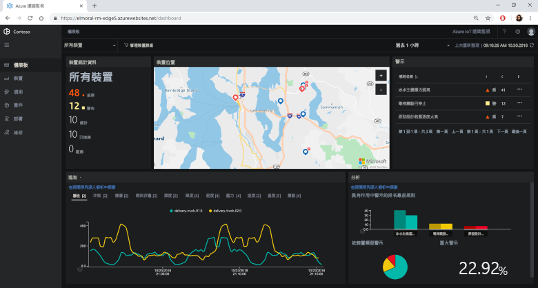

# Azure IoT 解決方案加速器是什麼？

雲端式 IoT 解決方案通常會使用自訂程式碼和多個雲端服務來管理裝置的連線、資料處理和分析，以及呈現。

IoT 解決方案加速器集合了完整、隨時可部署的 IoT 解決方案，以實作常見的 IoT 案例，例如遠端監視、連線工廠、預測性維護及裝置模擬。 當您部署解決方案加速器時，該部署中會包含所有必要的雲端式服務以及任何必要的應用程式程式碼。

解決方案加速器是建立自有 IoT 解決方案的起點。 所有解決方案加速器的原始程式碼都是開放原始碼，並可在 GitHub 中取得。 建議您下載並自訂解決方案加速器以因應您的需求。

您也可以先使用解決方案加速器作為學習工具，再從零開始建置自訂的 IoT 解決方案。 解決方案加速器會實作經過證實適用於雲端式 IoT 解決方案的做法，以供您遵循。

每個解決方案加速器中的應用程式程式碼均包含 Web 應用程式，以供您管理解決方案加速器。

## 所支援的 IoT 案例

目前有四個解決方案加速器可供您部署：

### 遠端監視

使用此解決方案加速器可從多個遠端裝置收集遙測資料，以及控制這些裝置。 裝置範例包括客戶營業場所內所安裝的冷卻系統，或是遠端抽水站內所安裝的閥門。

您可以使用遠端監視儀表板來檢視已連線裝置傳來的遙測資料、佈建新裝置，或升級已連線裝置的韌體：

### Connected Factory

使用此解決方案加速器可使用 [OPC 統一架構](https://opcfoundation.org/about/opc-technologies/opc-ua/)介面收集工業資產所傳來的遙測資料以及控制這些資產。 工業資產可能包含工廠生產線內的組裝台和測試台。

您可以使用連線工廠儀表板來監視及管理您的工業裝置：

### 預測性維護

使用此解決方案加速器可預測遠端裝置應該會在什麼時候故障，以便您可以在所預測的故障發生前，先進行維護。 此解決方案加速器會使用機器學習演算法，透過裝置的遙測資料來預測故障。 裝置範例可能是飛機引擎或電梯。

您可以使用預測性維護儀表板來檢視預測性維護分析：

### 裝置模擬

使用此解決方案加速器可執行多個會產生實際遙測資料的模擬裝置。 您可以使用此解決方案加速器來測試其他解決方案加速器的行為，也可以用它來測試您自己的自訂 IoT 解決方案。

您可以使用裝置模擬 Web 應用程式來設定及執行模擬作業：

## 設計原則

所有解決方案加速器皆遵循相同的設計原則和目標。 它們都設計成：

* **可調整**，讓您可以連接和管理數百萬個已連線的裝置。
* **可延伸**，讓您可以進行自訂以符合您的需求。
* **可理解**，讓您可以了解其運作方式，以及其實作方式。
* **模組化**，讓您可以抽換替代服務。
* **安全**，可結合 Azure 安全性與內建的連線能力和裝置安全性功能。

## 架構和語言

原始的解決方案加速器是使用模型檢視控制器 (MVC) 架構，透過 .NET 所撰寫的。 Microsoft 正在將解決方案加速器更新為新的微服務架構。 下表顯示解決方案加速器的目前狀態，並包含 GitHub 存放庫的連結：

| 解決方案加速器   | 架構  | 語言     |
| ---------------------- | ------------- | ------------- |
| 遠端監視      | 微服務 | [Java](https://github.com/Azure/azure-iot-pcs-remote-monitoring-java) 和 [.NET](https://github.com/Azure/azure-iot-pcs-remote-monitoring-dotnet) |
| 預測性維護 | MVC           | [.NET](https://github.com/Azure/azure-iot-predictive-maintenance)          |
| Connected Factory      | MVC           | [.NET](https://github.com/Azure/azure-iot-connected-factory)          |
| 裝置模擬      | 微服務 | [.NET](https://github.com/Azure/device-simulation-dotnet)          |

若要了解微服務架構的詳細資訊，請參閱 [.NET 應用程式架構](https://www.microsoft.com/net/learn/architecture)和[微服務︰採用雲端技術的應用程式革命](https://azure.microsoft.com/blog/microservices-an-application-revolution-powered-by-the-cloud/)。

## 部署選項

您可以從 [Microsoft Azure IoT 解決方案加速器](https://www.azureiotsolutions.com/Accelerators#)網站或使用命令列，來部署解決方案加速器。

您可以在下列組態中部署遠端監視解決方案加速器：

* **標準：** 適用於開發生產環境部署的擴展基礎結構部署。 Azure Container Service 會將微服務部署到多個 Azure 虛擬機器。 Kubernetes 會協調裝載個別微服務的 Docker 容器。
* **基本：** 低成本的示範版本，或用來測試部署。 所有微服務都將部署到單一 Azure 虛擬機器。
* **本機：** 用於測試和開發的本機電腦部署。 這種方法會將微服務部署到本機 Docker 容器，並連線到 IoT 中樞、Azure Cosmos DB 和 Azure 雲端儲存體服務。

解決方案加速器的執行成本是[基礎 Azure 服務成本](https://azure.microsoft.com/pricing)的彙總。 當您選擇部署選項時，就會看到所用 Azure 服務的詳細資料。

## 後續步驟

若要試用其中一個 IoT 解決方案加速器，請參閱快速入門：

* [試用遠端監視解決方案](quickstart-remote-monitoring-deploy.md)
* [試用連線工廠解決方案](quickstart-connected-factory-deploy.md)
* [試用預測性維護解決方案](quickstart-predictive-maintenance-deploy.md)
* [試用裝置模擬解決方案](quickstart-device-simulation-deploy.md)
