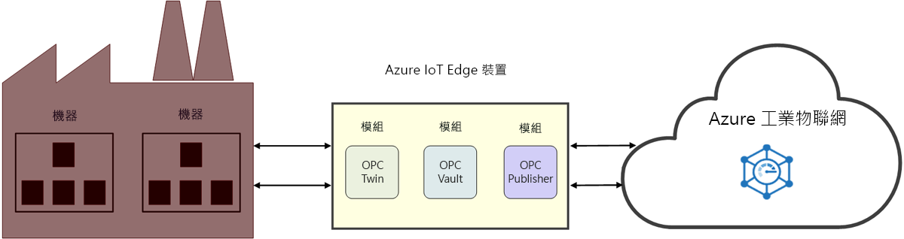

# 什麼是產業 IoT (IIoT)

IIoT 是指產業物聯網。 IIoT 可透過在製造業中應用 IoT 來提升產業效能。 

## 提升產業效能

利用連線的工廠解決方案加速器，加強您的作業產能與獲利率。 在雲端連線及監視您的產業設備與裝置 (包含已經在製造商工廠運作的機器)。 分析您的 IoT 資料取得見解，來協助您增加整個製造商工廠的效能。

透過 OPC 對應項減少存取廠房機器的耗時程序，並將您的時間投注在建置 IIoT 解決方案上。 簡化憑證管理以及與 OPC 保存庫的產業資產整合，並確信資產連線受到保護。 這些微服務可在 [Azure 產業 IoT 元件](https://github.com/Azure/azure-iiot-opc-ua)之上提供 REST 型 API。 服務 API 可讓您控制 Edge 模組的功能。 

> [!NOTE]
> 如需 Azure 產業 IoT 服務的詳細資訊，請參閱 GitHub [存放庫](https://github.com/Azure/azure-iiot-services)。
如果您不熟悉 Azure IoT Edge 模組的運作方式，請先閱讀下列文章：
- [關於 Azure IoT Edge](../iot-edge/about-iot-edge.md)
- [Azure IoT Edge 模組](../iot-edge/iot-edge-modules.md)

## 連線的處理站

[連線的工廠](../iot-accelerators/iot-accelerators-connected-factory-features.md)為 Microsoft Azure 產業 IoT 參考架構的實作，可進行自訂以滿足特定業務需求。 完整解決方案程式碼為開放原始碼，且可從「連線的工廠」解決方案加速器 GitHub 存放庫取得。 您可將其作為商業產品的起點，且數分鐘內即可將預先建置的解決方案部署至 Azure 訂用帳戶。 

## 廠房連線

OPC 對應項是一個 IIoT 元件，可將裝置探索和註冊自動化，以及透過 REST API 提供對產業裝置的遠端控制。 OPC 對應項會使用 Azure IoT Edge 與 IoT 中樞來連接雲端和工廠網路。 OPC 對應項可讓 IIoT 開發人員全心建置 IIoT 應用程式，而不需擔心如何安全地存取內部部署機器。

## 安全性

OPC 保存庫是 OPC UA Global Discovery Server (GDS) 的實作，可以設定、註冊和管理雲端中的 OPC UA 伺服器和用戶端應用程式的憑證生命週期。 OPC 保存庫可簡化在產業空間中實作和維護安全資產連線的工作。 透過自動化憑證管理，OPC 保存庫讓工廠操作員無須手動繁複地執行與連線和憑證管理相關聯的程序。

## 後續步驟

現在您已大致了解產業 IoT 及其元件，以下是建議執行的下一個步驟：

> [!div class="nextstepaction"]
> [什麼是 OPC 對應項](overview-opc-twin.md)
