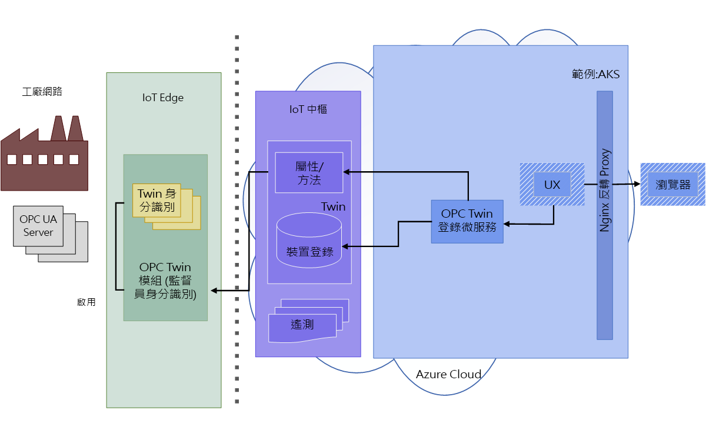
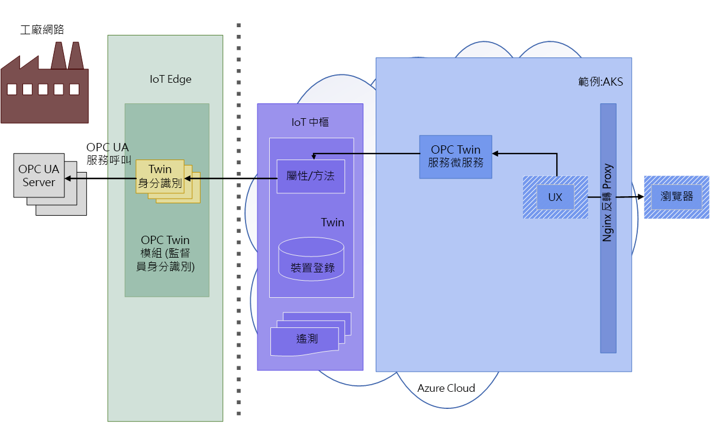
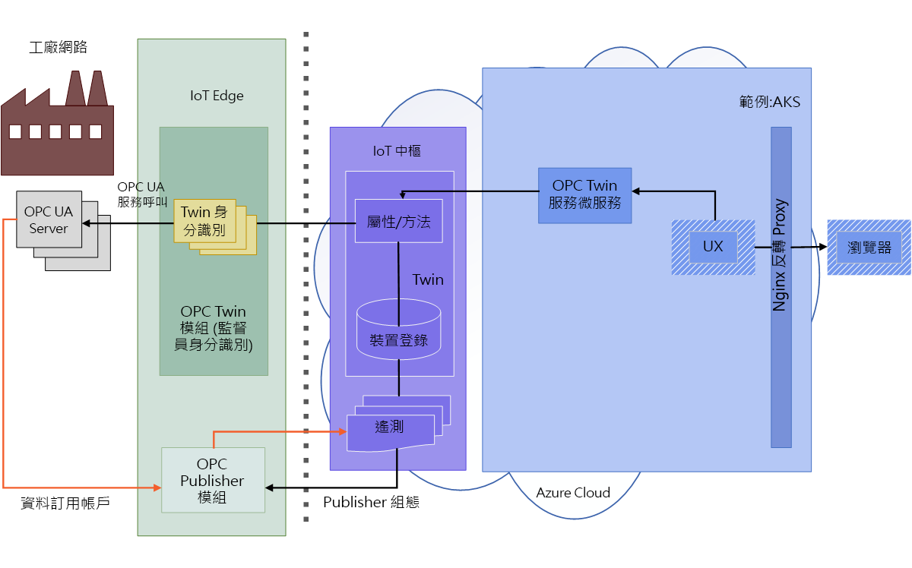

# OPC 對應項架構

下圖顯示 OPC 對應項架構。

## 探索和啟動

1. 操作員可在模組上啟用網路掃描，或使用探索 URL 進行一次性探索。 探索到的端點和應用程式資訊會透過遙測傳送至上線代理程式進行處理。  處於探索或掃描模式時，OPC UA 裝置上線代理程式會處理 OPC 對應項 IoT Edge 模組所傳送的 OPC UA 伺服器探索事件。 這些探索事件會致使應用程式在 OPC UA 裝置登錄中進行註冊和更新。

   

1. 操作員會對探索到的端點檢查憑證，並啟動已註冊的端點對應項以供存取。 

   

## 瀏覽和監視

1. 啟動後，操作員可以使用對應項服務 REST API 來瀏覽或檢查伺服器資訊模型、讀取/寫入物件變數，以及呼叫方法。  使用者可使用完全以 HTTP 和 JSON 表示的簡化 OPC UA API。

   

1. 對應項服務 REST 介面也可用來在 OPC 發行者中建立受監視的項目和訂用帳戶。 OPC 發行者可讓遙測資料從 OPC UA 伺服器系統傳送到 IoT 中樞。 如需 OPC 發行者的詳細資訊，請參閱 GitHub 上的 [OPC 發行者](https://github.com/Azure/iot-edge-opc-publisher)存放庫。

   